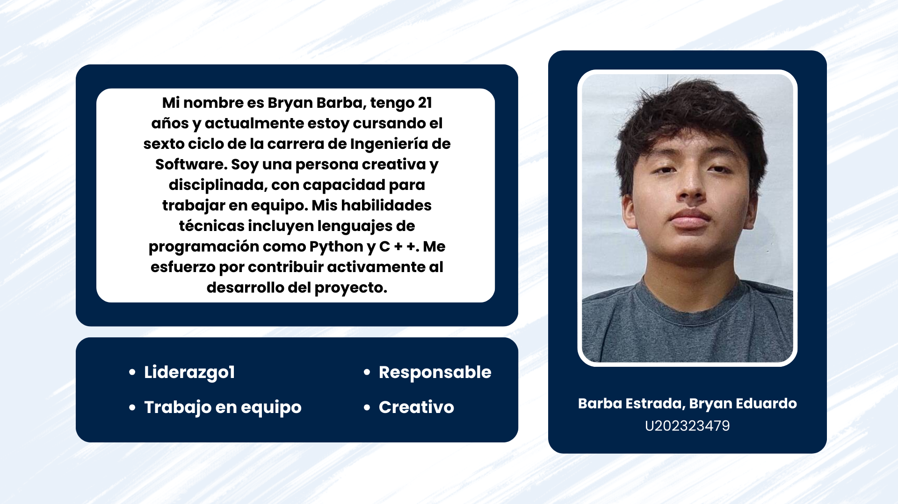
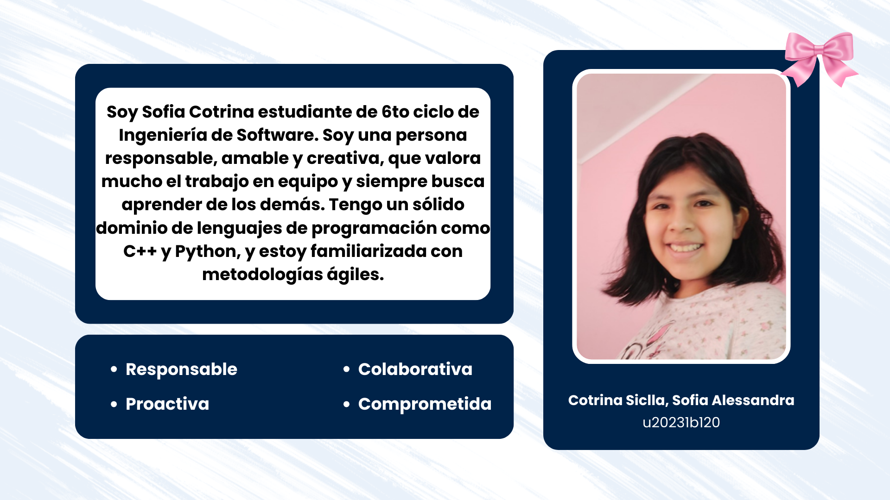
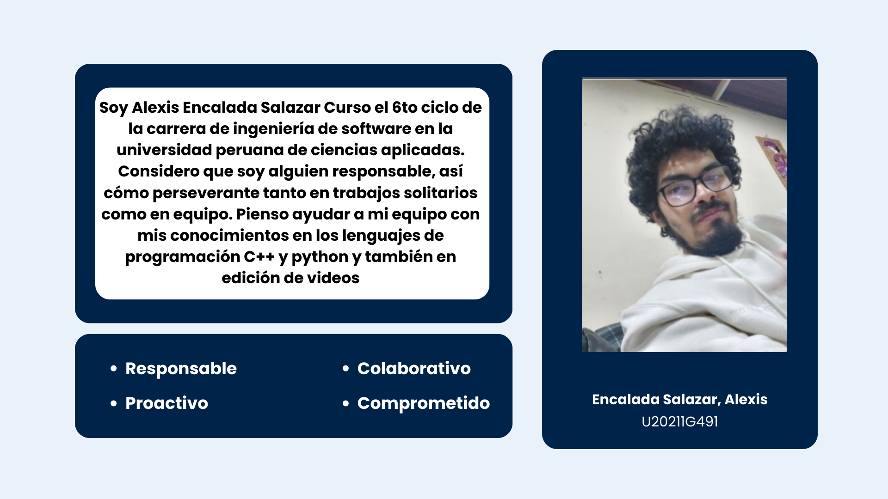
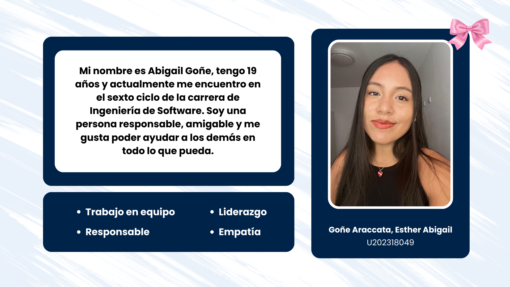
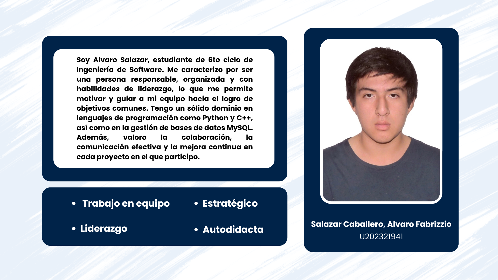
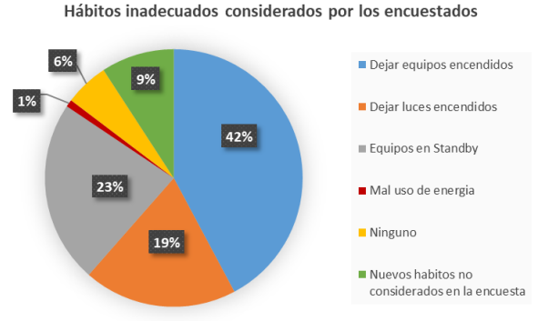
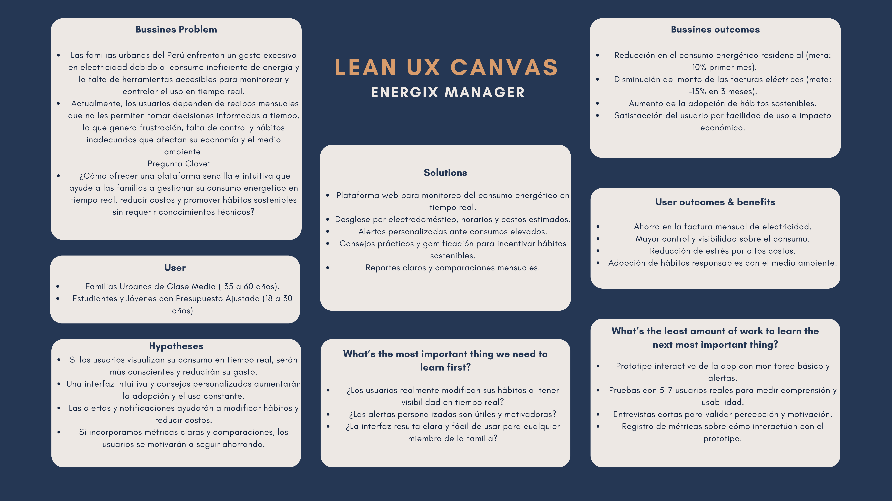

<h1 align="center"><strong>Informe del Trabajo Final</strong></h1>
<h3 align="center"><strong>Universidad Peruana de Ciencias Aplicadas</strong></h1>

<h4 align="center"><strong>Ingeniería de Software</strong></h4>
<h4 align="center"><strong>Aplicaciones Web - 7470</strong></h4>
<h4 align="center"><strong>Docente: Rafael Oswaldo Castro Veramendi</h4>
<h4 align="center"><strong>Startup: Energix</strong></h4>
<h4 align="center">Product: Energix Manager</strong></h4>

<strong>Team members:</strong>

<table align="center"; style="width: 100%; border-collapse: collapse; margin: 0 auto;">
  <tr>
    <th style="border: 1px solid black; padding: 8px; text-align: center;">Nombre</th>
    <th style="border: 1px solid black; padding: 8px; text-align: center;">Código</th>
  </tr>
  </tr>
    <tr>
    <td style="border: 1px solid black; padding: 8px; text-align: center;">Barba Estrada, Bryan Eduardo</td>
    <td style="border: 1px solid black; padding: 8px; text-align: center;">U202323479</td>
  </tr>
  <tr>
    <td style="border: 1px solid black; padding: 8px; text-align: center;">Cotrina Siclla, Sofia Alessandra</td>
    <td style="border: 1px solid black; padding: 8px; text-align: center;">U20231b120</td>
  </tr>
  </tr>
    <tr>
    <td style="border: 1px solid black; padding: 8px; text-align: center;">Encalada Salazar, Alexis</td>
    <td style="border: 1px solid black; padding: 8px; text-align: center;">U20211g491</td>
  </tr>  
  <tr>
    <td style="border: 1px solid black; padding: 8px; text-align: center;">Goñe Araccata, Esther Abigail</td>
    <td style="border: 1px solid black; padding: 8px; text-align: center;">U202318049</td>  
  </tr>
    <tr>
    <td style="border: 1px solid black; padding: 8px; text-align: center;">Salazar Caballero, Alvaro Fabrizzio</td>
    <td style="border: 1px solid black; padding: 8px; text-align: center;">U202321941</td>
  </tr>
</table>

<h3 align="center"><strong>Ciclo 2025-02</strong></h3>

# **Tabla de Contenidos**

<a href="#registro-de-versiones-del-informe">Registro de Versiones del Informe</a> 
<a href="#project-report-collaboration-insights">Project Report Collaboration Insights</a> 
<a href="#contenido">Contenido</a> 
<a href="#tabla-de-contenidos">Tabla de Contenidos</a> 
<a href="#student-outcome">Student Outcome</a> 

<a href="#capítulo-i-introducción">Capítulo I: Introducción</a>
<ul>
  <a href="#11-startup-profile">1.1. Startup Profile</a> 
  <ul>
    <a href="#111-descripción-de-la-startup">1.1.1. Descripción de la Startup</a> 
    <a href="#112-perfiles-de-integrantes-del-equipo">1.1.2. Perfiles de integrantes del equipo</a> 
  </ul>
  <a href="#12-solution-profile">1.2. Solution Profile</a> 
  <ul>
    <a href="#121-antecedentes-y-problemática">1.2.1. Antecedentes y problemática</a> 
    <a href="#122-lean-ux-process">1.2.2. Lean UX Process.</a> 
    <ul>
      <a href="#1221-lean-ux-problem-statements">1.2.2.1. Lean UX Problem Statements.</a> 
      <a href="#1222-lean-ux-assumptions">1.2.2.2. Lean UX Assumptions.</a> 
      <a href="#1223-lean-ux-hypothesis-statements">1.2.2.3. Lean UX Hypothesis Statements.</a> 
      <a href="#1224-lean-ux-canvas">1.2.2.4. Lean UX Canvas.</a> 
    </ul>
  </ul>
  <a href="#13-segmentos-objetivo">1.3. Segmentos objetivo.</a> 
</ul>

<a href="#capítulo-ii-requirements-elicitation--analysis">Capítulo II: Requirements Elicitation & Analysis</a>
<ul>
  <a href="#21-competidores">2.1. Competidores.</a> 
  <ul>
    <a href="#211-análisis-competitivo">2.1.1. Análisis competitivo.</a> 
    <a href="#212-estrategias-y-tácticas-frente-a-competidores">2.1.2. Estrategias y tácticas frente a competidores.</a> 
  </ul>
  <a href="#22-entrevistas">2.2. Entrevistas.</a> 
  <ul>
    <a href="#221-diseño-de-entrevistas">2.2.1. Diseño de entrevistas.</a> 
    <a href="#222-registro-de-entrevistas">2.2.2. Registro de entrevistas.</a> 
    <a href="#223-análisis-de-entrevistas">2.2.3. Análisis de entrevistas.</a> 
  </ul>
  <a href="#23-needfinding">2.3. Needfinding.</a> 
  <ul>
    <a href="#231-user-personas">2.3.1. User Personas.</a> 
    <a href="#232-user-task-matrix">2.3.2. User Task Matrix.</a> 
    <a href="#233-user-journey-mapping">2.3.3. User Journey Mapping.</a> 
    <a href="#234-empathy-mapping">2.3.4. Empathy Mapping.</a> 
    <a href="#235-as-is-scenario-mapping">2.3.5. As-Is scenario mapping.</a> 
  </ul>
  <a href="#24-big-picture-eventstorming">2.4. Big Picture EventStorming.</a> 
  <a href="#25-ubiquitous-language">2.5. Ubiquitous Language.</a> 
</ul>

<a href="#capítulo-iii-requirements-specification">Capítulo III: Requirements Specification</a>
<ul>
  <a href="#31-to-be-scenario-mapping">3.1. To-Be Scenario Mapping.</a> 
  <a href="#32-user-stories">3.2. User Stories.</a> 
  <a href="#321-technical-stories">3.2.1. Technical Stories.</a> 
  <a href="#33-impact-mapping">3.3. Impact Mapping.</a> 
  <a href="#34-product-backlog">3.4. Product Backlog.</a> 
</ul>

<a href="#capítulo-iv-product-design">Capítulo IV: Product Design</a>
<ul>
  <a href="#41-style-guidelines">4.1. Style Guidelines.</a> 
  <ul>
    <a href="#411-general-style-guidelines">4.1.1. General Style Guidelines.</a> 
    <a href="#412-web-style-guidelines">4.1.2. Web Style Guidelines.</a> 
  </ul>
  <a href="#42-information-architecture">4.2. Information Architecture.</a> 
  <ul>
    <a href="#421-organization-systems">4.2.1. Organization Systems.</a> 
    <a href="#422-labeling-systems">4.2.2. Labeling Systems.</a> 
    <a href="#423-seo-tags-and-meta-tags">4.2.3. SEO Tags and Meta Tags.</a> 
    <a href="#424-searching-systems">4.2.4. Searching Systems.</a> 
    <a href="#425-navigation-systems">4.2.5. Navigation Systems.</a> 
  </ul>
  <a href="#43-landing-page-ui-design">4.3. Landing Page UI Design.</a> 
  <ul>
    <a href="#431-landing-page-wireframe">4.3.1. Landing Page Wireframe.</a> 
    <a href="#432-landing-page-mock-up">4.3.2. Landing Page Mock-up.</a> 
  </ul>
  <a href="#44-web-applications-uxui-design">4.4. Web Applications UX/UI Design.</a> 
  <ul>
    <a href="#441-web-applications-wireframes">4.4.1. Web Applications Wireframes.</a> 
    <a href="#442-web-applications-wireflow-diagrams">4.4.2. Web Applications Wireflow Diagrams.</a> 
    <a href="#443-web-applications-mock-ups">4.4.3. Web Applications Mock-ups.</a> 
    <a href="#444-web-applications-user-flow-diagrams">4.4.4. Web Applications User Flow Diagrams.</a> 
  </ul>
  <a href="#45-web-applications-prototyping">4.5. Web Applications Prototyping.</a> 
  <a href="#46-domain-driven-software-architecture">4.6. Domain-Driven Software Architecture.</a> 
  <ul>
    <a href="#461-design-level-eventstorming">4.6.1. Design-Level EventStorming.</a> 
    <a href="#462-software-architecture-context-diagram">4.6.2. Software Architecture Context Diagram.</a> 
    <a href="#463-software-architecture-container-diagrams">4.6.3. Software Architecture Container Diagrams.</a> 
    <a href="#464-software-architecture-components-diagrams">4.6.4. Software Architecture Components Diagrams.</a> 
  </ul>
  <a href="#47-software-object-oriented-design">4.7. Software Object-Oriented Design.</a> 
  <ul>
    <a href="#471-class-diagrams">4.7.1. Class Diagrams.</a> 
  </ul>
  <a href="#48-database-design">4.8. Database Design.</a> 
  <ul>
    <a href="#481-database-diagrams">4.8.1. Database Diagrams.</a> 
  </ul>
</ul>

<a href="#bibliografía">Bibliografía</a>

<a href="#anexos">Anexos</a>

# **Student Outcome**

# **Capítulo I: Introducción** 

## **1.1. Startup Profile**

### ***1.1.1. Descripción de la Startup***

Somos Energix, un Startup conformado por alumnos de la Universidad Peruana de Ciencias Aplicadas (UPC), enfocada en desarrollar soluciones digitales para la optimización del consumo de energía en los hogares.

**Producto Principal:**
Energix Manager es una plataforma que proporciona herramientas tecnológicas accesibles y fáciles de usar, diseñadas para que los usuarios monitoreen, gestionen y controlen su consumo de energía en tiempo real.

**Misión:**
Ayudar a las personas a entender y optimizar su consumo de energía para reducir sus costos y promover hábitos responsables que beneficien tanto su economía familiar como el medio ambiente.

**Visión:**
Convertirnos en la plataforma líder en gestión energética para hogares, empoderando a las personas para que tomen el control de su consumo y reduzcan sus gastos de electricidad.

### ***1.1.2. Perfiles de Integrantes del Equipo***

  

  

  

  

  

## **1.2. Solution Profile**

### ***1.2.1. Antecedentes y problemática***

Para describir los antecedentes y problemática, hemos aplicado la técnica "5W’s & 2H’s", una herramienta clave en el enfoque de Lean UX, para centrarnos realmente en las necesidades del usuario. Esto nos ayudó a definir la dirección de nuestro producto, Energix Manager, de la siguiente manera:

**What**

*¿Cuál es el problema?*

El problema que Energix Manager busca resolver es el consumo ineficiente de energía eléctrica en los hogares urbanos del Perú. Esto se debe, en gran parte, a hábitos de uso inadecuados de los dispositivos y electrodomésticos, lo que provoca un incremento innecesario en la facturación para las familias y tiene un impacto ambiental negativo. Según el Ministerio de Energía y Minas (2022), el 28.6% de la electricidad consumida a nivel nacional en 2022 provino del sector residencial.

**When**

*¿Cuándo sucede el problema?*

El problema ocurre constantemente en la vida cotidiana de los hogares. Esto sucede cuando las personas dejan las luces encendidas en habitaciones vacías, mantienen electrodomésticos en modo "stand by" o utilizan equipos que no son eficientes.

*¿Cuándo utiliza el cliente el producto?*

El cliente usa Energix Manager en su hogar y en cualquier momento del día, ya sea para monitorear su consumo en tiempo real, entender el gasto de un electrodoméstico o gestionar el uso de sus dispositivos.

**Where**

¿Dónde surge el problema?

El problema surge principalmente en los hogares urbanos del Perú, que son los principales consumidores de energía eléctrica a nivel residencial. 

**Who**

*¿Quiénes están involucrados?*

Los principales involucrados son los miembros de las familias peruanas en sus hogares. Un estudio de caso demostró que al menos el 48% de los encuestados admitieron que alguien en su hogar utilizaba la energía de forma inadecuada (Chucuya Fuentes, 2021). Además, están involucradas las empresas eléctricas y las entidades gubernamentales como el Ministerio de Energía y Minas, ya que tienen la responsabilidad de educar y regular el consumo para fomentar la eficiencia energética.

*¿A quiénes le sucede el problema?*

El problema sucede a las familias que viven en áreas urbanas en el Perú, incluyendo tanto viviendas unifamiliares como multifamiliares.

*¿Quién utilizará el producto?*

El producto será utilizado principalmente por los propietarios de vivienda, adultos y jóvenes que toman decisiones sobre el uso de la electricidad y los electrodomésticos en casa. Estas personas son quienes pueden implementar cambios en los hábitos de consumo para lograr una mayor eficiencia energética

**Why**

*¿Por qué sucede el problema?*

El problema ocurre debido a la falta de conocimiento y capacitación sobre el uso eficiente de la energía. La mayoría de las personas desconocen las prácticas y regulaciones para el ahorro energético, lo que perpetúa los hábitos de consumo ineficiente.

*¿Qué llevó al usuario a esta situación?*

Los usuarios se encuentran en esta situación debido a la falta de información y educación. Según Chucuya Fuentes (2021), el 93% de los encuestados desconocía la existencia de normas o leyes para el ahorro de energía, lo que demuestra una brecha de conocimiento que impide la toma de decisiones informadas para ahorrar energía y dinero.

**How**

*¿En qué condiciones los clientes usan nuestro producto?*

Los clientes usan Energix Manager en su entorno doméstico. La plataforma está diseñada para ser accesible y fácil de usar, no requiere de conocimientos técnicos y puede ser utilizada desde un smartphone, tablet o computadora.

*¿Cómo nos conocerán los usuarios?*

Los usuarios conocerán Energix Manager a través de campañas de difusión y concientización que ataquen la falta de conocimiento sobre el consumo energético. Las estrategias clave incluyen alianzas con empresas eléctricas y el Ministerio de Energía y Minas, así como marketing digital.

**How much**

*¿En qué cantidad sucede el problema?*

Según el estudio de Chucuya Fuentes (2021), los hábitos de consumo ineficiente son comunes. Dejar equipos encendidos fue el mal hábito más frecuente (46 menciones), seguido por el uso de "stand by" (25 menciones) y dejar las luces encendidas (21 menciones). En términos económicos, estos hábitos pueden generar un gasto anual adicional de hasta S/ 323.44 soles por hogar.

  

### ***1.2.2. Lean UX Process***

En esta parte se llevará a cabo el proceso de Lean UX, el cual incluye la definición de la visión del modelo de negocio que respalda nuestro producto de software. A través de este enfoque metodológico, es posible enfocar la atención tanto en el diseño de la solución como en los problemas detectados mediante el pensamiento de diseño.

#### **1.2.2.1. Lean UX Problem Statements**

**Contexto:** En los hogares urbanos del Perú, el consumo de energía eléctrica es significativo, representando casi un tercio de la demanda nacional. Sin embargo, los usuarios carecen de información y herramientas para entender y controlar este gasto. La dependencia de recibos de luz mensuales no les permite tomar decisiones informadas en tiempo real para gestionar su consumo.

**Problema:** La falta de una herramienta accesible y fácil de usar que permita a las familias peruanas monitorear, gestionar y controlar su consumo de energía en tiempo real genera frustración por los altos costos, perpetúa hábitos de uso ineficiente y contribuye a un gasto innecesario que afecta tanto su economía como el medio ambiente.

**Pregunta Clave:** ¿Cómo podemos diseñar una plataforma que empodere a las familias peruanas a tomar el control de su consumo de energía, brindándoles información clara y herramientas intuitivas para reducir sus costos y ser más eficientes, sin requerir conocimientos técnicos avanzados?

#### **1.2.2.2. Lean UX Assumptions**

**¿Quiénes son nuestros usuarios?**

* Familias urbanas en el Perú.
* Adultos o jóvenes de 20 a 45 años, con educación media o superior, que gestionan las finanzas del hogar.
* Personas preocupadas por el ahorro económico y la sostenibilidad.
  
**¿Dónde encaja nuestro servicio en su trabajo o vida?**

* En la gestión de sus gastos mensuales.
* En la toma de decisiones sobre el uso de electrodomésticos.
* En la rutina de monitoreo del hogar.
  
**¿Qué problemas tiene nuestro producto y cómo se puede resolver?**

Problema de Integración: La conexión a los sistemas de facturación de empresas eléctricas.

Solución: Se puede resolver mediante alianzas estratégicas con las compañías eléctricas. 

Problema de Hábitos: La resistencia de los usuarios a cambiar sus hábitos de consumo.

Solución: La plataforma será intuitiva y motivadora. Se usarán notificaciones gamificadas, comparaciones de consumo y visualizaciones 
claras para hacer el ahorro tangible y gratificante.

**¿Cómo y cuándo es usado nuestro producto?**

* Al final de cada día para revisar el consumo.

* Al recibir la factura de electricidad, para entender los picos de consumo.

* En tiempo real, para verificar el impacto de usar un electrodoméstico específico.

**¿Qué características son importantes?**

* Compatibilidad con la mayoría de los electrodomésticos y medidores de energía en los hogares peruanos.
* Interfaz de usuario intuitiva y amigable para personas sin conocimientos técnicos.
* Datos en tiempo real sobre el consumo.
* Alertas y notificaciones personalizables sobre consumos elevados.
* Sugerencias de ahorro y análisis predictivo.
* Escalabilidad para añadir nuevas funcionalidades y electrodomésticos.

**¿Cómo debe verse nuestro producto y cómo comportarse?**

Energix Manager debe ser una plataforma que transmita confianza y simplicidad. Su comportamiento debe ser intuitivo y proactivo, ofreciendo información clara y recomendaciones útiles sin abrumar al usuario. Visualmente, debe ser limpio y moderno para atraer a un público joven y tecnológico, pero suficientemente claro para todos los miembros de la familia.

**User Outcome**

Para los usuarios:

* Reducción significativa en el monto de su factura de electricidad.
* Mayor control y visibilidad sobre su consumo energético.
* Menos estrés y frustración al entender por qué sus recibos son altos.
* Adopción de hábitos de consumo más eficientes y sostenibles.

**Features**

* Monitoreo en tiempo real: Muestra el consumo de energía en vivo.

* Análisis detallado: Desglosa el consumo por electrodoméstico y hora del día.

* Alertas y notificaciones: Envía avisos sobre consumos elevados o inusuales.

* Consejos personalizados: Ofrece sugerencias específicas para ahorrar energía según los hábitos del usuario.

#### 1.2.2.3. Lean UX Hypothesis Statements

**Hipótesis 1: Monitoreo y conciencia**

Creemos que al proporcionar a los usuarios de la plataforma una visualización en tiempo real de su consumo energético, ellos se volverán más conscientes de sus hábitos.

Sabremos que hemos tenido éxito cuando el 50% de los usuarios activos demuestre una reducción de consumo eléctrico del 10% en el primer mes de uso.

**Hipótesis 2: Impacto en la facturación**

Creemos que la implementación de alertas personalizadas y consejos de ahorro específicos para los electrodomésticos de mayor consumo como la refrigeradora y la iluminación permitirá a los usuarios reducir su gasto.

Sabremos que hemos tenido éxito cuando el 70% de los usuarios que utilicen estas funciones reportan una disminución en el costo de su factura mensual en los primeros tres meses.

#### **1.2.2.4. Lean UX Canvas**

Tras completar las etapas del Lean UX Process, el siguiente paso es elaborar el Lean UX Canvas. Esta herramienta nos ayuda a visualizar de manera integral el problema y sirve como punto de partida para la investigación previa al diseño de la solución propuesta.

  

## **1.3. Segmentos Objetivos**

Esta sección incluye la descripción de los segmentos asociados al dominio del problema, incluyendo características demográficas e información estadística de sustento.

<ins>**1. Familias Urbanas de Clase Media**</ins>

Este segmento es nuestro público objetivo principal. Son los adultos o miembros del hogar quienes toman las decisiones de gasto.

**Características Demográficas:**

* **Edad:** 35 a 60 años.
* **Nivel Socioeconómico:** C y B.
* **Composición Familiar:** Familias consolidadas, con o sin hijos en casa.

**Hábitos y Motivación:** Pasan la mayor parte del día en el hogar y son los principales gestores del consumo de electrodomésticos. Buscan soluciones prácticas y sencillas para controlar y reducir los costos de la factura de luz.

**Información de Sustento:**

La clase media en el Perú ha crecido significativamente, representando un segmento con un poder de consumo energético importante. Un hogar promedio en Lima consume alrededor de 172 kWh/mes, un valor que supera ampliamente el promedio nacional y refleja un alto uso de electrodomésticos (Autosolar Perú).

<ins>**2. Estudiantes y Jóvenes con Presupuesto Ajustado**</ins>

Este segmento busca soluciones prácticas para reducir gastos, ya que viven con presupuestos limitados. Son nativos digitales y están abiertos a probar aplicaciones que les ofrezcan beneficios tangibles de forma inmediata.

**Características Demográficas:**

* **Edad:** 18 a 30 años.
* **Nivel Socioeconómico:** C, D y E.
* **Composición Familiar:** Viven en departamentos compartidos o alquilados.

**Hábitos y Motivación:** Buscan maneras prácticas y rápidas de reducir sus gastos mensuales para hacer rendir su presupuesto.

**Información de Sustento:**

Las viviendas alquiladas en zonas universitarias o céntricas suelen tener un alto consumo de energía por la falta de conciencia compartida y la falta de control individual sobre el gasto.

Este segmento está muy influenciado por la información en línea y las recomendaciones. Una solución fácil de usar que demuestre un ahorro real podría ser adoptada rápidamente y difundida a través de sus círculos sociales.

# **Capítulo II: Requirements Elicitation & Analysis**

## **2.1. Competidores**

## 2.1.1. Análisis competitivo

# Análisis Competitivo – Energix Manager

## ¿Por qué llevar a cabo este análisis?
Este análisis permite entender el posicionamiento de **Energix Manager** en el mercado de plataformas de monitoreo y optimización de consumo energético en hogares, identificar oportunidades de diferenciación y anticipar amenazas de competidores. Así se optimizan estrategias de producto y marketing, asegurando que Energix Manager responda a las necesidades de los hogares urbanos interesados en eficiencia y ahorro energético.

---

## Competitive Analysis Landscape

|                       | Su startup – **Energix Manager** | Competidor 1 – **Sense Home Energy Monitor** | Competidor 2 – **Wibeee Box** | Competidor 3 – **SmartThings Energy** |
|-----------------------|----------------------------------|---------------------------------------------|--------------------------------|----------------------------------------|
| **Perfil / Overview** | Plataforma web que permite monitoreo en tiempo real, análisis por electrodoméstico, alertas personalizadas y consejos de ahorro. | Dispositivo físico que se instala en el panel eléctrico para monitoreo detallado a nivel de electrodoméstico. | Sistema conectado al cuadro eléctrico que ofrece análisis integral del consumo energético. | Aplicación que permite controlar y monitorear dispositivos inteligentes Samsung. |
| **Ventaja competitiva / Valor** | Interfaz intuitiva, recomendaciones personalizadas, predicción de consumo, alertas inteligentes, enfoque en ahorro económico y hábitos sostenibles. | Alertas de consumo anormal, reportes detallados, monitoreo preciso de cada dispositivo. | Informes precisos, análisis predictivo, sugerencias de tarifas para optimizar gasto. | Integración con ecosistema Samsung, control remoto de electrodomésticos, visualización de consumo. |

---

## Perfil de Marketing

|                       | Su startup – **Energix Manager** | Competidor 1 – **Sense Home Energy Monitor** | Competidor 2 – **Wibeee Box** | Competidor 3 – **SmartThings Energy** |
|-----------------------|----------------------------------|---------------------------------------------|--------------------------------|----------------------------------------|
| **Mercado objetivo** | Hogares urbanos de clase media y estudiantes jóvenes preocupados por eficiencia y ahorro energético en Perú. | Propietarios de viviendas que buscan control detallado del consumo eléctrico. | Hogares que desean optimizar su consumo integralmente. | Usuarios de dispositivos Samsung interesados en eficiencia energética y control remoto. |
| **Estrategias de marketing** | Marketing digital, colaboraciones con empresas eléctricas y Ministerio de Energía y Minas, campañas educativas. | Marketing de producto, asociaciones con instaladores eléctricos, campañas educativas. | Campañas educativas sobre ahorro energético, presencia en ferias de eficiencia. | Promociones cruzadas con productos Samsung y marketing digital. |

---

## Perfil de Producto

|                       | Su startup – **Energix Manager** | Competidor 1 – **Sense Home Energy Monitor** | Competidor 2 – **Wibeee Box** | Competidor 3 – **SmartThings Energy** |
|-----------------------|----------------------------------|---------------------------------------------|--------------------------------|----------------------------------------|
| **Productos & Servicios** | Monitoreo en tiempo real, análisis detallado por dispositivo, alertas, recomendaciones personalizadas, gráficos comparativos, panel web. | Dispositivo + app móvil para monitoreo en tiempo real y alertas. | Hardware + app móvil para análisis de consumo y recomendaciones de ahorro. | App móvil para control de dispositivos, reportes de consumo, alertas. |
| **Precios & Costos** | Freemium: plan básico gratuito, plan premium $5–$15/mes. | Dispositivo ~$250–$300, app incluida. | Hardware + suscripción mensual ~$15–$50. | App gratuita; requiere dispositivos Samsung. |
| **Canales de distribución (Web y/o Móvil)** | Plataforma web accesible desde cualquier navegador, marketing digital y alianzas estratégicas. | Venta online, distribuidores especializados, app móvil complementaria. | Venta online, distribuidores autorizados, app móvil. | Samsung Galaxy Store, Google Play, control vía app móvil. |

---

## Análisis SWOT

|                       | Su startup – **Energix Manager** | Competidor 1 – **Sense Home Energy Monitor** | Competidor 2 – **Wibeee Box** | Competidor 3 – **SmartThings Energy** |
|-----------------------|----------------------------------|---------------------------------------------|--------------------------------|----------------------------------------|
| **Fortalezas** | Web intuitiva, alertas y recomendaciones, plan freemium, enfoque en ahorro y sostenibilidad. | Monitoreo preciso por dispositivo, alertas, reportes detallados. | Informes predictivos, análisis integral, buenas recomendaciones de ahorro. | Integración con Samsung, control remoto, app consolidada. |
| **Debilidades** | Sin app móvil, depende de datos del usuario, marca poco conocida, integración limitada. | Requiere instalación, costo inicial alto, curva de aprendizaje. | Depende de hardware, costo mensual, adopción limitada. | Solo funciona con dispositivos Samsung, funcionalidad limitada fuera del ecosistema. |
| **Oportunidades** | Alianzas con empresas y gobierno, expansión en Latinoamérica, gamificación, tendencia hacia eficiencia energética. | Expansión a hogares residenciales, integración con domótica. | Expansión internacional, alianzas con compañías de energía. | Crecimiento de smart homes, colaboración con Samsung. |
| **Amenazas** | Competencia de apps móviles, resistencia al cambio de hábitos, apps gratuitas, conectividad limitada. | Nuevas soluciones IoT más económicas. | Competencia de apps sin hardware, saturación de mercado. | Competencia de apps multimarca, usuarios fuera de Samsung no pueden usarla. |

---

### ***2.1.2. Estrategias y tácticas frente a competidores***

- **Plan Freemium accesible**: Ofreceremos funciones esenciales de monitoreo y alertas personalizadas, mucho más accesibles que las soluciones de hardware costoso como **Sense Home Energy Monitor** o **Wibeee Box**.

- **Contenido educativo gratuito**: Publicaremos guías en PDF, videos y webinars sobre eficiencia energética y ahorro en el hogar, posicionando a **Energix Manager** como la opción más simple y práctica frente a competidores más complejos.

- **Prueba premium de 30 días**: Permitiremos acceso completo a todas las funcionalidades premium con énfasis en la **facilidad de uso y adopción inmediata**, diferenciándonos de otros que requieren hardware o instalaciones complejas.

- **Funciones diferenciadoras**: Desarrollaremos alertas automáticas de consumo elevado y recomendaciones personalizadas por electrodoméstico, superando las limitaciones de aplicaciones centradas exclusivamente en hardware o ecosistemas cerrados.

- **Planes escalables**: Ofreceremos planes que se adapten a distintos tamaños de hogar, permitiendo a los usuarios crecer en funcionalidades sin incurrir en altos costos iniciales, a diferencia de plataformas de hardware con inversión significativa.

## **2.2. Entrevistas**

### ***2.2.1. Diseño de entrevistas***

## Segmento 1: Estudiantes que alquilan vivienda

- ¿Compartes el pago de la electricidad con tus compañeros de vivienda? ¿Cómo organizan ese gasto?  
- ¿Qué tanta atención presta al consumo eléctrico diario o mensual en tu alojamiento?  
- ¿Qué tipo de alertas (horario, sobreconsumo, dispositivos encendidos) serían más útiles en tu caso?  
- ¿Usas alguna app para organizar tus finanzas personales? ¿Te gustaría incluir el gasto eléctrico ahí?  
- ¿Prefieres recibir información simple (costo total por persona) o detallada (por artefacto)?  
- ¿Qué dispositivo usas más para revisar este tipo de información: ¿celular, laptop o ambos?  
- ¿Qué tan dispuesto estarías a cambiar tus hábitos (apagar equipos, desconectar cargadores) si recibes recomendaciones personalizadas?  
- ¿Qué barreras ves para adoptar una app que te ayude a reducir el gasto eléctrico?  

---

## Segmento 2: Jóvenes adultos responsables del pago de la electricidad

- ¿Qué importancia le das al control del consumo eléctrico dentro de tu presupuesto mensual?  
- ¿Has tenido experiencias de aumentos inesperados en el recibo de luz? ¿Cómo los enfrentas?  
- ¿Qué información te gustaría recibir de una plataforma para sentir que tienes control sobre tu consumo?  
- ¿Con qué frecuencia revisarías un reporte de consumo (diario, semanal, mensual)?  
- ¿Qué tan útil sería para ti recibir alertas sobre consumos anormales en ciertos horarios?  
- ¿Qué dispositivos de tu hogar crees que más impactan en tu recibo de luz?  
- ¿Qué tan dispuesto estarías a pagar por una app que te ayude a ahorrar en tu consumo eléctrico?  
- ¿Qué funcionalidades consideras esenciales en una plataforma web o app para controlar tu consumo de energía?  

---

### ***2.2.2. Registro de entrevistas***

## Entrevistas por segmento

## Segmento 1: Estudiantes que alquilan vivienda

| Número de registro | Datos del entrevistado | Captura |
|--------------------|-------------------------|---------|
| **1** | **Nombre:** Willy Guzman    **Edad:** 22 años   **Distrito:** SMP   **Duración de la entrevista:** 4:28 minutos   **Link:** [Ver entrevista](https://youtu.be/gCHaPFnEpZ4?si=Kx5f6Wv6fKwcg4Qe)   **Resumen:** El entrevistado, estudiante de Cajamarca que vive en Lima con sus primos en una vivienda alquilada, comparte el pago de electricidad entre tres personas. No presta demasiada atención al consumo eléctrico diario o mensual y no recibe alertas de apps. Valora la idea de una app que muestre tanto el costo total como el consumo por artefacto, para identificar dispositivos de mayor gasto. Reconoce que equipos como la computadora, impresora, televisor, refrigerador y microondas impactan en el recibo. Afirma que estaría dispuesto a cambiar hábitos si recibe recomendaciones personalizadas y que valora información clara, visual y sencilla. Considera barrera principal la falta de compatibilidad de dispositivos. |  |
| **2** | **Nombre:** Leimy Nuñez   **Edad:** 20 años   **Distrito:** Callao   **Duración de la entrevista:** 3:10 minutos   **Link:** [Ver entrevista](https://youtu.be/aIU7QD1wems?si=Xt_kOwqgm8nAsZdM)   **Resumen:** La entrevistada comparte el pago de electricidad dividiéndolo en partes iguales con sus compañeros. No presta atención diaria al consumo eléctrico, pero sí al momento de pagar el recibo. Considera útiles alertas que avisen de dispositivos encendidos innecesariamente. No usa aplicaciones para organizar finanzas, pero estaría interesada en una que incluya el gasto eléctrico. Prefiere información simple (costo total dividido entre personas). Revisa información desde el celular. Manifiesta disposición a cambiar hábitos y considera barrera la posible falta de compatibilidad con dispositivos del hogar. |  |

---

## Segmento 2: Jóvenes adultos responsables del pago de la electricidad

| Número de registro | Datos del entrevistado | Captura |
|--------------------|-------------------------|---------|
| **1** | **Nombre:** Braden Garcia   **Edad:** 23 años   **Distrito:** San Borja   **Duración de la entrevista:** 2:16 minutos   **Link:** [Ver entrevista](https://youtu.be/fkTpOOHVGQ0?si=tNZzRJI2dFmMgi7F)   **Resumen:** Considera importante controlar el consumo eléctrico, destina entre 10% y 15% de su presupuesto mensual (≈150 soles) a la luz. Reconoce aumentos en épocas específicas y estaría interesado en alertas inmediatas sobre consumos anormales. Afirma que revisaría la información a diario si la app es accesible desde el móvil. Identifica como dispositivos de mayor impacto el aire acondicionado y la computadora. Estaría dispuesto a pagar un servicio (≈10–20 soles mensuales). Valora facilidad de acceso, posibilidad de comparativas y visualización clara del consumo. |  |
| **2** | **Nombre:** Nestor Rojas   **Edad:** 21 años   **Distrito:** Comas   **Duración de la entrevista:** 3:07 minutos   **Link:** [Ver entrevista](https://youtu.be/SaUrn95CV8E?si=BDsRBMo3lKQccWOW)   **Resumen:** Vive con su abuela, considera importante el control del consumo eléctrico familiar. Ha enfrentado aumentos por enchufes conectados y por mayor uso de dispositivos electrónicos. Busca identificar consumo por dispositivo y comparar entre meses. Prefiere revisarlo en tiempo real más que esperar la factura. Considera esencial recibir alertas inmediatas y saber qué aparato gasta más en el momento. Indica que pagaría por la app solo si le aporta un beneficio tangible. |  |

### ***2.2.3. Análisis de entrevistas***
## **2.3. Needfinding**
### ***2.3.1. User Personas***
### ***2.3.2. User Task Matrix***
### ***2.3.3. User Journey Mapping***
### ***2.3.4. Empathy Mapping***
### ***2.3.5. As-is Scenario Mapping***
## **2.4. Ubiquitous Language**

# **Capítulo III: Requirements Specification**

## **3.1. To-Be Scenario Mapping**

El To-Be Scenario Mapping describe cómo se espera que los usuarios interactúen con la solución propuesta en el futuro. Permite visualizar de manera narrativa y estructurada los procesos deseados, identificando mejoras frente a la situación actual y sirviendo como base para la definición de requerimientos.

**Segmento 1:** Familias Urbanas de Clase Media

  

**Segmento 2:** Estudiantes y Jóvenes con Presupuesto Ajustado

  

## **4.6 Domain-Driven Software Architecture**
### ***4.6.1 Design-Level EventStorming***

### ***4.6.2 Software Architecture Context Diagram***

### ***4.6.3 Software Architecture Container Diagram***

### ***4.6.4 Software Architecture Components Diagram***

## **4.7 Software Object-Oriented Design**
### ***4.7.1 Class Diagrams***

## **4.8 Database Design**
### **4.8.1 Database Diagrams**
