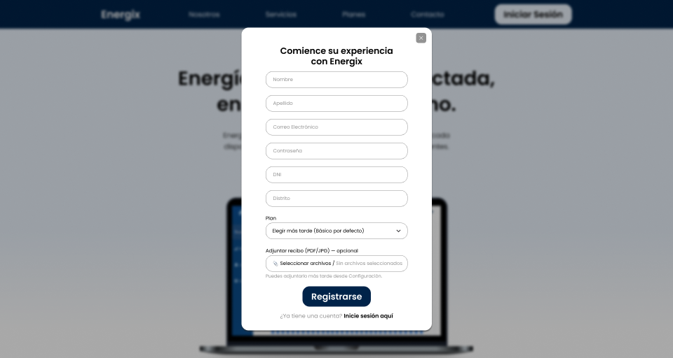

<p align="center">
</p>

<h3 align="center"><strong>Universidad Peruana de Ciencias Aplicadas</strong></h3>
<h4 align="center"><strong>Facultad de Ingeniería</strong></h4>
<h4 align="center"><strong>Carrera de Ingeniería de Software</strong></h4>
<h4 align="center"><strong>Periodo 202520</strong></h4>
<h4 align="center"><strong>Código del curso: A1ASI0729</strong></h4>
<h4 align="center"><strong>Nombre del curso: Aplicaciones Web</strong></h4>
<h4 align="center"><strong>NRC: 7470</strong></h4>

<h4 align="center"><strong>Nombre del profesor: Rafael Oswaldo Castro Veramendi</strong></h4>
<h4 align="center"><strong>Informe del trabajo final</strong></h4> 


<h4 align="center"><strong>Nombre del startup: Energix</strong></h4>
<h4 align="center"><strong>Nombre del producto: Energix Manager</strong></h4>

<p align="center"><strong>Team members:</strong></p>

<table align="center" style="width: 100%; border-collapse: collapse; margin: 0 auto;">
  <tr>
    <th style="border: 1px solid black; padding: 8px; text-align: center;">Apellidos y Nombres</th>
    <th style="border: 1px solid black; padding: 8px; text-align: center;">Código</th>
  </tr>

  <tr>
    <td style="border: 1px solid black; padding: 8px; text-align: center;">Barba Estrada, Bryan Eduardo</td>
    <td style="border: 1px solid black; padding: 8px; text-align: center;">U202323479</td>
  </tr>
  
  <tr>
    <td style="border: 1px solid black; padding: 8px; text-align: center;">Cotrina Siclla, Sofia Alessandra</td>
    <td style="border: 1px solid black; padding: 8px; text-align: center;">U20231B120</td>
  </tr>

  <tr>
    <td style="border: 1px solid black; padding: 8px; text-align: center;">Encalada Salazar, Alexis</td>
    <td style="border: 1px solid black; padding: 8px; text-align: center;">U20211G491</td>
  </tr>

  <tr>
    <td style="border: 1px solid black; padding: 8px; text-align: center;">Goñe Araccata, Esther Abigail</td>
    <td style="border: 1px solid black; padding: 8px; text-align: center;">U202318049</td>
  </tr>

  <tr>
    <td style="border: 1px solid black; padding: 8px; text-align: center;">Salazar Caballero, Alvaro Fabrizzio</td>
    <td style="border: 1px solid black; padding: 8px; text-align: center;">U202321941</td>
  </tr>
</table>

<br><br>

<h3 align="center"><strong>Diciembre 2025</strong></h3>

<br>

<hr>

# **Registro de Versiones del Informe**

| **Versión** | **Fecha**    | **Autor** | **Descripción de la modificación** |
|-------------|--------------|-----------|------------------------------------|
| TB1         | 19/09/2025   | Barba Estrada, Bryan Eduardo <br><br> Cotrina Siclla, Sofia Alessandra <br><br> Encalada Salazar, Alexis <br><br> Goñe Araccata, Esther Abigail <br><br> Salazar Caballero, Fabrizzio Alvaro | En la primera entrega del informe de nuestro proyecto, hemos realizado los primeros 5 capítulos del informe y también la primera versión del landing page de Energix. |
| TP         | 10/08/2025   | Barba Estrada, Bryan Eduardo <br><br> Cotrina Siclla, Sofia Alessandra <br><br> Encalada Salazar, Alexis <br><br> Goñe Araccata, Esther Abigail <br><br> Salazar Caballero, Fabrizzio Alvaro | En la segunda entrega del informe de nuestro proyecto, se realizó la documentación correspondiente al Sprint 2 y se realizó actualizaciones en las conclusiones y anexos del informe de reporte. Por otro lado, se realizó las respectivas mejoras y se desarrolló la primera versión del Fronted Web Applications. |
| TF         |    | Barba Estrada, Bryan Eduardo <br><br> Cotrina Siclla, Sofia Alessandra <br><br> Encalada Salazar, Alexis <br><br> Goñe Araccata, Esther Abigail <br><br> Salazar Caballero, Fabrizzio Alvaro |  |

<hr>

# **Project Report Collaboration Insights**

Se elaboró el informe del proyecto en un repositorio llamado “ProjectReport” en la organización “AppWeb-Energix”.

**Enlace del repositorio “ProjectReport”:** https://github.com/AppWeb-Energix/ProjectReport

TB1: Para facilitar la elaboración colaborativa de este informe, el equipo comenzó trabajando en un documento compartido en Google. Posteriormente, el contenido se trasladó y organizó en un repositorio de GitHub, empleando el formato markdown para estructurar cada sección. A continuación, se presenta una imagen con los insights de los commits realizados por cada integrante dentro de dicho repositorio.

<p align="center">
  
</p>

TP: Para la elaboración del informe del TP1, seguimos una metodología similar a la empleada en la entrega anterior. Iniciamos el trabajo en un documento colaborativo de Google, lo que nos permitió registrar y monitorear los avances correspondientes al Sprint 2. Posteriormente, el contenido desarrollado fue migrado al formato Markdown y subido al repositorio del project report en GitHub mediante commits. A continuación, se presenta una imagen con los insights de los commits realizados por cada integrante dentro de dicho repositorio.

<p align="center">
  
</p>

TB2: Para la elaboración del informe del TB2, seguimos una metodología similar a la empleada en la entrega anterior. Iniciamos el trabajo en un documento colaborativo de Google, lo que nos permitió registrar y monitorear los avances correspondientes al Sprint 3. Posteriormente, el contenido desarrollado fue migrado al formato Markdown y subido al repositorio del project report en GitHub mediante commits. A continuación, se presenta una imagen con los insights de los commits realizados por cada integrante dentro de dicho repositorio.

<p align="center">
  
</p>

TF:

<p align="center">
  
</p>

<hr>

# **Tabla de Contenidos**

<a href="#registro-de-versiones-del-informe">Registro de Versiones del Informe</a><br>
<a href="#project-report-collaboration-insights">Project Report Collaboration Insights</a><br>
<a href="#tabla-de-contenidos">Tabla de Contenidos</a><br>
<a href="#student-outcome">Student Outcome</a><br>

<a href="#capítulo-i-introducción">Capítulo I: Introducción</a>
<ul>
  <a href="#11-startup-profile">1.1. Startup Profile</a><br>
  <ul>
    <a href="#111-descripción-de-la-startup">1.1.1. Descripción de la Startup</a><br>
    <a href="#112-perfiles-de-integrantes-del-equipo">1.1.2. Perfiles de integrantes del equipo</a><br>
  </ul>
  <a href="#12-solution-profile">1.2. Solution Profile</a><br>
  <ul>
    <a href="#121-antecedentes-y-problemática">1.2.1. Antecedentes y problemática</a><br>
    <a href="#122-lean-ux-process">1.2.2. Lean UX Process.</a><br>
    <ul>
      <a href="#1221-lean-ux-problem-statements">1.2.2.1. Lean UX Problem Statements.</a><br>
      <a href="#1222-lean-ux-assumptions">1.2.2.2. Lean UX Assumptions.</a><br>
      <a href="#1223-lean-ux-hypothesis-statements">1.2.2.3. Lean UX Hypothesis Statements.</a><br>
      <a href="#1224-lean-ux-canvas">1.2.2.4. Lean UX Canvas.</a><br>
    </ul>
  </ul>
  <a href="#13-segmentos-objetivo">1.3. Segmentos objetivo.</a><br>
</ul>

<a href="#capítulo-ii-requirements-elicitation--analysis">Capítulo II: Requirements Elicitation & Analysis</a>
<ul>
  <a href="#21-competidores">2.1. Competidores.</a><br>
  <ul>
    <a href="#211-análisis-competitivo">2.1.1. Análisis competitivo.</a><br>
    <a href="#212-estrategias-y-tácticas-frente-a-competidores">2.1.2. Estrategias y tácticas frente a competidores.</a><br>
  </ul>
  <a href="#22-entrevistas">2.2. Entrevistas.</a><br>
  <ul>
    <a href="#221-diseño-de-entrevistas">2.2.1. Diseño de entrevistas.</a><br>
    <a href="#222-registro-de-entrevistas">2.2.2. Registro de entrevistas.</a><br>
    <a href="#223-análisis-de-entrevistas">2.2.3. Análisis de entrevistas.</a><br>
  </ul>
  <a href="#23-needfinding">2.3. Needfinding.</a><br>
  <ul>
    <a href="#231-user-personas">2.3.1. User Personas.</a><br>
    <a href="#232-user-task-matrix">2.3.2. User Task Matrix.</a><br>
    <a href="#233-user-journey-mapping">2.3.3. User Journey Mapping.</a><br>
    <a href="#234-empathy-mapping">2.3.4. Empathy Mapping.</a><br>
    <a href="#235-as-is-scenario-mapping">2.3.5. As-Is scenario mapping.</a><br>
  </ul>
  <a href="#24-big-picture-eventstorming">2.4. Big Picture EventStorming.</a><br>
  <a href="#25-ubiquitous-language">2.5. Ubiquitous Language.</a><br>
</ul>

<a href="#capítulo-iii-requirements-specification">Capítulo III: Requirements Specification</a>
<ul>
  <a href="#31-to-be-scenario-mapping">3.1. To-Be Scenario Mapping.</a><br>
  <a href="#32-user-stories">3.2. User Stories.</a><br>
  <a href="#321-technical-stories">3.2.1. Technical Stories.</a><br>
  <a href="#33-impact-mapping">3.3. Impact Mapping.</a><br>
  <a href="#34-product-backlog">3.4. Product Backlog.</a><br>
</ul>

<a href="#capítulo-iv-product-design">Capítulo IV: Product Design</a>
<ul>
  <a href="#41-style-guidelines">4.1. Style Guidelines.</a><br>
  <ul>
    <a href="#411-general-style-guidelines">4.1.1. General Style Guidelines.</a><br>
    <a href="#412-web-style-guidelines">4.1.2. Web Style Guidelines.</a><br>
  </ul>
  <a href="#42-information-architecture">4.2. Information Architecture.</a><br>
  <ul>
    <a href="#421-organization-systems">4.2.1. Organization Systems.</a><br>
    <a href="#422-labeling-systems">4.2.2. Labeling Systems.</a><br>
    <a href="#423-seo-tags-and-meta-tags">4.2.3. SEO Tags and Meta Tags.</a><br>
    <a href="#424-searching-systems">4.2.4. Searching Systems.</a><br>
    <a href="#425-navigation-systems">4.2.5. Navigation Systems.</a><br>
  </ul>
  <a href="#43-landing-page-ui-design">4.3. Landing Page UI Design.</a><br>
  <ul>
    <a href="#431-landing-page-wireframe">4.3.1. Landing Page Wireframe.</a><br>
    <a href="#432-landing-page-mock-up">4.3.2. Landing Page Mock-up.</a><br>
  </ul>
  <a href="#44-web-applications-uxui-design">4.4. Web Applications UX/UI Design.</a><br>
  <ul>
    <a href="#441-web-applications-wireframes">4.4.1. Web Applications Wireframes.</a><br>
    <a href="#442-web-applications-wireflow-diagrams">4.4.2. Web Applications Wireflow Diagrams.</a><br>
    <a href="#443-web-applications-mock-ups">4.4.3. Web Applications Mock-ups.</a><br>
    <a href="#444-web-applications-user-flow-diagrams">4.4.4. Web Applications User Flow Diagrams.</a><br>
  </ul>
  <a href="#45-web-applications-prototyping">4.5. Web Applications Prototyping.</a><br>
  <a href="#46-domain-driven-software-architecture">4.6. Domain-Driven Software Architecture.</a><br>
  <ul>
    <a href="#461-design-level-eventstorming">4.6.1. Design-Level EventStorming.</a><br>
    <a href="#462-software-architecture-context-diagram">4.6.2. Software Architecture Context Diagram.</a><br>
    <a href="#463-software-architecture-container-diagrams">4.6.3. Software Architecture Container Diagrams.</a><br>
    <a href="#464-software-architecture-components-diagrams">4.6.4. Software Architecture Components Diagrams.</a><br>
  </ul>
  <a href="#47-software-object-oriented-design">4.7. Software Object-Oriented Design.</a><br>
  <ul>
    <a href="#471-class-diagrams">4.7.1. Class Diagrams.</a><br>
  </ul>
  <a href="#48-database-design">4.8. Database Design.</a><br>
  <ul>
    <a href="#481-database-diagrams">4.8.1. Database Diagrams.</a><br>
  </ul>
</ul>

<a href="#capítulo-v-product-implementation-validation-deployment">Capítulo V: Product Implementation, Validation & Deployment</a><br>
<ul>
  <a href="#51-software-configuration-management">5.1. Software Configuration Management</a><br>
  <ul>
    <a href="#511-software-development-environment-configuration">5.1.1. Software Development Environment Configuration</a><br>
    <a href="#512-source-code-management">5.1.2. Source Code Management</a><br>
    <a href="#513-source-code-style-guide-conventions">5.1.3. Source Code Style Guide & Conventions</a><br>
    <a href="#514-software-deployment-configuration">5.1.4. Software Deployment Configuration</a><br>
  </ul>
  <a href="#52-landing-page-services-applications-implementation">5.2. Landing Page, Services & Applications Implementation</a>
  <ul>
    <a href="#521-sprint-1">5.2.1. Sprint 1</a><br>
    <ul>
      <a href="#5211-sprint-planning-1">5.2.1.1. Sprint Planning 1</a><br>
      <a href="#5212-aspect-leaders-and-collaborators">5.2.1.2. Aspect Leaders and Collaborators</a><br>
      <a href="#5213-sprint-backlog-1">5.2.1.3. Sprint Backlog 1</a><br>
      <a href="#5214-development-evidence-for-sprint-review">5.2.1.4. Development Evidence for Sprint Review</a><br>
      <a href="#5215-execution-evidence-for-sprint-review">5.2.1.5. Execution Evidence for Sprint Review</a><br>
      <a href="#5216-services-documentation-evidence-for-sprint-review">5.2.1.6. Services Documentation Evidence for Sprint Review</a><br>
      <a href="#5217-software-deployment-evidence-for-sprint-review">5.2.1.7. Software Deployment Evidence for Sprint Review</a><br>
      <a href="#5218-team-collaboration-insights-during-sprint">5.2.1.8. Team Collaboration Insights During Sprint</a><br>
    </ul>
    <a href="#522-sprint-2">5.2.2. Sprint 2</a><br>
    <ul>
      <a href="#5221-sprint-planning-2">5.2.2.1. Sprint Planning 2</a><br>
      <a href="#5222-aspect-leaders-and-collaborators">5.2.2.2. Aspect Leaders and Collaborators</a><br>
      <a href="#5223-sprint-backlog-2">5.2.2.3. Sprint Backlog 2</a><br>
      <a href="#5224-development-evidence-for-sprint-review">5.2.2.4. Development Evidence for Sprint Review</a><br>
      <a href="#5225-execution-evidence-for-sprint-review">5.2.2.5. Execution Evidence for Sprint Review</a><br>
      <a href="#5226-services-documentation-evidence-for-sprint-review">5.2.2.6. Services Documentation Evidence for Sprint Review</a><br>
      <a href="#5227-software-deployment-evidence-for-sprint-review">5.2.2.7. Software Deployment Evidence for Sprint Review</a><br>
      <a href="#5228-team-collaboration-insights-during-sprint">5.2.2.8. Team Collaboration Insights During Sprint</a><br>
    </ul>
    <a href="#523-sprint-2">5.2.3. Sprint 3</a><br>
    <ul>
      <a href="#5231-sprint-planning-3">5.2.3.1. Sprint Planning 3</a><br>
      <a href="#5232-aspect-leaders-and-collaborators">5.2.3.2. Aspect Leaders and Collaborators</a><br>
      <a href="#5233-sprint-backlog-3">5.2.3.3. Sprint Backlog 3</a><br>
      <a href="#5234-development-evidence-for-sprint-review">5.2.3.4. Development Evidence for Sprint Review</a><br>
      <a href="#5235-execution-evidence-for-sprint-review">5.2.3.5. Execution Evidence for Sprint Review</a><br>
      <a href="#5236-services-documentation-evidence-for-sprint-review">5.2.3.6. Services Documentation Evidence for Sprint Review</a><br>
      <a href="#5237-software-deployment-evidence-for-sprint-review">5.2.3.7. Software Deployment Evidence for Sprint Review</a><br>
      <a href="#5238-team-collaboration-insights-during-sprint">5.2.3.8. Team Collaboration Insights During Sprint</a><br>
    </ul>
    <a href="#524-sprint-4">5.2.4. Sprint 4</a><br>
    <ul>
      <a href="#5241-sprint-planning-4">5.2.4.1. Sprint Planning 4</a><br>
      <a href="#5242-aspect-leaders-and-collaborators">5.2.4.2. Aspect Leaders and Collaborators</a><br>
      <a href="#5243-sprint-backlog-4">5.2.4.3. Sprint Backlog 4</a><br>
      <a href="#5244-development-evidence-for-sprint-review">5.2.4.4. Development Evidence for Sprint Review</a><br>
      <a href="#5245-execution-evidence-for-sprint-review">5.2.4.5. Execution Evidence for Sprint Review</a><br>
      <a href="#5246-services-documentation-evidence-for-sprint-review">5.2.4.6. Services Documentation Evidence for Sprint Review</a><br>
      <a href="#5247-software-deployment-evidence-for-sprint-review">5.2.4.7. Software Deployment Evidence for Sprint Review</a><br>
      <a href="#5248-team-collaboration-insights-during-sprint">5.2.4.8. Team Collaboration Insights During Sprint</a><br>
    </ul>
  </ul>
  <a href="#53-validation-interviews">5.3. Validation Interviews</a><br>
  <ul>
    <a href="#531-diseño-de-entrevistas">5.3.1. Diseño de entrevistas.</a><br>
    <a href="#532-registro-de-entrevistas">5.3.2. Registro de entrevistas.</a><br>
    <a href="#533-análisis-de-entrevistas">5.3.3. Análisis de entrevistas.</a><br>
  </ul>
  <a href="#54-video-about-the-product">5.3. Video About The Product</a><br>

<br>

<a href="#conclusiones">Conclusiones</a>

<a href="#bibliografía">Bibliografía</a>

<a href="#anexos">Anexos</a>

<hr>

# **Student Outcome**

El curso contribuye al cumplimiento del Student Outcome ABET: **ABET – EAC - Student Outcome 5**

Criterio: *La capacidad de funcionar efectivamente en un equipo cuyos miembros juntos proporcionan liderazgo, crean un entorno de colaboración e inclusivo, establecen objetivos, planifican tareas y cumplen objetivos.*

En el siguiente cuadro se describe las acciones realizadas y enunciados de conclusiones por parte del grupo, que permiten sustentar el haber alcanzado el logro del ABET – EAC - Student Outcome 5.

**Objetivo general**: Como equipo Energix, desarrollaremos Energix Manager, una aplicación web orientada a optimizar la gestión integral de proyectos de construcción. Nuestro objetivo es diseñar e implementar una solución tecnológica innovadora fundamentada en el enfoque Domain-Driven Design (DDD), que permita abordar de manera eficiente la complejidad del dominio y garantizar un sistema escalable y alineado a las necesidades del sector.

### 5.c. Evaluación del Trabajo en Equipo

| **Criterio Específico** | **Acciones realizadas** | **Conclusiones** |
|--------------------------|-------------------------------|------------------|
| **5.c1. Trabaja en equipo para proporcionar liderazgo en forma conjunta** | **Barba Estrada, Bryan Eduardo**<br>**TB1**<br>Lideró la estructuración de la *Domain-Driven Software Architecture*, promoviendo la participación activa y equitativa de todos los integrantes.<br><br>**TP**<br>Lideró la implementación del módulo de autenticación de usuarios (*Feature/auth-login*), integrando la lógica de inicio de sesión.<br><br>**TB2**<br><br>**TF**<br><br>**Cotrina Siclla, Sofía Alessandra**<br>**TB1**<br>Elaboró artefactos clave como el *Impact Mapping*, organizando reuniones para definir objetivos de arquitectura.<br><br>**TP**<br>Encabezó el desarrollo de la sección de ajustes del usuario (*Feature/settings*), coordinando reuniones para definir su estructura y promoviendo la colaboración entre diseño y desarrollo.<br><br>**TB2**<br><br>**TF**<br><br>**Encalada Salazar, Alexis**<br>**TB1**<br>Implementó la *Landing Page* inicial, coordinando la asignación de tareas específicas para el Sprint 1 y brindando apoyo a sus compañeros.<br><br>**TP**<br>Lideró la implementación del *Dashboard principal* (*Feature/dashboard*), integrando gráficos de consumo energético con datos del backend y apoyando en la configuración visual del panel.<br><br>**TB2**<br><br>**TF**<br><br>**Goñe Araccata, Esther Abigail**<br>**TB1**<br>Organizó y distribuyó las tareas del diseño de la *Landing Page* y la *Web Application*, logrando la colaboración entre roles de diseño y desarrollo.<br><br>**TP**<br>Coordinó el diseño y la estructura de las vistas del módulo de autenticación, asegurando coherencia visual.<br><br>**TB2**<br><br>**TF**<br><br>**Salazar Caballero, Fabrizzio Álvaro**<br>**TB1**<br>Coordinó entrevistas con usuarios, realizó análisis de escenarios y elaboró documentación de gestión de configuración.<br><br>**TP**<br>Desarrolló el módulo de suscripciones y recompensas (*Feature/subscriptions-and-rewards*), liderando la integración de los beneficios y el sistema de planes de usuario dentro del flujo general de la aplicación.<br><br>**TB2**<br><br>**TF** | **TB1:**<br>**Objetivo:** Promover el liderazgo distribuido entre los miembros para organizar y ejecutar las primeras actividades del proyecto, incluyendo la definición de la arquitectura, el diseño de la *Landing Page*, la elaboración de artefactos de análisis y la documentación inicial.<br><br>**Conclusión:** El equipo demostró liderazgo compartido en la organización y ejecución de las actividades iniciales. Cada miembro asumió responsabilidades específicas, lo que permitió establecer una base sólida para el proyecto y garantizar que los primeros entregables fueran completados de manera efectiva y colaborativa.<br><br>**TP:**<br>**Objetivo específico:** Fortalecer el liderazgo técnico compartido en el equipo, orientando la implementación de funcionalidades clave del sistema como autenticación, configuración, panel de control y recompensas. Se buscó coordinar de forma efectiva las tareas y decisiones técnicas, garantizando la integración de cada módulo dentro de la arquitectura general.<br><br>**Conclusión:** Durante el desarrollo del Sprint 2, el liderazgo se ejerció de manera equitativa y colaborativa. Cada integrante asumió la responsabilidad de un módulo específico (autenticación, ajustes, dashboard o recompensas), demostrando autonomía y compromiso en la coordinación de su implementación.<br><br>**TB2:**<br>**Objetivo específico:**<br><br>**Conclusión:**<br><br>**TF:**<br>**Objetivo específico:**<br><br>**Conclusión:** |
| **5.c2. Crea un entorno colaborativo e inclusivo, establece metas, planifica tareas y cumple objetivos** | **Barba Estrada, Bryan Eduardo**<br>**TB1**<br>Promovió la participación equitativa en las reuniones iniciales, facilitando la integración de ideas en la definición de la arquitectura.<br><br>**TP**<br>Fomentó un entorno colaborativo en la implementación del *login*, orientando a sus compañeros sobre buenas prácticas de estructura de código y revisión de ramas en GitHub.<br><br>**TB2**<br><br>**TF**<br><br>**Cotrina Siclla, Sofía Alessandra**<br>**TB1**<br>Coordinó sesiones de trabajo colaborativo para elaborar los artefactos de análisis, garantizando la diversidad de aportes.<br><br>**TP**<br>Promovió la participación equitativa en la definición de configuraciones del sistema, recopilando sugerencias de usabilidad y adaptándolas al diseño del módulo *Settings*.<br><br>**TB2**<br><br>**TF**<br><br>**Encalada Salazar, Alexis**<br>**TB1**<br>Apoyó constantemente a sus compañeros en la implementación técnica, brindando acompañamiento en la *Landing Page*.<br><br>**TP**<br>Brindó soporte constante en la integración de componentes y conexiones con la API, garantizando la coherencia técnica entre módulos.<br><br>**TB2**<br><br>**TF**<br><br>**Goñe Araccata, Esther Abigail**<br>**TB1**<br>Estableció dinámicas inclusivas en el diseño, integrando aportes técnicos y creativos para fortalecer la cohesión grupal.<br><br>**TP**<br>Estableció dinámicas de revisión visual, integrando aportes del equipo de frontend para mantener consistencia en los estilos y estructuras de la interfaz.<br><br>**TB2**<br><br>**TF**<br><br>**Salazar Caballero, Fabrizzio Álvaro**<br>**TB1**<br>Organizó el análisis de escenarios de usuario con la participación de todos, recogiendo diversas perspectivas para enriquecer la documentación.<br><br>**TP**<br>Coordinó pruebas funcionales conjuntas del módulo de recompensas, promoviendo la colaboración para validar los resultados e incorporar mejoras sugeridas por el equipo.<br><br>**TB2**<br><br>**TF** | **TB1:**<br>**Objetivo específico:** Fomentar un entorno de trabajo inclusivo y participativo en el que cada miembro pueda aportar sus ideas y habilidades.<br><br>**Conclusión:** El equipo consolidó un entorno de colaboración inclusiva, en el que cada integrante tuvo la oportunidad de contribuir según sus fortalezas. La definición de objetivos permitió cumplir satisfactoriamente con las metas del primer entregable, evidenciando la capacidad del grupo para trabajar de manera coordinada.<br><br>**TP:**<br>**Objetivo específico:** Guiar técnicamente la planificación y desarrollo de los distintos módulos del sistema, fomentando un entorno colaborativo e inclusivo donde cada integrante participe activamente en la definición de metas, la distribución de tareas y la integración de funcionalidades para fortalecer el trabajo en equipo y alcanzar los objetivos del sprint.<br><br>**Conclusión:** Durante el Sprint 2, el equipo mantuvo un entorno de trabajo colaborativo basado en la comunicación constante y la integración de ideas. Cada miembro participó activamente en la planificación y desarrollo de su módulo, compartiendo avances y brindando apoyo técnico a sus compañeros. Esta dinámica fortaleció la cohesión grupal y permitió cumplir los objetivos del sprint de manera organizada y efectiva, garantizando un ambiente inclusivo donde todos aportaron según sus habilidades.<br><br>**TB2:**<br>**Objetivo específico:**<br><br>**Conclusión:**<br><br>**TF:**<br>**Objetivo específico:**<br><br>**Conclusión:** |

<hr>

# **Capítulo I: Introducción** 

## **1.1. Startup Profile**

### **1.1.1. Descripción de la Startup**

Somos Energix, un Startup conformado por alumnos de la Universidad Peruana de Ciencias Aplicadas (UPC), enfocada en desarrollar soluciones digitales para la optimización del consumo de energía en los hogares.

**Producto Principal:**
Energix Manager es una plataforma que proporciona herramientas tecnológicas accesibles y fáciles de usar, diseñadas para que los usuarios monitoreen, gestionen y controlen su consumo de energía en tiempo real.

**Misión:**
Ayudar a las personas a entender y optimizar su consumo de energía para reducir sus costos y promover hábitos responsables que beneficien tanto su economía familiar como el medio ambiente.

**Visión:**
Convertirnos en la plataforma líder en gestión energética para hogares, empoderando a las personas para que tomen el control de su consumo y reduzcan sus gastos de electricidad.

### **1.1.2. Perfiles de Integrantes del Equipo**

<p align="center">
  
</p>

<p align="center">
  
</p>

<p align="center">
  
</p>

<p align="center">
  
</p>

<p align="center">
  
</p>

## **1.2. Solution Profile**

### **1.2.1. Antecedentes y problemática**

Para describir los antecedentes y problemática, hemos aplicado la técnica "5W’s & 2H’s", una herramienta clave en el enfoque de Lean UX, para centrarnos realmente en las necesidades del usuario. Esto nos ayudó a definir la dirección de nuestro producto, Energix Manager, de la siguiente manera:

**What**

*¿Cuál es el problema?*

El problema que Energix Manager busca resolver es el consumo ineficiente de energía eléctrica en los hogares urbanos del Perú. Esto se debe, en gran parte, a hábitos de uso inadecuados de los dispositivos y electrodomésticos, lo que provoca un incremento innecesario en la facturación para las familias y tiene un impacto ambiental negativo. Según el Ministerio de Energía y Minas (2022), el 28.6% de la electricidad consumida a nivel nacional en 2022 provino del sector residencial.

**When**

*¿Cuándo sucede el problema?*

El problema ocurre constantemente en la vida cotidiana de los hogares. Esto sucede cuando las personas dejan las luces encendidas en habitaciones vacías, mantienen electrodomésticos en modo "stand by" o utilizan equipos que no son eficientes.

*¿Cuándo utiliza el cliente el producto?*

El cliente usa Energix Manager en su hogar y en cualquier momento del día, ya sea para monitorear su consumo en tiempo real, entender el gasto de un electrodoméstico o gestionar el uso de sus dispositivos.

**Where**

¿Dónde surge el problema?

El problema surge principalmente en los hogares urbanos del Perú, que son los principales consumidores de energía eléctrica a nivel residencial. 

**Who**

*¿Quiénes están involucrados?*

Los principales involucrados son los miembros de las familias peruanas en sus hogares. Un estudio de caso demostró que al menos el 48% de los encuestados admitieron que alguien en su hogar utilizaba la energía de forma inadecuada (Chucuya Fuentes, 2021). Además, están involucradas las empresas eléctricas y las entidades gubernamentales como el Ministerio de Energía y Minas, ya que tienen la responsabilidad de educar y regular el consumo para fomentar la eficiencia energética.

*¿A quiénes le sucede el problema?*

El problema sucede a las familias que viven en áreas urbanas en el Perú, incluyendo tanto viviendas unifamiliares como multifamiliares.

*¿Quién utilizará el producto?*

El producto será utilizado principalmente por los propietarios de vivienda, adultos y jóvenes que toman decisiones sobre el uso de la electricidad y los electrodomésticos en casa. Estas personas son quienes pueden implementar cambios en los hábitos de consumo para lograr una mayor eficiencia energética

**Why**

*¿Por qué sucede el problema?*

El problema ocurre debido a la falta de conocimiento y capacitación sobre el uso eficiente de la energía. La mayoría de las personas desconocen las prácticas y regulaciones para el ahorro energético, lo que perpetúa los hábitos de consumo ineficiente.

*¿Qué llevó al usuario a esta situación?*

Los usuarios se encuentran en esta situación debido a la falta de información y educación. Según Chucuya Fuentes (2021), el 93% de los encuestados desconocía la existencia de normas o leyes para el ahorro de energía, lo que demuestra una brecha de conocimiento que impide la toma de decisiones informadas para ahorrar energía y dinero.

**How**

*¿En qué condiciones los clientes usan nuestro producto?*

Los clientes usan Energix Manager en su entorno doméstico. La plataforma está diseñada para ser accesible y fácil de usar, no requiere de conocimientos técnicos y puede ser utilizada desde un smartphone, tablet o computadora.

*¿Cómo nos conocerán los usuarios?*

Los usuarios conocerán Energix Manager a través de campañas de difusión y concientización que ataquen la falta de conocimiento sobre el consumo energético. Las estrategias clave incluyen alianzas con empresas eléctricas y el Ministerio de Energía y Minas, así como marketing digital.

**How much**

*¿En qué cantidad sucede el problema?*

Según el estudio de Chucuya Fuentes (2021), los hábitos de consumo ineficiente son comunes. Dejar equipos encendidos fue el mal hábito más frecuente (46 menciones), seguido por el uso de "stand by" (25 menciones) y dejar las luces encendidas (21 menciones). En términos económicos, estos hábitos pueden generar un gasto anual adicional de hasta S/ 323.44 soles por hogar.

<p align="center">
  
</p>

### **1.2.2. Lean UX Process**

En esta parte se llevará a cabo el proceso de Lean UX, el cual incluye la definición de la visión del modelo de negocio que respalda nuestro producto de software. A través de este enfoque metodológico, es posible enfocar la atención tanto en el diseño de la solución como en los problemas detectados mediante el pensamiento de diseño.

#### **1.2.2.1. Lean UX Problem Statements**

**Contexto:** En los hogares urbanos del Perú, el consumo de energía eléctrica es significativo, representando casi un tercio de la demanda nacional. Sin embargo, los usuarios carecen de información y herramientas para entender y controlar este gasto. La dependencia de recibos de luz mensuales no les permite tomar decisiones informadas en tiempo real para gestionar su consumo.

**Problema:** La falta de una herramienta accesible y fácil de usar que permita a las familias peruanas monitorear, gestionar y controlar su consumo de energía en tiempo real genera frustración por los altos costos, perpetúa hábitos de uso ineficiente y contribuye a un gasto innecesario que afecta tanto su economía como el medio ambiente.

**Pregunta Clave:** ¿Cómo podemos diseñar una plataforma que empodere a las familias peruanas a tomar el control de su consumo de energía, brindándoles información clara y herramientas intuitivas para reducir sus costos y ser más eficientes, sin requerir conocimientos técnicos avanzados?

#### **1.2.2.2. Lean UX Assumptions**

**¿Quiénes son nuestros usuarios?**

* Familias urbanas en el Perú.
* Adultos o jóvenes de 20 a 45 años, con educación media o superior, que gestionan las finanzas del hogar.
* Personas preocupadas por el ahorro económico y la sostenibilidad.


**¿Dónde encaja nuestro servicio en su trabajo o vida?**

* En la gestión de sus gastos mensuales.
* En la toma de decisiones sobre el uso de electrodomésticos.
* En la rutina de monitoreo del hogar.

**¿Qué problemas tiene nuestro producto y cómo se puede resolver?**

Problema de Integración: La conexión a los sistemas de facturación de empresas eléctricas.

Solución: Se puede resolver mediante alianzas estratégicas con las compañías eléctricas. 

Problema de Hábitos: La resistencia de los usuarios a cambiar sus hábitos de consumo.

Solución: La plataforma será intuitiva y motivadora. Se usarán notificaciones gamificadas, comparaciones de consumo y visualizaciones 
claras para hacer el ahorro tangible y gratificante.

**¿Cómo y cuándo es usado nuestro producto?**

* Al final de cada día para revisar el consumo.

* Al recibir la factura de electricidad, para entender los picos de consumo.

* En tiempo real, para verificar el impacto de usar un electrodoméstico específico.

**¿Qué características son importantes?**

* Compatibilidad con la mayoría de los electrodomésticos y medidores de energía en los hogares peruanos.
* Interfaz de usuario intuitiva y amigable para personas sin conocimientos técnicos.
* Datos en tiempo real sobre el consumo.
* Alertas y notificaciones personalizables sobre consumos elevados.
* Sugerencias de ahorro y análisis predictivo.
* Escalabilidad para añadir nuevas funcionalidades y electrodomésticos.
<br>

**¿Cómo debe verse nuestro producto y cómo comportarse?**

Energix Manager debe ser una plataforma que transmita confianza y simplicidad. Su comportamiento debe ser intuitivo y proactivo, ofreciendo información clara y recomendaciones útiles sin abrumar al usuario. Visualmente, debe ser limpio y moderno para atraer a un público joven y tecnológico, pero suficientemente claro para todos los miembros de la familia.

**User Outcome**

Para los usuarios:

* Reducción significativa en el monto de su factura de electricidad.
* Mayor control y visibilidad sobre su consumo energético.
* Menos estrés y frustración al entender por qué sus recibos son altos.
* Adopción de hábitos de consumo más eficientes y sostenibles.
<br>

**Features**

* Monitoreo en tiempo real: Muestra el consumo de energía en vivo.
* Análisis detallado: Desglosa el consumo por electrodoméstico y hora del día.
* Alertas y notificaciones: Envía avisos sobre consumos elevados o inusuales.
* Consejos personalizados: Ofrece sugerencias específicas para ahorrar energía según los hábitos del usuario.

#### **1.2.2.3. Lean UX Hypothesis Statements**

**Hipótesis 1: Monitoreo y conciencia**

Creemos que al proporcionar a los usuarios de la plataforma una visualización en tiempo real de su consumo energético, ellos se volverán más conscientes de sus hábitos.

Sabremos que hemos tenido éxito cuando el 50% de los usuarios activos demuestre una reducción de consumo eléctrico del 10% en el primer mes de uso.

**Hipótesis 2: Impacto en la facturación**

Creemos que la implementación de alertas personalizadas y consejos de ahorro específicos para los electrodomésticos de mayor consumo como la refrigeradora y la iluminación permitirá a los usuarios reducir su gasto.

Sabremos que hemos tenido éxito cuando el 70% de los usuarios que utilicen estas funciones reportan una disminución en el costo de su factura mensual en los primeros tres meses.

#### **1.2.2.4. Lean UX Canvas**

Tras completar las etapas del Lean UX Process, el siguiente paso es elaborar el Lean UX Canvas. Esta herramienta nos ayuda a visualizar de manera integral el problema y sirve como punto de partida para la investigación previa al diseño de la solución propuesta.

<p align="center">
  
</p>

## **1.3. Segmentos Objetivo**

Esta sección incluye la descripción de los segmentos asociados al dominio del problema, incluyendo características demográficas e información estadística de sustento.

<ins>**1. Familias Urbanas de Clase Media**</ins>

Este segmento es nuestro público objetivo principal. Son los adultos o miembros del hogar quienes toman las decisiones de gasto.

**Características Demográficas:**

* **Edad:** 35 a 60 años.
* **Nivel Socioeconómico:** C y B.
* **Composición Familiar:** Familias consolidadas, con o sin hijos en casa.
<br>

**Hábitos y Motivación:** Pasan la mayor parte del día en el hogar y son los principales gestores del consumo de electrodomésticos. Buscan soluciones prácticas y sencillas para controlar y reducir los costos de la factura de luz.

**Información de Sustento:**

La clase media en el Perú ha crecido significativamente, representando un segmento con un poder de consumo energético importante. Un hogar promedio en Lima consume alrededor de 172 kWh/mes, un valor que supera ampliamente el promedio nacional y refleja un alto uso de electrodomésticos (Autosolar Perú).

<ins>**2. Estudiantes y Jóvenes con Presupuesto Ajustado**</ins>

Este segmento busca soluciones prácticas para reducir gastos, ya que viven con presupuestos limitados. Son nativos digitales y están abiertos a probar aplicaciones que les ofrezcan beneficios tangibles de forma inmediata.

**Características Demográficas:**

* **Edad:** 18 a 30 años.
* **Nivel Socioeconómico:** C, D y E.
* **Composición Familiar:** Viven en departamentos compartidos o alquilados.
<br>

**Hábitos y Motivación:** Buscan maneras prácticas y rápidas de reducir sus gastos mensuales para hacer rendir su presupuesto.

**Información de Sustento:**

Las viviendas alquiladas en zonas universitarias o céntricas suelen tener un alto consumo de energía por la falta de conciencia compartida y la falta de control individual sobre el gasto.

Este segmento está muy influenciado por la información en línea y las recomendaciones. Una solución fácil de usar que demuestre un ahorro real podría ser adoptada rápidamente y difundida a través de sus círculos sociales.

<hr>

# **Capítulo II: Requirements Elicitation & Analysis**

## **2.1. Competidores**

### **2.1.1. Análisis competitivo**

## Análisis Competitivo – Energix Manager

### ¿Por qué llevar a cabo este análisis?
Este análisis permite entender el posicionamiento de **Energix Manager** en el mercado de plataformas de monitoreo y optimización de consumo energético en hogares, identificar oportunidades de diferenciación y anticipar amenazas de competidores. Así se optimizan estrategias de producto y marketing, asegurando que Energix Manager responda a las necesidades de los hogares urbanos interesados en eficiencia y ahorro energético.

## Competitive Analysis Landscape

|                       | Su startup – **Energix Manager** | Competidor 1 – **Sense Home Energy Monitor** | Competidor 2 – **Wibeee Box** | Competidor 3 – **SmartThings Energy** |
|-----------------------|----------------------------------|---------------------------------------------|--------------------------------|----------------------------------------|
| **Perfil / Overview** | Plataforma web que permite monitoreo en tiempo real, análisis por electrodoméstico, alertas personalizadas y consejos de ahorro. | Dispositivo físico que se instala en el panel eléctrico para monitoreo detallado a nivel de electrodoméstico. | Sistema conectado al cuadro eléctrico que ofrece análisis integral del consumo energético. | Aplicación que permite controlar y monitorear dispositivos inteligentes Samsung. |
| **Ventaja competitiva / Valor** | Interfaz intuitiva, recomendaciones personalizadas, predicción de consumo, alertas inteligentes, enfoque en ahorro económico y hábitos sostenibles. | Alertas de consumo anormal, reportes detallados, monitoreo preciso de cada dispositivo. | Informes precisos, análisis predictivo, sugerencias de tarifas para optimizar gasto. | Integración con ecosistema Samsung, control remoto de electrodomésticos, visualización de consumo. |

## Perfil de Marketing

|                       | Su startup – **Energix Manager** | Competidor 1 – **Sense Home Energy Monitor** | Competidor 2 – **Wibeee Box** | Competidor 3 – **SmartThings Energy** |
|-----------------------|----------------------------------|---------------------------------------------|--------------------------------|----------------------------------------|
| **Mercado objetivo** | Hogares urbanos de clase media y estudiantes jóvenes preocupados por eficiencia y ahorro energético en Perú. | Propietarios de viviendas que buscan control detallado del consumo eléctrico. | Hogares que desean optimizar su consumo integralmente. | Usuarios de dispositivos Samsung interesados en eficiencia energética y control remoto. |
| **Estrategias de marketing** | Marketing digital, colaboraciones con empresas eléctricas y Ministerio de Energía y Minas, campañas educativas. | Marketing de producto, asociaciones con instaladores eléctricos, campañas educativas. | Campañas educativas sobre ahorro energético, presencia en ferias de eficiencia. | Promociones cruzadas con productos Samsung y marketing digital. |

## Perfil de Producto

|                       | Su startup – **Energix Manager** | Competidor 1 – **Sense Home Energy Monitor** | Competidor 2 – **Wibeee Box** | Competidor 3 – **SmartThings Energy** |
|-----------------------|----------------------------------|---------------------------------------------|--------------------------------|----------------------------------------|
| **Productos & Servicios** | Monitoreo en tiempo real, análisis detallado por dispositivo, alertas, recomendaciones personalizadas, gráficos comparativos, panel web. | Dispositivo + app móvil para monitoreo en tiempo real y alertas. | Hardware + app móvil para análisis de consumo y recomendaciones de ahorro. | App móvil para control de dispositivos, reportes de consumo, alertas. |
| **Precios & Costos** | Freemium: plan básico gratuito, plan premium $5–$15/mes. | Dispositivo ~$250–$300, app incluida. | Hardware + suscripción mensual ~$15–$50. | App gratuita; requiere dispositivos Samsung. |
| **Canales de distribución (Web y/o Móvil)** | Plataforma web accesible desde cualquier navegador, marketing digital y alianzas estratégicas. | Venta online, distribuidores especializados, app móvil complementaria. | Venta online, distribuidores autorizados, app móvil. | Samsung Galaxy Store, Google Play, control vía app móvil. |

## Análisis SWOT

|                       | Su startup – **Energix Manager** | Competidor 1 – **Sense Home Energy Monitor** | Competidor 2 – **Wibeee Box** | Competidor 3 – **SmartThings Energy** |
|-----------------------|----------------------------------|---------------------------------------------|--------------------------------|----------------------------------------|
| **Fortalezas** | Web intuitiva, alertas y recomendaciones, plan freemium, enfoque en ahorro y sostenibilidad. | Monitoreo preciso por dispositivo, alertas, reportes detallados. | Informes predictivos, análisis integral, buenas recomendaciones de ahorro. | Integración con Samsung, control remoto, app consolidada. |
| **Debilidades** | Sin app móvil, depende de datos del usuario, marca poco conocida, integración limitada. | Requiere instalación, costo inicial alto, curva de aprendizaje. | Depende de hardware, costo mensual, adopción limitada. | Solo funciona con dispositivos Samsung, funcionalidad limitada fuera del ecosistema. |
| **Oportunidades** | Alianzas con empresas y gobierno, expansión en Latinoamérica, gamificación, tendencia hacia eficiencia energética. | Expansión a hogares residenciales, integración con domótica. | Expansión internacional, alianzas con compañías de energía. | Crecimiento de smart homes, colaboración con Samsung. |
| **Amenazas** | Competencia de apps móviles, resistencia al cambio de hábitos, apps gratuitas, conectividad limitada. | Nuevas soluciones IoT más económicas. | Competencia de apps sin hardware, saturación de mercado. | Competencia de apps multimarca, usuarios fuera de Samsung no pueden usarla. |

### **2.1.2. Estrategias y tácticas frente a competidores**

- **Plan Freemium accesible**: Ofreceremos funciones esenciales de monitoreo y alertas personalizadas, mucho más accesibles que las soluciones de hardware costoso como **Sense Home Energy Monitor** o **Wibeee Box**.

- **Contenido educativo gratuito**: Publicaremos guías en PDF, videos y webinars sobre eficiencia energética y ahorro en el hogar, posicionando a **Energix Manager** como la opción más simple y práctica frente a competidores más complejos.

- **Prueba premium de 30 días**: Permitiremos acceso completo a todas las funcionalidades premium con énfasis en la **facilidad de uso y adopción inmediata**, diferenciándonos de otros que requieren hardware o instalaciones complejas.

- **Funciones diferenciadoras**: Desarrollaremos alertas automáticas de consumo elevado y recomendaciones personalizadas por electrodoméstico, superando las limitaciones de aplicaciones centradas exclusivamente en hardware o ecosistemas cerrados.

- **Planes escalables**: Ofreceremos planes que se adapten a distintos tamaños de hogar, permitiendo a los usuarios crecer en funcionalidades sin incurrir en altos costos iniciales, a diferencia de plataformas de hardware con inversión significativa.

## **2.2. Entrevistas**

### **2.2.1. Diseño de entrevistas**

### Segmento 1: Familias Urbanas de Clase Media

- ¿Compartes el pago de la electricidad con tus compañeros de vivienda? ¿Cómo organizan ese gasto?  
- ¿Qué tanta atención presta al consumo eléctrico diario o mensual en tu alojamiento?  
- ¿Qué tipo de alertas (horario, sobreconsumo, dispositivos encendidos) serían más útiles en tu caso?  
- ¿Usas alguna app para organizar tus finanzas personales? ¿Te gustaría incluir el gasto eléctrico ahí?  
- ¿Prefieres recibir información simple (costo total por persona) o detallada (por artefacto)?  
- ¿Qué dispositivo usas más para revisar este tipo de información: ¿celular, laptop o ambos?  
- ¿Qué tan dispuesto estarías a cambiar tus hábitos (apagar equipos, desconectar cargadores) si recibes recomendaciones personalizadas?  
- ¿Qué barreras ves para adoptar una app que te ayude a reducir el gasto eléctrico?  

### Segmento 2: Estudiantes y Jovenes con Presupuesto Ajustado

- ¿Qué importancia le das al control del consumo eléctrico dentro de tu presupuesto mensual?  
- ¿Has tenido experiencias de aumentos inesperados en el recibo de luz? ¿Cómo los enfrentas?  
- ¿Qué información te gustaría recibir de una plataforma para sentir que tienes control sobre tu consumo?  
- ¿Con qué frecuencia revisarías un reporte de consumo (diario, semanal, mensual)?  
- ¿Qué tan útil sería para ti recibir alertas sobre consumos anormales en ciertos horarios?  
- ¿Qué dispositivos de tu hogar crees que más impactan en tu recibo de luz?  
- ¿Qué tan dispuesto estarías a pagar por una app que te ayude a ahorrar en tu consumo eléctrico?  
- ¿Qué funcionalidades consideras esenciales en una plataforma web o app para controlar tu consumo de energía?  

### **2.2.2. Registro de entrevistas**

## Entrevistas por segmento

### Segmento 1: Familias Urbanas de Clase Media

| Número de registro | Datos del entrevistado | Captura |
|--------------------|-------------------------|---------|
| **1** | **Nombre:** Willy Guzman  <br> **Edad:** 22 años <br> **Distrito:** SMP <br> **Duración de la entrevista:** 4:28 minutos <br> **Enlace Video Entrevista - Segmento 1 - Willy Guzman:** https://youtu.be/aIU7QD1wems?si=Q6-a7qwEVHUx9Qr8 <br> **Resumen:** El entrevistado, estudiante de Cajamarca que vive en Lima con sus primos en una vivienda alquilada, comparte el pago de electricidad entre tres personas. No presta demasiada atención al consumo eléctrico diario o mensual y no recibe alertas de apps. Valora la idea de una app que muestre tanto el costo total como el consumo por artefacto, para identificar dispositivos de mayor gasto. Reconoce que equipos como la computadora, impresora, televisor, refrigerador y microondas impactan en el recibo. Afirma que estaría dispuesto a cambiar hábitos si recibe recomendaciones personalizadas y que valora información clara, visual y sencilla. Considera barrera principal la falta de compatibilidad de dispositivos. |  |
| **2** | **Nombre:** Leimy Nuñez <br> **Edad:** 20 años <br> **Distrito:** Callao <br> **Duración de la entrevista:** 3:10 minutos <br> **Enlace Video Entrevista - Segmento 1 - Leimy Nuñez:** https://youtu.be/SaUrn95CV8E?si=zV5xGSbz7BuQLPQP <br> **Resumen:** La entrevistada comparte el pago de electricidad dividiéndolo en partes iguales con sus compañeros. No presta atención diaria al consumo eléctrico, pero sí al momento de pagar el recibo. Considera útiles alertas que avisen de dispositivos encendidos innecesariamente. No usa aplicaciones para organizar finanzas, pero estaría interesada en una que incluya el gasto eléctrico. Prefiere información simple (costo total dividido entre personas). Revisa información desde el celular. Manifiesta disposición a cambiar hábitos y considera barrera la posible falta de compatibilidad con dispositivos del hogar. |  |

### Segmento 2: Estudiantes y Jovenes con Presupuesto Ajustado

| Número de registro | Datos del entrevistado | Captura |
|--------------------|-------------------------|---------|
| **1** | **Nombre:** Braden Garcia <br> **Edad:** 23 años <br> **Distrito:** San Borja <br> **Duración de la entrevista:** 2:16 minutos <br> **Enlace Video Entrevista - Segmento 2 - Braden Garcia:** https://youtu.be/gCHaPFnEpZ4?si=YmXrpxZbYKI6Rp63 <br> **Resumen:** Considera importante controlar el consumo eléctrico, destina entre 10% y 15% de su presupuesto mensual (≈150 soles) a la luz. Reconoce aumentos en épocas específicas y estaría interesado en alertas inmediatas sobre consumos anormales. Afirma que revisaría la información a diario si la app es accesible desde el móvil. Identifica como dispositivos de mayor impacto el aire acondicionado y la computadora. Estaría dispuesto a pagar un servicio (≈10–20 soles mensuales). Valora facilidad de acceso, posibilidad de comparativas y visualización clara del consumo. |  |
| **2** | **Nombre:** Nestor Rojas <br> **Edad:** 21 años <br> **Distrito:** Comas <br> **Duración de la entrevista:** 3:07 minutos <br> **Enlace Video Entrevista - Segmento 2 - Nestor Rojas:** https://youtu.be/fkTpOOHVGQ0?si=muU4Sj4Iaz7YVg3N <br> **Resumen:** Vive con su abuela, considera importante el control del consumo eléctrico familiar. Ha enfrentado aumentos por enchufes conectados y por mayor uso de dispositivos electrónicos. Busca identificar consumo por dispositivo y comparar entre meses. Prefiere revisarlo en tiempo real más que esperar la factura. Considera esencial recibir alertas inmediatas y saber qué aparato gasta más en el momento. Indica que pagaría por la app solo si le aporta un beneficio tangible. |  |

### **2.2.3. Análisis de entrevistas**

## Segmento 1: Familias Urbanas de Clase Media

A partir de las entrevistas realizadas a estudiantes que comparten vivienda alquilada, podemos concluir lo siguiente:

**a)** El pago de electricidad suele organizarse de manera colectiva y equitativa, dividiendo el monto total entre todos los ocupantes, sin importar el consumo individual. Esto genera poca motivación para vigilar el gasto diario.  
**b)** La atención al consumo eléctrico es baja; los entrevistados solo revisan el recibo cuando llega y rara vez analizan el detalle. Esto refleja una gestión reactiva más que preventiva.  
**c)** Se valora como útil la posibilidad de recibir alertas sobre dispositivos encendidos innecesariamente, como luces o televisores, ya que los descuidos son comunes en viviendas compartidas.  
**d)** Existe interés en contar con información simple y clara, sobre todo el costo total dividido entre personas. Sin embargo, también se reconoce el valor de un análisis más detallado por artefacto en casos específicos (ej. calentador, refrigerador).  
**e)** Los principales dispositivos que afectan el consumo identificados son: computadora, calentador, refrigerador, microondas, impresora y televisor, los cuales suelen usarse intensivamente en grupo.  
**f)** Hay disposición a cambiar hábitos si la app ofrece recomendaciones personalizadas, por ejemplo, apagar enchufes o controlar el uso de focos en pasadizos. Esto muestra apertura hacia soluciones prácticas que faciliten el ahorro.  
**g)** Una barrera importante para la adopción de estas plataformas es la complejidad de uso, es decir, aplicaciones con exceso de datos técnicos o incompatibilidad con dispositivos del hogar. Los estudiantes prefieren interfaces simples, visuales e intuitivas.  

**Resumen:** Este segmento experimenta un bajo nivel de control consciente sobre el gasto eléctrico debido al carácter compartido de los pagos, lo que diluye la responsabilidad individual. Sin embargo, ven valor en herramientas que ofrezcan alertas en tiempo real, información clara y división automática de costos, siempre que sean fáciles de usar. La compatibilidad con dispositivos y la sencillez de la interfaz son claves para la adopción.

## Segmento 2: Estudiantes y Jovenes con Presupuesto Ajustado

A partir de las dos entrevistas realizadas a jóvenes que asumen el pago de la electricidad en el hogar, podemos concluir lo siguiente:

**a)** Existe una clara preocupación por el control del gasto eléctrico, ya sea destinando un porcentaje fijo del presupuesto mensual (10–15%) o analizando la factura en familia para ajustar consumos.  
**b)** Ambos entrevistados han experimentado aumentos inesperados en el recibo, ocasionados por mayor uso de aparatos en ciertas temporadas o por descuidos como enchufes olvidados. Esto refuerza la necesidad de mecanismos preventivos.  
**c)** Se valoran funciones de la aplicación como comparativas de consumo mes a mes y la identificación del gasto por dispositivo, lo cual genera una sensación de control y transparencia.  
**d)** En cuanto a la frecuencia de revisión, se evidencian perfiles distintos: un entrevistado revisaría el consumo a diario desde el móvil, mientras que el otro lo haría de forma mensual al llegar la factura.  
**e)** Ambos destacan la importancia de las alertas en tiempo real para detectar consumos anormales (ejemplo: terma encendida), considerándolas fundamentales para tomar acciones inmediatas.  
**f)** Los dispositivos electrónicos de uso continuo (aire acondicionado, computadoras, laptops) son percibidos como los que más impacto tienen en el recibo de luz.  
**g)** Existe disposición a pagar por una app de este tipo, aunque de forma moderada y condicionada al valor percibido; se mencionan montos bajos o indeterminados.  
**h)** Como funcionalidades esenciales se destacan la facilidad de acceso, la visualización de datos en soles, las comparativas históricas y la notificación en tiempo real de consumos anormales.  

**Resumen:** Este segmento busca mantener el gasto eléctrico bajo control sin que afecte su presupuesto mensual. Consideran clave contar con alertas preventivas, métricas claras expresadas en dinero y un sistema flexible que permita tanto revisiones rápidas y diarias como reportes más globales. La disposición de pago existe, pero dependerá de que la aplicación ofrezca un valor tangible y práctico en la gestión del consumo.

## **2.3. Needfinding**
### **2.3.1. User Personas**

Los **User Personas** representan arquetipos basados en los segmentos clave de usuarios identificados a través de entrevistas.  
Permiten comprender sus motivaciones, hábitos, frustraciones y comportamientos, sirviendo como guía en el diseño de soluciones enfocadas en sus necesidades reales.

En el caso de **Energix Manager**, se han definido dos perfiles principales:

- **Estudiantes con Presupuesto Ajustado**  
- **Familias Urbanas de Clase Media**

### User Persona 1: Laura Fernández — Familias Urbanas de Clase Media


### User Persona 2: Diego Rojas - Estudiantes y Jóvenes con Presupuesto Ajustado


### **2.3.2. User Task Matrix**


### **2.3.3. User Journey Mapping**

### User Persona 1: Laura Fernández - Familias Urbanas de Clase Media


### User Persona 2: Diego Rojas - Estudiantes y Jovenes con Presupuesto Ajustado


### **2.3.4. Empathy Mapping**

### User Persona 1: Laura Fernández - Familias Urbanas de Clase Media


### User Persona 2: Diego Rojas - Estudiantes y Jovenes con Presupuesto Ajustado


### **2.3.5. As-is Scenario Mapping**

### User Persona 1: Laura Fernández - Familias Urbanas de Clase Media


### User Persona 2: Diego Rojas - Estudiantes y Jovenes con Presupuesto Ajustado


## **2.4. Big Picture Evenstorming**


## **2.5. Ubiquitous Language**

### Glosario de Términos

- **Consumo**: Cantidad de energía eléctrica que un hogar utiliza en un periodo determinado (por ejemplo, kWh por día o mes).  

- **Presupuesto**: Límite definido por el usuario —en kWh o en dinero— para restringir el gasto de energía o los costos asociados.  

- **Factura de Luz (Recibo)**: Documento mensual emitido por la empresa eléctrica que muestra el consumo total y los cargos correspondientes.  

- **Monitoreo en Tiempo Real**: Seguimiento instantáneo del consumo de energía, que permite visualizar el uso al momento.  

- **Alertas**: Notificaciones enviadas cuando el consumo se acerca o excede los límites predefinidos, como el presupuesto o picos inusuales.  

- **Consejos**: Recomendaciones personalizadas de ahorro energético basadas en las tendencias y hábitos de consumo del usuario.  

- **Reporte Histórico**: Resúmenes gráficos o en tablas que comparan el consumo eléctrico en periodos anteriores (día, semana o mes).  

- **Desglose por Aparato**: Estimación o visualización del consumo energético de cada electrodoméstico o dispositivo conectado.  

- **Pronóstico**: Proyección del consumo y costo eléctrico futuro a partir de patrones de uso pasados.  

- **Tendencias de Uso**: Identificación de patrones en el consumo de electricidad, como horas pico o días de mayor gasto.  

- **Roommates (Compañeros de Piso)**: Usuarios que comparten vivienda y necesitan dividir de manera justa los costos de la electricidad.  

- **Administrador del Hogar**: Miembro de la familia encargado de gestionar el consumo eléctrico y el presupuesto del hogar.  

<hr>

# **Capítulo III: Requirements Specification**

## **3.1. To-Be Scenario Mapping**

El To-Be Scenario Mapping describe cómo se espera que los usuarios interactúen con la solución propuesta en el futuro. Permite visualizar de manera narrativa y estructurada los procesos deseados, identificando mejoras frente a la situación actual y sirviendo como base para la definición de requerimientos.

**Segmento 1:** Familias Urbanas de Clase Media

<p align="center">
  
</p>

**Segmento 2:** Estudiantes y Jóvenes con Presupuesto Ajustado

<p align="center">
  
</p>

## **3.2. User Stories**

Las User Stories representan las necesidades y expectativas de los usuarios finales expresadas en un lenguaje sencillo y centrado en su valor. A través de ellas se traduce lo que los usuarios quieren lograr al usar el producto, asegurando que las funcionalidades desarrolladas estén alineadas con sus objetivos reales.

| Epic                                      | ID   |
|-------------------------------------------|------|
| Monitoreo Inteligente del Consumo         | EP01 |
| Alertas Automáticas                       | EP02 |
| Recomendaciones Personalizadas            | EP03 |
| Panel Estadístico                         | EP04 |
| Perfil y Configuración del Usuario        | EP05 |
| Integración & Exportación de Datos        | EP06 |
| Landing Page                              | EP07 |
| Inicio de Sesión                          | EP08 |
<br>

| Story ID | Título                                     | Descripción | Criterios de Aceptación | Relacionado con (Epic ID) |
|----------|---------------------------------------------|-------------|--------------------------|----------------------------|
| US01     | Consumo en tiempo real                     | Como usuario, quiero ver mi consumo energético en vivo para reaccionar de inmediato y no pasarme de mi presupuesto. | **Escenario 1:** Visualización del consumo instantáneo<br>Given que accedo al panel principal<br>When me encuentro en la pestaña “Panel”<br>Then el sistema muestra los kWh y su equivalente en soles en tiempo real. | EP01 |
| US02     | Historial de consumo                       | Como usuario, quiero ver el historial de consumo (día/semana/mes) para identificar patrones y planificar los gastos de mi hogar. | **Escenario 1:** Consulta del historial<br>Given que ingreso al módulo de historial<br>When selecciono un rango de fechas<br>Then el sistema muestra consumo total y promedio en ese período. | EP01 |
| US03     | Consumo por electrodoméstico               | Como miembro de familia urbana de clase media, quiero ver el consumo por aparato en un gráfico circular para identificar cuáles generan más gasto en mi hogar. | **Escenario 1:** Distribución por dispositivos<br>Given que tengo varios electrodomésticos registrados<br>When ingreso al “Panel”<br>Then el sistema muestra un gráfico circular con porcentajes de consumo por aparato. | EP01 |
| US04     | Resumen diario automático por correo       | Como estudiante con presupuesto ajustado, quiero recibir un resumen automático diario para controlar mis gastos sin necesidad de revisar la app constantemente. | **Escenario 1:** Recepción de resumen diario<br>Given que configuro notificaciones<br>When finaliza el día<br>Then recibo un resumen de consumo en mi correo. | EP01 |
| US05     | Comparación mensual y gráfica de consumo   | Como miembro de familia urbana de clase media, quiero comparar mi consumo entre meses y visualizarlo en barras para evaluar mis medidas de ahorro. | **Escenario 1:** Comparación de meses<br>Given que selecciono la opción “Comparar meses”<br>When elijo dos períodos<br>Then el sistema muestra consumos y diferencias porcentuales.<br>**Escenario 2:** Visualización mensual<br>Given que ingreso al “Panel”<br>When consulto “Uso este mes”<br>Then veo un gráfico de barras con consumo diario. | EP01 |
| US06     | Pronóstico y costo estimado de consumo     | Como miembro de familia urbana de clase media, quiero estimar mi consumo futuro en base a mis hábitos para anticipar el monto de mi factura de electricidad. | **Escenario 1:** Proyección de consumo<br>Given que el sistema tiene mis datos históricos<br>When consulto la predicción<br>Then se muestra la proyección del gasto mensual y su costo estimado. | EP01 |
| US07     | Visualizar promedio de consumo             | Como usuario, quiero ver el consumo promedio en watts para entender mi nivel típico de gasto. | **Escenario 1:** Consumo promedio<br>Given que ingreso al “Panel”<br>When reviso el cuadro “Promedio”<br>Then el sistema muestra el promedio de consumo registrado. | EP01 |
| US08     | Alerta de consumo inusual                  | Como estudiante con presupuesto ajustado, quiero recibir alertas cuando un electrodoméstico consuma más de lo normal para desconectarlo y no gastar de más. | **Escenario 1:** Notificación por consumo anormal<br>Given que un dispositivo excede su consumo promedio<br>When ocurre la variación<br>Then recibo una notificación inmediata. | EP02 |
| US09     | Límite de consumo mensual                  | Como miembro de familia urbana de clase media, quiero establecer un límite mensual y recibir avisos al acercarme para mantener control financiero en el hogar. | **Escenario 1:** Aviso preventivo al 80% del límite<br>Given que fijo un límite<br>When alcanzo el 80%<br>Then recibo una notificación.<br>**Escenario 2:** Aviso al superar el límite<br>Given que fijo un límite<br>When lo supero<br>Then recibo una alerta indicando exceso. | EP02 |
| US10     | Aviso por luces encendidas                 | Como miembro de familia urbana de clase media, quiero recibir recordatorios cuando se detecten luces encendidas demasiado tiempo para evitar gastos innecesarios. | **Escenario 1:** Recordatorio por luces activas<br>Given que una luz permanece encendida más de X horas<br>When el sistema lo detecta<br>Then me envía una notificación. | EP02 |
| US11     | Alertas personalizables en “Panel”         | Como usuario, quiero configurar qué alertas recibir y verlas reflejadas en el ícono del “Panel” para mantenerme informado. | **Escenario 1:** Personalización de alertas<br>Given que ingreso a configuración<br>When ajusto parámetros<br>Then las notificaciones se adaptan a mis preferencias.<br>**Escenario 2:** Visualización de alertas<br>Given que recibo una alerta<br>When accedo al “Panel”<br>Then el ícono de campana muestra la notificación pendiente. | EP02 |
| US12     | Consejos adaptados al usuario              | Como usuario, quiero recibir consejos personalizados en base a mis patrones de consumo. | **Escenario 1:** Recomendación personalizada<br>Given que el sistema detecta mis hábitos<br>When consulto sugerencias<br>Then recibo tips de ahorro adaptados a mi consumo. | EP03 |
| US13     | Buenas prácticas generales                 | Como usuario, quiero ver un listado de buenas prácticas rápidas para reducir consumo. | **Escenario 1:** Acceso a buenas prácticas<br>Given que accedo a la sección de consejos<br>When selecciono “Prácticas generales”<br>Then visualizo una lista con sugerencias estándar de ahorro. | EP03 |
| US14     | Horarios de menor costo                    | Como usuario, quiero conocer las horas más económicas de electricidad. | **Escenario 1:** Consulta de horarios<br>Given que accedo a la sección de tarifas<br>When selecciono “Horas económicas”<br>Then el sistema muestra los tramos horarios de menor costo. | EP03 |
| US15     | Estimación de ahorro                       | Como usuario, quiero ver el ahorro potencial de aplicar un consejo. | **Escenario 1:** Cálculo de ahorro<br>Given que selecciono un consejo<br>When activo la opción “Estimar ahorro”<br>Then el sistema muestra el ahorro estimado en kWh y soles. | EP03 |
| US16     | Panel integral de métricas y gráficas      | Como usuario, quiero ver en un panel mis indicadores principales (kWh, costo, ahorro). | **Escenario 1:** Visualización integral<br>Given que accedo al “Panel”<br>When cargo la vista<br>Then aparecen indicadores clave y gráficas relacionadas. | EP04 |
| US17     | Gráfica de consumo diario por horas        | Como usuario, quiero ver mi consumo a lo largo del día en una gráfica de líneas para detectar picos de gasto. | **Escenario 1:** Consumo horario<br>Given que ingreso a la vista diaria<br>When consulto la gráfica<br>Then observo un gráfico de líneas con variaciones por hora. | EP04 |
| US18     | Acceso a reportes desde menú lateral       | Como usuario, quiero acceder a la sección de reportes desde el menú lateral. | **Escenario 1:** Navegación lateral<br>Given que abro el menú lateral<br>When selecciono “Reportes”<br>Then soy redirigido a la sección de reportes. | EP04 |
| US19     | Gestión y acceso al perfil personal        | Como usuario, quiero registrar, actualizar y acceder a mis datos personales. | **Escenario 1:** Registro de datos<br>Given que accedo a “Mi perfil”<br>When agrego información<br>Then se guarda correctamente.<br>**Escenario 2:** Actualización de datos<br>Given que accedo a “Mi perfil”<br>When edito mis datos<br>Then el sistema guarda los cambios. | EP05 |
| US20     | Configuración completa                     | Como usuario, quiero configurar idioma y notificaciones desde el menú lateral. | **Escenario 1:** Configuración de idioma<br>Given que accedo a ajustes<br>When selecciono otro idioma<br>Then la interfaz cambia automáticamente.<br>**Escenario 2:** Configuración de notificaciones<br>Given que accedo a ajustes<br>When activo/desactivo notificaciones<br>Then el sistema aplica las preferencias. | EP05 |
| US21     | Registro de electrodomésticos              | Como usuario, quiero añadir o eliminar electrodomésticos en mi perfil. | **Escenario 1:** Agregar dispositivo<br>Given que accedo a la sección de dispositivos<br>When ingreso datos de un electrodoméstico<br>Then se guarda en mi perfil.<br>**Escenario 2:** Eliminar dispositivo<br>Given que accedo a la sección de dispositivos<br>When selecciono eliminar<br>Then el sistema borra el electrodoméstico de la lista. | EP05 |
| US22     | Personalización del panel                  | Como usuario, quiero elegir qué métricas ver primero en mi panel. | **Escenario 1:** Configuración de métricas<br>Given que accedo al “Panel”<br>When selecciono personalizar<br>Then puedo ordenar métricas según mi preferencia. | EP05 |
| US23     | Integración con facturas eléctricas        | Como usuario, quiero vincular mi recibo digital de electricidad y comparar consumos. | **Escenario 1:** Carga de recibo<br>Given que accedo a “Facturas”<br>When subo un archivo de recibo<br>Then el sistema lo procesa y guarda.<br>**Escenario 2:** Comparación<br>Given que tengo facturas cargadas<br>When selecciono dos períodos<br>Then veo la comparación gráfica de consumo. | EP06 |
| US24     | Compatibilidad con smart devices           | Como usuario premium, quiero compatibilidad con dispositivos inteligentes IoT. | **Escenario 1:** Vinculación IoT<br>Given que tengo un dispositivo IoT<br>When lo vinculo en “Dispositivos”<br>Then el sistema reconoce y muestra su consumo en el panel. | EP06 |
| US25     | Exportación de reportes                    | Como usuario, quiero exportar mis estadísticas en PDF o Excel. | **Escenario 1:** Exportar a PDF<br>Given que accedo a reportes<br>When selecciono “Exportar PDF”<br>Then recibo el archivo descargable.<br>**Escenario 2:** Exportar a Excel<br>Given que accedo a reportes<br>When selecciono “Exportar Excel”<br>Then recibo el archivo en formato .xlsx. | EP06 |
| US26     | Página de bienvenida clara                 | Como visitante, quiero que la landing muestre qué es Energix Manager de manera simple. | **Escenario 1:** Página introductoria<br>Given que ingreso a la web<br>When cargo la landing<br>Then visualizo un mensaje claro de qué es Energix Manager. | EP07 |
| US27     | Información en el footer                   | Como visitante, quiero ver información útil en el pie de página. | **Escenario 1:** Footer visible<br>Given que navego en la landing<br>When llego al pie de página<br>Then observo enlaces a contacto, términos y redes sociales. | EP07 |
| US28     | Encabezado con navegación                  | Como visitante, quiero un encabezado con menú de navegación. | **Escenario 1:** Menú superior<br>Given que accedo a la landing<br>When interactúo con el encabezado<br>Then puedo navegar entre secciones principales. | EP07 |
| US29     | Formulario de contacto                     | Como visitante, quiero un formulario para comunicarme con soporte. | **Escenario 1:** Envío de mensaje<br>Given que completo el formulario<br>When presiono “Enviar”<br>Then el sistema envía el mensaje a soporte y confirma el envío. | EP07 |
| US30     | Planes de suscripción                      | Como visitante, quiero ver distintos planes de suscripción. | **Escenario 1:** Listado de planes<br>Given que accedo a la sección de precios<br>When cargo la vista<br>Then veo los diferentes planes con sus características y costos. | EP07 |
| US31     | Características de Energix Manager         | Como visitante, quiero ver lista de características de la app. | **Escenario 1:** Información de features<br>Given que accedo a la landing<br>When voy a la sección “Características”<br>Then se listan las principales funcionalidades de la app. | EP07 |
| US32     | Conociendo al equipo                       | Como visitante, quiero ver un video de presentación del equipo. | **Escenario 1:** Video visible<br>Given que accedo a la landing<br>When llego a la sección “Equipo”<br>Then se muestra un video de presentación. | EP07 |
| US33     | Video tutorial introductorio               | Como visitante, quiero acceder a un tutorial para comprender cómo funciona la app. | **Escenario 1:** Acceso a tutorial<br>Given que accedo a la landing<br>When selecciono “Tutorial”<br>Then se reproduce un video explicativo de la app. | EP07 |
| US34     | Multilenguaje                              | Como visitante, quiero cambiar entre español e inglés en la landing. | **Escenario 1:** Cambio de idioma<br>Given que accedo al encabezado<br>When selecciono “EN/ES”<br>Then la landing se traduce automáticamente. | EP07 |
| US35     | Inicio con credenciales                    | Como usuario, quiero acceder con correo y contraseña de forma segura. | **Escenario 1:** Login válido<br>Given que ingreso usuario y contraseña correctos<br>When presiono ingresar<br>Then accedo a mi panel.<br>**Escenario 2:** Login inválido<br>Given que ingreso credenciales erróneas<br>When intento acceder<br>Then el sistema muestra error de autenticación. | EP08 |
| US36     | Recuperación de contraseña                 | Como usuario, quiero recuperar mi contraseña olvidada. | **Escenario 1:** Recuperar clave<br>Given que selecciono “¿Olvidaste tu contraseña?”<br>When ingreso mi correo<br>Then el sistema envía un enlace de recuperación. | EP08 |
| US37     | Creación de cuenta                         | Como potencial usuario, quiero crear mi cuenta ingresando nombre, correo y clave. | **Escenario 1:** Registro exitoso<br>Given que completo el formulario de registro<br>When envío los datos<br>Then el sistema crea la cuenta y me da acceso inicial. | EP08 |
| US38     | Cierre de sesión                           | Como usuario, quiero cerrar sesión de forma segura. | **Escenario 1:** Logout<br>Given que estoy autenticado<br>When selecciono “Cerrar sesión”<br>Then el sistema finaliza la sesión y me redirige a la página de inicio. | EP08 |

### **3.2.1. Technical Stories**

Las Technical Stories detallan requerimientos técnicos derivados de las User Stories. Están orientadas al equipo de desarrollo y especifican aspectos relacionados con infraestructura, integraciones, seguridad o rendimiento, necesarios para que las funcionalidades puedan implementarse correctamente.

| ID   | Título Técnico                                | Descripción | Acceptance Criteria | Relacionado con (US ID) |
|------|-----------------------------------------------|-------------|----------------------|--------------------------|
| TS01 | Endpoint GET de consumo en tiempo real        | Como developer, quiero implementar un endpoint que devuelva el consumo energético en tiempo real del usuario autenticado. | **Escenario:** Consulta exitosa<br>Given que el usuario está autenticado<br>When consulta su consumo actual<br>Then el sistema retorna el valor en kWh y soles. | US01 |
| TS02 | Endpoint GET historial de consumo             | Como developer, quiero implementar un endpoint que devuelva el historial de consumo por rango de fechas. | **Escenario:** Consulta por rango<br>Given que el usuario selecciona un rango de fechas<br>When envía la solicitud<br>Then el sistema retorna el consumo total y promedio. | US02 |
| TS03 | Endpoint GET consumo por electrodoméstico     | Como developer, quiero implementar un endpoint que devuelva el consumo agregado por electrodoméstico. | **Escenario:** Distribución por dispositivos<br>Given que el usuario tiene dispositivos registrados<br>When consulta su distribución de consumo<br>Then el sistema muestra el consumo agrupado por aparato. | US03 |
| TS04 | Job automático de resumen diario              | Como developer, quiero programar un job que genere y envíe por correo el resumen de consumo al final del día. | **Escenario:** Envío de correo automático<br>Given que el usuario activó las notificaciones<br>When finaliza el día<br>Then recibe un correo con su resumen de consumo. | US04 |
| TS05 | Endpoint GET comparación mensual              | Como developer, quiero implementar un endpoint que compare el consumo entre dos meses distintos. | **Escenario:** Comparación exitosa<br>Given que existen datos de ambos meses<br>When el usuario solicita la comparación<br>Then el sistema muestra los consumos y la diferencia porcentual. | US05 |
| TS06 | Endpoint GET pronóstico de consumo            | Como developer, quiero implementar un endpoint que genere una predicción de consumo futuro usando datos históricos. | **Escenario:** Predicción generada<br>Given que existen datos históricos<br>When el usuario consulta proyección<br>Then se devuelve estimación en kWh y soles. | US06 |
| TS07 | Endpoint GET promedio de consumo              | Como developer, quiero implementar un endpoint que calcule el consumo promedio. | **Escenario:** Promedio calculado<br>Given que existen datos<br>When el usuario solicita su promedio<br>Then el sistema devuelve el valor calculado. | US07 |
| TS08 | Sistema de alertas por consumo inusual        | Como developer, quiero implementar un servicio que detecte consumos inusuales y genere alertas. | **Escenario:** Detección de anomalía<br>Given que un dispositivo supera su promedio<br>When ocurre el evento<br>Then el sistema genera una alerta al usuario. | US08 |
| TS09 | Endpoint POST límite de consumo mensual       | Como developer, quiero implementar un endpoint que permita fijar y almacenar un límite de consumo mensual. | **Escenario:** Registro de límite<br>Given que el usuario define un valor<br>When guarda el límite<br>Then queda almacenado y disponible para validación. | US09 |
| TS10 | Servicio de notificaciones por límite         | Como developer, quiero implementar un proceso que monitoree el límite mensual y envíe notificaciones. | **Escenario:** Aviso de consumo<br>Given que el usuario fijó un límite<br>When se alcanza el 80% o se supera<br>Then el sistema envía alerta. | US09 |
| TS11 | Sistema de detección de luces encendidas      | Como developer, quiero programar un servicio que detecte luces encendidas demasiado tiempo. | **Escenario:** Detección de luces<br>Given que un foco permanece encendido X horas<br>When el sistema lo detecta<br>Then envía notificación al usuario. | US10 |
| TS12 | Configuración de alertas personalizables      | Como developer, quiero habilitar que el usuario configure qué alertas recibir. | **Escenario:** Personalización<br>Given que el usuario accede a configuración<br>When selecciona/deselecciona alertas<br>Then el sistema guarda las preferencias. | US11 |
| TS13 | Ícono de notificaciones en panel              | Como developer, quiero implementar un ícono en el panel que muestre alertas pendientes. | **Escenario:** Visualización<br>Given que el usuario recibe alertas<br>When entra al panel<br>Then el ícono refleja las notificaciones. | US11 |
| TS14 | Motor de recomendaciones personalizadas       | Como developer, quiero implementar un motor que genere consejos adaptados al usuario. | **Escenario:** Generación de consejos<br>Given que existen patrones de consumo<br>When el sistema los analiza<br>Then genera recomendaciones personalizadas. | US12 |
| TS15 | Listado estático de buenas prácticas          | Como developer, quiero implementar un listado predefinido de prácticas de ahorro energético. | **Escenario:** Visualización<br>Given que el usuario accede a consejos<br>When selecciona “Prácticas generales”<br>Then se muestra el listado. | US13 |
| TS16 | Endpoint GET horarios de menor costo          | Como developer, quiero crear un endpoint que devuelva los horarios de menor tarifa. | **Escenario:** Consulta exitosa<br>Given que existen tarifas<br>When el usuario consulta<br>Then recibe horarios con menor costo. | US14 |
| TS17 | Cálculo de estimación de ahorro               | Como developer, quiero implementar un algoritmo que estime el ahorro potencial al aplicar un consejo. | **Escenario:** Cálculo correcto<br>Given que el usuario selecciona un consejo<br>When consulta ahorro<br>Then el sistema muestra el valor estimado. | US15 |
| TS18 | Dashboard integral de métricas                | Como developer, quiero construir un panel que muestre métricas principales en una sola vista. | **Escenario:** Visualización<br>Given que el usuario accede al panel<br>When carga la vista<br>Then aparecen kWh, costo y ahorro. | US16 |
| TS19 | Gráfica de consumo diario                     | Como developer, quiero implementar una gráfica de líneas que muestre el consumo por horas en un día. | **Escenario:** Visualización<br>Given que existen datos<br>When el usuario accede al gráfico diario<br>Then ve picos de consumo. | US17 |
| TS20 | Acceso a reportes desde menú lateral          | Como developer, quiero añadir la opción de “Reportes” en el menú lateral. | **Escenario:** Navegación<br>Given que el usuario abre menú<br>When selecciona “Reportes”<br>Then se redirige a reportes. | US18 |
| TS21 | CRUD de perfil personal                       | Como developer, quiero implementar el CRUD de datos personales del usuario. | **Escenario:** Guardado de datos<br>Given que el usuario ingresa información<br>When guarda<br>Then queda registrada en BD. | US19 |
| TS22 | Configuración de idioma y notificaciones      | Como developer, quiero implementar endpoints para configurar idioma y notificaciones. | **Escenario:** Configuración<br>Given que el usuario ajusta valores<br>When guarda<br>Then el sistema aplica cambios. | US20 |
| TS23 | CRUD de electrodomésticos                     | Como developer, quiero implementar un CRUD para registrar y eliminar electrodomésticos. | **Escenario:** Alta y baja<br>Given que el usuario gestiona dispositivos<br>When agrega o elimina<br>Then el sistema actualiza la lista. | US21 |
| TS24 | Personalización de panel                      | Como developer, quiero implementar lógica para guardar preferencias de métricas en el panel. | **Escenario:** Personalización<br>Given que el usuario ordena métricas<br>When guarda configuración<br>Then el sistema muestra panel adaptado. | US22 |
| TS25 | Integración de recibos digitales              | Como developer, quiero implementar un servicio que procese recibos de electricidad subidos por el usuario. | **Escenario:** Carga exitosa<br>Given que el usuario sube un PDF<br>When el sistema lo procesa<br>Then se almacena y se compara con consumos. | US23 |
| TS26 | Integración con dispositivos IoT              | Como developer, quiero implementar compatibilidad con dispositivos inteligentes. | **Escenario:** Vinculación IoT<br>Given que el usuario tiene un IoT<br>When lo vincula<br>Then el sistema recibe y muestra sus datos. | US24 |
| TS27 | Exportación de reportes en PDF                | Como developer, quiero generar reportes en formato PDF. | **Escenario:** Generación PDF<br>Given que el usuario solicita exportar<br>When selecciona PDF<br>Then se descarga archivo con estadísticas. | US25 |
| TS28 | Exportación de reportes en Excel              | Como developer, quiero generar reportes en formato Excel. | **Escenario:** Generación Excel<br>Given que el usuario solicita exportar<br>When selecciona Excel<br>Then se descarga archivo .xlsx. | US25 |
| TS29 | Página de bienvenida (landing)                | Como developer, quiero implementar la landing con descripción clara del producto. | **Escenario:** Carga landing<br>Given que un visitante entra<br>When se carga página<br>Then se muestra mensaje introductorio. | US26 |
| TS30 | Footer con información                        | Como developer, quiero implementar un footer con enlaces y datos de contacto. | **Escenario:** Visualización<br>Given que un visitante navega<br>When llega al footer<br>Then observa enlaces útiles. | US27 |
| TS31 | Encabezado con navegación                     | Como developer, quiero implementar un encabezado con menú de navegación. | **Escenario:** Navegación<br>Given que el visitante interactúa<br>When selecciona un enlace<br>Then se redirige a la sección correspondiente. | US28 |
| TS32 | Formulario de contacto                        | Como developer, quiero implementar un formulario de contacto funcional. | **Escenario:** Envío de mensaje<br>Given que el visitante completa el formulario<br>When lo envía<br>Then se recibe en soporte. | US29 |
| TS33 | Listado de planes de suscripción              | Como developer, quiero implementar un listado dinámico de planes en la landing. | **Escenario:** Visualización<br>Given que el visitante abre sección de precios<br>When carga<br>Then ve los planes disponibles. | US30 |
| TS34 | Listado de características de la app          | Como developer, quiero implementar la sección de características de la app en la landing. | **Escenario:** Visualización<br>Given que el visitante abre landing<br>When navega a “Características”<br>Then observa el listado de funcionalidades. | US31 |
| TS35 | Video de presentación del equipo              | Como developer, quiero integrar un video en la landing sobre el equipo. | **Escenario:** Visualización<br>Given que el visitante entra a “Equipo”<br>When carga<br>Then se reproduce video de presentación. | US32 |
| TS36 | Video tutorial introductorio                  | Como developer, quiero integrar un video tutorial en la landing. | **Escenario:** Acceso al tutorial<br>Given que el visitante selecciona “Tutorial”<br>When carga<br>Then se reproduce el video explicativo. | US33 |
| TS37 | Multilenguaje en landing                      | Como developer, quiero implementar cambio de idioma entre español e inglés. | **Escenario:** Cambio idioma<br>Given que el visitante selecciona “EN/ES”<br>When cambia<br>Then la landing se traduce automáticamente. | US34 |
| TS38 | Módulo de autenticación                       | Como developer, quiero implementar el login, registro, recuperación y logout de usuarios. | **Escenario 1:** Login válido<br>Given credenciales correctas<br>When inicia sesión<br>Then accede.<br>**Escenario 2:** Registro exitoso<br>Given datos correctos<br>When se registra<br>Then se crea cuenta.<br>**Escenario 3:** Recuperación de contraseña<br>Given correo válido<br>When solicita recuperación<br>Then recibe enlace.<br>**Escenario 4:** Logout<br>Given sesión activa<br>When selecciona “Cerrar sesión”<br>Then el sistema lo desconecta. | US35, US36, US37, US38 |git commit -m "docs(chapter-3): add user stories and technical stories"

## **3.3. Impact Mapping**

El Impact Mapping es una técnica de planificación estratégica que conecta los objetivos del negocio con los entregables del producto. Ayuda a visualizar cómo las funcionalidades contribuyen a alcanzar los resultados esperados, identificando actores, impactos deseados y soluciones clave.

<p align="center">
  
</p>

## **3.4. Product Backlog**

El Product Backlog es una lista priorizada de funcionalidades, mejoras y requisitos técnicos que guiarán la evolución del producto. Su propósito es organizar el trabajo en función del valor que aporta al usuario y al negocio, sirviendo como una hoja de ruta flexible y adaptable durante el desarrollo.

Realizamos el product Backlog de Energix Manager en la plataforma de Trello:

<p align="center">
  
</p>

Product Backlog Trello - Energix: https://trello.com/invite/b/6858d3899919c3f6565deafb/ATTI9188cbdb75bfd6dc0e468dc3688b2f0d6E232D66/productbacklog

| Orden  | User Story Id | Título                                    | Descripción                                                                                                   | Story Points |
|----|---------------|-------------------------------------------|---------------------------------------------------------------------------------------------------------------|--------------|
| 1  | US01          | Consumo en tiempo real                   | Como usuario, quiero ver mi consumo energético en vivo para reaccionar de inmediato y no pasarme de mi presupuesto. | 5            |
| 2  | US02          | Historial de consumo                     | Como usuario, quiero ver el historial de consumo (día/semana/mes) para identificar patrones y planificar gastos. | 3            |
| 3  | US03          | Consumo por electrodoméstico             | Como usuario, quiero ver el consumo por aparato en un gráfico circular para identificar cuáles generan más gasto en mi hogar. | 5            |
| 4  | US05          | Comparación mensual y gráfica de consumo | Como usuario, quiero comparar mi consumo entre meses y verlo en gráficas para evaluar mis medidas de ahorro. | 5            |
| 5  | US17          | Gráfica de consumo diario por horas      | Como usuario, quiero ver mi consumo a lo largo del día en una gráfica de líneas para detectar picos de gasto. | 5            |
| 6  | US07          | Visualizar promedio de consumo           | Como usuario, quiero ver el consumo promedio en watts para entender mi nivel típico de gasto. | 2            |
| 7  | US06          | Pronóstico y costo estimado              | Como usuario, quiero estimar mi consumo futuro en base a hábitos para anticipar el monto de la factura. | 8            |
| 8  | US08          | Alerta de consumo inusual                | Como usuario, quiero recibir alertas cuando un electrodoméstico consuma más de lo normal. | 5            |
| 9  | US09          | Límite de consumo mensual                | Como usuario, quiero establecer un límite mensual y recibir avisos al acercarme. | 5            |
| 10 | US10          | Aviso por luces encendidas               | Como usuario, quiero recibir recordatorios cuando se detecten luces encendidas demasiado tiempo. | 3            |
| 11 | US11          | Alertas personalizables en Panel         | Como usuario, quiero configurar qué alertas recibir y verlas reflejadas en el ícono del Panel. | 5            |
| 12 | US04          | Resumen diario automático por correo     | Como usuario, quiero recibir un resumen automático diario en mi correo. | 3            |
| 13 | US12          | Consejos adaptados al usuario            | Como usuario, quiero recibir consejos personalizados en base a mis patrones de consumo. | 5            |
| 14 | US13          | Buenas prácticas generales               | Como usuario, quiero ver un listado de buenas prácticas rápidas para reducir consumo. | 2            |
| 15 | US14          | Horarios de menor costo                  | Como usuario, quiero conocer las horas más económicas de electricidad. | 3            |
| 16 | US15          | Estimación de ahorro                     | Como usuario, quiero ver el ahorro potencial de aplicar un consejo. | 3            |
| 17 | US16          | Panel integral de métricas y gráficas    | Como usuario, quiero ver en un panel mis indicadores principales (kWh, costo, ahorro). | 5            |
| 18 | US18          | Acceso a reportes desde menú lateral     | Como usuario, quiero acceder a la sección de reportes desde el menú lateral. | 2            |
| 19 | US25          | Exportación de reportes                  | Como usuario, quiero exportar mis estadísticas en PDF o Excel. | 3            |
| 20 | US23          | Integración con facturas eléctricas      | Como usuario, quiero vincular mi recibo digital de electricidad y comparar consumos. | 5            |
| 21 | US24          | Compatibilidad con smart devices         | Como usuario premium, quiero compatibilidad con dispositivos inteligentes IoT. | 8            |
| 22 | US21          | Registro de electrodomésticos            | Como usuario, quiero añadir o eliminar electrodomésticos en mi perfil. | 3            |
| 23 | US22          | Personalización del panel                | Como usuario, quiero elegir qué métricas ver primero en mi panel. | 3            |
| 24 | US19          | Gestión y acceso al perfil personal      | Como usuario, quiero registrar, actualizar y acceder a mis datos personales. | 2            |
| 25 | US20          | Configuración completa                   | Como usuario, quiero configurar idioma y notificaciones desde el menú lateral. | 3            |
| 26 | US26          | Página de bienvenida clara               | Como visitante, quiero que la landing muestre qué es Energix Manager de manera simple. | 2            |
| 27 | US27          | Información en el footer                 | Como visitante, quiero ver información útil en el pie de página. | 1            |
| 28 | US28          | Encabezado con navegación                | Como visitante, quiero un encabezado con menú de navegación. | 2            |
| 29 | US30          | Planes de suscripción                    | Como visitante, quiero ver distintos planes de suscripción. | 2            |
| 30 | US31          | Características de Energix Manager       | Como visitante, quiero ver lista de características de la app. | 2            |
| 31 | US32          | Conociendo al equipo                     | Como visitante, quiero ver un video de presentación del equipo. | 3            |
| 32 | US33          | Video tutorial introductorio             | Como visitante, quiero acceder a un tutorial para comprender cómo funciona la app. | 3            |
| 33 | US34          | Multilenguaje                            | Como visitante, quiero cambiar entre español e inglés en la landing. | 3            |
| 34 | US29          | Formulario de contacto                   | Como visitante, quiero un formulario para comunicarme con soporte. | 2            |
| 35 | US35          | Inicio con credenciales                  | Como usuario, quiero acceder con correo y contraseña de forma segura. | 3            |
| 36 | US36          | Recuperación de contraseña               | Como usuario, quiero recuperar mi contraseña olvidada. | 2            |
| 37 | US37          | Creación de cuenta                       | Como potencial usuario, quiero crear mi cuenta ingresando nombre, correo y clave. | 3            |
| 38 | US38          | Cierre de sesión                         | Como usuario, quiero cerrar sesión de forma segura. | 1            |

<hr>

# **Capítulo IV: Product UX/UI Design**
## **4.1. Style Guidelines**
### **4.1.1. General Style Guidelines**
<p align="center">
  
</p>

## Colores
La paleta de colores utilizada representa un diseño minimalista, basado en la combinación de algunos tonos neutros con acentos vibrantes. Los colores claros y oscuros aporten balance y legibilidad, mientras que los tonos de acento transmiten dinamismo y confianza en el uso de la aplicación.

El color E9F1FA (Azul muy claro): Genera sensación de frescura y limpieza visual.

El color 000000 (Negro): Expresa fuerza, elegancia y sobriedad.

El color E2D226 (Amarillo brillante): Aporta energía y optimismo, ideal para destacar acciones importantes.

El color 2C2C2C (Gris carbón): Equilibra la paleta, aportando modernidad y neutralidad.

El color 002349 (Azul marino): Representa confianza, seriedad y profesionalismo.

El color FFFFFF (Blanco): Simboliza pureza y claridad, garantizando contraste y legibilidad.

<p align="center">
  
</p>

## Tipografía

Nuestra tipografía principal es Poppins, una fuente sans serif de estilo geométrico que refuerza el carácter moderno y minimalista de nuestro diseño.

La elección de esta tipografía busca transmitir modernidad, claridad y versatilidad.

<p align="center">
  
</p>

## Branding

El logo representa la esencia de nuestra aplicación a través de un diseño moderno y funcional. Cada elemento visual ha sido pensado para reflejar nuestros valores de profesionalismo, confianza y seguridad, mientras que la tipografía y la paleta cromática minimalista.

## **4.3. Landing Page UI Design**
### **4.3.1. Landing Page Wireframe**

**Enlace Diseño Figma Landing Page Wireframe - Energix:** https://www.figma.com/design/5OJsXwI0ncjULusmBwS2bS/Energix?node-id=0-1&t=Gndb8NpshRr6S3XR-1


<p align="center">
  
</p>

### **4.3.2. Landing Page Mock-up**

**Enlace Diseño Figma Landing Page Mock-up - Energix:** https://www.figma.com/design/5OJsXwI0ncjULusmBwS2bS/Energix?node-id=0-1&t=Gndb8NpshRr6S3XR-1

<p align="center">
  
</p>

## **4.4. Web Applications UX/UI Design**
### **4.4.1. Web Applications Wireframes**

**Enlace Diseño Figma Web Application Wireframes - Energix:** https://www.figma.com/design/5OJsXwI0ncjULusmBwS2bS/Energix?node-id=0-1&t=Gndb8NpshRr6S3XR-1

**Inicio Sesión**
<p align="center">
  
</p>

**Registro**
<p align="center">
  
</p>

**Dashboard**
<p align="center">
  
</p>

**Consumo**
<p align="center">
  
</p>

**Alertas**
<p align="center">
  
</p>

**Consejos & Ahorro**
<p align="center">
  
</p>

**Reportes**
<p align="center">
  
</p>

**Configuración**
<p align="center">
  
</p>

**Cambiar Plan**
<p align="center">
  
</p>

**Cerrar Sesión**
<p align="center">
  
</p>

<p align="center">
  
</p>


### **4.4.2. Web Applications Wireflow Diagrams**

### User Goal: Iniciar Sesión 
**Usuario**: Cliente registrado

El usuario ingresa a la aplicación desde la vista de login, donde introduce sus credenciales (correo y contraseña). Si las credenciales son correctas, el sistema lo redirige al dashboard principal, donde puede visualizar métricas de consumo energético en tiempo real. En caso de error (credenciales incorrectas), se muestra un mensaje de validación y se permite reintentar.

<p align="center">
  
</p>

### User Goal: Monitorear Consumo Energético  
**Usuario**: Cliente registrado

Desde el dashboard, el usuario accede a la sección Consumo. En esta vista puede revisar su consumo energético en diferentes rangos de tiempo (día, últimos 7, 30 o 90 días), filtrar el consumo por dispositivo o visualizar el total general. Además, dispone de un resumen del periodo, que muestra el consumo total en kWh junto con su equivalente monetario, el promedio diario de consumo y el plan de suscripción activo.

<p align="center">
  
</p>

### User Goal: Gestión de alertas automáticas
**Usuario**: Cliente registrado

Desde el Dashboard, el usuario selecciona la sección de Alertas, donde se muestran notificaciones generadas automáticamente por el sistema: consumo inusual, límites alcanzados o luces encendidas demasiado tiempo. El usuario puede revisar las alertas activas y gestionarlas según corresponda.

<p align="center">
  
</p>

### User Goal: Tips & Savings 
**Usuario**: Cliente registrado

El usuario accede a la sección de Tips & Savings, donde se le presentan consejos personalizados en base a sus patrones de consumo, buenas prácticas generales de ahorro, horarios de menor costo y una estimación del ahorro potencial. Esto facilita la adopción de hábitos eficientes de consumo.

<p align="center">
  
</p> 

### User Goal: Generación y consulta de reportes 
**Usuario**: Cliente registrado

Desde la barra lateral, el usuario ingresa a Reportes para visualizar estadísticas detalladas y gráficas comparativas de su consumo energético. Allí puede consultar tendencias, realizar comparaciones entre periodos y, si lo requiere, exportar los reportes en formato PDF o Excel.

<p align="center">
  
</p>

### User Goal: Configuración y gestión de plan de usuario
**Usuario**: Cliente registrado

En la sección Settings, el usuario puede actualizar sus datos personales, configurar idioma y notificaciones, registrar o eliminar dispositivos, personalizar su panel y modificar el plan de suscripción. Estas opciones permiten adaptar la aplicación a sus necesidades específicas.

<p align="center">
  
</p>

### User Goal: Cerrar Sesión
**Usuario**: Cliente registrado

Desde el dashboard, el usuario selecciona la opción Log out, confirmando su intención de cerrar sesión. El sistema valida la acción y redirige a la pantalla de inicio de sesión, finalizando el acceso de manera segura.

<p align="center">
  
</p>

### **4.4.2. Web Applications Mock-ups**

**Enlace Diseño Figma Web Application Mock-ups - Energix:** https://www.figma.com/design/5OJsXwI0ncjULusmBwS2bS/Energix?node-id=0-1&t=Gndb8NpshRr6S3XR-1

**Inicio Sesión**
<p align="center">
  
</p>

**Registro**
<p align="center">
  
</p>

**Dashboard**
<p align="center">
  
</p>

**Consumo**
<p align="center">
  
</p>

**Alertas**
<p align="center">
  
</p>

**Consejos & Ahorro**
<p align="center">
  
</p>

**Reportes**
<p align="center">
  
</p>

**Configuración**
<p align="center">
  
</p>

**Cambiar Plan**
<p align="center">
  
</p>

**Cerrar Sesión**
<p align="center">
  
</p>

<p align="center">
  
</p>

### **4.4.3. Web Applications User Flow Diagrams**

### User goal 1: Iniciar sesión para poder obversar el dashboard informativo


### User goal 2: Entrar al dashboard interactivo para luego ir a la opción de consumo y poder visualizar mi historial de consumo energético a lo largo de los últimos 3 meses


### User goal 3: Comprar una subscripción desde la página principal rellenando información del medio de pago elegido


### User goal 4: Entrar al dashboard informativo para luego entrar en la opción de Reportes y descargar mi reporte generado a lo largo del mes


### Happy y Unhappy paths de cada User goal

#### User goal 1
- **(Happy path)** El usuario entra a la landing page y encuentra el botón de Iniciar sesión, como ya tiene una cuenta ingresa sus credenciales y son validadas por el sistema, una vez todo correcto es redirigido al dashboard informativo donde podrá interactuar con las diferentes herrameintas disponibles.
- **(Unhappy path)** El usuario entra a la landing page y presiona el botón de Inicar sesión, ingresa sus credenciales pero son incorrectas por lo que el sistema le manda un mensaje de error que dice "Correo o contraseña incorrectos", por lo que no será redirigido al dashboard informativo.

#### User goal 2
- **(Happy path)** El usuario navega por la landing page, entra al dashboard informativo mediante el botón Iniciar Sesión, luego de la validación entra al dashboard y hace click en la opción de Consumo, donde puede visualizar más detalladamente los kilowhats consumidos, el porcentaje total, los tiempos de uso de cada dispositivo y el costo estimado para el mes.
- **(Unhappy path)** El usuario navega por la landing page, entra al dashboard informativo mediante el botón Iniciar Sesión, luego de la validación entra al dashboard y hace click en la opción de Consumo, al momemto de entar el usuario no podrá visualizar los datos completos, estarán imcompletos o desactualizados en los indicadores principales, por lo que no podrá visualizar la información detallada.

#### User goal 3
- **(Happy path)** El usuario ingresa a la landing page y se desplaza hacia la parte de subscripciones, selecciona uno de los planes que están disponibles, luego se le habilitará una ventana para que eliga el método de pago preferido, una vez que rellene la información necesaria el sistema validará los datos y le dará un mensaje diciendo "Pago realizado, gracias" junto al logo con el método seleccionado.
- **(Unhappy path)** El usuario ingresa a la landing page y se desplaza hacia la parte de subscripciones, selecciona uno de los planes que están disponibles, luego se le habilitará una ventana para que eliga el método de pago preferido, una vez que el usuario rellene toda la información necesaría le dará click al botón de "pagar", pero no pasará nada, no le aparecerá otra ventana diciendo "Pago realizado, gracias", debido a un error interno con los métodos de pago por lo que no se puede continuar con la transacción, por consiguiente el usuario no podrá comprar ningún producto.

#### User goal 4
- **(Happy path)** El usuario accede al landing page y hace click en Iniciar Sesión, ingresa con sus credenciales y tras una validación es redirigido al dashboard informativo. Navega por el menú lateral y hace click en la opción de Reportes donde visualiza el panel con la información de su consumo de mes, cumplimiento de metas, ranking de dispositivos y ahorro acumulado, entonces el usuario presiona el botón para descarga la información en formato PDF y Excel, luego aparece un mensaje diciendo "Reporte descargado exito" con la opción de visualizar el reporte.
- **(Unhappy path)** El usuario accede al landing page y hace click en Iniciar Sesión, ingresa con sus credenciales y tras una validación es redirigido al dashboard informativo. Navega por el menú lateral y hace click en la opción de Reportes, al momento de entrar no le aparecerá ninguna información disponible por lo que el sistema le dará un mensaje diciendo "Error al momento de cargar la información", del mismo modo si presiona el botón de descargar el sistema le dirá "Error al momento de descargar intente más tarde", por lo que el usuario no podrá visualizar su información ni descargarla.
## **4.5. Web Applications Prototyping**
Para la elaboración del prototype utilizamos la herramienta Figma, en la cual desarrollamos los mockups y añadimos las interacciones necesarias directamente dentro del mismo programa.

**Enlace Diseño Figma Prototype - Energix:** https://www.figma.com/design/5OJsXwI0ncjULusmBwS2bS/Energix?node-id=0-1&t=Gndb8NpshRr6S3XR-1


<p align="center">
  
</p>

**Enlace Video Web Application Prototype - Energix:** https://upcedupe-my.sharepoint.com/personal/u202318049_upc_edu_pe/_layouts/15/embed.aspx?UniqueId=13fd5f60-0c21-4005-bc70-473078bcd18d&embed=%7B%22ust%22%3Afalse%2C%22hv%22%3A%22CopyEmbedCode%22%7D&referrer=StreamWebApp&referrerScenario=EmbedDialog.Create

## **4.6 Domain-Driven Software Architecture**
### **4.6.1 Design-Level EventStorming**


### **4.6.2 Software Architecture Context Diagram**


### **4.6.3 Software Architecture Container Diagram**


### **4.6.4 Software Architecture Components Diagram**


## **4.7 Software Object-Oriented Design**
### **4.7.1 Class Diagrams**


## **4.8 Database Design**
### **4.8.1 Database Diagrams**


# **Capítulo V: Product Implementation Validation & Deployment**
## **5.1 Software Configuration Management**
En esta sección, el equipo establece las decisiones y convenciones para  mantener la consistencia durante el ciclo de vida del desarrollo del software. Estas convenciones son cruciales para asegurar que todo esté alineado en términos de uso de herramientas, procesos de despliegue y prácticas de codificación

### **5.1.1 Software Development Environment Configuration**
En este apartado se mencionarán los distintos productos de software empleados por el equipo de desarrollo para llevar a cabo las actividades relacionadas con la elaboración del proyecto ENERGIX.

**Producto UX/UI Design**
- **UXPressia**: https://uxpressia.com/ Se utilizó para la creación de User Personas, Empathy Maps, Journey Maps e Impact Maps, proporcionando una visión centrada en el usuario.
- **Figma**: https://www.figma.com/ Herramienta de diseño colaborativo utilizada para la creación de wireframes, mock-ups y prototipos de escritorio.
- **Miro**: https://miro.com/ Utilizada para la creación de los As-Is y To-Be Scenarios Maps, ayudando a visualizar y planificar los diferentes escenarios de uso de plataforma.
<br>

**Software Development**
- **Visual Studio Code**: https://code.visualstudio.com/ Entorno de desarrollo ligero empleado para la creación del landing page y las aplicaciones web, utilizando HTML5, CSS3, JavaScript y TypeScript.
- **WebStorm**: Entorno de desarrollo utilizado para trabajar con HTML, CSS, JavaScript y frameworks como Vue y Angular.
- **Rider**: Entorno de desarrollo usado para trabajar con el
lenguaje C# y la plataforma .NET, utilizados para crear Web Services basados en ASP.NET para el proyecto.
- **Spring Boot Framework**: Framework utilizado para desarrollar servicios web RESTful en Java, proporcionando una base escalable y robusta.
- **GitHub**: https://github.com/ Plataforma de control de versiones utilizada para la gestión del código fuente, aplicando el flujo de trabajo GitFlow para garantizar un desarrollo ordenado.
- **Git**: https://git-scm.com/ Software de control de versiones utilizado para gestionar los cambios en el código a través de commits y facilitar el trabajo colaborativo.
<br>

**Project Management and Collaboration**
- **Discord**: https://discord.com/ Aplicación de mensajería utilizada para la coordinación y discusión de temas relacionados con el proyecto en tiempo real
<br>

**Software Documentation**
- **Vertabelo**: https://vertabelo.com/ Herramienta online utilizada para el diseño, creación y gestión colaborativa de bases de datos para el proyecto.
- **LucidChart**: https://lucid.app/ Plataforma utilizada para la creación de diagramas UML, wireflows y user flows, facilitando la visualización y planificación del sistema
- **Structurizr**: https://www.structurizr.com/ Herramienta utilizada para modelar la arquitectura de software mediante diagramas C4, permitiendo un modelado claro de la estructura del proyecto.
<br>

**Software Testing**
- **Swagger / OpenAPI Specification**: https://swagger.io/specification/ Utilizado para documentar y probar las APIs RESTful desarrolladas con Spring Boot, facilitando la creación de documentación interactiva.
- **Markdown**: Lenguaje de marcado ligero utilizado para documentar el proyecto y en los archivos README del repositorio de la organización.

### **5.1.2 Source Code Management**
La gestión del código fuente es una parte fundamental del desarrollo de cualquier proyecto de software, ya que permite rastrear cambios, revertir versiones y coordinar a varios desarrolladores trabajando simultáneamente. En ENERGIX, utilizaremos Git como sistema de control de versiones y GitHub como plataforma para alojar nuestros repositorios.

**URL de los Repositorios**
- **Organization:**  https://github.com/AppWeb-Energix 
- **Reporte:** https://github.com/AppWeb-Energix/ProjectReport
- **Landing Page** :  https://github.com/AppWeb-Energix/Landing-Page 
<br>

**GitFlow**

Para la gestión del desarrollo de código, ENERGIX sigue el flujo de trabajo GitFlow, que permite la creación de ramas para distintas funciones y asegura un proceso de integración continuo y ordenado. A continuación, se detallan las ramas y su funcionamiento:

- Master Branch: Rama principal que contiene las versiones estables del proyecto. Todas las demás ramas se derivan de aquí.

- Develop Branch: Rama secundaria que almacena las características en desarrollo antes de fusionarse a la rama principal.

- Feature Branches: Ramas temporales que se crean para desarrollar nuevas funcionalidades. Estas se crean desde develop y, al completarse, se fusionan de nuevo en develop.

- Feature Branches:

   - Son ramas temporales que se crean para desarrollar nuevas funcionalidades o solucionar problemas específicos. Estas ramas se crean a partir de develop y, una vez finalizado el trabajo, se fusionan nuevamente en develop. Cada feature branch debe tener un nombre descriptivo, como feature/nueva-funcionalidad, que indique la naturaleza de la tarea en desarrollo.

- Release Branches:

  - Estas ramas se crean cuando el equipo decide que la rama develop está lista para ser convertida en una nueva versión estable. A partir de aquí, se realizan los últimos ajustes y correcciones antes de fusionarse en la Master. Esta rama también permite preparar versiones de prueba para el equipo de QA.

- Hotfix Branches:

  - Son ramas dedicadas a solucionar errores críticos en la Master que no pueden esperar a la siguiente versión. Se crean a partir de Master y, una vez solucionado el error, se fusionan tanto en Master como en develop para asegurar que las correcciones también se apliquen a la rama de desarrollo.

**Implementación de GitFlow**

Para implementar GitFlow en ENERGIX, se utiliza la siguiente estructura de ramas:

- **Master**: La versión estable del proyecto, lista para ser lanzada o en producción.
Develop: La rama de desarrollo donde se integran todas las nuevas características antes de ser lanzadas.
- **Feature Branches**: Ramas temporales, nombradas feature/nombre-funcionalidad, para el desarrollo de características individuales.
- **Release Branches**: Ramas temporales, nombradas release/nombre-version, utilizadas para preparar versiones finales antes de ser fusionadas en Master.
- **Hotfix Branches**: Ramas temporales, nombradas hotfix/nombre-problema, que permiten arreglar errores críticos en la Master y luego se fusionan en Develop para mantener el proyecto sincronizado.
<br>

**Commits Convencionales**
Para los mensajes de commit en el proyecto ENERGIX, se sigue la convención Conventional Commits. Estos mensajes deben seguir el formato estándar para facilitar la lectura y entendimiento del historial del proyecto:

``` html
<type>[optional scope]: <description>
[optional body]
[optional footer(s)]
```
- **Type:**
  - **feat**: Se usa cuando se añade una nueva característica.
  - **fix**: Para la corrección de errores.
  - **docs**: Modificaciones en la documentación.
  - **style**: Cambios que no afectan la lógica del código, como formato o estilo.
  - **refactor**: Modificaciones que no añaden características ni corrigen errores.
  - **test**: Adición o modificación de pruebas.
 
- **Scope:** Proporciona información adicional sobre el área del código afectada. Ejemplo: feat(auth): add login functionality.
  
**Ejemplo de coomits**
- feat(login): add user authentication module
- fix(payment): resolve payment gateway issue
- docs(README): update setup instructions
<br>

Con esta estructura, ENERGIX puede gestionar eficientemente el flujo de trabajo del desarrollo, asegurando una integración continua y una organización clara del código fuente.

### **5.1.3. Source Code Style Guide & Conventions**

En el proyecto ENERGIX, hemos implementado una serie de guías de estilo y convenciones para asegurar que todo el equipo de desarrollo siga una estructura consistente y clara en todo el ciclo de vida del proyecto. Esto facilita la legibilidad del código, mejora la colaboración entre los desarrolladores y asegura que el código sea mantenible a largo plazo.

**Nomenclatura General**
Para asegurar la coherencia en todo el código, se seguirán las siguientes directrices:
- Los nombres de variables, funciones y métodos deben utilizar **camelCase**.
- Los nombres de clases y componentes seguirán la convención **PascalCase**.
- Para los archivos y carpetas, se empleará la convención **kebab-case.**
<br>

El uso de inglés para todos los nombres es obligatorio, con el fin de asegurar la comprensión entre los miembros del equipo y facilitar la colaboración internacional.

**Ejemplos:**
- **Variables:** device, userLocation
- **Clases:** HomeOwner, User
- **Archivos:** home-owmer.service.ts, user.controller.js
<br>

**Espacios y Sangría**

La **sangría** de código en ENERGIX seguirá las siguientes reglas para asegurar la claridad y el orden del código:

- Se utilizarán 2 espacios para la sangría en archivos HTML, CSS, JavaScript y TypeScript.
- En archivos Java, se utilizarán 4 espacios para la sangría.
<br>

Esta convención ayuda a mantener la consistencia en todos los lenguajes empleados en el proyecto y facilita la colaboración entre diferentes desarrolladores.

``` html
<!DOCTYPE html>
<html>
  <head>
    <title>Energix</title>
  </head>
  <body>
    <h1>Reportes Disponibles</h1>
    <p>Encuentra tu consumo semanal y mensual fácilmente</p>
  </body>
</html>
```

Convenciones por Lenguaje
- **HTML/CSS/JavaScript:**

  - Se utilizará la Google HTML/CSS Style Guide (https://google.github.io/styleguide/htmlcssguide.html) para asegurar la consistencia en la estructura y la presentación de los archivos HTML y CSS.
  - Para JavaScript, adoptamos la Airbnb JavaScript Style Guide (https://google.github.io/styleguide/htmlcssguide.html), ampliamente conocida y utilizada en la industria.
- **TypeScript:**

  - Angular es el framework elegido para el frontend de PARKINGNOW, por lo que seguimos la Angular Style Guide (https://v17.angular.io/guide/styleguide), que dicta cómo deben estructurarse los módulos, servicios y componentes.
  - También seguimos la Google TypeScript Style Guide (https://google.github.io/styleguide/tsguide.html) para garantizar la correcta tipificación y legibilidad del código.
- **Java:**

  - En el backend, utilizamos Spring Boot para crear APIs y servicios web. Seguimos la Google Java Style Guide (https://google.github.io/styleguide/javaguide.html) para mantener consistencia en la estructura de las clases y los métodos.
  - Los nombres de clases serán descriptivos, utilizando sustantivos para clases y verbos para métodos.
<br>

**Ejemplo de una clase Java**

``` Java
public class HomeOwner {
  private int availableSpaces;

  public HomeOwner(int spaces) {
    this.availableSpaces = spaces;
  }

  public void device() {
    if (availableSpaces > 0) {
      availableSpaces--;
    }
  }
}

```

- **Gherkin**
  - Para escribir los tests automatizados, seguimos la convención de Gherkin Syntax. (https://cucumber.io/docs/gherkin/) Esto permite una descripción clara y precisa de los escenarios de prueba en los archivos .feature.
  - Utilizamos Given-When-Then para describir el comportamiento esperado en cada escenario.
<br>

**Ejemplo de Gherkin**
``` Gherkin
Feature: Registro de nuevo dispositivo

  Scenario: Regristo exitoso
    Given el usuario ha iniciado sesión
    When selecciona registrar dispositivo
    Then el usuario debe elegir el dispositivo
    Then el sistem debe confirma el registro
```

**Espaciado y Comillas**
- **Espacios:** Siempre se debe colocar un espacio alrededor de los operadores y entre los parámetros en las funciones.
``` Java
let totalSpaces = 50;
let bookedSpaces = 10;
let availableSpaces = totalSpaces - bookedSpaces;
```
- **Comillas:** En JavaScript y TypeScript, se utilizan comillas simples (') para cadenas, mientras que en HTML se prefieren las comillas dobles (").
<br>

**Límite de Longitud de Línea**
El código no debe exceder las 80 columnas por línea. En caso de necesitar más espacio, se recomienda dividir la línea de código para mejorar la legibilidad.

### **5.1.4. Software Deployment Configuration**
En esta sección se detalla la configuración necesaria para el despliegue de la solución ENERGIX, incluyendo los pasos clave para lograr la publicación satisfactoria de la Landing Page, Servicios Web y Aplicaciones Web Frontend utilizando GitHub Pages para visualizar cada commit del Landing Page.

A continuación, se describen los pasos para realizar el despliegue de la Landing Page del proyecto PARKINGNOW:
- **Actualización de Ramas**: Asegúrate de que todas las ramas del repositorio estén actualizadas. Luego, ingresa a GitHub y dirígete al repositorio del proyecto ENERGIX

- **Acceso a las Configuraciones**: Una vez dentro del repositorio, haz clic en la pestaña Settings en la parte superior del repositorio.


- **Selección de GitHub Pages**: Dentro de la sección Settings, en el menú lateral, busca la opción llamada Pages. Esta opción permite configurar el despliegue de la página desde una rama específica del repositorio.


- **Configuración de la Rama Principal**: En la opción Pages, selecciona la rama principal (generalmente llamada main o master). Luego, haz clic en el botón Save para iniciar el proceso de despliegue de la página.


- **Confirmación del Deploy**: Una vez que GitHub complete el proceso de deploy, en la parte superior de la sección Pages se mostrará un mensaje de confirmación junto con el enlace generado para acceder a la Landing Page del proyecto.


- **Acceso a la Página**: Finalmente, podrás acceder a la Landing Page desde el enlace que se generó al finalizar el deploy. Aquí está el enlace para el proyecto ENERGIX:


## **5.2 Software Configuration Management**

### **5.2.1 Sprint 1**
#### **5.2.1.1 Sprint Planning 1**
A continuación mostraremos nuestro sprint planning. Se detallará lo que se acordó y revisó en la reunión.

| **Sprint #** | Sprint 1 |
|--------------|----------|
| **Sprint Planning Background** | Durante el sprint realizamos una reunión para evaluar el avance individual de cada integrante y el progreso del equipo. A partir de esta revisión, identificamos puntos de mejora y establecimos acciones importantes para optimizar el trabajo grupal. |
| **Date** | 2025-09-20 |
| **Time** | 22:00 |
| **Location** | Server AppWeb |
| **Prepared By** | Goñe Araccata, Esther Abigail |
| **Attendees (to planning meeting)** | Barba Estrada, Cotrina Siclla, Encalada Salazar, Goñe Araccata, Salazar Caballero |
| **Sprint Review Summary** | En esta revisión analizamos el avance del sprint, destacando los logros alcanzados y los pendientes por resolver. Se discutieron las user stories en curso y se dieron comentarios para mejorar el trabajo en equipo. Finalmente, se evaluó el progreso individual y grupal para asegurar el cumplimiento de las tareas. |
| **Sprint Retrospective Summary** | **Start:** Debemos organizar revisiones cortas al cierre de cada día de trabajo.<br> **Stop:** Dejar tareas sin responsables definidos, esto genera retrasos.<br> **Continue:** Mantener la comunicación activa en el servidor y la colaboración constante en el reporte. |
| **Sprint Goal & User Stories** | |
| **Sprint Goal** | Our focus is on **delivering the initial version of the landing page**. This includes defining its **structure, layout, and navigation flow**, as well as applying the brand’s **style guidelines** to ensure visual consistency. <br><br> We believe this sprint goal ensures a **solid foundation for the product**, allowing users to clearly understand the value proposition while improving the system’s **overall usability and first impression**.
| **Sprint Velocity** | 3 |
| **Sum of Story Points** | 10 |

#### **5.2.1.2 Aspect Leaders and Collaborators**

| **Team Member (Last Name, First Name)** | **GitHub Username** | **Landing Page Leader (L) / Collaborator (C)** | **Documentation Leader (L) / Collaborator (C)** | **Epics Leader (L) / Collaborator (C)** |
|------------------------------------------|----------------------|-----------------------------------------------|-----------------------------------------------|------------------------------------------|
| Barba Estrada, Bryan Eduardo             | br14nbe              | C                                             | C                                             | C                                        |
| Cotrina Siclla, Sofia Alessandra         | IamAndreek           | C                                             | C                                             | C                                        |
| Encalada Salazar, Alexis                 | Alexiz248            | L                                             | C                                             | C                                        |
| Goñe Araccata, Esther Abigail            | abigoe02             | C                                             | L                                             | L                                        |
| Salazar Caballero, Alvaro Fabrizzio      | IDymian              | C                                             | C                                             | C                                        |


#### **5.2.1.3 Sprint Backlog 1**

En este primer sprint, nos enfocamos en desarrollar la Landing Page de Energix. Para lograrlo, dividimos el trabajo en tareas específicas basadas en cada historia de usuario relacionada con la Landing Page, asignándolas a diferentes miembros del equipo. Además, utilizamos la herramienta “Trello” para organizar de manera más eficiente nuestro Backlog.

**Figura** *Sprint 1 de Energix*


*Nota.* Obtenido de **Trello**: https://trello.com/invite/b/6858d3899919c3f6565deafb/ATT19188cbdb75bfd6dc0e468dc3688b2f0d6E232D66/productbacklog

| Sprint #   | Sprint 1                           |                |                          |                                                                       |                    |                 |                                              |
|------------|------------------------------------|----------------|--------------------------|-----------------------------------------------------------------------|--------------------|-----------------|----------------------------------------------|
| User Story |                                    | Work Item/Task |                          |                                                                       |                    |                 |                                              |
| id         | Tittle                             | id             | Tittle                   | Description                                                           | Estimation (Hours) | Assigned to     | Status (To-do / InProcess / ToReview / Done) |
| US26       | Página de bienvenida clara         | T1             | Implementar hero y CTA   | Diseño hero HTML/CSS responsive                                       | 3                  | Bryan Barba     | Done                                         |
| US27       | Información en el footer           | T2             | Implementar footer       | Contenido y enlaces legales HTML/CSS responsive pruebas               | 1                  | Sofia Cotrina   | Done                                         |
| US28       | Encabezado con navegación          | T3             | Header y menú responsive | Diseño header menú responsive manejo estado sesión pruebas móviles    | 3                  | Alexis Encalada | Done                                         |
| US29       | Formulario de contacto             | T4             | Form + backend envío     | Formulario front API backend; validaciones confirmación/alertas tests | 1                  | Abigail Goñe    | Done                                         |
| US30       | Planes de suscripción              | T5             | Sección planes y CTAs    | Diseño tablas de planes implementación front integración precios QA   | 2                  | Alvaro Salazar  | Done                                         |
| US31       | Características de Energix Manager | T1             | Sección características  | Redacción de beneficios diseño tarjetas con iconos implementación QA  | 1                  | Bryan Barba     | Done                                         |
| US32       | Conociendo al equipo               | T2             | Página equipo            | Contenido de miembros grid de fotos responsive accesibilidad          | 2                  | Sofia Cotrina   | Done                                         |
| US33       | Video tutorial introductorio       | T3             | Producción y embed video | Guion corto grabación/edición 2-3 min export embed en web QA          | 3                  | Alexis Encalada | Done                                         |
| US34       | Multilenguaje                      | T4             | Soporte i18n ES/EN       | Extraer textos integrar traducción inicial pruebas                    | 2                  | Abigail Goñe    | Done     

#### **5.2.1.4 Development Evidence for Sprint Review**
|**Repository**                                                  |**Branch**        |**Commit ID**                             |**Commit Message**                                  |**Commit Message Body**    |**Commited on (Date)**  |
|----------------------------------------------------------------|------------------|------------------------------------------|----------------------------------------------------|--------------------------|-------------------------|
|AppWeb-Energix/Landing-Page: Landing Page del proyecto Energix  | **Feature/main** | f1dc735e91462ae27a3f7e8c18cc9f29e28f2d22 | Create index.html                                  | .                        |18/09/25                 |
|                                                                | **Feature/main** | ab4d5c58aa7f9eef8902a4ad2f22dbab4f9190d9 | add header                                         | .                        |18/09/25                 |
|                                                                | **Feature/main** | 6ad07d4e9d5e87e51b5afa6e9ab11846e3b7966d | add hero                                           | .                        |18/09/25                 |
|                                                                | **Feature/main** | 28c51717e4b1949ee922d750ea058dabbd4bd25d | add videos & services                              | .                        |18/09/25                 |
|                                                                | **Feature/main** | 19991dcc5b811ef087c7e5db6bf160521d1c380b | add contact                                        | .                        |18/09/25                 |
|                                                                | **Feature/main** | 12a00370e53bc9213b0ee6219ed07010bb9c3f72 | add footer and modal for login and registration    | .                        |18/09/25                 |

#### **5.2.1.5. Execution Evidence for Sprint Review**

En el sprint 1, se avanzó significativamente con la página de inicio. La versión actual permite a los usuarios explorar las secciones principales con información del producto y de la empresa, aunque todavía quedan algunas funciones por completar. A continuación se muestran algunas evidencias:

**Enlace Landing Page deploy - Energix:** https://appweb-energix.github.io/Landing-Page/

<p align="center">
  
</p>

<p align="center">
  
</p>

<p align="center">
  
</p>

<p align="center">
  
</p>

<p align="center">
  
</p>

<p align="center">
  
</p>

**Enlace Video Ejecución Landing Page - Energix:** https://upcedupe-my.sharepoint.com/:v:/g/personal/u20231b120_upc_edu_pe/EdjYKV6p4BtDk509oaXU3dQBVx5fCknb9jrzrT0xwERvpw?e=TDgL3Z&nav=eyJyZWZlcnJhbEluZm8iOnsicmVmZXJyYWxBcHAiOiJTdHJlYW1QbGF5bGlzdCIsInJlZmVycmFsTW9kZSI6Im1pcyIsInJlZmVycmFsVmlldyI6InZpZGVvYWN0aW9ucy1zaGFyZSIsInJlZmVycmFsUGxheWJhY2tTZXNzaW9uSWQiOiI0ODJjZjZhZS1hMmYyLTQ3NzgtOGQwMi1hYTEzNGQxY2RkOGEifX0%3D

#### **5.2.1.6. Services Documentation Evidence for Sprint Review**


| **Endpoint**                | **Path**              | **Descripción**                                               |
|------------------------------|-----------------------|---------------------------------------------------------------|
| Login                        | /api/auth/login       | Punto de acceso para la autenticación de usuarios.            |
| Registro                     | /api/auth/register    | Punto de acceso para crear nuevas cuentas de usuario.         |
| Recuperación de Contraseña   | /api/auth/recover     | Punto de acceso para solicitar el restablecimiento de contraseña. |
| Formulario de Contacto       | /api/contact          | Punto de acceso para gestionar los mensajes del formulario de contacto. |

#### **5.2.1.7. Software Deployment Evidence for Sprint Review**

Para la revisión de sprint, se realizó el despliegue del sitio mediante **GitHub Pages**, garantizando que la documentación/landing sea accesible públicamente.

Primero, se creó y configuró el repositorio público **AppWeb-Energix/ProjectReport**. Luego, se cargaron los archivos del sitio, se habilitó **GitHub Pages** seleccionando la rama **main** y la carpeta **/(docs)**, y se validó la disponibilidad en el enlace oficial: https://frontend-energix.netlify.app/login

Cuando se requieren cambios, se actualizan los archivos del repositorio y GitHub Pages publica automáticamente la nueva versión.

### Evidencia de Deployment 1
  
**Nota.** Elaboración propia.

### Evidencia de Deployment 2
  
**Nota.** Elaboración propia.

#### **5.2.1.8. Team Collaboration Insights during Sprint**

| Alumno                          | Actividad                                                                 |
|---------------------------------|---------------------------------------------------------------------------|
| Bryan Eduardo Barba Estrada     | Implementación de secciones de la landing page y contribución al README.md |
| Sofia Alessandra Cotrina Siclla | Implementación de secciones de la landing page y contribución al README.md |
| Alexis Encalada Salazar         | Implementación de secciones de la landing page y contribución al README.md |
| Esther Abigail Goñe Araccata    | Implementación de secciones de la landing page y contribución al README.md |
| Alvaro Fabrizzio Salazar Caballero | Implementación de secciones de la landing page y contribución al README.md |


READ.ME


Landing Page


### **5.2.2. Sprint 2**

#### **5.2.2.1. Sprint Planning 2**

A continuación mostraremos nuestro **Sprint Planning 2**.  
Se detallará lo que se acordó y revisó en la reunión.

| **Sprint #** | **Sprint 2** |
|--------------|--------------|
| **Sprint Planning Background** | Durante el sprint 2 realizamos una reunión de planificación para coordinar el desarrollo de funcionalidades orientadas a la experiencia de usuario y la gestión administrativa del sistema. A partir del análisis del tablero, se identificaron las historias de usuario prioritarias relacionadas con métricas, reportes, gestión de perfil, autenticación y personalización. Se distribuyeron las tareas entre los integrantes del equipo para optimizar el trabajo grupal. |
| **Date** | 2025-10-03 |
| **Time** | 16:00 |
| **Location** | Server AppWeb |
| **Prepared By** | Goñe Araccata, Esther Abigail |
| **Attendees (to planning meeting)** | Barba Estrada, Cotrina Siclla, Encalada Salazar, Goñe Araccata, Salazar Caballero |
| **Sprint Review Summary** | En esta revisión analizamos el avance del sprint 2, destacando el progreso en las funcionalidades de métricas (**US16–US18**), gestión de perfil y configuración (**US19–US22**), y módulo de autenticación (**US35–US38**). Se discutieron las *user stories* en curso, se dieron comentarios para mejorar la integración entre componentes, y se evaluó el progreso individual y grupal para asegurar el cumplimiento de las tareas planificadas. |
| **Sprint Retrospective Summary** | **Start:** Debemos organizar revisiones cortas al cierre de cada día de trabajo.<br><br>**Stop:** Dejar tareas sin responsables definidos, esto genera retrasos.<br><br>**Continue:** Mantener la comunicación activa en el servidor y la colaboración constante en el reporte. |
| **Sprint Goal** | Our current focus is on implementing the core frontend features of the admin dashboard and user authentication system: comprehensive metrics panel, daily consumption graphics, report access from sidebar navigation, profile management interface, complete user configuration, appliance registration, panel personalization, and the complete authentication flow including login, password recovery, account creation, and logout. Success will be validated when users can authenticate securely, navigate seamlessly to their personalized dashboard, and access key modules like consumption metrics, reports, profile configuration, and appliance management according to their registered data. |
| **Sprint Velocity** | 6 |
| **Sum of Story Points** | 32 |

#### **5.2.2.2. Aspect Leaders and Collaborators**

| **Team Member (Last Name, First Name)** | **GitHub Username** | **Fronted-Energix Leader (L) / Collaborator (C)** | **Fronted-Energix Leader (L) / Collaborator (C)** | **Fronted-Energix Leader (L) / Collaborator (C)** |
|----------------------------------------|----------------------|-----------------------------------------------|--------------------------------------------------|-------------------------------------------------------------|
| Barba Estrada, Bryan Eduardo | br14nbe | C | C | C |
| Cotrina Siclla, Sofia Alessandra | IamAndreek | C | C | C |
| Encalada Salazar, Alexis | Alexiz248 | L | C | C |
| Goñe Araccata, Esther Abigail | abigoe02 | C | L | L |
| Salazar Caballero, Alvaro Fabrizzio | IDymian | C | C | C |

#### **5.2.2.3. Sprint Backlog 2**

En este segundo sprint, nos enfocamos en desarrollar el **Frontend de Energix**.  
Para lograrlo, dividimos el trabajo en tareas específicas basadas en cada historia de usuario relacionada con el Frontend, asignándolas a diferentes miembros del equipo.  

Además, utilizamos la herramienta **Trello** para organizar de manera más eficiente nuestro **Backlog**.

**Figura:** *Sprint 2 de Energix*


#### **5.2.2.4. Development Evidence for Sprint Review**

| **Repository** | **Branch** | **Commit Id** | **Commit Message Body** | **Committed on (Date)** |
|----------------|-------------|----------------|--------------------------|--------------------------|
| **AppWeb-Energix/** | Frontend-Energix/main | 7576e64c117ce27749b1be214839687bd774a4 | Feature/auth login (#3) | 8/10/25 |
| **Frontend-Energix** | Frontend-Energix/main | 4630d313edc9ac961b28fe68d57e1be8e948345d | chore(deps): add PrimeVue, PrimeFlex, and PrimeIcons dependencies | 4/10/25 |
|  | Frontend-Energix/main | 44fc10c7281bb79c1b4c91994595c5679d625883 | feat(pages): rewrite alerts component | 4/10/25 |
|  | Frontend-Energix/main | 2d42737d2333aec345ef43616abb6d8cc0349a10 | feat(pages): rewrite configuration component | 3/10/25 |
|  | Frontend-Energix/main | 5a93250da394ed2162355e30a75f110ea23265ad | problem resolved | 2/10/25 |
|  | Frontend-Energix/main | c8a0f5ad2fa7540c325b3cf19c0da6d1b63ec5d7 | add project | 2/10/25 |
|  | Frontend-Energix/main | ddf682b64abd8d0683f3263942f0d0809f657a77 | Initial commit | 2/10/25 |

#### **5.2.2.5. Execution Evidence for Sprint Review**

Durante este sprint, hemos logrado implementar **funcionalidades esenciales** para el sistema de gestión **Energix Manager**:

- El sistema permite el **registro e ingreso por roles diferenciados** (estudiante, familia, usuario genérico), validando códigos y adaptando el acceso y las opciones según el tipo de usuario.  
- Incluye **módulos visibles desde el dashboard**: alertas, dispositivos registrados, suscripciones, recompensas y configuraciones de perfil.  
- Los usuarios pueden **gestionar sus dispositivos** (*enchufes inteligentes*), asignarlos por zonas de la casa y registrar información relevante de consumo energético.  
- El módulo de **suscripciones** se activa mediante códigos y permite visualizar el estado del plan. Existen restricciones, por ejemplo, los usuarios sin código solo pueden conectar dos dispositivos.  
- La plataforma permite la **personalización de datos personales**, cambio de contraseña y visualización de datos y gráficos de consumo.  
- Se puede **gestionar el inventario de dispositivos conectados**, asociarlos a zonas y definir el tipo de equipo para análisis por consumo y costo.  
- Se incluyen **incentivos mediante recompensas y referidos** que promueven el uso continuado de la plataforma.  

Estas implementaciones representan un **avance significativo** en nuestro objetivo de crear una plataforma integral para la gestión inteligente de energía, permitiendo a los usuarios **gestionar eficientemente sus recursos, monitorear el consumo y optimizar el uso de dispositivos** en sus hogares y organizaciones.

**Enlace del proyecto (FrontEnd) deploy - Energix:** https://frontend-energix.vercel.app/

#### Capturas de pantalla de las principales vistas

- **Login y Autenticación**


- **Dashboard principal**

  
- **Mis dispositivos**

  
- **Suscripciones**

<br>

Para una comprensión de las funcionalidades implementadas, hemos realizado un **video demostrativo**:

**Enlace Video Presentación FrontEnd - Energix:** https://upcedupe-my.sharepoint.com/personal/u20211g491_upc_edu_pe/_layouts/15/embed.aspx?UniqueId=10316c51-02b1-402c-b582-c3a682247c07&embed=%7B%22ust%22%3Atrue%2C%22hv%22%3A%22CopyEmbedCode%22%7D&referrer=StreamWebApp&referrerScenario=EmbedDialog.Create

#### 5.2.2.6. **Services Documentation Evidence for Sprint Review**

| **Endpoint** | **Path** | **Descripción** |
|---------------|-----------|------------------|
| **POST /auth/login** | `/auth/login` | Inicia sesión de un usuario (valida correo y contraseña). |
| **POST /auth/register** | `/auth/register` | Registra un nuevo usuario (estudiante, familia o sin código). |
| **POST /auth/validate-code** | `/auth/validate-code` | Verifica si el código ingresado pertenece a un estudiante o familia. |
| **GET /dashboard** | `/dashboard` | Obtiene información principal del usuario: consumo, dispositivos y alertas. |
| **GET /alerts** | `/alerts` | Devuelve la lista de alertas del usuario (como dispositivos conectados). |
| **GET /devices** | `/devices` | Lista los dispositivos asociados a la cuenta del usuario. |
| **POST /devices** | `/devices` | Agrega un nuevo dispositivo (enchufe, sensor, etc.). |
| **PUT /devices/:id** | `/devices/:id` | Actualiza información de un dispositivo (nombre, zona, consumo, etc.). |
| **DELETE /devices/:id** | `/devices/:id` | Elimina un dispositivo registrado. |
| **GET /subscriptions** | `/subscriptions` | Consulta el plan actual (estudiantil, familiar o básico). |
| **POST /subscriptions/activate** | `/subscriptions/activate` | Activa la suscripción mediante el código de registro. |
| **GET /rewards** | `/rewards` | Muestra los puntos acumulados y los referidos del usuario. |
| **GET /config** | `/config` | Obtiene la configuración actual del perfil y del panel. |
| **PUT /config/profile** | `/config/profile` | Actualiza datos personales (nombre, apellido, correo, DNI, etc.). |
| **PUT /config/password** | `/config/password` | Cambia la contraseña del usuario. |
| **PUT /config/panel** | `/config/panel` | Personaliza el panel (gráficos, preferencias, visualización). |
| **POST /logout** | `/logout` | Cierra la sesión actual del usuario. |


#### **5.2.2.7. Software Deployment Evidence for Sprint Review**

Durante este sprint, configuramos un **entorno de backend local** utilizando **JSON Server** y un archivo `db.json`, el cual actúa como una **base de datos simulada** para el sistema.  

Esta estrategia nos permitió **emular operaciones CRUD** (*crear, leer, actualizar y eliminar*) sin necesidad de un servidor completo, facilitando el desarrollo y las pruebas del **frontend**.

El archivo `db.json` contiene las siguientes **colecciones principales**:

- **users:** datos de usuarios y credenciales simuladas.  
- **codes:** códigos de acceso y suscripciones.  
- **devices:** dispositivos inteligentes registrados por el usuario.  
- **zones:** zonas de uso o habitaciones asociadas a los dispositivos.  
- **alerts:** alertas generadas en función del consumo energético y configuración de los dispositivos.

**Enlace del proyecto (FrontEnd) deploy - Energix:** https://frontend-energix.vercel.app/

#### **5.2.2.8. Team Collaboration Insights During Sprint**


### **5.2.3. Sprint 3**

#### **5.2.3.1. Sprint Planning 3**

A continuación, se presenta el **Sprint Planning** correspondiente al **Sprint 3**. En esta sección se detallan los acuerdos, revisiones y decisiones tomadas durante la reunión llevada a cabo por el equipo para la planificación del sprint.

| Aspecto | Detalle |
| :--- | :--- |
| **Sprint #** | Sprint 3 |
| **Sprint Planning Background** | En esta reunión se revisaron las necesidades actuales del backend y se definió el alcance del Sprint 3. Se acordó enfocarse en la implementación completa del módulo de consumo histórico, la optimización de servicios existentes, mejoras de seguridad básica, manejo de errores y documentación interna del API. También se revisaron dependencias y tareas pendientes para asegurar una estructura estable para los próximos sprints. |
| **Date** | 2025-11-12 |
| **Time** | 17:00 |
| **Location** | Server AppWeb |
| **Prepared By** | Goñe Araccata, Esther Abigail |
| **Attendees (to planning meeting)** | Barba Estrada, Cotrina Siclla, Encalada Salazar, Goñe Araccata, Salazar Caballero |
| **Sprint Review Summary** | Se identificó que el backend requería nuevas capacidades para soportar análisis de datos y endpoints más robustos. Se decidió priorizar el módulo histórico y la estandarización de los servicios. |

#### Resumen de la Retrospectiva del Sprint

| Categoría | Acciones |
| :--- | :--- |
| **Start** | Desarrollar el módulo de consumo histórico desde backend (entidades, repositorios, servicios y endpoints). Implementar middleware de validación y estandarización de respuestas. Documentar todos los endpoints creados en Swagger. |
| **Stop** | Avanzar funcionalidades sin pruebas unitarias mínimas. Realizar integraciones sin revisar dependencias internas de dominio. |
| **Continue** | Mantener sesiones breves de daily para detectar bloqueos. Continuar con la revisión cruzada de código antes del merge. Mantener prácticas de GitFlow y commits convencionales. |

#### Meta del Sprint y Métricas

| Métrica | Valor |
| :--- | :--- |
| **Sprint Goal** | Implement the backend for the historical consumption module and strengthen the Energix Manager service architecture through optimized endpoints, comprehensive documentation, centralized validations, and improved data flow management. The main objective is to have a robust, standardized, and functional backend ready for full integration with the frontend in subsequent sprints. |
| **Sprint Velocity** | 4 |
| **Sum of Story Points** | 31 |

#### **5.2.3.2. Aspect Leaders and Collaborators**

| Team Member (Last Name, First Name) | GitHub Username | Documentation Leader (L) / Collaborator (C) | App Web Leader (L) / Collaborator (C) | BackEnd Leader (L) / Collaborator (C) |
| :--- | :--- | :--- | :--- | :--- |
| Barba Estrada, Bryan Eduardo | br14nbe | C | C | C |
| Cotrina Siclla, Sofia Alessandra | IamAndreek | C | C | C |
| Encalada Salazar, Alexis | Alexiz248 | L | C | C |
| Goñe Araccata, Esther Abigail | abigoe02 | C | L | L |
| Salazar Caballero, Alvaro Fabrizzio | IDymian | C | C | C |

#### **5.2.3.3. Sprint Backlog 3**

En este tercer sprint, nos enfocamos en la implementación completa del módulo de consumo histórico desde el backend, así como en optimizaciones clave para mejorar la estabilidad, consistencia y escalabilidad del API. Todas las tareas asignadas en el sprint están alineadas al objetivo principal: preparar un backend sólido, documentado y listo para integrarse con las funcionalidades del frontend.

| User Story | Subtarea | Descripción | Criterio de aceptación | Estimación (horas) | Asignado a | Estado |
| :--- | :--- | :--- | :--- | :--- | :--- | :--- |
| US01 | TS01 | Como developer, quiero implementar un endpoint que devuelva el consumo energético en tiempo real del usuario autenticado. | Escenario: Consulta exitosa - Given que el usuario está autenticado - When consulta su consumo actual - Then el sistema retorna el valor en kWh y soles. | 4 | Abigail Goñe | DO |
| US02 | TS02 | Como developer, quiero implementar un endpoint que devuelva el historial de consumo por rango de fechas. | Escenario: Consulta por rango - Given que el usuario selecciona un rango de fechas - When envía la solicitud - Then el sistema retorna el consumo total y promedio. | 4 | Alvaro Salazar | DO |
| US03 | TS03 | Como developer, quiero implementar un endpoint que devuelva el consumo agregado por electrodoméstico. | Escenario: Distribución por dispositivos - Given que el usuario tiene dispositivos registrados - When consulta su distribución de consumo - Then el sistema muestra el consumo agrupado por aparato. | 4 | Bryan Barba | DO |
| US04 | TS04 | Como developer, quiero programar un job que genere y envíe por correo el resumen de consumo al final del día. | Escenario: Envío de correo automático - Given que el usuario activó las notificaciones - When finaliza el día - Then recibe un correo con su resumen de consumo. | 2 | Sofia Cotrina | DO |
| US05 | TS05 | Como developer, quiero implementar un endpoint que compare el consumo entre dos meses distintos. | Escenario: Comparación exitosa - Given que existen datos de ambos meses - When el usuario solicita la comparación - Then el sistema muestra los consumos y la diferencia porcentual. | 2 | Alexis Encalada | DO |
| US06 | TS06 | Como developer, quiero implementar un endpoint que genere una predicción de consumo futuro usando datos históricos. | Escenario: Predicción generada - Given que existen datos históricos - When el usuario consulta proyección - Then se devuelve estimación en kWh y soles. | 2 | Abigail Goñe | DO |
| US07 | TS07 | Como developer, quiero implementar un endpoint que calcule el consumo promedio. | Escenario: Promedio calculado - Given que existen datos - When el usuario solicita su promedio - Then el sistema devuelve el valor calculado. | 2 | Alvaro Salazar | DO |
| US08 | TS08 | Como developer, quiero implementar un servicio que detecte consumos inusuales y genere alertas. | Escenario: Detección de anomalía - Given que un dispositivo supera su promedio - When ocurre el evento - Then el sistema genera una alerta al usuario. | 3 | Bryan Barba | DO |
| US09 | TS09 | Como developer, quiero implementar un endpoint que permita fijar y almacenar un límite de consumo mensual. | Escenario: Registro de límite - Given que el usuario define un valor - When guarda el límite - Then queda almacenado y disponible para validación. | 1 | Sofia Cotrina | DO |
| | TS10 | Como developer, quiero implementar un proceso que monitoree el límite mensual y envíe notificaciones. | Escenario: Aviso de consumo - Given que el usuario fijó un límite - When se alcanza el 80% o se supera - Then el sistema envía alerta. | 1 | Alexis Encalada | DO |
| US10 | TS11 | Como developer, quiero programar un servicio que detecte luces encendidas demasiado tiempo. | Escenario: Detección de luces - Given que un foco permanece encendido X horas - When el sistema lo detecta - Then envía notificación al usuario. | 2 | Abigail Goñe | DO |
| US11 | TS12 | Como developer, quiero habilitar que el usuario configure qué alertas recibir. | Escenario: Personalización - Given que el usuario accede a configuración - When selecciona/deselecciona alertas - Then el sistema guarda las preferencias. | 2 | Alvaro Salazar | |
| | TS13 | Como developer, quiero implementar un ícono en el panel que muestre alertas pendientes. | Escenario: Visualización - Given que el usuario recibe alertas - When entra al panel - Then el ícono refleja las notificaciones. | 2 | Bryan Barba | |

#### **5.2.3.4. Development Evidence for Sprint Review**

| Repository | Branch | Commit Id | Commit Message Body | Committed on (Date) |
| :--- | :--- | :--- | :--- | :--- |
| AppWeb-Energix/Backend-Energix | origin/develop | dd1d47958961be846ae4200bdee8184e256501d7 | Merge pull request #10 from AppWeb-Energix/feature/release | 14/11/2025 |
| | origin/develop | 5f7879363de4dcd7c7a66637646cfdfaa2e8be73 | Merge pull request #9 from AppWeb-Energix/feature/config-backend | 14/11/2025 |
| | origin/develop | 4560589de14df6fa272b68bcb6bde8c0f7b13166 | Merge pull request #7 from AppWeb-Energix/feature/identity | 14/11/2025 |
| | origin/develop | 75f97e624be43f3677716601c30d63f17939d1cd | Merge pull request #5 from AppWeb-Energix/feature/devices | 10/11/2025 |
| | origin/develop | | | |
| | origin/develop | | | |

#### **5.2.3.5. Execution Evidence for Sprint Review**

A continuación, se presentan las evidencias de ejecución correspondientes al Sprint 3, mostrando el funcionamiento de los endpoints implementados en el backend. Las capturas reflejan las pruebas realizadas mediante herramientas como Postman, Swagger UI y la respuesta directa del servidor, verificando que los módulos desarrollados funcionan correctamente.

**Enlace Documentación Swagger - Energix:** https://backend-energix.onrender.com/swagger/index.html

#### **5.2.3.6. Services Documentation Evidence for Sprint Review**

| Endpoint | Path | Descripción |
| :--- | :--- | :--- |
| **POST** | `/api/v1/authentication/sign-in` | Permite a un usuario iniciar sesión y recibir un token JWT válido. |
| **POST** | `/api/v1/authentication/sign-up` | Registra a un nuevo usuario en el sistema con validaciones de datos. |
| **GET** | `/api/v1/dbinfo/tables` | Obtiene información sobre las tablas registradas en la base de datos del sistema. |
| **GET** | `/api/v1/Devices` | Retorna la lista completa de dispositivos registrados para el usuario. |
| **POST** | `/api/v1/Devices` | Registra un nuevo dispositivo asociado a un usuario. |
| **GET** | `/api/v1/Devices/{id}` | Obtiene los detalles del dispositivo especificado por su ID. |
| **PATCH** | `/api/v1/Devices/{id}` | Actualiza los datos de un dispositivo existente. |
| **DELETE** | `/api/v1/Devices/{id}` | Elimina un dispositivo registrado por su ID. |
| **GET** | `/` | Endpint base del API. Verifica el estado general del servidor Energix. |
| **GET** | `/api/v1/Personalization/{id}` | Obtiene las preferencias de personalización asociadas al usuario. |
| **PATCH** | `/api/v1/Personalization/{id}` | Actualiza las preferencias de personalización del usuario. |
| **GET** | `/api/v1/users/{id}` | Obtiene la información del usuario indicado por su ID. |
| **GET** | `/api/v1/users/me` | Retorna la información del usuario actualmente autenticado. |
| **GET** | `/api/v1/Zones` | Retorna todas las zonas asociadas a un usuario o propiedad. |
| **POST** | `/api/v1/Zones` | Registra una nueva zona dentro del sistema. |
| **GET** | `/api/v1/Zones/{id}` | Obtiene la información detallada de una zona específica. |
| **PATCH** | `/api/v1/Zones/{id}` | Actualiza los datos de una zona registrada. |
| **DELETE** | `/api/v1/Zones/{id}` | Elimina una zona mediante su ID. |

#### **5.2.3.7. Software Deployment Evidence for Sprint Review**

Durante el Sprint 3 se realizó el despliegue del backend de Energix en un entorno de ejecución local para su validación y pruebas internas. El equipo utilizó el repositorio oficial del proyecto y ejecutó el servidor en modo desarrollo y producción local para verificar el funcionamiento de los endpoints implementados.

A continuación, se detallan las evidencias del proceso de ejecución y despliegue del backend:

* Primero se realizaron ajustes en el archivo `Dockerfile` ubicado en la raíz del proyecto para asegurar que el proceso de construcción y despliegue del backend utilice correctamente el archivo de proyecto principal `Energix.API.csproj`.
* Además, se revisaron y configuraron los archivos de entorno (`appsettings.json`, `appsettings.Development.json`, `appsettings.Production.json`) para definir las cadenas de conexión y parámetros de autenticación JWT.
* También se verificó la configuración de los servicios en `docker-compose.yml` para garantizar la correcta comunicación entre la API y la base de datos MySQL.
* Todos estos cambios se aplicaron en la rama `feature/release` y se subieron al repositorio remoto para su despliegue automático en Render.

**Enlace del proyecto (BackEnd) API deploy - Energix:** https://backend-energix.onrender.com

#### **5.2.3.8. Team Collaboration Insights During Sprint**

Durante el Sprint 3, el equipo trabajó de manera coordinada para completar las tareas asignadas en el backend, manteniendo comunicación constante y aplicando prácticas colaborativas que permitieron avanzar con eficiencia.

**Enlace Repositorio BackEnd - Energix:** https://github.com/AppWeb-Energix/Backend-Energix

### **5.2.4. Sprint 4**

#### **5.2.4.1. Sprint Planning 4**

#### **5.2.4.2. Aspect Leaders and Collaborators**

#### **5.2.4.3. Sprint Backlog 4**

#### **5.2.4.4. Development Evidence for Sprint Review**

#### **5.2.4.5. Execution Evidence for Sprint Review**

#### **5.2.4.6. Services Documentation Evidence for Sprint Review**

#### **5.2.4.7. Software Deployment Evidence for Sprint Review**

#### **5.2.4.8. Team Collaboration Insights During Sprint**

## 5.3. Validation Interviews

### **5.3.1. Diseño de Entrevistas**

Se definieron los flujos de usuario (User Flows) y el cuestionario para los dos segmentos objetivos de **Energix**.

#### User Flows Clave

| Segmento | Flujos de Usuario (User Stories) |
| :--- | :--- |
| **1: Estudiantes que alquilan vivienda** | * **Cálculo de gasto:** Ver gasto total y dividido entre ocupantes. |
| | * **Alertas de olvido:** Recibir alertas cuando un dispositivo queda encendido innecesariamente. |
| | * **Simplicidad:** Tener una vista simple y clara del consumo sin tecnicismos. |
| | * **Identificación de alto consumo:** Identificar qué dispositivos consumen más para evitar gastos excesivos. |
| **2: Jóvenes adultos responsables del pago de electricidad** | * **Comparación de consumo:** Comparar el consumo mes a mes para entender las variaciones del recibo. |
| | * **Métricas en Soles:** Visualizar el consumo en soles, no solo en kilowatts. |
| | * **Alertas inmediatas:** Recibir alertas si un dispositivo está consumiendo más de lo normal (ej. terma, AC). |
| | * **Detalle por dispositivo:** Ver el consumo por dispositivo para identificar incrementos inesperados. |

#### Cuestionario (Segmento Objetivo #2)

**Perfil del entrevistado:** Jóvenes adultos responsables del pago de la electricidad.

| Etapa | Pregunta |
| :--- | :--- |
| **Inicio** | * ¿Cuál es tu nombre y cómo manejas actualmente el pago de electricidad en tu hogar? |
| | * ¿Revisas tu consumo eléctrico con frecuencia o solo cuando llega la factura? |
| **Landing Page** | * ¿Qué es lo primero que te transmite esta página? |
| | * ¿Entiendes qué hace Energix solo con ver la landing? |
| | * ¿Qué tan claro te parece lo que ofrecemos aquí? |
| | * ¿El valor del plan te parece razonable? |
| **Demostración App**| * ¿Qué tan fácil te parece el proceso de registrarte? |
| | * ¿Hubo algún punto donde hayas dudado qué hacer? |
| | * ¿Hay algo que no entiendas a primera vista? |
| | * ¿Te parece fácil agregar un dispositivo? |
| **Cierre** | * Si esta plataforma estuviera disponible hoy, ¿la usarías? |
| | * ¿Qué tendríamos que mejorar para que definitivamente la uses cada semana? |

### **5.3.2. Registro de Entrevistas**

**Segmento objetivo #2:** Jóvenes adultos responsables del pago de la electricidad.

| Entrevistado | Edad | Enlace Entrevista |
| :--- | :--- | :--- |
| **Néstor Rojas** | 22 | **Enlace Video Validación Entrevista - Segmento 2 - Néstor Rojas:** https://upcedupe-my.sharepoint.com/personal/u202318049_upc_edu_pe/_layouts/15/embed.aspx?UniqueId=f7ee1995-0e60-487e-915b-3c7f989e52f9&embed=%7B%22ust%22%3Afalse%2C%22hv%22%3A%22CopyEmbedCode%22%7D&referrer=StreamWebApp&referrerScenario=EmbedDialog.Create |

#### Resumen de Feedback (Néstor Rojas)

* **Hábito actual:** Revisa el consumo solo cuando llega la factura, pero desea una herramienta en tiempo real para ahorrar.
* **Percepción de Landing Page:** Transmite **modernidad y claridad**. Entiende rápidamente el propósito (monitorear consumo). El precio le parece **razonable**.
* **Percepción de la App:** El registro, navegación y la función de agregar dispositivos le parecieron **simples e intuitivos**.
* **Mejora Principal:** Sugiere **ampliar la cantidad de dispositivos** que pueden vincularse en el plan estudiantil, ya que usa más de dos equipos (celular, tablet, etc.).
* **Conclusión:** Usaría Energix si estuviera disponible, especialmente si se incrementa el límite de dispositivos en el plan.

### **5.3.3. Evaluaciones según heurísticas**

| Auditor | Cliente(s) | Sitio a Evaluar |
| :--- | :--- | :--- |
| ENERGIX | Néstor Alonso Rojas Tello | Energix |

**Tareas Evaluadas:** Visualización de Landing Page, Comprensión del valor ofrecido, Proceso de registro, Primera navegación, Comprensión de métricas, Vinculación de dispositivos, Percepción general.

#### Escala de Severidad (Nielsen)

| Nivel | Descripción |
| :--- | :--- |
| **1** | Problema superficial: fácilmente superado, no requiere arreglo urgente. |
| **2** | Problema menor: ocurre frecuentemente o es ligeramente difícil de superar. Se recomienda atenderlo en el siguiente release. |
| **3** | Problema mayor: ocurre con frecuencia o los usuarios no pueden resolverlo. Se debe corregir con prioridad alta. |
| **4** | Problema muy grave: impide al usuario continuar. Debe corregirse antes del lanzamiento. |

#### Tabla Resumen de Problemas

| # | Problema | Severidad | Heurística/Principio Violado |
| :--- | :--- | :--- | :--- |
| **1** | La sección de “promedios” puede generar ligera confusión inicial sobre su cálculo o lo que representan. | 1 | Correspondencia entre el sistema y el mundo real. |
| **2** | El plan estudiantil permite vincular solo dos dispositivos, lo que es limitado para estudiantes que usan múltiples equipos. | 2 | Flexibilidad y eficiencia de uso / Conocer al usuario. |

### Detalle de Problemas Encontrados

#### PROBLEMA #1: Confusión en la métrica de "Promedios"


| Aspecto | Detalle |
| :--- | :--- |
| **Severidad** | 1 (Problema superficial) |
| **Heurística Violada** | Correspondencia entre el sistema y el mundo real. |
| **Problema** | La sección de "promedios" dentro de la aplicación puede generar una ligera confusión en usuarios nuevos, ya que no queda totalmente claro cómo se calcula este valor o qué representa. No impide la navegación, pero afecta la comprensión. |
| **Recomendación** | Ampliar la información contextual (e.g., tooltips, descripciones breves) sobre el cálculo del promedio para que el usuario pueda tomar decisiones informadas. |

#### PROBLEMA #2: Límite de dispositivos en el Plan Estudiantil


| Aspecto | Detalle |
| :--- | :--- |
| **Severidad** | 2 (Problema menor) |
| **Heurística Violada** | Flexibilidad y eficiencia de uso / Conocer al usuario. |
| **Problema** | El límite de dos dispositivos en el plan estudiantil es insuficiente para el segmento, ya que los estudiantes suelen usar múltiples equipos (celular, tablet, Kindle), lo que limita la utilidad percibida de la plataforma. |
| **Recomendación** | Aumentar el número permitido de dispositivos en el plan estudiantil o brindar mayor flexibilidad, alineándose mejor con el comportamiento típico de este segmento de usuarios. |

## 5.4. Video About-The-Product

**Enlace Video About The Product - Energix:** https://upcedupe-my.sharepoint.com/personal/u202318049_upc_edu_pe/_layouts/15/embed.aspx?UniqueId=d6d9e92e-de8a-4bff-b617-01d97f123f4d&embed=%7B%22ust%22%3Afalse%2C%22hv%22%3A%22CopyEmbedCode%22%7D&referrer=StreamWebApp&referrerScenario=EmbedDialog.Create

## **Conclusiones**

Concluimos que Energix es una plataforma que ayudaría a muchos peruanos a optimizar su consumo de energía eléctrica, promoviendo el ahorro económico y la conciencia ambiental. El trabajo en equipo permitió fortalecer la colaboración, la planificación y el liderazgo compartido, consolidando una propuesta innovadora orientada al bienestar de los usuarios. En conjunto, Energix Manager refleja el compromiso por aprovechar la tecnología para mejorar la calidad de vida, impulsando un uso más eficiente y responsable de la energía.  

## **Bibliografía**

- Ministerio de Energía y Minas del Perú. (2022). *Boletín estadístico de electricidad 2022*. Dirección General de Electricidad. https://www.gob.pe/minem

- Ministerio de Energía y Minas del Perú. (2022). *Guía de orientación del uso eficiente de la energía y de diagnóstico energético sector residencial*. Ministerio de Energía y Minas. https://eficienciaenergetica.minem.gob.pe/Content/fileman/Uploads/Documents/Gu%C3%ADas%202022/GUIA%20SECTOR%20RESIDENCIAL_VF3.pdf

- Chucuya Fuentes, E. E. (2021). *Hábitos inadecuados del uso y consumo de energía eléctrica que influyen en la facturación a las familias del distrito de Ciudad Nueva - Tacna en el año 2019* [Tesis de licenciatura, Universidad Continental]. Repositorio Institucional de la Universidad Continental. https://repositorio.continental.edu.pe/bitstream/20.500.12394/9774/4/IV_FIN_109_TE_Chucuya_Fuentes_2021.pdf

- Autosolar Perú. (s.f.). *Consumo energético familiar en Perú*. https://autosolar.pe/ahorro-de-energia/consumo-energetico-familiar-en-peru?srsltid=AfmBOoq0OeX8EQ6pqgCOG22w2vKRg0PCjXZnSkKVlPKlIssj2zNpBm8p

## **Anexos**

**Despliegues y Documentación**

- Enlace Documentación Swagger - Energix: https://backend-energix.onrender.com/swagger/index.html

- Enlace del proyecto (BackEnd) API deploy - Energix: https://backend-energix.onrender.com

- Enlace del proyecto (FrontEnd) deploy - Energix: https://frontend-energix.vercel.app/

- Enlace Landing Page deploy - Energix:** https://appweb-energix.github.io/Landing-Page/

**Repositorios GitHub**

- Enlace Repositorio BackEnd - Energix: https://github.com/AppWeb-Energix/Backend-Energix

- Enlace Repositorio FrontEnd - Energix: https://github.com/AppWeb-Energix/Frontend-Energix

- Enlace Repositorio Landing Page - Energix: https://github.com/AppWeb-Energix/Landing-Page

- Enlace Repositorio Project Report - Energix: https://github.com/AppWeb-Energix/Frontend-Energix

- Enlace Repositorio Trabajo Responsabilidad Social - Energix: https://github.com/AppWeb-Energix/srca-app-web

**Videos Exposiciones**

- Enlace Video Exposición TB1 - Energix: https://upcedupe-my.sharepoint.com/personal/u202318049_upc_edu_pe/_layouts/15/embed.aspx?UniqueId=20a599eb-2ff5-4ef4-9223-c6ab96a977d5&embed=%7B%22ust%22%3Afalse%2C%22hv%22%3A%22CopyEmbedCode%22%7D&referrer=StreamWebApp&referrerScenario=EmbedDialog.Create

- Enlace Video Exposición TP - Energix:

- Enlace Video Exposición TB2 - Energix: https://upcedupe-my.sharepoint.com/personal/u202318049_upc_edu_pe/_layouts/15/embed.aspx?UniqueId=f01210be-d21c-4db9-8f37-1d8855e9de9a&embed=%7B%22ust%22%3Afalse%2C%22hv%22%3A%22CopyEmbedCode%22%7D&referrer=StreamWebApp&referrerScenario=EmbedDialog.Create

- Enlace Video Exposición TF - Energix:

**Videos About The Team**

- Enlace Video About The Team - Energix:

- Enlace Video About The Team - Sprint 1 - Energix: https://upcedupe-my.sharepoint.com/personal/u202318049_upc_edu_pe/_layouts/15/embed.aspx?UniqueId=aa9c3b73-7697-4b1c-a7fe-a2078e1740b6&embed=%7B%22ust%22%3Afalse%2C%22hv%22%3A%22CopyEmbedCode%22%7D&referrer=StreamWebApp&referrerScenario=EmbedDialog.Create

- Enlace Video About The Team - Sprint 2 - Energix:

- Enlace Video About The Team - Sprint 3 - Energix: https://upcedupe-my.sharepoint.com/personal/u202318049_upc_edu_pe/_layouts/15/embed.aspx?UniqueId=4b518f41-e1ee-4478-9c6b-a38375b795a6&embed=%7B%22ust%22%3Afalse%2C%22hv%22%3A%22CopyEmbedCode%22%7D&referrer=StreamWebApp&referrerScenario=EmbedDialog.Create

- Enlace Video About The Team - Sprint 4 - Energix:

**Video About The Product**

- Enlace Video About The Product - Energix: https://upcedupe-my.sharepoint.com/personal/u202318049_upc_edu_pe/_layouts/15/embed.aspx?UniqueId=d6d9e92e-de8a-4bff-b617-01d97f123f4d&embed=%7B%22ust%22%3Afalse%2C%22hv%22%3A%22CopyEmbedCode%22%7D&referrer=StreamWebApp&referrerScenario=EmbedDialog.Create

**Videos Aplicación**

- Enlace Video Ejecución Landing Page - Energix: 

- Enlace Video Web Application Prototype - Energix: https://upcedupe-my.sharepoint.com/personal/u202318049_upc_edu_pe/_layouts/15/embed.aspx?UniqueId=13fd5f60-0c21-4005-bc70-473078bcd18d&embed=%7B%22ust%22%3Afalse%2C%22hv%22%3A%22CopyEmbedCode%22%7D&referrer=StreamWebApp&referrerScenario=EmbedDialog.Create

- Enlace Video Presentación FrontEnd - Energix: https://upcedupe-my.sharepoint.com/personal/u20211g491_upc_edu_pe/_layouts/15/embed.aspx?UniqueId=10316c51-02b1-402c-b582-c3a682247c07&embed=%7B%22ust%22%3Atrue%2C%22hv%22%3A%22CopyEmbedCode%22%7D&referrer=StreamWebApp&referrerScenario=EmbedDialog.Create

- Enlace Video Presentación BackEnd - Energix:

**Diseño Figma**

- Enlace Diseño Figma Landing Page Mock-up - Energix: https://www.figma.com/design/5OJsXwI0ncjULusmBwS2bS/Energix?node-id=0-1&t=Gndb8NpshRr6S3XR-1

- Enlace Diseño Figma Landing Page Wireframe - Energix: https://www.figma.com/design/5OJsXwI0ncjULusmBwS2bS/Energix?node-id=0-1&t=Gndb8NpshRr6S3XR-1

- Enlace Diseño Figma Prototype - Energix: https://www.figma.com/design/5OJsXwI0ncjULusmBwS2bS/Energix?node-id=0-1&t=Gndb8NpshRr6S3XR-1

- Enlace Diseño Figma Web Application Mock-ups - Energix: https://www.figma.com/design/5OJsXwI0ncjULusmBwS2bS/Energix?node-id=0-1&t=Gndb8NpshRr6S3XR-1

- Enlace Diseño Figma Web Application Wireframes - Energix: https://www.figma.com/design/5OJsXwI0ncjULusmBwS2bS/Energix?node-id=0-1&

**Videos Entrevistas y Validaciones**

- Enlace Video Entrevista - Segmento 1 - Leimy Nuñez: https://upcedupe-my.sharepoint.com/personal/u202321941_upc_edu_pe/_layouts/15/embed.aspx?UniqueId=c93113a2-00a9-4a0a-9379-a42de373a3a9&embed=%7B%22ust%22%3Atrue%2C%22hv%22%3A%22CopyEmbedCode%22%7D&referrer=StreamWebApp&referrerScenario=EmbedDialog.Create

- Enlace Video Entrevista - Segmento 1 - Willy Guzman: https://upcedupe-my.sharepoint.com/personal/u202321941_upc_edu_pe/_layouts/15/embed.aspx?UniqueId=187c2b4a-39da-42ea-842b-d91279ae34cb&embed=%7B%22ust%22%3Atrue%2C%22hv%22%3A%22CopyEmbedCode%22%7D&referrer=StreamWebApp&referrerScenario=EmbedDialog.Create

- Enlace Video Entrevista - Segmento 2 - Braden Garcia: https://upcedupe-my.sharepoint.com/personal/u202321941_upc_edu_pe/_layouts/15/embed.aspx?UniqueId=e4d05e86-b3ac-405d-b951-526695ae58aa&embed=%7B%22ust%22%3Atrue%2C%22hv%22%3A%22CopyEmbedCode%22%7D&referrer=StreamWebApp&referrerScenario=EmbedDialog.Create

- Enlace Video Entrevista - Segmento 2 - Nestor Rojas: https://upcedupe-my.sharepoint.com/personal/u202321941_upc_edu_pe/_layouts/15/embed.aspx?UniqueId=534e0101-c2d6-425d-a69c-63f40550bd31&embed=%7B%22ust%22%3Atrue%2C%22hv%22%3A%22CopyEmbedCode%22%7D&referrer=StreamWebApp&referrerScenario=EmbedDialog.Create

- Enlace Video Validación Entrevista - Segmento 1 - Willy Guzman:

- Enlace Video Validación Entrevista - Segmento 1 - Leimy Nuñez:

- Enlace Video Validación Entrevista - Segmento 2 - Braden Garcia:

- Enlace Video Validación Entrevista - Segmento 2 - Néstor Rojas: https://upcedupe-my.sharepoint.com/personal/u202318049_upc_edu_pe/_layouts/15/embed.aspx?UniqueId=f7ee1995-0e60-487e-915b-3c7f989e52f9&embed=%7B%22ust%22%3Afalse%2C%22hv%22%3A%22CopyEmbedCode%22%7D&referrer=StreamWebApp&referrerScenario=EmbedDialog.Create
