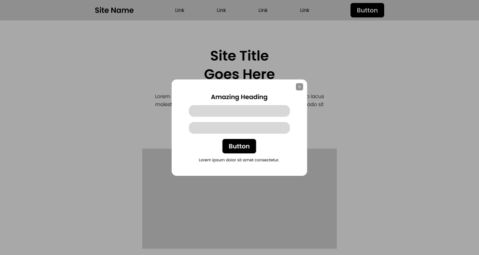

<div align="center" style="margin-top: -5px;">


## Universidad Peruana de Ciencias Aplicadas  

**Facultad:** Ingeniería
 
**Carrera:** Ingeniería de Software

**Periodo:** 2025-20

**Código del Curso:** A1ASI0729

**Curso:** Aplicaciones Web

**NRC:** 7470

**Profesor:** Castro Veramendi, Rafael Oswaldo

### Informe del Trabajo Final

**Startup:** Energix

**Nombre del producto:** Energix Manager

<strong>“Energía inteligente y conectada en la palma de tu mano”</strong>

#### Relación de integrantes

| Integrante                              | Código         |
|-----------------------------------------|----------------|
| Barba Estrada, Bryan Eduardo            | U202323479     |
| Cotrina Siclla, Sofia Alessandra        | U20231B120     |
| Encalada Salazar, Alexis                | U20211G491     |
| Goñe Araccata, Esther Abigail           | U202318049     |
| Salazar Caballero, Alvaro Fabrizzio     | U202321941     |

<div align="center"><h3>Diciembre 2025</h3></div>
   
</div>
<br>

---

# **Registro de Versiones del Informe**

| **Versión** | **Fecha**    | **Autor** | **Descripción de la modificación** |
|-------------|--------------|-----------|------------------------------------|
| TB1         | 19/09/2025   | Barba Estrada, Bryan Eduardo <br><br> Cotrina Siclla, Sofia Alessandra <br><br> Encalada Salazar, Alexis <br><br> Goñe Araccata, Esther Abigail <br><br> Salazar Caballero, Fabrizzio Alvaro | En la primera entrega del informe de nuestro proyecto, hemos realizado los primeros 5 capítulos del informe y también la primera versión del landing page de Energix. |
| TP         | 10/08/2025   | Barba Estrada, Bryan Eduardo <br><br> Cotrina Siclla, Sofia Alessandra <br><br> Encalada Salazar, Alexis <br><br> Goñe Araccata, Esther Abigail <br><br> Salazar Caballero, Fabrizzio Alvaro | En la segunda entrega del informe de nuestro proyecto, se realizó la documentación correspondiente al Sprint 2 y se realizó actualizaciones en las conclusiones y anexos del informe de reporte. Por otro lado, se realizó las respectivas mejoras y se desarrolló la primera versión del Fronted Web Applications. |
| TB2        | 14/11/2025   | Barba Estrada, Bryan Eduardo <br><br> Cotrina Siclla, Sofia Alessandra <br><br> Encalada Salazar, Alexis <br><br> Goñe Araccata, Esther Abigail <br><br> Salazar Caballero, Fabrizzio Alvaro | En la tercera entrega se revisaron las necesidades actuales del backend y se definió el alcance del Sprint 3. Se acordó enfocarse en la implementación completa del módulo de consumo histórico, la optimización de los servicios existentes, mejoras de seguridad básica, manejo adecuado de errores y la documentación interna del API. Asimismo, se revisaron las dependencias y tareas pendientes con el fin de asegurar una estructura estable en el próximo sprint. |
| TF         |  30/11/2025   | Barba Estrada, Bryan Eduardo <br><br> Cotrina Siclla, Sofia Alessandra <br><br> Encalada Salazar, Alexis <br><br> Goñe Araccata, Esther Abigail <br><br> Salazar Caballero, Fabrizzio Alvaro | En la cuarta entrega, se revisaron las necesidades actuales del backend y se definió el alcance del Sprint 4. Se acordó priorizar la gestión administrativa de usuarios mediante la implementación del rol de administrador, así como optimizar los servicios existentes del backend. Además, se incluyeron tareas relacionadas con el manejo adecuado de errores, depuración de funcionalidades previas y la actualización de la documentación interna de la API. Finalmente, se revisaron dependencias y ajustes pendientes con el objetivo de garantizar una arquitectura estable para el cierre del proyecto. |

<hr>

# **Project Report Collaboration Insights**

Se elaboró el informe del proyecto en un repositorio llamado “ProjectReport” en la organización “AppWeb-Energix”.

**Enlace Organización AppWeb-Energix:** https://github.com/AppWeb-Energix

**Enlace Repositorio Project Report - Energix:** https://github.com/AppWeb-Energix/ProjectReport

TB1: Para facilitar la elaboración colaborativa de este informe, el equipo comenzó trabajando en un documento compartido en Google. Posteriormente, el contenido se trasladó y organizó en un repositorio de GitHub, empleando el formato markdown para estructurar cada sección. A continuación, se presenta una imagen con los insights de los commits realizados por cada integrante dentro de dicho repositorio.

<p align="center">
  
</p>

TP: Para la elaboración del informe del TP1, seguimos una metodología similar a la empleada en la entrega anterior. Iniciamos el trabajo en un documento colaborativo de Google, lo que nos permitió registrar y monitorear los avances correspondientes al Sprint 2. Posteriormente, el contenido desarrollado fue migrado al formato Markdown y subido al repositorio del project report en GitHub mediante commits. A continuación, se presenta una imagen con los insights de los commits realizados por cada integrante dentro de dicho repositorio.

<p align="center">
  
</p>

TB2: Para la elaboración del informe del TB2, seguimos una metodología similar a la empleada en la entrega anterior. Iniciamos el trabajo en un documento colaborativo de Google, lo que nos permitió registrar y monitorear los avances correspondientes al Sprint 3. Posteriormente, el contenido desarrollado fue migrado al formato Markdown y subido al repositorio del project report en GitHub mediante commits. A continuación, se presenta una imagen con los insights de los commits realizados por cada integrante dentro de dicho repositorio.

<p align="center">
  
</p>

TF: Durante la elaboración del informe del TF correspondiente al Sprint 4, se llevó a cabo una revisión exhaustiva del contenido previamente entregado, corrigiendo errores identificados en la versión anterior y asegurando que toda la documentación esté alineada con el estado actual del proyecto. Para ello, se verificaron y restauraron enlaces, se actualizaron imágenes faltantes o desactualizadas, se mejoró la redacción y la estructura del reporte, y se integraron las nuevas evidencias del frontend y backend resultantes de este sprint. Todo el contenido actualizado fue posteriormente migrado al formato Markdown y subido al repositorio en GitHub mediante commits estructurados, garantizando trazabilidad, coherencia y calidad en la entrega final.

<p align="center">
  
</p>

<hr>

# **Tabla de Contenidos**

<a href="#registro-de-versiones-del-informe">Registro de Versiones del Informe</a><br>
<a href="#project-report-collaboration-insights">Project Report Collaboration Insights</a><br>
<a href="#tabla-de-contenidos">Tabla de Contenidos</a><br>
<a href="#student-outcome">Student Outcome</a><br>

<a href="#capítulo-i-introducción">Capítulo I: Introducción</a>
<ul>
  <a href="#11-startup-profile">1.1. Startup Profile</a><br>
  <ul>
    <a href="#111-descripción-de-la-startup">1.1.1. Descripción de la Startup</a><br>
    <a href="#112-perfiles-de-integrantes-del-equipo">1.1.2. Perfiles de integrantes del equipo</a><br>
  </ul>
  <a href="#12-solution-profile">1.2. Solution Profile</a><br>
  <ul>
    <a href="#121-antecedentes-y-problemática">1.2.1. Antecedentes y problemática</a><br>
    <a href="#122-lean-ux-process">1.2.2. Lean UX Process.</a><br>
    <ul>
      <a href="#1221-lean-ux-problem-statements">1.2.2.1. Lean UX Problem Statements.</a><br>
      <a href="#1222-lean-ux-assumptions">1.2.2.2. Lean UX Assumptions.</a><br>
      <a href="#1223-lean-ux-hypothesis-statements">1.2.2.3. Lean UX Hypothesis Statements.</a><br>
      <a href="#1224-lean-ux-canvas">1.2.2.4. Lean UX Canvas.</a><br>
    </ul>
  </ul>
  <a href="#13-segmentos-objetivo">1.3. Segmentos objetivo.</a><br>
</ul>

<a href="#capítulo-ii-requirements-elicitation--analysis">Capítulo II: Requirements Elicitation & Analysis</a>
<ul>
  <a href="#21-competidores">2.1. Competidores.</a><br>
  <ul>
    <a href="#211-análisis-competitivo">2.1.1. Análisis competitivo.</a><br>
    <a href="#212-estrategias-y-tácticas-frente-a-competidores">2.1.2. Estrategias y tácticas frente a competidores.</a><br>
  </ul>
  <a href="#22-entrevistas">2.2. Entrevistas.</a><br>
  <ul>
    <a href="#221-diseño-de-entrevistas">2.2.1. Diseño de entrevistas.</a><br>
    <a href="#222-registro-de-entrevistas">2.2.2. Registro de entrevistas.</a><br>
    <a href="#223-análisis-de-entrevistas">2.2.3. Análisis de entrevistas.</a><br>
  </ul>
  <a href="#23-needfinding">2.3. Needfinding.</a><br>
  <ul>
    <a href="#231-user-personas">2.3.1. User Personas.</a><br>
    <a href="#232-user-task-matrix">2.3.2. User Task Matrix.</a><br>
    <a href="#233-user-journey-mapping">2.3.3. User Journey Mapping.</a><br>
    <a href="#234-empathy-mapping">2.3.4. Empathy Mapping.</a><br>
    <a href="#235-as-is-scenario-mapping">2.3.5. As-Is scenario mapping.</a><br>
  </ul>
  <a href="#24-big-picture-eventstorming">2.4. Big Picture EventStorming.</a><br>
  <a href="#25-ubiquitous-language">2.5. Ubiquitous Language.</a><br>
</ul>

<a href="#capítulo-iii-requirements-specification">Capítulo III: Requirements Specification</a>
<ul>
  <a href="#31-to-be-scenario-mapping">3.1. To-Be Scenario Mapping.</a><br>
  <a href="#32-user-stories">3.2. User Stories.</a><br>
  <a href="#321-technical-stories">3.2.1. Technical Stories.</a><br>
  <a href="#33-impact-mapping">3.3. Impact Mapping.</a><br>
  <a href="#34-product-backlog">3.4. Product Backlog.</a><br>
</ul>

<a href="#capítulo-iv-product-design">Capítulo IV: Product Design</a>
<ul>
  <a href="#41-style-guidelines">4.1. Style Guidelines.</a><br>
  <ul>
    <a href="#411-general-style-guidelines">4.1.1. General Style Guidelines.</a><br>
    <a href="#412-web-style-guidelines">4.1.2. Web Style Guidelines.</a><br>
  </ul>
  <a href="#42-information-architecture">4.2. Information Architecture.</a><br>
  <ul>
    <a href="#421-organization-systems">4.2.1. Organization Systems.</a><br>
    <a href="#422-labeling-systems">4.2.2. Labeling Systems.</a><br>
    <a href="#423-seo-tags-and-meta-tags">4.2.3. SEO Tags and Meta Tags.</a><br>
    <a href="#424-searching-systems">4.2.4. Searching Systems.</a><br>
    <a href="#425-navigation-systems">4.2.5. Navigation Systems.</a><br>
  </ul>
  <a href="#43-landing-page-ui-design">4.3. Landing Page UI Design.</a><br>
  <ul>
    <a href="#431-landing-page-wireframe">4.3.1. Landing Page Wireframe.</a><br>
    <a href="#432-landing-page-mock-up">4.3.2. Landing Page Mock-up.</a><br>
  </ul>
  <a href="#44-web-applications-uxui-design">4.4. Web Applications UX/UI Design.</a><br>
  <ul>
    <a href="#441-web-applications-wireframes">4.4.1. Web Applications Wireframes.</a><br>
    <a href="#442-web-applications-wireflow-diagrams">4.4.2. Web Applications Wireflow Diagrams.</a><br>
    <a href="#443-web-applications-mock-ups">4.4.3. Web Applications Mock-ups.</a><br>
    <a href="#444-web-applications-user-flow-diagrams">4.4.4. Web Applications User Flow Diagrams.</a><br>
  </ul>
  <a href="#45-web-applications-prototyping">4.5. Web Applications Prototyping.</a><br>
  <a href="#46-domain-driven-software-architecture">4.6. Domain-Driven Software Architecture.</a><br>
  <ul>
    <a href="#461-design-level-eventstorming">4.6.1. Design-Level EventStorming.</a><br>
    <a href="#462-software-architecture-context-diagram">4.6.2. Software Architecture Context Diagram.</a><br>
    <a href="#463-software-architecture-container-diagrams">4.6.3. Software Architecture Container Diagrams.</a><br>
    <a href="#464-software-architecture-components-diagrams">4.6.4. Software Architecture Components Diagrams.</a><br>
  </ul>
  <a href="#47-software-object-oriented-design">4.7. Software Object-Oriented Design.</a><br>
  <ul>
    <a href="#471-class-diagrams">4.7.1. Class Diagrams.</a><br>
  </ul>
  <a href="#48-database-design">4.8. Database Design.</a><br>
  <ul>
    <a href="#481-database-diagrams">4.8.1. Database Diagrams.</a><br>
  </ul>
</ul>

<a href="#capítulo-v-product-implementation-validation-deployment">Capítulo V: Product Implementation, Validation & Deployment</a><br>
<ul>
  <a href="#51-software-configuration-management">5.1. Software Configuration Management</a><br>
  <ul>
    <a href="#511-software-development-environment-configuration">5.1.1. Software Development Environment Configuration</a><br>
    <a href="#512-source-code-management">5.1.2. Source Code Management</a><br>
    <a href="#513-source-code-style-guide-conventions">5.1.3. Source Code Style Guide & Conventions</a><br>
    <a href="#514-software-deployment-configuration">5.1.4. Software Deployment Configuration</a><br>
  </ul>
  <a href="#52-landing-page-services-applications-implementation">5.2. Landing Page, Services & Applications Implementation</a>
  <ul>
    <a href="#521-sprint-1">5.2.1. Sprint 1</a><br>
    <ul>
      <a href="#5211-sprint-planning-1">5.2.1.1. Sprint Planning 1</a><br>
      <a href="#5212-aspect-leaders-and-collaborators">5.2.1.2. Aspect Leaders and Collaborators</a><br>
      <a href="#5213-sprint-backlog-1">5.2.1.3. Sprint Backlog 1</a><br>
      <a href="#5214-development-evidence-for-sprint-review">5.2.1.4. Development Evidence for Sprint Review</a><br>
      <a href="#5215-execution-evidence-for-sprint-review">5.2.1.5. Execution Evidence for Sprint Review</a><br>
      <a href="#5216-services-documentation-evidence-for-sprint-review">5.2.1.6. Services Documentation Evidence for Sprint Review</a><br>
      <a href="#5217-software-deployment-evidence-for-sprint-review">5.2.1.7. Software Deployment Evidence for Sprint Review</a><br>
      <a href="#5218-team-collaboration-insights-during-sprint">5.2.1.8. Team Collaboration Insights During Sprint</a><br>
    </ul>
    <a href="#522-sprint-2">5.2.2. Sprint 2</a><br>
    <ul>
      <a href="#5221-sprint-planning-2">5.2.2.1. Sprint Planning 2</a><br>
      <a href="#5222-aspect-leaders-and-collaborators">5.2.2.2. Aspect Leaders and Collaborators</a><br>
      <a href="#5223-sprint-backlog-2">5.2.2.3. Sprint Backlog 2</a><br>
      <a href="#5224-development-evidence-for-sprint-review">5.2.2.4. Development Evidence for Sprint Review</a><br>
      <a href="#5225-execution-evidence-for-sprint-review">5.2.2.5. Execution Evidence for Sprint Review</a><br>
      <a href="#5226-services-documentation-evidence-for-sprint-review">5.2.2.6. Services Documentation Evidence for Sprint Review</a><br>
      <a href="#5227-software-deployment-evidence-for-sprint-review">5.2.2.7. Software Deployment Evidence for Sprint Review</a><br>
      <a href="#5228-team-collaboration-insights-during-sprint">5.2.2.8. Team Collaboration Insights During Sprint</a><br>
    </ul>
    <a href="#523-sprint-2">5.2.3. Sprint 3</a><br>
    <ul>
      <a href="#5231-sprint-planning-3">5.2.3.1. Sprint Planning 3</a><br>
      <a href="#5232-aspect-leaders-and-collaborators">5.2.3.2. Aspect Leaders and Collaborators</a><br>
      <a href="#5233-sprint-backlog-3">5.2.3.3. Sprint Backlog 3</a><br>
      <a href="#5234-development-evidence-for-sprint-review">5.2.3.4. Development Evidence for Sprint Review</a><br>
      <a href="#5235-execution-evidence-for-sprint-review">5.2.3.5. Execution Evidence for Sprint Review</a><br>
      <a href="#5236-services-documentation-evidence-for-sprint-review">5.2.3.6. Services Documentation Evidence for Sprint Review</a><br>
      <a href="#5237-software-deployment-evidence-for-sprint-review">5.2.3.7. Software Deployment Evidence for Sprint Review</a><br>
      <a href="#5238-team-collaboration-insights-during-sprint">5.2.3.8. Team Collaboration Insights During Sprint</a><br>
    </ul>
    <a href="#524-sprint-4">5.2.4. Sprint 4</a><br>
    <ul>
      <a href="#5241-sprint-planning-4">5.2.4.1. Sprint Planning 4</a><br>
      <a href="#5242-aspect-leaders-and-collaborators">5.2.4.2. Aspect Leaders and Collaborators</a><br>
      <a href="#5243-sprint-backlog-4">5.2.4.3. Sprint Backlog 4</a><br>
      <a href="#5244-development-evidence-for-sprint-review">5.2.4.4. Development Evidence for Sprint Review</a><br>
      <a href="#5245-execution-evidence-for-sprint-review">5.2.4.5. Execution Evidence for Sprint Review</a><br>
      <a href="#5246-services-documentation-evidence-for-sprint-review">5.2.4.6. Services Documentation Evidence for Sprint Review</a><br>
      <a href="#5247-software-deployment-evidence-for-sprint-review">5.2.4.7. Software Deployment Evidence for Sprint Review</a><br>
      <a href="#5248-team-collaboration-insights-during-sprint">5.2.4.8. Team Collaboration Insights During Sprint</a><br>
    </ul>
  </ul>
  <a href="#53-validation-interviews">5.3. Validation Interviews</a><br>
  <ul>
    <a href="#531-diseño-de-entrevistas">5.3.1. Diseño de entrevistas.</a><br>
    <a href="#532-registro-de-entrevistas">5.3.2. Registro de entrevistas.</a><br>
    <a href="#533-análisis-de-entrevistas">5.3.3. Análisis de entrevistas.</a><br>
  </ul>
  <a href="#54-video-about-the-product">5.3. Video About The Product</a><br>

<br>

<a href="#conclusiones">Conclusiones</a>

<a href="#bibliografía">Bibliografía</a>

<a href="#anexos">Anexos</a>

<hr>

# **Student Outcome**

El curso contribuye al cumplimiento del Student Outcome ABET: **ABET – EAC - Student Outcome 5**

Criterio: *La capacidad de funcionar efectivamente en un equipo cuyos miembros juntos proporcionan liderazgo, crean un entorno de colaboración e inclusivo, establecen objetivos, planifican tareas y cumplen objetivos.*

En el siguiente cuadro se describe las acciones realizadas y enunciados de conclusiones por parte del grupo, que permiten sustentar el haber alcanzado el logro del ABET – EAC - Student Outcome 5.

**Objetivo general**: Como equipo Energix, desarrollaremos Energix Manager, una aplicación web orientada a optimizar la gestión integral de proyectos de construcción. Nuestro objetivo es diseñar e implementar una solución tecnológica innovadora fundamentada en el enfoque Domain-Driven Design (DDD), que permita abordar de manera eficiente la complejidad del dominio y garantizar un sistema escalable y alineado a las necesidades del sector.

### 5.c. Evaluación del Trabajo en Equipo

| **Criterio Específico** | **Acciones realizadas** | **Conclusiones** |
|--------------------------|-------------------------------|------------------|
| **5.c1. Trabaja en equipo para proporcionar liderazgo en forma conjunta** | **Barba Estrada, Bryan Eduardo**<br>**TB1**<br>Lideró la estructuración de la *Domain-Driven Software Architecture*, promoviendo la participación activa y equitativa de todos los integrantes.<br><br>**TP**<br>Lideró la implementación del módulo de autenticación de usuarios (*Feature/auth-login*), integrando la lógica de inicio de sesión.<br><br>**TB2**<br>Participó activamente en la definición del alcance del Sprint 3, liderando la organización de requerimientos del backend y promoviendo la colaboración para priorizar correctamente el módulo de consumo histórico y las optimizaciones de servicios.<br><br>**TF**<br>Asumió liderazgo en la corrección de su parte del backend para el Trabajo Final, guiando la resolución de errores pendientes y aportando en la estabilización de los servicios existentes.<br><br>**Cotrina Siclla, Sofía Alessandra**<br>**TB1**<br>Elaboró artefactos clave como el *Impact Mapping*, organizando reuniones para definir objetivos de arquitectura.<br><br>**TP**<br>Encabezó el desarrollo de la sección de ajustes del usuario (*Feature/settings*), coordinando reuniones para definir su estructura y promoviendo la colaboración entre diseño y desarrollo.<br><br>**TB2**<br>Contribuyó al análisis de las necesidades del backend proponiendo mejoras funcionales para el módulo de consumo histórico; organizó la revisión conjunta de dependencias para asegurar alineación entre equipos.<br><br>**TF**<br>Lideró la implementación y el refinamiento del módulo de administración en el backend, así como el despliegue en producción, asegurando la integración correcta del rol admin y sus funciones.<br><br>**Encalada Salazar, Alexis**<br>**TB1**<br>Implementó la *Landing Page* inicial, coordinando la asignación de tareas específicas para el Sprint 1 y brindando apoyo a sus compañeros.<br><br>**TP**<br>Lideró la implementación del *Dashboard principal* (*Feature/dashboard*), integrando gráficos de consumo energético con datos del backend y apoyando en la configuración visual del panel.<br><br>**TB2**<br>Lideró la evaluación técnica del backend, guiando la detección de mejoras en los servicios existentes y proponiendo soluciones estructurales para el módulo de consumo histórico, trabajando de manera conjunta con sus compañeros.<br><br>**TF**<br>Tomó el liderazgo técnico en la corrección y ajuste del backend relacionado con el dashboard, garantizando la correcta visualización de métricas y estabilidad del módulo.<br><br>**Goñe Araccata, Esther Abigail**<br>**TB1**<br>Organizó y distribuyó las tareas del diseño de la *Landing Page* y la *Web Application*, logrando la colaboración entre roles de diseño y desarrollo.<br><br>**TP**<br>Coordinó el diseño y la estructura de las vistas del módulo de autenticación, asegurando coherencia visual.<br><br>**TB2**<br>Colaboró en la revisión del alcance del Sprint 3, participando en la toma conjunta de decisiones sobre seguridad básica y documentación interna, contribuyendo a mantener cohesión entre los integrantes.<br><br>**TF**<br>Lideró la actualización, revisión y cierre del reporte final, organizando evidencias, validando enlaces y asegurando que la documentación refleje correctamente el trabajo del equipo.<br><br>**Salazar Caballero, Fabrizzio Álvaro**<br>**TB1**<br>Coordinó entrevistas con usuarios, realizó análisis de escenarios y elaboró documentación de gestión de configuración.<br><br>**TP**<br>Desarrolló el módulo de suscripciones y recompensas (*Feature/subscriptions-and-rewards*), liderando la integración de los beneficios y el sistema de planes de usuario dentro del flujo general de la aplicación.<br><br>**TB2**<br>Lideró la recopilación y análisis de requerimientos técnicos del backend para Sprint 3, coordinando la identificación de dependencias críticas y fortaleciendo la toma conjunta de decisiones.<br><br>**TF**<br>Contribuyó al desarrollo y corrección del módulo de administración en el backend, ajustando su código y consolidando las funcionalidades admin para el entorno final. <br><br> | **TB1:**<br>**Objetivo:** Promover el liderazgo distribuido entre los miembros para organizar y ejecutar las primeras actividades del proyecto, incluyendo la definición de la arquitectura, el diseño de la *Landing Page*, la elaboración de artefactos de análisis y la documentación inicial.<br><br>**Conclusión:** El equipo demostró liderazgo compartido en la organización y ejecución de las actividades iniciales. Cada miembro asumió responsabilidades específicas, lo que permitió establecer una base sólida para el proyecto y garantizar que los primeros entregables fueran completados de manera efectiva y colaborativa.<br><br>**TP:**<br>**Objetivo específico:** Fortalecer el liderazgo técnico compartido en el equipo, orientando la implementación de funcionalidades clave del sistema como autenticación, configuración, panel de control y recompensas. Se buscó coordinar de forma efectiva las tareas y decisiones técnicas, garantizando la integración de cada módulo dentro de la arquitectura general.<br><br>**Conclusión:** Durante el desarrollo del Sprint 2, el liderazgo se ejerció de manera equitativa y colaborativa. Cada integrante asumió la responsabilidad de un módulo específico (autenticación, ajustes, dashboard o recompensas), demostrando autonomía y compromiso en la coordinación de su implementación.<br><br>**TB2:**<br>**Objetivo específico:** Fortalecer el liderazgo compartido del equipo mediante la revisión conjunta del backend y la definición del alcance del Sprint 3, promoviendo la participación equitativa en la toma de decisiones técnicas <br><br>**Conclusión:** El equipo ejerció un liderazgo colaborativo al analizar necesidades, priorizar el módulo de consumo histórico y coordinar mejoras en seguridad y servicios. Las decisiones se tomaron de forma conjunta, manteniendo una dinámica de apoyo mutuo y responsabilidad compartida. <br><br>**TF:**<br>**Objetivo específico:** Consolidar el liderazgo compartido durante el desarrollo del Trabajo Final mediante la corrección del backend, la integración del nuevo rol de administrador y la preparación integral de la entrega final; asegurando que cada miembro lidere y concluya sus propios módulos, contribuyendo de manera equitativa al éxito del proyecto.<br><br>**Conclusión:** Durante la última fase del proyecto, el equipo demostró un liderazgo maduro y colaborativo, gestionando de manera autónoma la corrección de funcionalidades del backend, la implementación del módulo de administración y la preparación de la entrega final. Cada integrante asumió responsabilidad plena sobre sus tareas, manteniendo comunicación efectiva y apoyo constante, lo que permitió cumplir los objetivos planteados y garantizar un producto estable para su despliegue final.|
| **5.c2. Crea un entorno colaborativo e inclusivo, establece metas, planifica tareas y cumple objetivos** | **Barba Estrada, Bryan Eduardo**<br>**TB1**<br>Promovió la participación equitativa en las reuniones iniciales, facilitando la integración de ideas en la definición de la arquitectura.<br><br>**TP**<br>Fomentó un entorno colaborativo en la implementación del *login*, orientando a sus compañeros sobre buenas prácticas de estructura de código y revisión de ramas en GitHub.<br><br>**TB2**<br>Facilitó espacios de discusión técnica sobre seguridad y manejo de errores, integrando aportes del equipo para establecer metas claras y garantizar una planificación realista del backend para el Sprint 3.<br><br>**TF**<br>Coordinó el proceso de corrección del backend identificando errores, priorizando tareas y validando los cambios realizados en equipo para garantizar el cumplimiento de los objetivos técnicos.<br><br>**Cotrina Siclla, Sofía Alessandra**<br>**TB1**<br>Coordinó sesiones de trabajo colaborativo para elaborar los artefactos de análisis, garantizando la diversidad de aportes.<br><br>**TP**<br>Promovió la participación equitativa en la definición de configuraciones del sistema, recopilando sugerencias de usabilidad y adaptándolas al diseño del módulo *Settings*.<br><br>**TB2**<br>Fomentó la participación equitativa en la identificación de tareas pendientes, coordinando la definición de metas relacionadas con la documentación interna del API y promoviendo una comunicación abierta.<br><br>**TF**<br>Promovió un entorno colaborativo en torno al despliegue y consolidación del módulo admin, coordinando pruebas y ajustes junto al equipo para asegurar una integración correcta.<br><br>**Encalada Salazar, Alexis**<br>**TB1**<br>Apoyó constantemente a sus compañeros en la implementación técnica, brindando acompañamiento en la *Landing Page*.<br><br>**TP**<br>Brindó soporte constante en la integración de componentes y conexiones con la API, garantizando la coherencia técnica entre módulos.<br><br>**TB2**<br>Brindó soporte al equipo en la planificación de tareas y en el análisis de errores del backend, promoviendo un ambiente donde todos pudieran participar en la definición de prioridades del Sprint 3.<br><br>**TF**<br>Colaboró activamente en la corrección del backend del dashboard, manteniendo comunicación constante con el equipo para asegurar alineación técnica y cumplimiento de objetivos.<br><br>**Goñe Araccata, Esther Abigail**<br>**TB1**<br>Estableció dinámicas inclusivas en el diseño, integrando aportes técnicos y creativos para fortalecer la cohesión grupal.<br><br>**TP**<br>Estableció dinámicas de revisión visual, integrando aportes del equipo de frontend para mantener consistencia en los estilos y estructuras de la interfaz.<br><br>**TB2**<br>Promovió un entorno inclusivo durante la revisión de tareas pendientes del backend, integrando distintas perspectivas para asegurar claridad en las metas del módulo de consumo histórico.<br><br>**TF**<br>Coordinó la recopilación de evidencias, validación de información y organización del reporte final, generando un entorno colaborativo que permitió completar la entrega de forma ordenada.<br><br>**Salazar Caballero, Fabrizzio Álvaro**<br>**TB1**<br>Organizó el análisis de escenarios de usuario con la participación de todos, recogiendo diversas perspectivas para enriquecer la documentación.<br><br>**TP**<br>Coordinó pruebas funcionales conjuntas del módulo de recompensas, promoviendo la colaboración para validar los resultados e incorporar mejoras sugeridas por el equipo.<br><br>**TB2**<br>Organizó la revisión colaborativa del manejo de errores y mejoras de seguridad, facilitando la creación de metas alcanzables y asegurando que todos los integrantes participaran en el diseño de soluciones.<br><br>**TF**<br>Facilitó espacios de coordinación para validar las funcionalidades del módulo admin y sus dependencias, integrando retroalimentación y apoyando la planificación de los últimos ajustes.<br><br> | **TB1:**<br>**Objetivo específico:** Fomentar un entorno de trabajo inclusivo y participativo en el que cada miembro pueda aportar sus ideas y habilidades.<br><br>**Conclusión:** El equipo consolidó un entorno de colaboración inclusiva, en el que cada integrante tuvo la oportunidad de contribuir según sus fortalezas. La definición de objetivos permitió cumplir satisfactoriamente con las metas del primer entregable, evidenciando la capacidad del grupo para trabajar de manera coordinada.<br><br>**TP:**<br>**Objetivo específico:** Guiar técnicamente la planificación y desarrollo de los distintos módulos del sistema, fomentando un entorno colaborativo e inclusivo donde cada integrante participe activamente en la definición de metas, la distribución de tareas y la integración de funcionalidades para fortalecer el trabajo en equipo y alcanzar los objetivos del sprint.<br><br>**Conclusión:** Durante el Sprint 2, el equipo mantuvo un entorno de trabajo colaborativo basado en la comunicación constante y la integración de ideas. Cada miembro participó activamente en la planificación y desarrollo de su módulo, compartiendo avances y brindando apoyo técnico a sus compañeros. Esta dinámica fortaleció la cohesión grupal y permitió cumplir los objetivos del sprint de manera organizada y efectiva, garantizando un ambiente inclusivo donde todos aportaron según sus habilidades.<br><br>**TB2:**<br>**Objetivo específico:** Fomentar un entorno inclusivo donde todos los integrantes participen en la planificación del Sprint 3, estableciendo metas claras y distribuyendo tareas de manera organizada para asegurar el avance del backend <br><br>**Conclusión:** Se logró un ambiente de trabajo colaborativo en el que cada integrante aportó a la planificación, identificación de dependencias y definición de objetivos. Esto permitió organizar mejor las tareas, priorizar optimizaciones y consolidar una coordinación efectiva dentro del equipo.<br><br>**TF:**<br>**Objetivo específico:** Mantener un entorno de trabajo altamente colaborativo durante el cierre del proyecto, planificando actividades finales como la validación del backend, las pruebas del módulo administrador y la consolidación de documentación y evidencias; asegurando que todos los integrantes contribuyan a cumplir los objetivos del Trabajo Final. <br><br>**Conclusión:** El equipo logró cumplir de manera organizada y colaborativa con todas las metas del cierre del proyecto. Se realizaron reuniones constantes de validación, apoyo entre integrantes para resolver errores y coordinación en la documentación del producto final. Gracias a esta dinámica inclusiva, se aseguró un resultado alineado con los estándares del curso, reflejando un trabajo sólido y conjunto durante toda la entrega final. |

<hr>

# **Capítulo I: Introducción** 

## **1.1. Startup Profile**

### **1.1.1. Descripción de la Startup**

Somos Energix, un Startup conformado por alumnos de la Universidad Peruana de Ciencias Aplicadas (UPC), enfocada en desarrollar soluciones digitales para la optimización del consumo de energía en los hogares.

**Producto Principal:**
Energix Manager es una plataforma que proporciona herramientas tecnológicas accesibles y fáciles de usar, diseñadas para que los usuarios monitoreen, gestionen y controlen su consumo de energía en tiempo real.

**Misión:**
Ayudar a las personas a entender y optimizar su consumo de energía para reducir sus costos y promover hábitos responsables que beneficien tanto su economía familiar como el medio ambiente.

**Visión:**
Convertirnos en la plataforma líder en gestión energética para hogares, empoderando a las personas para que tomen el control de su consumo y reduzcan sus gastos de electricidad.

### **1.1.2. Perfiles de Integrantes del Equipo**

<p align="center">
  
</p>

<p align="center">
  
</p>

<p align="center">
  
</p>

<p align="center">
  
</p>

<p align="center">
  
</p>

## **1.2. Solution Profile**

### **1.2.1. Antecedentes y problemática**

Para describir los antecedentes y problemática, hemos aplicado la técnica "5W’s & 2H’s", una herramienta clave en el enfoque de Lean UX, para centrarnos realmente en las necesidades del usuario. Esto nos ayudó a definir la dirección de nuestro producto, Energix Manager, de la siguiente manera:

**What**

*¿Cuál es el problema?*

El problema que Energix Manager busca resolver es el consumo ineficiente de energía eléctrica en los hogares urbanos del Perú. Esto se debe, en gran parte, a hábitos de uso inadecuados de los dispositivos del hogar, lo que provoca un incremento innecesario en la facturación para las familias y tiene un impacto ambiental negativo. Según el Ministerio de Energía y Minas (2022), el 28.6% de la electricidad consumida a nivel nacional en 2022 provino del sector residencial.

**When**

*¿Cuándo sucede el problema?*

El problema ocurre constantemente en la vida cotidiana de los hogares. Esto sucede cuando las personas dejan las luces encendidas en habitaciones vacías, mantienen sus dispositivos en modo "stand by" o utilizan equipos que no son eficientes.

*¿Cuándo utiliza el cliente el producto?*

El cliente usa Energix Manager en su hogar y en cualquier momento del día, ya sea para monitorear su consumo en tiempo real, entender el gasto de un dispositivo del hogar o gestionar su uso.

**Where**

¿Dónde surge el problema?

El problema surge principalmente en los hogares urbanos del Perú, que son los principales consumidores de energía eléctrica a nivel residencial. 

**Who**

*¿Quiénes están involucrados?*

Los principales involucrados son los miembros de las familias peruanas en sus hogares. Un estudio de caso demostró que al menos el 48% de los encuestados admitieron que alguien en su hogar utilizaba la energía de forma inadecuada (Chucuya Fuentes, 2021). Además, están involucradas las empresas eléctricas y las entidades gubernamentales como el Ministerio de Energía y Minas, ya que tienen la responsabilidad de educar y regular el consumo para fomentar la eficiencia energética.

*¿A quiénes le sucede el problema?*

El problema sucede a las familias que viven en áreas urbanas en el Perú, incluyendo tanto viviendas unifamiliares como multifamiliares.

*¿Quién utilizará el producto?*

El producto será utilizado principalmente por los propietarios de vivienda, adultos y jóvenes que toman decisiones sobre el uso de la electricidad y los dispositivos en casa. Estas personas son quienes pueden implementar cambios en los hábitos de consumo para lograr una mayor eficiencia energética

**Why**

*¿Por qué sucede el problema?*

El problema ocurre debido a la falta de conocimiento y capacitación sobre el uso eficiente de la energía. La mayoría de las personas desconocen las prácticas y regulaciones para el ahorro energético, lo que perpetúa los hábitos de consumo ineficiente.

*¿Qué llevó al usuario a esta situación?*

Los usuarios se encuentran en esta situación debido a la falta de información y educación. Según Chucuya Fuentes (2021), el 93% de los encuestados desconocía la existencia de normas o leyes para el ahorro de energía, lo que demuestra una brecha de conocimiento que impide la toma de decisiones informadas para ahorrar energía y dinero.

**How**

*¿En qué condiciones los clientes usan nuestro producto?*

Los clientes usan Energix Manager en su entorno doméstico. La plataforma está diseñada para ser accesible y fácil de usar, no requiere de conocimientos técnicos y puede ser utilizada desde un smartphone, tablet o computadora.

*¿Cómo nos conocerán los usuarios?*

Los usuarios conocerán Energix Manager a través de campañas de difusión y concientización que ataquen la falta de conocimiento sobre el consumo energético. Las estrategias clave incluyen alianzas con empresas eléctricas y el Ministerio de Energía y Minas, así como marketing digital.

**How much**

*¿En qué cantidad sucede el problema?*

Según el estudio de Chucuya Fuentes (2021), los hábitos de consumo ineficiente son comunes. Dejar equipos encendidos fue el mal hábito más frecuente (46 menciones), seguido por el uso de "stand by" (25 menciones) y dejar las luces encendidas (21 menciones). En términos económicos, estos hábitos pueden generar un gasto anual adicional de hasta S/ 323.44 soles por hogar.

**Figura 1**  
*Hábitos de consumo ineficiente en hogares peruanos*

<p align="center">
  
</p>

*Nota.* Elaboración propia a partir de Chucuya Fuentes (2021).

### **1.2.2. Lean UX Process**

En esta parte se llevará a cabo el proceso de Lean UX, el cual incluye la definición de la visión del modelo de negocio que respalda nuestro producto de software. A través de este enfoque metodológico, es posible enfocar la atención tanto en el diseño de la solución como en los problemas detectados mediante el pensamiento de diseño.

#### **1.2.2.1. Lean UX Problem Statements**

**Contexto:** En los hogares urbanos del Perú, el consumo de energía eléctrica es significativo, representando casi un tercio de la demanda nacional. Sin embargo, los usuarios carecen de información y herramientas para entender y controlar este gasto. La dependencia de recibos de luz mensuales no les permite tomar decisiones informadas en tiempo real para gestionar su consumo.

**Problema:** La falta de una herramienta accesible y fácil de usar que permita a las familias peruanas monitorear, gestionar y controlar su consumo de energía en tiempo real genera frustración por los altos costos, perpetúa hábitos de uso ineficiente y contribuye a un gasto innecesario que afecta tanto su economía como el medio ambiente.

**Pregunta Clave:** ¿Cómo podemos diseñar una plataforma que empodere a las familias peruanas a tomar el control de su consumo de energía, brindándoles información clara y herramientas intuitivas para reducir sus costos y ser más eficientes, sin requerir conocimientos técnicos avanzados?

#### **1.2.2.2. Lean UX Assumptions**

**¿Quiénes son nuestros usuarios?**

* Familias urbanas en el Perú.
* Adultos o jóvenes de 20 a 45 años, con educación media o superior, que gestionan las finanzas del hogar.
* Personas preocupadas por el ahorro económico y la sostenibilidad.
<br>

**¿Dónde encaja nuestro servicio en su trabajo o vida?**

* En la gestión de sus gastos mensuales.
* En la toma de decisiones sobre el uso de dispositivos en el hogar.
* En la rutina de monitoreo del hogar.
<br>

**¿Qué problemas tiene nuestro producto y cómo se puede resolver?**

Problema de Integración: La conexión a los sistemas de facturación de empresas eléctricas.

Solución: Se puede resolver mediante alianzas estratégicas con las compañías eléctricas. 

Problema de Hábitos: La resistencia de los usuarios a cambiar sus hábitos de consumo.

Solución: La plataforma será intuitiva y motivadora. Se usarán notificaciones gamificadas, comparaciones de consumo y visualizaciones 
claras para hacer el ahorro tangible y gratificante.

**¿Cómo y cuándo es usado nuestro producto?**

* Al final de cada día para revisar el consumo.

* Al recibir la factura de electricidad, para entender los picos de consumo.

* En tiempo real, para verificar el impacto de usar un dispositivo específico.

**¿Qué características son importantes?**

* Compatibilidad con la mayoría de los dispositivos y medidores de energía en los hogares peruanos.
* Interfaz de usuario intuitiva y amigable para personas sin conocimientos técnicos.
* Datos en tiempo real sobre el consumo.
* Alertas y notificaciones personalizables sobre consumos elevados.
* Sugerencias de ahorro y análisis predictivo.
* Escalabilidad para añadir nuevas funcionalidades y dispositivos.
<br>

**¿Cómo debe verse nuestro producto y cómo comportarse?**

Energix Manager debe ser una plataforma que transmita confianza y simplicidad. Su comportamiento debe ser intuitivo y proactivo, ofreciendo información clara y recomendaciones útiles sin abrumar al usuario. Visualmente, debe ser limpio y moderno para atraer a un público joven y tecnológico, pero suficientemente claro para todos los miembros de la familia.

**User Outcome**

Para los usuarios:

* Reducción significativa en el monto de su factura de electricidad.
* Mayor control y visibilidad sobre su consumo energético.
* Menos estrés y frustración al entender por qué sus recibos son altos.
* Adopción de hábitos de consumo más eficientes y sostenibles.
<br>

**Features**

* Monitoreo en tiempo real: Muestra el consumo de energía en vivo.
* Análisis detallado: Desglosa el consumo por dispositivo y hora del día.
* Alertas y notificaciones: Envía avisos sobre consumos elevados o inusuales.
* Consejos personalizados: Ofrece sugerencias específicas para ahorrar energía según los hábitos del usuario.

#### **1.2.2.3. Lean UX Hypothesis Statements**

**Hipótesis 1: Monitoreo y conciencia**

Creemos que al proporcionar a los usuarios de la plataforma una visualización en tiempo real de su consumo energético, ellos se volverán más conscientes de sus hábitos.

Sabremos que hemos tenido éxito cuando el 50% de los usuarios activos demuestre una reducción de consumo eléctrico del 10% en el primer mes de uso.

**Hipótesis 2: Impacto en la facturación**

Creemos que la implementación de alertas personalizadas y consejos de ahorro específicos para los dispositivos electrónicos de mayor consumo como la refrigeradora y la iluminación permitirá a los usuarios reducir su gasto.

Sabremos que hemos tenido éxito cuando el 70% de los usuarios que utilicen estas funciones reportan una disminución en el costo de su factura mensual en los primeros tres meses.

#### **1.2.2.4. Lean UX Canvas**

Tras completar las etapas del Lean UX Process, el siguiente paso es elaborar el Lean UX Canvas. Esta herramienta nos ayuda a visualizar de manera integral el problema y sirve como punto de partida para la investigación previa al diseño de la solución propuesta.

**Figura 2**  
*Lean UX Canvas del proyecto*

<p align="center">
  
</p>

*Nota.* Elaboración propia.

## **1.3. Segmentos Objetivo**

Esta sección incluye la descripción de los segmentos asociados al dominio del problema, así como características demográficas y datos estadísticos de sustento vinculados al consumo eléctrico residencial.

## Segmento Objetivo #1: Familias Urbanas con Casas Inteligentes

Este segmento corresponde a hogares ubicados principalmente en zonas urbanas que cuentan con múltiples dispositivos eléctricos y soluciones inteligentes en su vivienda, lo que incrementa su consumo energético.

**Características Demográficas:**
- **Edad:** 20 a 55 años  
- **Nivel Socioeconómico:** B y C  
- **Composición Familiar:** Familias consolidadas con uno o más hijos  
<br>

**Hábitos y Motivación:**  
Buscan eficiencia energética, confort y automatización en su hogar. Priorizan el control del presupuesto mensual y la seguridad del hogar, mientras utilizan equipamiento como routers inteligentes, Smart TVs, aire acondicionado, PCs, asistentes virtuales, etc.

**Información de Sustento:**  
Según Autosolar Perú, un hogar urbano en Lima consume en promedio **172 kWh/mes**, valor superior al promedio nacional debido a la cantidad de dispositivos conectados. Asimismo, el mercado de dispositivos inteligentes en Perú ha crecido significativamente en los últimos años, impulsando la necesidad de herramientas de gestión energética.

## Segmento Objetivo #2: Estudiantes y Jóvenes que Alquilan Vivienda

Este segmento se compone de jóvenes que asumen parcial o totalmente el pago de electricidad dentro de departamentos o habitaciones alquiladas.

**Características Demográficas:**
- **Edad:** 18 a 30 años  
- **Nivel Socioeconómico:** C y D  
- **Lugar de Residencia:** Habitaciones o departamentos compartidos en zonas universitarias o céntricas  
<br>

**Hábitos y Motivación:**  
Buscan optimizar sus gastos mensuales y necesitan soluciones rápidas y simples que les permitan identificar qué dispositivos generan mayor gasto. Suelen utilizar laptops, cocinas eléctricas, terma y refrigeradoras compartidas, lo que eleva el consumo sin control individual.

**Información de Sustento:**  
De acuerdo con estudios de consumo urbano, la falta de conciencia en el uso de energía en viviendas compartidas incrementa el gasto mensual y genera conflictos entre ocupantes. Este segmento es altamente receptivo a aplicaciones móviles que brinden alertas y métricas claras en **soles**, impulsando decisiones inmediatas de ahorro.

---

# **Capítulo II: Requirements Elicitation & Analysis**

## **2.1. Competidores**

### **2.1.1. Análisis competitivo**

## Análisis Competitivo – Energix Manager

### ¿Por qué llevar a cabo este análisis?
Este análisis permite entender el posicionamiento de **Energix Manager** en el mercado de plataformas de monitoreo y optimización de consumo energético en hogares, identificar oportunidades de diferenciación y anticipar amenazas de competidores. Así se optimizan estrategias de producto y marketing, asegurando que Energix Manager responda a las necesidades de los hogares urbanos interesados en eficiencia y ahorro energético.

## Competitive Analysis Landscape

**Tabla 1**  
*Análisis competitivo de plataformas de monitoreo energético*

|                       | **Energix Manager** | Competidor 1 – **Sense Home Energy Monitor** | Competidor 2 – **Wibeee Box** | Competidor 3 – **SmartThings Energy** |
|-----------------------|----------------------------------|---------------------------------------------|--------------------------------|----------------------------------------|
| **Perfil / Overview** | Plataforma web que permite monitoreo en tiempo real, análisis por dispositivo, alertas personalizadas y consejos de ahorro. | Dispositivo físico que se instala en el panel eléctrico para monitoreo detallado a nivel de dispositivo. | Sistema conectado al cuadro eléctrico que ofrece análisis integral del consumo energético. | Aplicación que permite controlar y monitorear dispositivos inteligentes Samsung. |
| **Ventaja competitiva / Valor** | Interfaz intuitiva, recomendaciones personalizadas, predicción de consumo, alertas inteligentes, enfoque en ahorro económico y hábitos sostenibles. | Alertas de consumo anormal, reportes detallados, monitoreo preciso de cada dispositivo. | Informes precisos, análisis predictivo, sugerencias de tarifas para optimizar gasto. | Integración con ecosistema Samsung, control remoto de dispositivos, visualización de consumo. |

*Nota.* Elaboración propia.

## Perfil de Marketing

**Tabla 2**  
*Perfil de Marketing*

|                       | **Energix Manager** | Competidor 1 – **Sense Home Energy Monitor** | Competidor 2 – **Wibeee Box** | Competidor 3 – **SmartThings Energy** |
|-----------------------|----------------------------------|---------------------------------------------|--------------------------------|----------------------------------------|
| **Mercado objetivo** | Hogares urbanos de clase media y estudiantes jóvenes preocupados por eficiencia y ahorro energético en Perú. | Propietarios de viviendas que buscan control detallado del consumo eléctrico. | Hogares que desean optimizar su consumo integralmente. | Usuarios de dispositivos Samsung interesados en eficiencia energética y control remoto. |
| **Estrategias de marketing** | Marketing digital, colaboraciones con empresas eléctricas y Ministerio de Energía y Minas, campañas educativas. | Marketing de producto, asociaciones con instaladores eléctricos, campañas educativas. | Campañas educativas sobre ahorro energético, presencia en ferias de eficiencia. | Promociones cruzadas con productos Samsung y marketing digital. |

*Nota.* Elaboración propia.

## Perfil de Producto

**Tabla 3**  
*Perfil de Producto*

|                       | **Energix Manager** | Competidor 1 – **Sense Home Energy Monitor** | Competidor 2 – **Wibeee Box** | Competidor 3 – **SmartThings Energy** |
|-----------------------|----------------------------------|---------------------------------------------|--------------------------------|----------------------------------------|
| **Productos & Servicios** | Monitoreo en tiempo real, análisis detallado por dispositivo, alertas, recomendaciones personalizadas, gráficos comparativos, panel web. | Dispositivo + app móvil para monitoreo en tiempo real y alertas. | Hardware + app móvil para análisis de consumo y recomendaciones de ahorro. | App móvil para control de dispositivos, reportes de consumo, alertas. |
| **Precios & Costos** | Freemium: plan básico gratuito, plan premium $5–$15/mes. | Dispositivo ~$250–$300, app incluida. | Hardware + suscripción mensual ~$15–$50. | App gratuita; requiere dispositivos Samsung. |
| **Canales de distribución (Web y/o Móvil)** | Plataforma web accesible desde cualquier navegador, marketing digital y alianzas estratégicas. | Venta online, distribuidores especializados, app móvil complementaria. | Venta online, distribuidores autorizados, app móvil. | Samsung Galaxy Store, Google Play, control vía app móvil. |

*Nota.* Elaboración propia.

## Análisis SWOT

**Tabla 4**  
*Análisis FODA*

|                       | **Energix Manager** | Competidor 1 – **Sense Home Energy Monitor** | Competidor 2 – **Wibeee Box** | Competidor 3 – **SmartThings Energy** |
|-----------------------|----------------------------------|---------------------------------------------|--------------------------------|----------------------------------------|
| **Fortalezas** | Web intuitiva, alertas y recomendaciones, plan freemium, enfoque en ahorro y sostenibilidad. | Monitoreo preciso por dispositivo, alertas, reportes detallados. | Informes predictivos, análisis integral, buenas recomendaciones de ahorro. | Integración con Samsung, control remoto, app consolidada. |
| **Debilidades** | Sin app móvil, depende de datos del usuario, marca poco conocida, integración limitada. | Requiere instalación, costo inicial alto, curva de aprendizaje. | Depende de hardware, costo mensual, adopción limitada. | Solo funciona con dispositivos Samsung, funcionalidad limitada fuera del ecosistema. |
| **Oportunidades** | Alianzas con empresas y gobierno, expansión en Latinoamérica, gamificación, tendencia hacia eficiencia energética. | Expansión a hogares residenciales, integración con domótica. | Expansión internacional, alianzas con compañías de energía. | Crecimiento de smart homes, colaboración con Samsung. |
| **Amenazas** | Competencia de apps móviles, resistencia al cambio de hábitos, apps gratuitas, conectividad limitada. | Nuevas soluciones IoT más económicas. | Competencia de apps sin hardware, saturación de mercado. | Competencia de apps multimarca, usuarios fuera de Samsung no pueden usarla. |

*Nota.* Elaboración propia, información recopilada de sitios oficiales de Sense, Wibeee y SmartThings.

### **2.1.2. Estrategias y tácticas frente a competidores**

- **Plan Freemium accesible**: Ofreceremos funciones esenciales de monitoreo y alertas personalizadas, mucho más accesibles que las soluciones de hardware costoso como **Sense Home Energy Monitor** o **Wibeee Box**.

- **Contenido educativo gratuito**: Publicaremos guías en PDF, videos y webinars sobre eficiencia energética y ahorro en el hogar, posicionando a **Energix Manager** como la opción más simple y práctica frente a competidores más complejos.

- **Prueba premium de 30 días**: Permitiremos acceso completo a todas las funcionalidades premium con énfasis en la **facilidad de uso y adopción inmediata**, diferenciándonos de otros que requieren hardware o instalaciones complejas.

- **Funciones diferenciadoras**: Desarrollaremos alertas automáticas de consumo elevado y recomendaciones personalizadas por dispositivo agregado, superando las limitaciones de aplicaciones centradas exclusivamente en hardware o ecosistemas cerrados.

- **Planes escalables**: Ofreceremos planes que se adapten a distintos tamaños de hogar, permitiendo a los usuarios crecer en funcionalidades sin incurrir en altos costos iniciales, a diferencia de plataformas de hardware con inversión significativa.

## **2.2. Entrevistas**

### **2.2.1. Diseño de entrevistas**

## Segmento #1: Familias Urbanas con Casas Inteligentes

- ¿Compartes el pago de la electricidad con tus compañeros de vivienda? ¿Cómo organizan ese gasto?  
- ¿Qué tanta atención presta al consumo eléctrico diario o mensual en tu alojamiento?  
- ¿Qué tipo de alertas (horario, sobreconsumo, dispositivos encendidos) serían más útiles en tu caso?  
- ¿Usas alguna app para organizar tus finanzas personales? ¿Te gustaría incluir el gasto eléctrico ahí?  
- ¿Prefieres recibir información simple (costo total por persona) o detallada (por artefacto)?  
- ¿Qué dispositivo usas más para revisar este tipo de información: ¿celular, laptop o ambos?  
- ¿Qué tan dispuesto estarías a cambiar tus hábitos (apagar equipos, desconectar cargadores) si recibes recomendaciones personalizadas?  
- ¿Qué barreras ves para adoptar una app que te ayude a reducir el gasto eléctrico?  

## Segmento #2: Estudiantes y Jóvenes que Alquilan Vivienda

- ¿Qué importancia le das al control del consumo eléctrico dentro de tu presupuesto mensual?  
- ¿Has tenido experiencias de aumentos inesperados en el recibo de luz? ¿Cómo los enfrentas?  
- ¿Qué información te gustaría recibir de una plataforma para sentir que tienes control sobre tu consumo?  
- ¿Con qué frecuencia revisarías un reporte de consumo (diario, semanal, mensual)?  
- ¿Qué tan útil sería para ti recibir alertas sobre consumos anormales en ciertos horarios?  
- ¿Qué dispositivos de tu hogar crees que más impactan en tu recibo de luz?  
- ¿Qué tan dispuesto estarías a pagar por una app que te ayude a ahorrar en tu consumo eléctrico?  
- ¿Qué funcionalidades consideras esenciales en una plataforma web o app para controlar tu consumo de energía?  

### **2.2.2. Registro de entrevistas**

### Entrevistas por segmento

## Segmento #1: Familias Urbanas con Casas Inteligentes

**Tabla 5**  
*Registro de entrevistas — Segmento #1*

| Número de registro | Datos del entrevistado | Resumen | Evidencia |
|-------------------|----------------------|---------|-----------|
| **1** | **Nombre:** Willy Guzman <br> **Edad:** 22 años <br> **Distrito:** SMP <br> **Duración:** 4:28 min <br> **Enlace Video Entrevista - Segmento #1 - Willy Guzman:** https://youtu.be/aIU7QD1wems?si=Q6-a7qwEVHUx9Qr8 | El entrevistado, estudiante de Cajamarca que vive en Lima con sus primos en una vivienda alquilada, comparte el pago de electricidad entre tres personas. No presta demasiada atención al consumo eléctrico diario o mensual y no recibe alertas de apps. Valora la idea de una app que muestre tanto el costo total como el consumo por artefacto, para identificar dispositivos de mayor gasto. Reconoce que equipos como la computadora, impresora, televisor, refrigerador y microondas impactan en el recibo. Afirma que estaría dispuesto a cambiar hábitos si recibe recomendaciones personalizadas y que valora información clara, visual y sencilla. Considera barrera principal la falta de compatibilidad de dispositivos. | Ver **Figura 3** |
| **2** | **Nombre:** Leimy Nuñez <br> **Edad:** 20 años <br> **Distrito:** Callao <br> **Duración:** 3:10 min <br> **Enlace Video Entrevista - Segmento #1 - Leimy Nuñez:** https://youtu.be/SaUrn95CV8E?si=zV5xGSbz7BuQLPQP | La entrevistada comparte el pago de electricidad dividiéndolo en partes iguales con sus compañeros. No presta atención diaria al consumo eléctrico, pero sí al momento de pagar el recibo. Considera útiles alertas que avisen de dispositivos encendidos innecesariamente. No usa aplicaciones para organizar finanzas, pero estaría interesada en una que incluya el gasto eléctrico. Prefiere información simple (costo total dividido entre personas). Revisa información desde el celular. Manifiesta disposición a cambiar hábitos y considera barrera la posible falta de compatibilidad con dispositivos del hogar. | Ver **Figura 4** |

*Nota.* Elaboración propia.
<br>

**Figura 3**  
*Evidencia de entrevista — Segmento #1 — Participante 1*


*Nota.* Elaboración propia.
<br>

**Figura 4**  
*Evidencia de entrevista — Segmento #1 — Participante 2*


*Nota.* Elaboración propia.

## Segmento #2: Estudiantes y Jóvenes que Alquilan Vivienda

**Tabla 6**  
*Registro de entrevistas — Segmento #2*

| Número de registro | Datos del entrevistado | Resumen | Evidencia |
|-------------------|----------------------|---------|-----------|
| **1** | **Nombre:** Braden Garcia <br> **Edad:** 23 años <br> **Distrito:** San Borja <br> **Duración:** 2:16 min <br> **Enlace Video Entrevista - Segmento #2 - Braden Garcia:** https://youtu.be/gCHaPFnEpZ4?si=YmXrpxZbYKI6Rp63 | Considera importante controlar el consumo eléctrico, destina entre 10% y 15% de su presupuesto mensual (≈150 soles) a la luz. Reconoce aumentos en épocas específicas y estaría interesado en alertas inmediatas sobre consumos anormales. Afirma que revisaría la información a diario si la app es accesible desde el móvil. Identifica como dispositivos de mayor impacto el aire acondicionado y la computadora. Estaría dispuesto a pagar un servicio (≈10–20 soles mensuales). Valora facilidad de acceso, posibilidad de comparativas y visualización clara del consumo. | Ver **Figura 5** |
| **2** | **Nombre:** Néstor Rojas <br> **Edad:** 22 años <br> **Distrito:** Comas <br> **Duración:** 3:07 min <br> **Enlace Video Entrevista - Segmento #2 - Nestor Rojas:** https://youtu.be/fkTpOOHVGQ0?si=muU4Sj4Iaz7YVg3N | Vive con su abuela, considera importante el control del consumo eléctrico familiar. Ha enfrentado aumentos por enchufes conectados y por mayor uso de dispositivos electrónicos. Busca identificar el consumo por dispositivo y comparar entre meses. Prefiere revisarlo en tiempo real más que esperar la factura. Considera esencial recibir alertas inmediatas y saber qué aparato gasta más en el momento. Indica que pagaría por la app solo si le aporta un beneficio tangible. | Ver **Figura 6** |

*Nota.* Elaboración propia.
<br>

**Figura 5**  
*Evidencia de entrevista — Segmento #2 — Participante 1*


*Nota.* Elaboración propia.
<br>

**Figura 6**  
*Evidencia de entrevista — Segmento #2 — Participante 2*


*Nota.* Elaboración propia.

### **2.2.3. Análisis de entrevistas**

## Segmento #1: Familias Urbanas con Casas Inteligentes

A partir de las entrevistas realizadas a estudiantes que comparten vivienda alquilada, podemos concluir lo siguiente:

**a)** El pago de electricidad suele organizarse de manera colectiva y equitativa, dividiendo el monto total entre todos los ocupantes, sin importar el consumo individual. Esto genera poca motivación para vigilar el gasto diario.  
**b)** La atención al consumo eléctrico es baja; los entrevistados solo revisan el recibo cuando llega y rara vez analizan el detalle. Esto refleja una gestión reactiva más que preventiva.  
**c)** Se valora como útil la posibilidad de recibir alertas sobre dispositivos encendidos innecesariamente, como luces o televisores, ya que los descuidos son comunes en viviendas compartidas.  
**d)** Existe interés en contar con información simple y clara, sobre todo el costo total dividido entre personas. Sin embargo, también se reconoce el valor de un análisis más detallado por artefacto en casos específicos (ej. calentador, refrigerador).  
**e)** Los principales dispositivos que afectan el consumo identificados son: computadora, calentador, refrigerador, microondas, impresora y televisor, los cuales suelen usarse intensivamente en grupo.  
**f)** Hay disposición a cambiar hábitos si la app ofrece recomendaciones personalizadas, por ejemplo, apagar enchufes o controlar el uso de focos en pasadizos. Esto muestra apertura hacia soluciones prácticas que faciliten el ahorro.  
**g)** Una barrera importante para la adopción de estas plataformas es la complejidad de uso, es decir, aplicaciones con exceso de datos técnicos o incompatibilidad con dispositivos del hogar. Los estudiantes prefieren interfaces simples, visuales e intuitivas.  

**Resumen:** Este segmento experimenta un bajo nivel de control consciente sobre el gasto eléctrico debido al carácter compartido de los pagos, lo que diluye la responsabilidad individual. Sin embargo, ven valor en herramientas que ofrezcan alertas en tiempo real, información clara y división automática de costos, siempre que sean fáciles de usar. La compatibilidad con dispositivos y la sencillez de la interfaz son claves para la adopción.

## Segmento #2: Estudiantes y Jóvenes que Alquilan Vivienda

A partir de las dos entrevistas realizadas a jóvenes que asumen el pago de la electricidad en el hogar, podemos concluir lo siguiente:

**a)** Existe una clara preocupación por el control del gasto eléctrico, ya sea destinando un porcentaje fijo del presupuesto mensual (10–15%) o analizando la factura en familia para ajustar consumos.  
**b)** Ambos entrevistados han experimentado aumentos inesperados en el recibo, ocasionados por mayor uso de aparatos en ciertas temporadas o por descuidos como enchufes olvidados. Esto refuerza la necesidad de mecanismos preventivos.  
**c)** Se valoran funciones de la aplicación como comparativas de consumo mes a mes y la identificación del gasto por dispositivo, lo cual genera una sensación de control y transparencia.  
**d)** En cuanto a la frecuencia de revisión, se evidencian perfiles distintos: un entrevistado revisaría el consumo a diario desde el móvil, mientras que el otro lo haría de forma mensual al llegar la factura.  
**e)** Ambos destacan la importancia de las alertas en tiempo real para detectar consumos anormales (ejemplo: terma encendida), considerándolas fundamentales para tomar acciones inmediatas.  
**f)** Los dispositivos electrónicos de uso continuo (aire acondicionado, computadoras, laptops) son percibidos como los que más impacto tienen en el recibo de luz.  
**g)** Existe disposición a pagar por una app de este tipo, aunque de forma moderada y condicionada al valor percibido; se mencionan montos bajos o indeterminados.  
**h)** Como funcionalidades esenciales se destacan la facilidad de acceso, la visualización de datos en soles, las comparativas históricas y la notificación en tiempo real de consumos anormales.  

**Resumen:** Este segmento busca mantener el gasto eléctrico bajo control sin que afecte su presupuesto mensual. Consideran clave contar con alertas preventivas, métricas claras expresadas en dinero y un sistema flexible que permita tanto revisiones rápidas y diarias como reportes más globales. La disposición de pago existe, pero dependerá de que la aplicación ofrezca un valor tangible y práctico en la gestión del consumo.

## **2.3. Needfinding**
### **2.3.1. User Personas**

Los **User Personas** representan arquetipos basados en los segmentos clave de usuarios identificados a través de entrevistas.  
Permiten comprender sus motivaciones, hábitos, frustraciones y comportamientos, sirviendo como guía en el diseño de soluciones enfocadas en sus necesidades reales.

En el caso de **Energix Manager**, se han definido dos perfiles principales:

- **Estudiantes con Presupuesto Ajustado**  
- **Familias Urbanas de Clase Media**

## User Persona 1: Laura Fernández - Familias Urbanas con Casas Inteligentes

**Figura 7**  
*User Persona 1*

<p align="center">
  
</p>

*Nota.* Elaboración propia (realizado en Uxpressia).

## User Persona 2: Diego Rojas - Estudiantes y Jóvenes que Alquilan Vivienda

**Figura 8**  
*User Persona 2*

<p align="center">
  
</p>

*Nota.* Elaboración propia (realizado en Uxpressia).

### **2.3.2. User Task Matrix**

**Figura 9**  
*User Task Matrix*

<p align="center">
  
</p>

*Nota.* Elaboración propia.
<br>

### **2.3.3. User Journey Mapping**

## User Persona 1: Laura Fernández - Familias Urbanas con Casas Inteligentes

**Figura 10**  
*User Journey Mapping 1*

<p align="center">
  
</p>

*Nota.* Elaboración propia (realizado en Uxpressia).

## User Persona 2: Diego Rojas - Estudiantes y Jóvenes que Alquilan Vivienda

**Figura 11**  
*User Journey Mapping 2*

<p align="center">
  
</p>

*Nota.* Elaboración propia (realizado en Uxpressia).

### **2.3.4. Empathy Mapping**

## User Persona 1: Laura Fernández - Familias Urbanas con Casas Inteligentes

**Figura 12**  
*Empathy Mapping 1*

<p align="center">
  
</p>

*Nota.* Elaboración propia (realizado en Uxpressia).

## User Persona 2: Diego Rojas - Estudiantes y Jóvenes que Alquilan Vivienda

**Figura 13**  
*Empathy Mapping 2*

<p align="center">
  
</p>

*Nota.* Elaboración propia (realizado en Uxpressia).

### **2.3.5. As-is Scenario Mapping**

## User Persona 1: Laura Fernández - Familias Urbanas con Casas Inteligentes

**Figura 14**  
*As-Is Scenario Mapping 1*

<p align="center">
  
</p>

*Nota.* Elaboración propia (realizado en Miro).

## User Persona 2: Diego Rojas - Estudiantes y Jóvenes que Alquilan Vivienda

**Figura 15**  
*As-Is Scenario Mapping 2*

<p align="center">
  
</p>

*Nota.* Elaboración propia (realizado en Miro).

## **2.4. Big Picture Evenstorming**

**Figura 16**  
*Big Picture Event Storming*

<p align="center">
  
</p>

*Nota.* Elaboración propia (realizado en Miro).

## **2.5. Ubiquitous Language**

### Glosario de Términos

- **Consumo**: Cantidad de energía eléctrica que un hogar utiliza en un periodo determinado (por ejemplo, kWh por día o mes).  

- **Presupuesto**: Límite definido por el usuario —en kWh o en dinero— para restringir el gasto de energía o los costos asociados.  

- **Factura de Luz (Recibo)**: Documento mensual emitido por la empresa eléctrica que muestra el consumo total y los cargos correspondientes.  

- **Monitoreo en Tiempo Real**: Seguimiento instantáneo del consumo de energía, que permite visualizar el uso al momento.  

- **Alertas**: Notificaciones enviadas cuando el consumo se acerca o excede los límites predefinidos, como el presupuesto o picos inusuales.  

- **Consejos**: Recomendaciones personalizadas de ahorro energético basadas en las tendencias y hábitos de consumo del usuario.  

- **Reporte Histórico**: Resúmenes gráficos o en tablas que comparan el consumo eléctrico en periodos anteriores (día, semana o mes).  

- **Desglose por Aparato**: Estimación o visualización del consumo energético de cada dispositivo o electrodoméstico agregado.  

- **Pronóstico**: Proyección del consumo y costo eléctrico futuro a partir de patrones de uso pasados.  

- **Tendencias de Uso**: Identificación de patrones en el consumo de electricidad, como horas pico o días de mayor gasto.  

- **Roommates (Compañeros de Piso)**: Usuarios que comparten vivienda y necesitan dividir de manera justa los costos de la electricidad.  

- **Administrador del Hogar**: Miembro de la familia encargado de gestionar el consumo eléctrico y el presupuesto del hogar.  

<hr>

# **Capítulo III: Requirements Specification**

## **3.1. To-Be Scenario Mapping**

El To-Be Scenario Mapping describe cómo se espera que los usuarios interactúen con la solución propuesta en el futuro. Permite visualizar de manera narrativa y estructurada los procesos deseados, identificando mejoras frente a la situación actual y sirviendo como base para la definición de requerimientos.

## Segmento #1: Familias Urbanas con Casas Inteligentes

**Figura 17**  
*To-Be Scenario Map 1*

<p align="center">
  
</p>

*Nota.* Elaboración propia (realizado en Miro).

## Segmento #2: Estudiantes y Jóvenes que Alquilan Vivienda

**Figura 18**  
*To-Be Scenario Map 2*

<p align="center">
  
</p>

*Nota.* Elaboración propia (realizado en Miro).

## **3.2. User Stories**

Las User Stories representan las necesidades y expectativas de los usuarios finales expresadas en un lenguaje sencillo y centrado en su valor. A través de ellas se traduce lo que los usuarios quieren lograr al usar el producto, asegurando que las funcionalidades desarrolladas estén alineadas con sus objetivos reales.

**Tabla 7**  
*Epics*

| Epic                                      | ID   |
|-------------------------------------------|------|
| Monitoreo Inteligente del Consumo         | EP01 |
| Alertas Automáticas                       | EP02 |
| Recomendaciones Personalizadas            | EP03 |
| Dashboard y Visualización                 | EP04 |
| Perfil y Configuración del Usuario        | EP05 |
| Integración & Exportación de Datos        | EP06 |
| Landing Page                              | EP07 |
| Autenticación y Gestión de Sesión         | EP08 |
| Infraestructura y Servicios del API       | EP09 |
| Panel de Administración                   | EP10 |

*Nota.* Elaboración propia.
<br>

**Tabla 8**  
*User Stories*

| Story ID | Título                                     | Descripción | Criterios de Aceptación | Relacionado con (Epic ID) |
|----------|---------------------------------------------|-------------|--------------------------|----------------------------|
| US01     | Consumo en tiempo real                     | Como usuario, quiero ver mi consumo energético en vivo para reaccionar de inmediato y no pasarme de mi presupuesto. | **Escenario 1:** Visualización del consumo instantáneo<br>Given que accedo al panel principal<br>When me encuentro en la pestaña "Panel"<br>Then el sistema muestra los kWh y su equivalente en soles en tiempo real. | EP01 |
| US02     | Historial de consumo                       | Como usuario, quiero ver el historial de consumo (día/semana/mes) para identificar patrones y planificar los gastos de mi hogar. | **Escenario 1:** Consulta del historial<br>Given que ingreso al módulo de historial<br>When selecciono un rango de fechas<br>Then el sistema muestra consumo total y promedio en ese período. | EP01 |
| US03     | Consumo por dispositivo               | Como miembro de familia urbana con casa inteligente, quiero ver el consumo por aparato en un gráfico circular para identificar cuáles generan más gasto en mi hogar. | **Escenario 1:** Distribución por dispositivos<br>Given que tengo varios dispositivos registrados<br>When ingreso al "Panel"<br>Then el sistema muestra un gráfico circular con porcentajes de consumo por aparato. | EP01 |
| US04     | Comparación mensual y gráfica de consumo   | Como miembro de familia urbana con casa inteligente, quiero comparar mi consumo entre meses y visualizarlo en barras para evaluar mis medidas de ahorro. | **Escenario 1:** Comparación de meses<br>Given que selecciono la opción "Comparar meses"<br>When elijo dos períodos<br>Then el sistema muestra consumos y diferencias porcentuales.<br>**Escenario 2:** Visualización mensual<br>Given que ingreso al "Panel"<br>When consulto "Uso este mes"<br>Then veo un gráfico de barras con consumo diario. | EP01 |
| US05     | Pronóstico y costo estimado de consumo     | Como miembro de familia urbana con casa inteligente, quiero estimar mi consumo futuro en base a mis hábitos para anticipar el monto de mi factura de electricidad. | **Escenario 1:** Proyección de consumo<br>Given que el sistema tiene mis datos históricos<br>When consulto la predicción<br>Then se muestra la proyección del gasto mensual y su costo estimado. | EP01 |
| US06     | Visualizar promedio de consumo             | Como usuario, quiero ver el consumo promedio en watts para entender mi nivel típico de gasto. | **Escenario 1:** Consumo promedio<br>Given que ingreso al "Panel"<br>When reviso el cuadro "Promedio"<br>Then el sistema muestra el promedio de consumo registrado. | EP01 |
| US07     | Alerta de consumo inusual                  | Como estudiante con presupuesto ajustado, quiero recibir alertas cuando un dispositivo consuma más de lo normal para desconectarlo y no gastar de más. | **Escenario 1:** Notificación por consumo anormal<br>Given que un dispositivo excede su consumo promedio<br>When ocurre la variación<br>Then recibo una notificación inmediata. | EP02 |
| US08     | Límite de consumo mensual                  | Como miembro de familia urbana con casa inteligente, quiero establecer un límite mensual y recibir avisos al acercarme para mantener control financiero en el hogar. | **Escenario 1:** Aviso preventivo al 80% del límite<br>Given que fijo un límite<br>When alcanzo el 80%<br>Then recibo una notificación.<br>**Escenario 2:** Aviso al superar el límite<br>Given que fijo un límite<br>When lo supero<br>Then recibo una alerta indicando exceso. | EP02 |
| US09     | Aviso por luces encendidas                 | Como miembro de familia urbana de clase media, quiero recibir recordatorios cuando se detecten luces encendidas demasiado tiempo para evitar gastos innecesarios. | **Escenario 1:** Recordatorio por luces activas<br>Given que una luz permanece encendida más de X horas<br>When el sistema lo detecta<br>Then me envía una notificación. | EP02 |
| US10     | Estimación de ahorro                       | Como usuario, quiero ver el ahorro potencial de aplicar un consejo. | **Escenario 1:** Cálculo de ahorro<br>Given que selecciono un consejo<br>When activo la opción "Estimar ahorro"<br>Then el sistema muestra el ahorro estimado en kWh y soles. | EP03 |
| US11     | Panel integral de métricas y gráficas      | Como usuario, quiero ver en un panel mis indicadores principales (kWh, costo, ahorro). | **Escenario 1:** Visualización integral<br>Given que accedo al "Panel"<br>When cargo la vista<br>Then aparecen indicadores clave y gráficas relacionadas. | EP04 |
| US12     | Gráfica de consumo diario por horas        | Como usuario, quiero ver mi consumo a lo largo del día en una gráfica de líneas para detectar picos de gasto. | **Escenario 1:** Consumo horario<br>Given que ingreso a la vista diaria<br>When consulto la gráfica<br>Then observo un gráfico de líneas con variaciones por hora. | EP04 |
| US13     | Acceso a rewards desde menú lateral       | Como usuario, quiero acceder a la sección de Rewards desde el menú lateral. | **Escenario 1:** Navegación lateral a Rewards<br>Given que abro el menú lateral<br>When selecciono "Rewards"<br>Then soy redirigido a la sección de Rewards y puedo visualizar mis recompensas disponibles. | EP04 |
| US14     | Gestión y acceso al perfil personal        | Como usuario, quiero registrar, actualizar y acceder a mis datos personales. | **Escenario 1:** Registro de datos<br>Given que accedo a "Mi perfil"<br>When agrego información<br>Then se guarda correctamente.<br>**Escenario 2:** Actualización de datos<br>Given que accedo a "Mi perfil"<br>When edito mis datos<br>Then el sistema guarda los cambios. | EP05 |
| US15     | Configuración completa                     | Como usuario, quiero configurar el idioma desde el menú lateral. | **Escenario 1:** Configuración de idioma<br>Given que accedo a ajustes<br>When selecciono otro idioma<br>Then la interfaz cambia automáticamente. | EP05 |
| US16     | Registro de dispositivos electrónicos              | Como usuario, quiero añadir o eliminar dispositivos en mi perfil. | **Escenario 1:** Agregar dispositivo<br>Given que accedo a la sección de dispositivos<br>When ingreso datos de un dispositivo<br>Then se guarda en mi perfil.<br>**Escenario 2:** Eliminar dispositivo<br>Given que accedo a la sección de dispositivos<br>When selecciono eliminar<br>Then el sistema borra el electrodoméstico de la lista. | EP05 |
| US17     | Personalización del Dashboard | Como usuario, quiero activar o desactivar los gráficos del Dashboard desde la configuración, para visualizar solo los que me interesan. | **Escenario 1:** Gestión de métricas desde Dashboard Personalization<br>Given que estoy en la sección "Configuración"<br>And accedo a "Dashboard Personalization"<br>When activo o desactivo los gráficos mediante checkboxes<br>Then los gráficos seleccionados se muestran o se ocultan en mi Dashboard. | EP05 |
| US18     | Compatibilidad con smart devices           | Como usuario con plan estudiante o familiar, quiero compatibilidad con dispositivos inteligentes IoT. | **Escenario 1:** Vinculación IoT<br>Given que tengo un dispositivo IoT<br>When lo vinculo en "Dispositivos"<br>Then el sistema reconoce y muestra su consumo en el Dashboard. | EP06 |
| US19     | Página de bienvenida clara                 | Como visitante, quiero que la landing muestre qué es Energix Manager de manera simple. | **Escenario 1:** Página introductoria<br>Given que ingreso a la web<br>When cargo la landing<br>Then visualizo un mensaje claro de qué es Energix Manager. | EP07 |
| US20     | Información en el footer                   | Como visitante, quiero ver información útil en el pie de página. | **Escenario 1:** Footer visible<br>Given que navego en la landing<br>When llego al pie de página<br>Then observo enlaces a contacto, términos y redes sociales. | EP07 |
| US21     | Encabezado con navegación                  | Como visitante, quiero un encabezado con menú de navegación. | **Escenario 1:** Menú superior<br>Given que accedo a la landing<br>When interactúo con el encabezado<br>Then puedo navegar entre secciones principales. | EP07 |
| US22     | Formulario de contacto                     | Como visitante, quiero un formulario para comunicarme con soporte. | **Escenario 1:** Envío de mensaje<br>Given que completo el formulario<br>When presiono "Enviar"<br>Then el sistema envía el mensaje a soporte y confirma el envío. | EP07 |
| US23     | Planes de suscripción                      | Como visitante, quiero ver distintos planes de suscripción. | **Escenario 1:** Listado de planes<br>Given que accedo a la sección de precios<br>When cargo la vista<br>Then veo los diferentes planes con sus características y costos. | EP07 |
| US24     | Visualización de características en la Landing Page | Como visitante, quiero conocer las principales características de Energix Manager desde la landing, para entender cómo me ayuda a controlar mi consumo. | **Escenario 1:** Visualización de Features en la Landing<br>Given que accedo a la landing page<br>When navego a la sección "Características"<br>Then se muestran las funcionalidades destacadas. | EP07 |
| US25     | Conociendo al equipo                       | Como visitante, quiero ver un video de presentación del equipo. | **Escenario 1:** Video visible<br>Given que accedo a la landing<br>When llego a la sección "Equipo"<br>Then se muestra un video de presentación. | EP07 |
| US26     | Presentación del producto en video | Como visitante, quiero ver un video corto que muestre los beneficios de Energix Manager para entender cómo me ayuda a gestionar mi consumo energético. | **Escenario 1:** Video promocional visible<br>Given que accedo a la landing<br>When llego a la sección "About the product"<br>Then puedo reproducir un video que muestra las funcionalidades clave y beneficios del producto. | EP07 |
| US27     | Multilenguaje | Como visitante o usuario, quiero cambiar entre español e inglés tanto en la landing como en la web application, para visualizar todo el contenido en el idioma de mi preferencia. | **Escenario 1:** Cambio de idioma en Landing Page<br>Given que accedo al encabezado de la Landing Page<br>When selecciono el idioma "EN/ES"<br>Then todo el contenido visible se traduce automáticamente.<br><br>**Escenario 2:** Cambio de idioma en Web Application<br>Given que estoy logueado en la web application<br>And accedo al menú de configuración de idioma<br>When selecciono "EN/ES"<br>Then todas las secciones y etiquetas de la interfaz se traducen automáticamente al idioma seleccionado. | EP07 |
| US28     | Inicio con credenciales                    | Como usuario, quiero acceder con correo y contraseña de forma segura. | **Escenario 1:** Login válido<br>Given que ingreso usuario y contraseña correctos<br>When presiono ingresar<br>Then accedo a mi panel.<br>**Escenario 2:** Login inválido<br>Given que ingreso credenciales erróneas<br>When intento acceder<br>Then el sistema muestra error de autenticación. | EP08 |
| US29     | Creación de cuenta                         | Como potencial usuario, quiero crear mi cuenta ingresando nombre, correo y clave. | **Escenario 1:** Registro exitoso<br>Given que completo el formulario de registro<br>When envío los datos<br>Then el sistema crea la cuenta y me da acceso inicial. | EP08 |
| US30     | Cierre de sesión                           | Como usuario, quiero cerrar sesión de forma segura. | **Escenario 1:** Logout<br>Given que estoy autenticado<br>When selecciono "Cerrar sesión"<br>Then el sistema finaliza la sesión y me redirige a la página de inicio. | EP08 |
| US31     | Consulta de metadatos de la base de datos         | Como administrador de datos, quiero consultar información estructural de las tablas monitoreadas, para validar que la base de datos mantiene su integridad y estructura esperada. | **Escenario 1:** Obtención de metadatos<br>Given que deseo obtener información de la BD<br>When realizo una petición GET a `/api/v1/dbinfo/tables`<br>Then el sistema retorna una lista de tablas con nombre, columnas y tipos. | EP09 |
| US32     | Estado de conexión de la base de datos    | Como administrador de datos, quiero validar que la API mantiene conexión activa con la base de datos, para asegurar el servicio sin interrupciones. | **Escenario 1:** Validación de conexión<br>Given que necesito comprobar disponibilidad de BD<br>When realizo una petición GET a `/api/v1/dbinfo/status`<br>Then recibo un JSON con estado de conexión y tiempo de respuesta. | EP09 |
| US33     | Verificación de salud del sistema admin    | Como administrador, quiero verificar el estado de salud del sistema para asegurar que todos los servicios estén operativos. | **Escenario 1:** Health check exitoso<br>Given que soy administrador autenticado<br>When accedo al endpoint de health<br>Then el sistema retorna estado 200 y confirmación de servicios activos. | EP10 |
| US34     | Dashboard de administración                | Como administrador, quiero acceder a un dashboard con métricas generales del sistema para tener visibilidad completa. | **Escenario 1:** Acceso al dashboard admin<br>Given que soy administrador autenticado<br>When accedo al dashboard de administración<br>Then veo métricas de usuarios, dispositivos y consumo general del sistema. | EP10 |
| US35     | Auditoría de acciones administrativas      | Como administrador, quiero consultar un registro de auditoría de todas las acciones administrativas para rastrear cambios en el sistema. | **Escenario 1:** Consulta de audit log<br>Given que soy administrador autenticado<br>When accedo al log de auditoría<br>Then veo registro de acciones con timestamp, usuario y tipo de acción. | EP10 |

*Nota.* Elaboración propia.

### **3.2.1. Technical Stories**

Las Technical Stories detallan requerimientos técnicos derivados de las User Stories. Están orientadas al equipo de desarrollo y especifican aspectos relacionados con infraestructura, integraciones, seguridad o rendimiento, necesarios para que las funcionalidades puedan implementarse correctamente.

**Tabla 9**  
*Technical Stories*

| ID   | Título Técnico                                | Descripción | Acceptance Criteria | Relacionado con (US ID) | Endpoint |
|------|-----------------------------------------------|-------------|----------------------|--------------------------|----------|
| TS01 | Autenticación JWT con credenciales            | Como developer, quiero implementar un endpoint que valide credenciales y genere tokens JWT con expiración configurable. | **Escenario:** Login exitoso<br>Given que las credenciales (email y password) son correctas<br>When el usuario realiza POST a /api/v1/authentication/sign-in<br>Then el sistema retorna un token JWT válido con claims del usuario y tiempo de expiración. | US28 | POST /api/v1/authentication/sign-in |
| TS02 | Validación de credenciales erróneas           | Como developer, quiero que el endpoint de login rechace credenciales inválidas con mensajes claros. | **Escenario:** Credenciales incorrectas<br>Given que el email o password son incorrectos<br>When el usuario intenta hacer login<br>Then el sistema retorna error 401 con mensaje descriptivo. | US28 | POST /api/v1/authentication/sign-in |
| TS03 | Registro de usuario con validación de datos   | Como developer, quiero implementar un endpoint que registre usuarios validando unicidad de email y fortaleza de contraseña. | **Escenario:** Registro exitoso<br>Given que el email no existe y la contraseña cumple requisitos<br>When realiza POST a /api/v1/authentication/sign-up<br>Then el sistema crea la cuenta, hashea la contraseña y retorna confirmación. | US29 | POST /api/v1/authentication/sign-up |
| TS04 | Prevención de duplicados en registro          | Como developer, quiero que el endpoint de registro detecte emails duplicados. | **Escenario:** Email duplicado<br>Given que el email ya está registrado<br>When intenta crear cuenta<br>Then retorna error 409 indicando que el email ya existe. | US29 | POST /api/v1/authentication/sign-up |
| TS05 | Consulta de metadatos de tablas BD            | Como developer, quiero implementar un endpoint que obtenga información de las tablas registradas en la base de datos para monitoreo. | **Escenario:** Consulta de tablas<br>Given que el sistema está activo<br>When se consulta GET /api/v1/dbinfo/tables<br>Then retorna nombres, columnas y metadatos de las tablas. | N/A | GET /api/v1/dbinfo/tables |
| TS06 | Listado de dispositivos del usuario           | Como developer, quiero implementar un endpoint que retorne todos los dispositivos con sus datos de consumo asociados al usuario autenticado. | **Escenario:** Listar dispositivos<br>Given que el usuario está autenticado<br>When consulta GET /api/v1/devices<br>Then retorna la lista completa con nombre, tipo, zona y consumo de cada dispositivo. | US16 | GET /api/v1/devices |
| TS07 | Filtrado de dispositivos por zona             | Como developer, quiero permitir filtrar dispositivos por zona mediante query params. | **Escenario:** Filtrar por zona<br>Given que el usuario tiene dispositivos en múltiples zonas<br>When consulta GET /api/v1/devices?zone={zoneId}<br>Then retorna solo los dispositivos de esa zona. | US03, US16 | GET /api/v1/devices |
| TS08 | Registro de nuevo dispositivo con validaciones| Como developer, quiero implementar un endpoint que registre dispositivos validando nombre único y zona válida. | **Escenario:** Crear dispositivo<br>Given que el usuario envía nombre, tipo, potencia y zona válidos<br>When realiza POST a /api/v1/devices<br>Then el dispositivo se registra y retorna el ID generado. | US16 | POST /api/v1/devices |
| TS09 | Consulta de dispositivo por ID con consumo    | Como developer, quiero implementar un endpoint que obtenga detalles completos de un dispositivo incluyendo histórico de consumo. | **Escenario:** Detalle de dispositivo<br>Given que existe un dispositivo con ID válido<br>When consulta GET /api/v1/devices/{id}<br>Then retorna datos del dispositivo más su consumo histórico. | US03, US16 | GET /api/v1/devices/{id} |
| TS10 | Actualización parcial de dispositivo          | Como developer, quiero implementar un endpoint que permita actualizar solo los campos necesarios de un dispositivo. | **Escenario:** Actualizar dispositivo<br>Given que el dispositivo existe<br>When envía PATCH a /api/v1/devices/{id} con campos a modificar<br>Then actualiza solo los campos enviados sin afectar los demás. | US16 | PATCH /api/v1/devices/{id} |
| TS11 | Eliminación lógica de dispositivo             | Como developer, quiero implementar un endpoint que realice eliminación lógica de dispositivos manteniendo su histórico. | **Escenario:** Eliminar dispositivo<br>Given que el dispositivo existe y pertenece al usuario<br>When envía DELETE a /api/v1/devices/{id}<br>Then marca el dispositivo como inactivo sin eliminar datos históricos. | US16 | DELETE /api/v1/devices/{id} |
| TS12 | Health check del servidor                     | Como developer, quiero implementar un endpoint que verifique el estado del servidor y conexión a BD. | **Escenario:** Servidor activo<br>Given que el servidor está corriendo<br>When consulta GET /<br>Then retorna status 200, versión del API y estado de conexión a BD. | N/A | GET / |
| TS13 | Obtención de preferencias de dashboard        | Como developer, quiero implementar un endpoint que recupere la configuración personalizada de visualización del usuario. | **Escenario:** Obtener preferencias<br>Given que el usuario tiene preferencias guardadas<br>When consulta GET /api/v1/personalization/{id}<br>Then retorna configuración de gráficos activos, orden y tema visual. | US15, US17 | GET /api/v1/personalization/{id} |
| TS14 | Configuración por defecto para nuevos usuarios| Como developer, quiero que el endpoint de personalización retorne configuración por defecto si el usuario no tiene preferencias. | **Escenario:** Usuario sin configuración<br>Given que el usuario no ha personalizado su dashboard<br>When consulta sus preferencias<br>Then retorna configuración predeterminada del sistema. | US17 | GET /api/v1/personalization/{id} |
| TS15 | Actualización de preferencias visuales        | Como developer, quiero implementar un endpoint que actualice las preferencias de dashboard con validación de opciones válidas. | **Escenario:** Actualizar configuración<br>Given que el usuario modifica gráficos activos o tema<br>When envía PATCH a /api/v1/personalization/{id}<br>Then valida opciones y actualiza preferencias persistentemente. | US15, US17 | PATCH /api/v1/personalization/{id} |
| TS16 | Consulta de perfil de usuario por ID          | Como developer, quiero implementar un endpoint que obtenga información completa de un usuario específico. | **Escenario:** Consulta de usuario<br>Given que existe un usuario con ID válido<br>When se consulta GET /api/v1/users/{id}<br>Then retorna nombre, email, plan de suscripción y fecha de registro. | US14 | GET /api/v1/users/{id} |
| TS17 | Obtención de datos del usuario autenticado    | Como developer, quiero implementar un endpoint que extraiga el user ID del token JWT y retorne sus datos. | **Escenario:** Usuario autenticado<br>Given que el token JWT es válido<br>When se consulta GET /api/v1/users/me<br>Then extrae el ID del token y retorna datos del usuario en sesión. | US14 | GET /api/v1/users/me |
| TS18 | Listado de zonas con conteo de dispositivos   | Como developer, quiero implementar un endpoint que retorne zonas del usuario incluyendo cantidad de dispositivos por zona. | **Escenario:** Listar zonas<br>Given que el usuario tiene zonas configuradas<br>When consulta GET /api/v1/zones<br>Then retorna zonas con nombre, descripción y conteo de dispositivos asociados. | US16 | GET /api/v1/zones |
| TS19 | Creación de zona con nombre único             | Como developer, quiero implementar un endpoint que cree zonas validando unicidad de nombre por usuario. | **Escenario:** Crear zona<br>Given que el nombre de zona no existe para ese usuario<br>When realiza POST a /api/v1/zones<br>Then crea la zona y retorna el ID generado. | US16 | POST /api/v1/zones |
| TS20 | Prevención de zonas duplicadas                | Como developer, quiero que el endpoint rechace creación de zonas con nombres duplicados. | **Escenario:** Zona duplicada<br>Given que el usuario ya tiene una zona con ese nombre<br>When intenta crear otra zona con el mismo nombre<br>Then retorna error 409 indicando duplicado. | US16 | POST /api/v1/zones |
| TS21 | Detalle de zona con dispositivos asignados    | Como developer, quiero implementar un endpoint que obtenga información de zona incluyendo lista de dispositivos. | **Escenario:** Detalle de zona<br>Given que existe una zona con ID válido<br>When consulta GET /api/v1/zones/{id}<br>Then retorna datos de zona más lista de dispositivos asociados. | US16 | GET /api/v1/zones/{id} |
| TS22 | Actualización de zona con validaciones        | Como developer, quiero implementar un endpoint que actualice zonas validando que el nuevo nombre no esté duplicado. | **Escenario:** Actualizar zona<br>Given que la zona existe<br>When envía PATCH a /api/v1/zones/{id} con nuevo nombre<br>Then valida unicidad y actualiza la zona correctamente. | US16 | PATCH /api/v1/zones/{id} |
| TS23 | Eliminación de zona con verificación          | Como developer, quiero implementar un endpoint que elimine zonas solo si no tienen dispositivos asociados. | **Escenario:** Eliminar zona vacía<br>Given que la zona no tiene dispositivos asociados<br>When envía DELETE a /api/v1/zones/{id}<br>Then elimina la zona del sistema. | US16 | DELETE /api/v1/zones/{id} |
| TS24 | Prevención de eliminación de zonas con uso   | Como developer, quiero que el endpoint rechace eliminación de zonas con dispositivos activos. | **Escenario:** Zona con dispositivos<br>Given que la zona tiene dispositivos asociados<br>When intenta eliminarla<br>Then retorna error 409 indicando que debe reasignar dispositivos primero. | US16 | DELETE /api/v1/zones/{id} |
| TS25 | Endpoint de metadatos de tablas                        | Como developer, quiero implementar un endpoint que consulte tablas monitoreadas y sus columnas. | **Escenario:** Consulta correcta<br>Given que la BD responde<br>When se llama GET /api/v1/dbinfo/tables<br>Then retorna nombre de tablas, columnas y tipos de datos. | US31 | GET /api/v1/dbinfo/tables |
| TS26 | Endpoint de verificación de conexión a BD              | Como developer, quiero implementar un endpoint que provea el estado de conectividad con la base de datos. | **Escenario:** BD conectada<br>Given que se consulta el estado<br>When ejecuta GET /api/v1/dbinfo/status<br>Then retorna estado de conexión y tiempo de respuesta. Si falla conexión retorna error 400. | US32 | GET /api/v1/dbinfo/status |
| TS27 | Endpoint health check de administración      | Como developer, quiero implementar un endpoint que verifique el estado de salud del sistema administrativo. | **Escenario:** Health check exitoso<br>Given que se consulta el endpoint<br>When ejecuta GET /api/v1/admin/health<br>Then retorna status 200 con estado de servicios críticos (BD, API, conexiones). | US33 | GET /api/v1/admin/health |
| TS28 | Endpoint dashboard de métricas administrativas| Como developer, quiero implementar un endpoint que retorne métricas generales del sistema para el panel admin. | **Escenario:** Dashboard admin<br>Given que el admin está autenticado<br>When ejecuta GET /api/v1/admin/dashboard<br>Then retorna estadísticas: total usuarios, dispositivos, zonas y consumo agregado del sistema. | US34 | GET /api/v1/admin/dashboard |
| TS29 | Endpoint de registro de auditoría            | Como developer, quiero implementar un endpoint que registre y consulte acciones administrativas. | **Escenario:** Consulta de audit log<br>Given que el admin está autenticado<br>When ejecuta GET /api/v1/admin/audit<br>Then retorna log de acciones con detalles: usuario, acción, timestamp y entidad afectada. | US35 | GET /api/v1/admin/audit |

*Nota.* Elaboración propia.

## **3.3. Impact Mapping**

El Impact Mapping es una técnica de planificación estratégica que conecta los objetivos del negocio con los entregables del producto. Ayuda a visualizar cómo las funcionalidades contribuyen a alcanzar los resultados esperados, identificando actores, impactos deseados y soluciones clave.

**Figura 19**  
*Impact Mapping*

<p align="center">
  
</p>

*Nota.* Elaboración propia (realizado en Uxpressia).

## **3.4. Product Backlog**

El Product Backlog es una lista priorizada de funcionalidades, mejoras y requisitos técnicos que guiarán la evolución del producto. Su propósito es organizar el trabajo en función del valor que aporta al usuario y al negocio, sirviendo como una hoja de ruta flexible y adaptable durante el desarrollo.

Realizamos el product Backlog de Energix Manager en la plataforma de Trello:

**Figura 20**  
*Product Backlog*

<p align="center">
  
</p>

*Nota.* Elaboración propia (realizado en Trello).

**Enlace Product Backlog Trello - Energix:** https://trello.com/invite/b/6858d3899919c3f6565deafb/ATTI9188cbdb75bfd6dc0e468dc3688b2f0d6E232D66/productbacklog

**Tabla 10**  
*Product backlog*

| Orden | User Story Id | Título                                    | Descripción                                                                                                   | Story Points |
|-------|---------------|-------------------------------------------|---------------------------------------------------------------------------------------------------------------|--------------|
| 1     | US01          | Consumo en tiempo real                   | Como usuario, quiero ver mi consumo energético en vivo para reaccionar de inmediato y no pasarme de mi presupuesto. | 5            |
| 2     | US02          | Historial de consumo                     | Como usuario, quiero ver el historial de consumo (día/semana/mes) para identificar patrones y planificar los gastos de mi hogar. | 3            |
| 3     | US03          | Consumo por dispositivo                  | Como miembro de familia urbana con casa inteligente, quiero ver el consumo por aparato en un gráfico circular para identificar cuáles generan más gasto en mi hogar. | 5            |
| 4     | US04          | Comparación mensual y gráfica de consumo | Como miembro de familia urbana con casa inteligente, quiero comparar mi consumo entre meses y visualizarlo en barras para evaluar mis medidas de ahorro. | 5            |
| 5     | US05          | Pronóstico y costo estimado de consumo   | Como miembro de familia urbana con casa inteligente, quiero estimar mi consumo futuro en base a mis hábitos para anticipar el monto de mi factura de electricidad. | 8            |
| 6     | US06          | Visualizar promedio de consumo           | Como usuario, quiero ver el consumo promedio en watts para entender mi nivel típico de gasto. | 2            |
| 7     | US07          | Alerta de consumo inusual                | Como estudiante con presupuesto ajustado, quiero recibir alertas cuando un dispositivo consuma más de lo normal para desconectarlo y no gastar de más. | 5            |
| 8     | US08          | Límite de consumo mensual                | Como miembro de familia urbana con casa inteligente, quiero establecer un límite mensual y recibir avisos al acercarme para mantener control financiero en el hogar. | 5            |
| 9     | US09          | Aviso por luces encendidas               | Como miembro de familia urbana de clase media, quiero recibir recordatorios cuando se detecten luces encendidas demasiado tiempo para evitar gastos innecesarios. | 3            |
| 10    | US10          | Estimación de ahorro                     | Como usuario, quiero ver el ahorro potencial de aplicar un consejo. | 3            |
| 11    | US11          | Panel integral de métricas y gráficas    | Como usuario, quiero ver en un panel mis indicadores principales (kWh, costo, ahorro). | 5            |
| 12    | US12          | Gráfica de consumo diario por horas      | Como usuario, quiero ver mi consumo a lo largo del día en una gráfica de líneas para detectar picos de gasto. | 5            |
| 13    | US13          | Acceso a rewards desde menú lateral      | Como usuario, quiero acceder a la sección de Rewards desde el menú lateral. | 2            |
| 14    | US14          | Gestión y acceso al perfil personal      | Como usuario, quiero registrar, actualizar y acceder a mis datos personales. | 2            |
| 15    | US15          | Configuración completa                   | Como usuario, quiero configurar el idioma desde el menú lateral. | 3            |
| 16    | US16          | Registro de dispositivos electrónicos    | Como usuario, quiero añadir o eliminar dispositivos en mi perfil. | 3            |
| 17    | US17          | Personalización del Dashboard            | Como usuario, quiero activar o desactivar los gráficos del Dashboard desde la configuración, para visualizar solo los que me interesan. | 3            |
| 18    | US18          | Compatibilidad con smart devices         | Como usuario con plan estudiante o familiar, quiero compatibilidad con dispositivos inteligentes IoT. | 8            |
| 19    | US19          | Página de bienvenida clara               | Como visitante, quiero que la landing muestre qué es Energix Manager de manera simple. | 2            |
| 20    | US20          | Información en el footer                 | Como visitante, quiero ver información útil en el pie de página. | 1            |
| 21    | US21          | Encabezado con navegación                | Como visitante, quiero un encabezado con menú de navegación. | 2            |
| 22    | US22          | Formulario de contacto                   | Como visitante, quiero un formulario para comunicarme con soporte. | 2            |
| 23    | US23          | Planes de suscripción                    | Como visitante, quiero ver distintos planes de suscripción. | 2            |
| 24    | US24          | Visualización de características en la Landing Page | Como visitante, quiero conocer las principales características de Energix Manager desde la landing, para entender cómo me ayuda a controlar mi consumo. | 2            |
| 25    | US25          | Conociendo al equipo                     | Como visitante, quiero ver un video de presentación del equipo. | 3            |
| 26    | US26          | Presentación del producto en video       | Como visitante, quiero ver un video corto que muestre los beneficios de Energix Manager para entender cómo me ayuda a gestionar mi consumo energético. | 3            |
| 27    | US27          | Multilenguaje                            | Como visitante o usuario, quiero cambiar entre español e inglés tanto en la landing como en la web application, para visualizar todo el contenido en el idioma de mi preferencia. | 3            |
| 28    | US28          | Inicio con credenciales                  | Como usuario, quiero acceder con correo y contraseña de forma segura. | 3            |
| 29    | US29          | Creación de cuenta                       | Como potencial usuario, quiero crear mi cuenta ingresando nombre, correo y clave. | 3            |
| 30    | US30          | Cierre de sesión                         | Como usuario, quiero cerrar sesión de forma segura. | 1            |
| 31    | US31          | Consulta de metadatos de la base de datos | Como administrador de datos, quiero consultar información estructural de las tablas monitoreadas, para validar que la base de datos mantiene su integridad y estructura esperada. | 3            |
| 32    | US32          | Estado de conexión de la base de datos    | Como administrador de datos, quiero validar que la API mantiene conexión activa con la base de datos, para asegurar el servicio sin interrupciones. | 2            |
| 33    | US33          | Verificación de salud del sistema admin   | Como administrador, quiero verificar el estado de salud del sistema para asegurar que todos los servicios estén operativos. | 2            |
| 34    | US34          | Dashboard de administración               | Como administrador, quiero acceder a un dashboard con métricas generales del sistema para tener visibilidad completa. | 5            |
| 35    | US35          | Auditoría de acciones administrativas     | Como administrador, quiero consultar un registro de auditoría de todas las acciones administrativas para rastrear cambios en el sistema. | 3            |

*Nota.* Elaboración propia.

<hr>

# **Capítulo IV: Product UX/UI Design**
## **4.1. Style Guidelines**
### **4.1.1. General Style Guidelines**

**Figura 21**  
*Paleta de colores*

<p align="center">
  
</p>

*Nota.* Elaboración propia (realizado en Coolors).

## Colores
La paleta de colores utilizada representa un diseño minimalista, basado en la combinación de algunos tonos neutros con acentos vibrantes. Los colores claros y oscuros aporten balance y legibilidad, mientras que los tonos de acento transmiten dinamismo y confianza en el uso de la aplicación.

El color E9F1FA (Azul muy claro): Genera sensación de frescura y limpieza visual.

El color 000000 (Negro): Expresa fuerza, elegancia y sobriedad.

El color E2D226 (Amarillo brillante): Aporta energía y optimismo, ideal para destacar acciones importantes.

El color 2C2C2C (Gris carbón): Equilibra la paleta, aportando modernidad y neutralidad.

El color 002349 (Azul marino): Representa confianza, seriedad y profesionalismo.

El color FFFFFF (Blanco): Simboliza pureza y claridad, garantizando contraste y legibilidad.

**Figura 22**  
*Tipografía*

<p align="center">
  
</p>

*Nota.* Elaboración propia.

## Tipografía

Nuestra tipografía principal es Poppins, una fuente sans serif de estilo geométrico que refuerza el carácter moderno y minimalista de nuestro diseño.

La elección de esta tipografía busca transmitir modernidad, claridad y versatilidad.

**Figura 23**  
*Logo*

<p align="center">
  
</p>

*Nota.* Elaboración propia.

## Branding

El logo representa la esencia de nuestra aplicación a través de un diseño moderno y funcional. Cada elemento visual ha sido pensado para reflejar nuestros valores de profesionalismo, confianza y seguridad, mientras que la tipografía y la paleta cromática minimalista.

## **4.3. Landing Page UI Design**
### **4.3.1. Landing Page Wireframe**

**Enlace Diseño Figma Landing Page Wireframe - Energix:** https://tinyurl.com/landing-page-wireframe-energix

**Figura 24**<br>
*Wireframe — Landing Page Energix*

<p align="center">
  
</p>

*Nota.* Elaboración propia (realizado en Figma).

### **4.3.2. Landing Page Mock-up**

**Enlace Diseño Figma Landing Page Mock-up - Energix:** https://tinyurl.com/landing-page-mock-up-energix

**Figura 25**<br>
*Mock-up — Landing Page Energix*

<p align="center">
  
</p>

*Nota.* Elaboración propia (realizado en Figma).

## **4.4. Web Applications UX/UI Design**
### **4.4.1. Web Applications Wireframes**

**Enlace Diseño Figma Web Application Wireframes - Energix:** https://tinyurl.com/web-app-wireframes-energix

**Inicio Sesión**

**Figura 26**<br>
*Wireframe — Inicio de Sesión*

<p align="center">
  
</p>

*Nota.* Elaboración propia (realizado en Figma).
<br>

**Registro**

**Figura 27**<br>
*Wireframe — Registro*

<p align="center">
  
</p>

*Nota.* Elaboración propia (realizado en Figma).
<br>

**Dashboard**

**Figura 28**<br>
*Wireframe — Dashboard*

<p align="center">
  
</p>

*Nota.* Elaboración propia (realizado en Figma).
<br>

**Consumo**

**Figura 29**<br>
*Wireframe — Consumo*

<p align="center">
  
</p>

*Nota.* Elaboración propia (realizado en Figma).
<br>

**Alertas**

**Figura 30**<br>
*Wireframe — Alertas*

<p align="center">
  
</p>

*Nota.* Elaboración propia (realizado en Figma).
<br>

**Consejos & Ahorro**

**Figura 31**<br>
*Wireframe — Consejos & Ahorro*

<p align="center">
  
</p>

*Nota.* Elaboración propia (realizado en Figma).
<br>

**Reportes**

**Figura 32**<br>
*Wireframe — Reportes*

<p align="center">
  
</p>

*Nota.* Elaboración propia (realizado en Figma).
<br>

**Configuración**

**Figura 33**<br>
*Wireframe — Configuración*

<p align="center">
  
</p>

*Nota.* Elaboración propia (realizado en Figma).
<br>

**Cambiar Plan**

**Figura 34**<br>
*Wireframe — Cambiar Plan*

<p align="center">
  
</p>

*Nota.* Elaboración propia (realizado en Figma).
<br>

**Cerrar Sesión**

**Figura 35**<br>
*Wireframe — Cerrar Sesión*

<p align="center">
  
</p>

*Nota.* Elaboración propia (realizado en Figma).

  - Confirmación Cierre de Sesión

    **Figura 36**<br>
    *Wireframe — Confirmación de Cierre de Sesión*

    <p align="center">
      
    </p>

    *Nota.* Elaboración propia (realizado en Figma).

### **4.4.2. Web Applications Wireflow Diagrams**

## User Goal: Iniciar Sesión  

**Usuario:** Cliente registrado

El usuario ingresa a la aplicación desde la vista de login, donde introduce sus credenciales (correo y contraseña). Si las credenciales son correctas, el sistema lo redirige al dashboard principal, donde puede visualizar métricas de consumo energético en tiempo real. En caso de error (credenciales incorrectas), se muestra un mensaje de validación y se permite reintentar.

**Figura 37**<br>
*Wireflow Diagram — Iniciar Sesión*
<p align="center">
  
</p>

*Nota.* Elaboración propia (realizado en Figma).

## User Goal: Monitorear Consumo Energético

**Usuario:** Cliente registrado

Desde el dashboard, el usuario accede a la sección Consumo. En esta vista puede revisar su consumo energético en diferentes rangos de tiempo (día, últimos 7, 30 o 90 días), filtrar el consumo por dispositivo o visualizar el total general. Además, dispone de un resumen del periodo, que muestra el consumo total en kWh junto con su equivalente monetario, el promedio diario de consumo y el plan de suscripción activo.

**Figura 38**<br>
*Wireflow Diagram — Monitorear Consumo Energético*

<p align="center">
  
</p>

*Nota.* Elaboración propia (realizado en Figma).

## User Goal: Gestión de Alertas Automáticas

**Usuario:** Cliente registrado

Desde el Dashboard, el usuario selecciona la sección de Alertas, donde se muestran notificaciones generadas automáticamente por el sistema: consumo inusual, límites alcanzados o luces encendidas demasiado tiempo. El usuario puede revisar las alertas activas y gestionarlas según corresponda.

**Figura 39**<br>
*Wireflow Diagram — Gestión de Alertas Automáticas*

<p align="center">
  
</p>

*Nota.* Elaboración propia (realizado en Figma).

## User Goal: Tips & Savings

**Usuario:** Cliente registrado

El usuario accede a la sección de Tips & Savings, donde se le presentan consejos personalizados en base a sus patrones de consumo, buenas prácticas generales de ahorro, horarios de menor costo y una estimación del ahorro potencial. Esto facilita la adopción de hábitos eficientes de consumo.

**Figura 40**<br>
*Wireflow Diagram — Tips & Savings*

<p align="center">
  
</p>

*Nota.* Elaboración propia (realizado en Figma).

## User Goal: Generación y Consulta de Reportes

**Usuario:** Cliente registrado

Desde la barra lateral, el usuario ingresa a Reportes para visualizar estadísticas detalladas y gráficas comparativas de su consumo energético. Allí puede consultar tendencias, realizar comparaciones entre periodos y, si lo requiere, exportar los reportes en formato PDF o Excel.

**Figura 41**<br>
*Wireflow Diagram — Generación y Consulta de Reportes*

<p align="center">
  
</p>

*Nota.* Elaboración propia (realizado en Figma).

## User Goal: Configuración y Gestión de Plan de Usuario

**Usuario:** Cliente registrado

En la sección Settings, el usuario puede actualizar sus datos personales, configurar idioma y notificaciones, registrar o eliminar dispositivos, personalizar su panel y modificar el plan de suscripción. Estas opciones permiten adaptar la aplicación a sus necesidades específicas.

**Figura 42**<br>
*Wireflow Diagram — Configuración y Gestión de Plan de Usuario*

<p align="center">
  
</p>

*Nota.* Elaboración propia (realizado en Figma).

## User Goal: Cerrar Sesión

**Usuario:** Cliente registrado

Desde el dashboard, el usuario selecciona la opción Log out, confirmando su intención de cerrar sesión. El sistema valida la acción y redirige a la pantalla de inicio de sesión, finalizando el acceso de manera segura.

**Figura 43**<br>
*Wireflow Diagram — Cerrar Sesión*

<p align="center">
  
</p>

*Nota.* Elaboración propia (realizado en Figma).

### **4.4.3. Web Applications Mock-ups**

**Enlace Diseño Figma Web Application Mock-ups - Energix:** https://tinyurl.com/web-app-mock-ups-energix

**Inicio Sesión**

**Figura 44**<br>
*Mock-up — Inicio de Sesión*

<p align="center">
  
</p>

*Nota.* Elaboración propia (realizado en Figma).
<br>

**Registro**

**Figura 45**<br>
*Mock-up — Registro*

<p align="center">
  
</p>

*Nota.* Elaboración propia (realizado en Figma).
<br>

**Dashboard**

**Figura 46**<br>
*Mock-up — Dashboard*

<p align="center">
  
</p>

*Nota.* Elaboración propia (realizado en Figma).
<br>

**Consumo**

**Figura 47**<br>
*Mock-up — Consumo*

<p align="center">
  
</p>

*Nota.* Elaboración propia (realizado en Figma).
<br>

**Alertas**

**Figura 48**<br>
*Mock-up — Alertas*

<p align="center">
  
</p>

*Nota.* Elaboración propia (realizado en Figma).
<br>

**Consejos & Ahorro**

**Figura 49**<br>
*Mock-up — Consejos & Ahorro*

<p align="center">
  
</p>

*Nota.* Elaboración propia (realizado en Figma).
<br>

**Reportes**

**Figura 50**<br>
*Mock-up — Reportes*

<p align="center">
  
</p>

*Nota.* Elaboración propia (realizado en Figma).
<br>

**Configuración**

**Figura 51**<br>
*Mock-up — Configuración*

<p align="center">
  
</p>

*Nota.* Elaboración propia (realizado en Figma).
<br>

**Cambiar Plan**

**Figura 52**<br>
*Mock-up — Cambiar Plan*

<p align="center">
  
</p>

*Nota.* Elaboración propia (realizado en Figma).
<br>

**Cerrar Sesión**

**Figura 53**<br>
*Mock-up — Cerrar Sesión*

<p align="center">
  
</p>

*Nota.* Elaboración propia (realizado en Figma).
<br>

  - Confirmación Cierre de Sesión

    **Figura 54**
    *Mock-up — Confirmación de Cierre de Sesión*
    
    <p align="center">
      
    </p>
    
    *Nota.* Elaboración propia (realizado en Figma).

### **4.4.3. Web Applications User Flow Diagrams**

### User goal 1: Iniciar sesión para poder obversar el dashboard informativo

**Figura 55**<br>
*User Flow Diagram 1*

<p align="center">
  
</p>

*Nota.* Elaboración propia (realizado en ).

### User goal 2: Entrar al dashboard interactivo para luego ir a la opción de consumo y poder visualizar mi historial de consumo energético a lo largo de los últimos 3 meses

**Figura 56**<br>
*User Flow Diagram 2*

<p align="center">
  
</p>

*Nota.* Elaboración propia (realizado en ).

### User goal 3: Comprar una subscripción desde la página principal rellenando información del medio de pago elegido

**Figura 57**<br>
*User Flow Diagram 3*

<p align="center">
  
</p>

*Nota.* Elaboración propia (realizado en ).

### User goal 4: Entrar al dashboard informativo para luego entrar en la opción de Reportes y descargar mi reporte generado a lo largo del mes

**Figura 58**<br>
*User Flow Diagram 4*

<p align="center">
  
</p>

*Nota.* Elaboración propia (realizado en ).

### Happy y Unhappy paths de cada User goal

#### User goal 1
- **(Happy path)** El usuario entra a la landing page y encuentra el botón de Iniciar sesión, como ya tiene una cuenta ingresa sus credenciales y son validadas por el sistema, una vez todo correcto es redirigido al dashboard informativo donde podrá interactuar con las diferentes herrameintas disponibles.
- **(Unhappy path)** El usuario entra a la landing page y presiona el botón de Inicar sesión, ingresa sus credenciales pero son incorrectas por lo que el sistema le manda un mensaje de error que dice "Correo o contraseña incorrectos", por lo que no será redirigido al dashboard informativo.

#### User goal 2
- **(Happy path)** El usuario navega por la landing page, entra al dashboard informativo mediante el botón Iniciar Sesión, luego de la validación entra al dashboard y hace click en la opción de Consumo, donde puede visualizar más detalladamente los kilowhats consumidos, el porcentaje total, los tiempos de uso de cada dispositivo y el costo estimado para el mes.
- **(Unhappy path)** El usuario navega por la landing page, entra al dashboard informativo mediante el botón Iniciar Sesión, luego de la validación entra al dashboard y hace click en la opción de Consumo, al momemto de entar el usuario no podrá visualizar los datos completos, estarán imcompletos o desactualizados en los indicadores principales, por lo que no podrá visualizar la información detallada.

#### User goal 3
- **(Happy path)** El usuario ingresa a la landing page y se desplaza hacia la parte de subscripciones, selecciona uno de los planes que están disponibles, luego se le habilitará una ventana para que eliga el método de pago preferido, una vez que rellene la información necesaria el sistema validará los datos y le dará un mensaje diciendo "Pago realizado, gracias" junto al logo con el método seleccionado.
- **(Unhappy path)** El usuario ingresa a la landing page y se desplaza hacia la parte de subscripciones, selecciona uno de los planes que están disponibles, luego se le habilitará una ventana para que eliga el método de pago preferido, una vez que el usuario rellene toda la información necesaría le dará click al botón de "pagar", pero no pasará nada, no le aparecerá otra ventana diciendo "Pago realizado, gracias", debido a un error interno con los métodos de pago por lo que no se puede continuar con la transacción, por consiguiente el usuario no podrá comprar ningún producto.

#### User goal 4
- **(Happy path)** El usuario accede al landing page y hace click en Iniciar Sesión, ingresa con sus credenciales y tras una validación es redirigido al dashboard informativo. Navega por el menú lateral y hace click en la opción de Reportes donde visualiza el panel con la información de su consumo de mes, cumplimiento de metas, ranking de dispositivos y ahorro acumulado, entonces el usuario presiona el botón para descarga la información en formato PDF y Excel, luego aparece un mensaje diciendo "Reporte descargado exito" con la opción de visualizar el reporte.
- **(Unhappy path)** El usuario accede al landing page y hace click en Iniciar Sesión, ingresa con sus credenciales y tras una validación es redirigido al dashboard informativo. Navega por el menú lateral y hace click en la opción de Reportes, al momento de entrar no le aparecerá ninguna información disponible por lo que el sistema le dará un mensaje diciendo "Error al momento de cargar la información", del mismo modo si presiona el botón de descargar el sistema le dirá "Error al momento de descargar intente más tarde", por lo que el usuario no podrá visualizar su información ni descargarla.

## **4.5. Web Applications Prototyping**
Para la elaboración del prototype utilizamos la herramienta Figma, en la cual desarrollamos los mockups y añadimos las interacciones necesarias directamente dentro del mismo programa.

**Enlace Diseño Figma Prototype - Energix:** https://tinyurl.com/figma-prototype-energix

**Figura 59**<br>
*Prototype — Web Application Energix*

<p align="center">
  
</p>

*Nota.* Elaboración propia (realizado en Figma).

**Enlace Video Web Application Prototype - Energix:** https://tinyurl.com/prototype-energix

## **4.6 Domain-Driven Software Architecture**

### **4.6.1 Design-Level EventStorming**

**Figura 60**<br>
*Design-Level EventStorming*

<p align="center">
  
</p>

*Nota.* Elaboración propia (realizado en Miro).

### **4.6.2 Software Architecture Context Diagram**

**Figura 61**<br>
*Software Architecture Context Diagram*

<p align="center">
  
</p>

*Nota.* Elaboración propia (realizado en Structurizr).

### **4.6.3 Software Architecture Container Diagram**

**Figura 62**
*Software Architecture Container Diagram*

<p align="center">
  
</p>

*Nota.* Elaboración propia (realizado en Structurizr).

### **4.6.4 Software Architecture Components Diagram**

**Figura 63**
*Software Architecture Components Diagram*

<p align="center">
  
</p>

*Nota.* Elaboración propia (realizado en Structurizr).

## **4.7 Software Object-Oriented Design**

### **4.7.1 Class Diagrams**

**Figura 64**<br>
*Class Diagrams*

<p align="center">
  
</p>

*Nota.* Elaboración propia.

## **4.8 Database Design**

### **4.8.1 Database Diagrams**

**Figura 65**<br>
*Database Diagram*

<p align="center">
  
</p>

*Nota.* Elaboración propia.

---

# **Capítulo V: Product Implementation Validation & Deployment**

## **5.1 Software Configuration Management**
En esta sección, el equipo establece las decisiones y convenciones para  mantener la consistencia durante el ciclo de vida del desarrollo del software. Estas convenciones son cruciales para asegurar que todo esté alineado en términos de uso de herramientas, procesos de despliegue y prácticas de codificación

### **5.1.1 Software Development Environment Configuration**
En este apartado se mencionarán los distintos productos de software empleados por el equipo de desarrollo para llevar a cabo las actividades relacionadas con la elaboración del proyecto ENERGIX.

**Producto UX/UI Design**
- **UXPressia**: https://uxpressia.com/ Se utilizó para la creación de User Personas, Empathy Maps, Journey Maps e Impact Maps, proporcionando una visión centrada en el usuario.
- **Figma**: https://www.figma.com/ Herramienta de diseño colaborativo utilizada para la creación de wireframes, mock-ups y prototipos de escritorio.
- **Miro**: https://miro.com/ Utilizada para la creación de los As-Is y To-Be Scenarios Maps, ayudando a visualizar y planificar los diferentes escenarios de uso de plataforma.
<br>

**Software Development**
- **Visual Studio Code**: https://code.visualstudio.com/ Entorno de desarrollo ligero empleado para la creación del landing page y las aplicaciones web, utilizando HTML5, CSS3, JavaScript y Vue.
- **WebStorm**: Entorno de desarrollo utilizado para trabajar con HTML, CSS, JavaScript y frameworks como Vue y Angular.
- **Rider**: Entorno de desarrollo usado para trabajar con el
lenguaje C# y la plataforma .NET, utilizados para crear Web Services basados en ASP.NET para el proyecto.
- **Spring Boot Framework**: Framework utilizado para desarrollar servicios web RESTful en Java, proporcionando una base escalable y robusta.
- **GitHub**: https://github.com/ Plataforma de control de versiones utilizada para la gestión del código fuente, aplicando el flujo de trabajo GitFlow para garantizar un desarrollo ordenado.
- **Git**: https://git-scm.com/ Software de control de versiones utilizado para gestionar los cambios en el código a través de commits y facilitar el trabajo colaborativo.
<br>

**Project Management and Collaboration**
- **Discord**: https://discord.com/ Aplicación de mensajería utilizada para la coordinación y discusión de temas relacionados con el proyecto en tiempo real
<br>

**Software Documentation**
- **Vertabelo**: https://vertabelo.com/ Herramienta online utilizada para el diseño, creación y gestión colaborativa de bases de datos para el proyecto.
- **LucidChart**: https://lucid.app/ Plataforma utilizada para la creación de diagramas UML, wireflows y user flows, facilitando la visualización y planificación del sistema
- **Structurizr**: https://www.structurizr.com/ Herramienta utilizada para modelar la arquitectura de software mediante diagramas C4, permitiendo un modelado claro de la estructura del proyecto.
<br>

**Software Testing**
- **Swagger / OpenAPI Specification**: https://swagger.io/specification/ Utilizado para documentar y probar las APIs RESTful desarrolladas con Spring Boot, facilitando la creación de documentación interactiva.
- **Markdown**: Lenguaje de marcado ligero utilizado para documentar el proyecto y en los archivos README del repositorio de la organización.

### **5.1.2 Source Code Management**
La gestión del código fuente es una parte fundamental del desarrollo de cualquier proyecto de software, ya que permite rastrear cambios, revertir versiones y coordinar a varios desarrolladores trabajando simultáneamente. En ENERGIX, utilizaremos Git como sistema de control de versiones y GitHub como plataforma para alojar nuestros repositorios.

**URL de los Repositorios**
- **Organization:** https://github.com/AppWeb-Energix 
- **Project Report:** https://github.com/AppWeb-Energix/ProjectReport
- **Landing Page**: https://github.com/AppWeb-Energix/Landing-Page 
<br>

**GitFlow**

Para la gestión del desarrollo de código, ENERGIX sigue el flujo de trabajo GitFlow, que permite la creación de ramas para distintas funciones y asegura un proceso de integración continuo y ordenado. A continuación, se detallan las ramas y su funcionamiento:

- Master Branch: Rama principal que contiene las versiones estables del proyecto. Todas las demás ramas se derivan de aquí.

- Develop Branch: Rama secundaria que almacena las características en desarrollo antes de fusionarse a la rama principal.

- Feature Branches: Ramas temporales que se crean para desarrollar nuevas funcionalidades. Estas se crean desde develop y, al completarse, se fusionan de nuevo en develop.

- Feature Branches:

   - Son ramas temporales que se crean para desarrollar nuevas funcionalidades o solucionar problemas específicos. Estas ramas se crean a partir de develop y, una vez finalizado el trabajo, se fusionan nuevamente en develop. Cada feature branch debe tener un nombre descriptivo, como feature/nueva-funcionalidad, que indique la naturaleza de la tarea en desarrollo.

- Release Branches:

  - Estas ramas se crean cuando el equipo decide que la rama develop está lista para ser convertida en una nueva versión estable. A partir de aquí, se realizan los últimos ajustes y correcciones antes de fusionarse en la Master. Esta rama también permite preparar versiones de prueba para el equipo de QA.

- Hotfix Branches:

  - Son ramas dedicadas a solucionar errores críticos en la Master que no pueden esperar a la siguiente versión. Se crean a partir de Master y, una vez solucionado el error, se fusionan tanto en Master como en develop para asegurar que las correcciones también se apliquen a la rama de desarrollo.

**Implementación de GitFlow**

Para implementar GitFlow en ENERGIX, se utiliza la siguiente estructura de ramas:

- **Master**: La versión estable del proyecto, lista para ser lanzada o en producción.
Develop: La rama de desarrollo donde se integran todas las nuevas características antes de ser lanzadas.
- **Feature Branches**: Ramas temporales, nombradas feature/nombre-funcionalidad, para el desarrollo de características individuales.
- **Release Branches**: Ramas temporales, nombradas release/nombre-version, utilizadas para preparar versiones finales antes de ser fusionadas en Master.
- **Hotfix Branches**: Ramas temporales, nombradas hotfix/nombre-problema, que permiten arreglar errores críticos en la Master y luego se fusionan en Develop para mantener el proyecto sincronizado.
<br>

**Commits Convencionales**
Para los mensajes de commit en el proyecto ENERGIX, se sigue la convención Conventional Commits. Estos mensajes deben seguir el formato estándar para facilitar la lectura y entendimiento del historial del proyecto:

``` html
<type>[optional scope]: <description>
[optional body]
[optional footer(s)]
```
- **Type:**
  - **feat**: Se usa cuando se añade una nueva característica.
  - **fix**: Para la corrección de errores.
  - **docs**: Modificaciones en la documentación.
  - **style**: Cambios que no afectan la lógica del código, como formato o estilo.
  - **refactor**: Modificaciones que no añaden características ni corrigen errores.
  - **test**: Adición o modificación de pruebas.
 
- **Scope:** Proporciona información adicional sobre el área del código afectada. Ejemplo: feat(auth): add login functionality.
  
**Ejemplo de coomits**
- feat(login): add user authentication module
- fix(payment): resolve payment gateway issue
- docs(README): update setup instructions
<br>

Con esta estructura, ENERGIX puede gestionar eficientemente el flujo de trabajo del desarrollo, asegurando una integración continua y una organización clara del código fuente.

### **5.1.3. Source Code Style Guide & Conventions**

En el proyecto **Energix**, se han definido guías de estilo que aseguran un desarrollo consistente, comprensible y mantenible en todo el ciclo de vida del software. Estas convenciones se aplican en:

- Landing Page (HTML, CSS, JavaScript)
- Web Applications (Vue + JavaScript)
- RESTful Web Services (ASP.NET Core + C#)
<br>

**Nomenclatura General**

**Tabla 11**  
*Guía de nomenclatura del código*

| Element                  | Convention   | Example                           |
|--------------------------|--------------|-----------------------------------|
| Variables/Functions (JS) | `camelCase`  | `getDeviceStatus()`               |
| Properties/Methods (C#)  | `PascalCase` | `EnergyUsage`, `GetById()`        |
| Classes/Components       | `PascalCase` | `DeviceController`, `EnergyMonitor` |
| Files & Folders          | `kebab-case` | `device-service.js`               |
| Constants (JS)           | `ALL_CAPS`   | `MAX_DEVICES_ALLOWED`             |

*Nota.* Elaboración propia.

Todo el nombrado debe realizarse en **inglés** para garantizar la coherencia entre los miembros del equipo.

**Espacios y Sangría**

**Tabla 12**  
*Configuración de espacios y sangría*

| Technology                         | Configuration |
|------------------------------------|---------------|
| HTML / CSS / JavaScript / Vue      | 2 spaces      |
| C#                                 | 4 spaces      |

*Nota.* Elaboración propia.

Ejemplo de estructura en HTML:
```html
    Energix
    Available Reports
    Track your weekly and monthly energy consumption easily.
```

Convenciones por Lenguaje
- **HTML/CSS/JavaScript/VueStandards:**
  Para el desarrollo del frontend se siguen las siguientes guías:
  - Google HTML/CSS Style Guide
  - Airbnb JavaScript Style Guide
  - Vue Style Guide

  Ejemplo de componente en Vue:
  ```javascript
  export default {
    name: 'EnergyMonitor',
    methods: {
      openModal() {
        console.log('Opening modal...');
      }
    }
  }
  ```

- **C# – ASP.NET Core Web API:**
  Para el backend se utilizan:
  - Microsoft C# Coding Conventions
  - Microsoft ASP.NET Core Guidelines

  Reglas principales de nombrado:
  - Las clases utilizan sustantivos (por ejemplo, `Device`, `UserProfile`).
  - Los métodos utilizan verbos (por ejemplo, `UpdateUsage`, `GetById`).

  Ejemplo de clase en C#:
  ```csharp
  public class Device
  {
      public Guid Id { get; set; }
      public string Name { get; set; }
      public double CurrentUsage { get; private set; }

      public void UpdateUsage(double usage)
      {
          if (usage >= 0)
          {
              CurrentUsage = usage;
          }
      }
  }
  ```

- **Gherkin**
  - Para escribir los tests automatizados, seguimos la convención de Gherkin Syntax. (https://cucumber.io/docs/gherkin/) Esto permite una descripción clara y precisa de los escenarios de prueba en los archivos .feature.
  - Utilizamos Given-When-Then para describir el comportamiento esperado en cada escenario.
<br>

**Gherkin (Feature Testing)**
Para describir escenarios de prueba se utiliza sintaxis Gherkin siguiendo la documentación de Cucumber.
Los escenarios siguen la estructura **Given–When–Then**.
  ```gherkin
  Feature: Device registration

    Scenario: Successful registration
      Given the user is authenticated
      When the user registers a valid device
      Then the system must confirm the registration
  ```

**Espaciado y Uso de Comillas**
Siempre se coloca un espacio alrededor de los operadores y entre parámetros de funciones.
  ```javascript
  let total = 50;
  let used = 10;
  let available = total - used;
  ```
- En JavaScript se utilizan comillas simples `' '` para cadenas.
- En HTML se utilizan comillas dobles `" "` para atributos.
<br>

**Límite de longitud de línea**

El código no debe exceder los **120 caracteres** por línea.

En caso de requerir más espacio, la línea debe dividirse de forma que mantenga la legibilidad y la estructura lógica.

**Reglas de código limpio**

- Evitar código muerto o duplicado.
- Usar comentarios únicamente cuando aporten contexto adicional.
- Evitar nombres genéricos como: `data`, `test`, `temp`, `foo`, `bar`, etc.
- Favorecer nombres descriptivos y expresivos que permitan entender el propósito del código sin necesidad de comentarios extensivos.
<br>

**Referencias**

**Tabla 13**  
*Referencias de guías de estilo utilizadas*

| Technology | Style Guide                                                                                              |
|------------|----------------------------------------------------------------------------------------------------------|
| HTML / CSS | Google HTML/CSS Style Guide                                                                              |
|            | https://google.github.io/styleguide/htmlcssguide.html                                                    |
| JavaScript | Airbnb JavaScript Style Guide                                                                            |
|            | https://github.com/airbnb/javascript                                                                     |
| Vue        | Official Vue Style Guide                                                                                 |
|            | https://vuejs.org/style-guide/                                                                           |
| C#         | Microsoft C# Coding Conventions                                                                          |
|            | https://learn.microsoft.com/en-us/dotnet/csharp/fundamentals/coding-style/coding-conventions            |
| APIs       | ASP.NET Core Best Practices                                                                              |
|            | https://learn.microsoft.com/en-us/aspnet/core/fundamentals/best-practices?view=aspnetcore-10.0          |
| BDD        | Cucumber Gherkin Documentation                                                                           |
|            | https://cucumber.io/docs/gherkin/                                                                        |

*Nota.* Elaboración propia a partir de documentación oficial.

### **5.1.4. Software Deployment Configuration**
En esta sección se detalla la configuración necesaria para el despliegue de la solución ENERGIX, incluyendo los pasos clave para lograr la publicación satisfactoria de la Landing Page, Servicios Web y Aplicaciones Web Frontend utilizando GitHub Pages para visualizar cada commit del Landing Page.

A continuación, se describen los pasos para realizar el despliegue de la Landing Page del proyecto PARKINGNOW:
- **Actualización de Ramas**: Asegúrate de que todas las ramas del repositorio estén actualizadas. Luego, ingresa a GitHub y dirígete al repositorio del proyecto ENERGIX

- **Acceso a las Configuraciones**: Una vez dentro del repositorio, haz clic en la pestaña Settings en la parte superior del repositorio.

  **Figura 66**<br>
  *Configuración del Repositorio*

  <p align="center">
    
  </p>

  *Nota.* Captura de pantalla de GitHub.

- **Selección de GitHub Pages**: Dentro de la sección Settings, en el menú lateral, busca la opción llamada Pages. Esta opción permite configurar el despliegue de la página desde una rama específica del repositorio.

  **Figura 67**<br>
  *Sección Pages en Settings*

  <p align="center">
    
  </p>

  *Nota.* Captura de pantalla de GitHub.

- **Configuración de la Rama Principal**: En la opción Pages, selecciona la rama principal (generalmente llamada main o master). Luego, haz clic en el botón Save para iniciar el proceso de despliegue de la página.

  **Figura 68**<br>
  *Configuración de la Rama para Deploy*

  <p align="center">
    
  </p>

  *Nota.* Captura de pantalla de GitHub.

- **Confirmación del Deploy**: Una vez que GitHub complete el proceso de deploy, en la parte superior de la sección Pages se mostrará un mensaje de confirmación junto con el enlace generado para acceder a la Landing Page del proyecto.

  **Figura 69**<br>
  *Confirmación de Deploy y URL Generada*

  <p align="center">
    
  </p>

  *Nota.* Captura de pantalla de GitHub.

- **Acceso a la Página**: Finalmente, podrás acceder a la Landing Page desde el enlace que se generó al finalizar el deploy. Aquí está el enlace para el proyecto ENERGIX:

  **Figura 70**<br>
  *Landing Page Desplegada*

  <p align="center">
    
  </p>

  *Nota.* Captura de pantalla de la Landing Page desplegada.

## **5.2 Software Configuration Management**

### **5.2.1 Sprint 1**
#### **5.2.1.1 Sprint Planning 1**
A continuación mostraremos nuestro **Sprint Planning 1**. Se detallará lo que se acordó y revisó en la reunión.

**Tabla 14**  
*Sprint Planning 1*

| **Sprint #** | Sprint 1 |
|--------------|----------|
| **Sprint Planning Background** | Durante el sprint realizamos una reunión para evaluar el avance individual de cada integrante y el progreso del equipo. A partir de esta revisión, identificamos puntos de mejora y establecimos acciones importantes para optimizar el trabajo grupal. |
| **Date** | 2025-09-20 |
| **Time** | 22:00 |
| **Location** | Server AppWeb |
| **Prepared By** | Goñe Araccata, Esther Abigail |
| **Attendees (to planning meeting)** | Barba Estrada, Cotrina Siclla, Encalada Salazar, Goñe Araccata, Salazar Caballero |
| **Sprint Review Summary** | En esta revisión analizamos el avance del sprint, destacando los logros alcanzados y los pendientes por resolver. Se discutieron las user stories en curso y se dieron comentarios para mejorar el trabajo en equipo. Finalmente, se evaluó el progreso individual y grupal para asegurar el cumplimiento de las tareas. |
| **Sprint Retrospective Summary** | **Start:** Debemos organizar revisiones cortas al cierre de cada día de trabajo.<br> **Stop:** Dejar tareas sin responsables definidos, esto genera retrasos.<br> **Continue:** Mantener la comunicación activa en el servidor y la colaboración constante en el reporte. |
| **Sprint Goal & User Stories** | |
| **Sprint Goal** | Our focus is on **delivering the initial version of the landing page**. This includes defining its **structure, layout, and navigation flow**, as well as applying the brand’s **style guidelines** to ensure visual consistency. <br><br> We believe this sprint goal ensures a **solid foundation for the product**, allowing users to clearly understand the value proposition while improving the system’s **overall usability and first impression**.
| **Sprint Velocity** | 3 |
| **Sum of Story Points** | 10 |

*Nota.* Elaboración propia.

#### **5.2.1.2 Aspect Leaders and Collaborators**

**Tabla 15**  
*Roles del equipo — Sprint 1*

| **Team Member (Last Name, First Name)** | **GitHub Username** | **Landing Page Leader (L) / Collaborator (C)** |
|----------------------------------------|----------------------|----------------------------------------------------------------|
| Barba Estrada, Bryan Eduardo            | br14nbe              | C |
| Cotrina Siclla, Sofia Alessandra       | IamAndreek           | C |
| Encalada Salazar, Alexis               | Alexiz248            | L |
| Goñe Araccata, Esther Abigail          | abigoe02             | C |
| Salazar Caballero, Alvaro Fabrizzio    | IDymian              | C |

*Nota.* Elaboración propia.

#### **5.2.1.3 Sprint Backlog 1**

En este primer sprint, nos enfocamos en desarrollar la Landing Page de Energix. Para lograrlo, dividimos el trabajo en tareas específicas basadas en cada historia de usuario relacionada con la Landing Page, asignándolas a diferentes miembros del equipo. Además, utilizamos la herramienta “Trello” para organizar de manera más eficiente nuestro Backlog.

**Figura 71**<br>
*Sprint 1 — Trello Energix*

<p align="center">
  
</p>

*Nota.* Obtenido de Trello.

**Tabla 16**  
*Sprint Backlog — Sprint 1*

<table>
  <thead>
    <tr>
      <th colspan="8" style="text-align: center;">Sprint 1</th>
    </tr>
    <tr>
      <th colspan="2">User Story</th>
      <th colspan="2">Work Item/Task</th>
      <th>Description</th>
      <th>Estimation (Hours)</th>
      <th>Assigned to</th>
      <th>Status</th>
    </tr>
    <tr>
      <th>Id</th>
      <th>Title</th>
      <th>Id</th>
      <th>Title</th>
      <th></th>
      <th></th>
      <th></th>
      <th>(To-do / InProcess / ToReview / Done)</th>
    </tr>
  </thead>
  <tbody>
    <tr>
      <td rowspan="2">US19</td>
      <td rowspan="2">Página de bienvenida clara</td>
      <td>T1</td>
      <td>Implementar sección Hero</td>
      <td>Diseñar y desarrollar sección hero con mensaje principal, descripción del producto y CTA principal. Incluir diseño responsive y animaciones de entrada.</td>
      <td>3</td>
      <td>Bryan Barba</td>
      <td>Done</td>
    </tr>
    <tr>
      <td>T2</td>
      <td>Integrar CTA de registro</td>
      <td>Implementar botones de llamada a acción que redirijan a registro/login con tracking de conversión.</td>
      <td>1</td>
      <td>Bryan Barba</td>
      <td>Done</td>
    </tr>
    <tr>
      <td>US20</td>
      <td>Información en el footer</td>
      <td>T3</td>
      <td>Implementar footer completo</td>
      <td>Desarrollar footer con enlaces legales (términos, privacidad), contacto, redes sociales y copyright. Diseño responsive.</td>
      <td>2</td>
      <td>Sofia Cotrina</td>
      <td>Done</td>
    </tr>
    <tr>
      <td rowspan="2">US21</td>
      <td rowspan="2">Encabezado con navegación</td>
      <td>T4</td>
      <td>Desarrollar header responsivo</td>
      <td>Crear header con logo, menú de navegación sticky, botón de login y menú hamburguesa para móviles.</td>
      <td>3</td>
      <td>Alexis Encalada</td>
      <td>Done</td>
    </tr>
    <tr>
      <td>T5</td>
      <td>Implementar navegación suave</td>
      <td>Programar scroll suave entre secciones al hacer clic en enlaces del menú.</td>
      <td>1</td>
      <td>Alexis Encalada</td>
      <td>Done</td>
    </tr>
    <tr>
      <td rowspan="2">US22</td>
      <td rowspan="2">Formulario de contacto</td>
      <td>T6</td>
      <td>Crear formulario frontend</td>
      <td>Diseñar formulario con campos: nombre, email, asunto, mensaje. Validaciones en tiempo real.</td>
      <td>2</td>
      <td>Abigail Goñe</td>
      <td>Done</td>
    </tr>
    <tr>
      <td>T7</td>
      <td>Integrar envío de correo</td>
      <td>Conectar formulario con servicio de email (EmailJS/backend) y mostrar confirmación de envío.</td>
      <td>2</td>
      <td>Abigail Goñe</td>
      <td>Done</td>
    </tr>
    <tr>
      <td rowspan="2">US23</td>
      <td rowspan="2">Planes de suscripción</td>
      <td>T8</td>
      <td>Diseñar sección de pricing</td>
      <td>Crear tarjetas de planes (Free, Student, Family) con características, precios y botón de selección.</td>
      <td>3</td>
      <td>Alvaro Salazar</td>
      <td>Done</td>
    </tr>
    <tr>
      <td>T9</td>
      <td>Implementar comparador de planes</td>
      <td>Desarrollar tabla comparativa destacando diferencias entre planes con diseño responsive.</td>
      <td>2</td>
      <td>Alvaro Salazar</td>
      <td>Done</td>
    </tr>
    <tr>
      <td rowspan="2">US24</td>
      <td rowspan="2">Visualización de características en la Landing Page</td>
      <td>T10</td>
      <td>Sección de Features</td>
      <td>Crear grid de características principales con iconos, títulos y descripciones breves. Diseño con cards.</td>
      <td>3</td>
      <td>Bryan Barba</td>
      <td>Done</td>
    </tr>
    <tr>
      <td>T11</td>
      <td>Animaciones de aparición</td>
      <td>Implementar animaciones scroll-triggered para cards de características usando AOS o Intersection Observer.</td>
      <td>1</td>
      <td>Bryan Barba</td>
      <td>Done</td>
    </tr>
    <tr>
      <td rowspan="2">US25</td>
      <td rowspan="2">Conociendo al equipo</td>
      <td>T12</td>
      <td>Sección About the Team</td>
      <td>Diseñar sección con grid de fotos del equipo, nombres, roles y descripción breve de cada miembro.</td>
      <td>2</td>
      <td>Sofia Cotrina</td>
      <td>Done</td>
    </tr>
    <tr>
      <td>T15</td>
      <td>Producir y embeber video</td>
      <td>Grabar/editar video demo del producto (2-3 min) mostrando funcionalidades clave y embedder en landing.</td>
      <td>4</td>
      <td>Alexis Encalada</td>
      <td>Done</td>
    </tr>
    <tr>
      <td rowspan="3">US27</td>
      <td rowspan="3">Multilenguaje</td>
      <td>T16</td>
      <td>Configurar i18n en landing</td>
      <td>Implementar librería de internacionalización (react-i18next o similar) con archivos de traducción ES/EN.</td>
      <td>3</td>
      <td>Abigail Goñe</td>
      <td>Done</td>
    </tr>
    <tr>
      <td>T17</td>
      <td>Selector de idioma en header</td>
      <td>Crear toggle switch EN/ES en header que cambie idioma globalmente y persista preferencia en localStorage.</td>
      <td>2</td>
      <td>Abigail Goñe</td>
      <td>Done</td>
    </tr>
    <tr>
      <td>T18</td>
      <td>Traducir todo el contenido</td>
      <td>Completar archivos de traducción con todos los textos de la landing en español e inglés.</td>
      <td>2</td>
      <td>Alvaro Salazar</td>
      <td>Done</td>
    </tr>
  </tbody>
</table>

*Nota.* Elaboración propia.

#### **5.2.1.4 Development Evidence for Sprint Review**

**Tabla 17**  
*Evidencia de desarrollo — Sprint 1*

<table>
  <thead>
    <tr>
      <th>Repository</th>
      <th>Branch</th>
      <th>Commit ID</th>
      <th>Commit Message</th>
      <th>Committed on (Date)</th>
    </tr>
  </thead>
  <tbody>
    <tr>
      <td rowspan="6"><b>AppWeb-Energix / Landing-Page</b></td>
      <td>feature/main</td>
      <td>f1dc735e91462ae27a3f7e8c18cc9f29e28f2d22</td>
      <td>Create index.html</td>
      <td>18/09/25</td>
    </tr>
    <tr>
      <td>feature/main</td>
      <td>ab4d5c58aa7f9eef8902a4ad2f22dbab4f9190d9</td>
      <td>add header</td>
      <td>18/09/25</td>
    </tr>
    <tr>
      <td>feature/main</td>
      <td>6ad07d4e9d5e87e51b5afa6e9ab11846e3b7966d</td>
      <td>add hero</td>
      <td>18/09/25</td>
    </tr>
    <tr>
      <td>feature/main</td>
      <td>28c51717e4b1949ee922d750ea058dabbd4bd25d</td>
      <td>add videos & services</td>
      <td>18/09/25</td>
    </tr>
    <tr>
      <td>feature/main</td>
      <td>19991dcc5b811ef087c7e5db6bf160521d1c380b</td>
      <td>add contact</td>
      <td>18/09/25</td>
    </tr>
    <tr>
      <td>feature/main</td>
      <td>12a00370e53bc9213b0ee6219ed07010bb9c3f72</td>
      <td>add footer and modal for login and registration</td>
      <td>18/09/25</td>
    </tr>
  </tbody>
</table>

*Nota.* Elaboración propia a partir del repositorio Landing-Page.

#### **5.2.1.5. Execution Evidence for Sprint Review**

En el sprint 1, se avanzó significativamente con la página de inicio. La versión actual permite a los usuarios explorar las secciones principales con información del producto y de la empresa, aunque todavía quedan algunas funciones por completar. A continuación se muestran algunas evidencias:

**Enlace Landing Page deploy - Energix:** https://appweb-energix.github.io/Landing-Page/

**Figura 72**<br>
*Execution Evidence — Landing Page*

<p align="center">
  
</p>

<p align="center">
  
</p>

<p align="center">
  
</p>

<p align="center">
  
</p>

<p align="center">
  
</p>

<p align="center">
  
</p>

*Nota.* Capturas de pantalla de la Landing Page desplegada en Sprint 1.

**Enlace Video Ejecución Landing Page - Energix:** https://tinyurl.com/landing-page-energix

#### **5.2.1.6. Services Documentation Evidence for Sprint Review**

**Tabla 18**  
*Servicios implementados en el Sprint 1*

| **Endpoint**                | **Path**              | **Descripción**                                               |
|------------------------------|-----------------------|---------------------------------------------------------------|
| Login                        | /api/auth/login       | Punto de acceso para la autenticación de usuarios.            |
| Registro                     | /api/auth/register    | Punto de acceso para crear nuevas cuentas de usuario.         |
| Recuperación de Contraseña   | /api/auth/recover     | Punto de acceso para solicitar el restablecimiento de contraseña. |
| Formulario de Contacto       | /api/contact          | Punto de acceso para gestionar los mensajes del formulario de contacto. |

*Nota.* Elaboración propia.

#### **5.2.1.7. Software Deployment Evidence for Sprint Review**

Para la revisión de sprint, se realizó el despliegue del sitio mediante **GitHub Pages**, garantizando que la documentación/landing sea accesible públicamente.

Primero, se creó y configuró el repositorio público **AppWeb-Energix/ProjectReport**. Luego, se cargaron los archivos del sitio y se habilitó **GitHub Pages** seleccionando la rama **main** y la carpeta **/(docs)**.

Cuando se requieren cambios, se actualizan los archivos del repositorio y GitHub Pages publica automáticamente la nueva versión.

**Enlace Landing Page deploy - Energix:** https://appweb-energix.github.io/Landing-Page/

### Evidencia de Deployment 1

**Figura 73**<br>
*Software Deployment Evidence 1*

<p align="center">
  
</p>

*Nota.* Elaboración propia.

### Evidencia de Deployment 2

**Figura 74**<br>
*Software Deployment Evidence 2*

<p align="center">
  
</p>

*Nota.* Elaboración propia.

#### **5.2.1.8. Team Collaboration Insights during Sprint**

**Tabla 19**  
*Colaboración del equipo — Sprint 1*

| Alumno                          | Actividad                                                                 |
|---------------------------------|---------------------------------------------------------------------------|
| Bryan Eduardo Barba Estrada     | Implementación de secciones de la landing page y contribución al Project Report |
| Sofia Alessandra Cotrina Siclla | Implementación de secciones de la landing page y contribución al Project Report |
| Alexis Encalada Salazar         | Implementación de secciones de la landing page y contribución al Project Report |
| Esther Abigail Goñe Araccata    | Implementación de secciones de la landing page y contribución al Project Report |
| Alvaro Fabrizzio Salazar Caballero | Implementación de secciones de la landing page y contribución al Project Report |

*Nota.* Elaboración propia.

**Figura 75**<br>
*Team Collaboration Insights Sprint 1*

<p align="center">
    
  </p>

*Nota.* Estadísticas de commits del repositorio Landing-Page durante el Sprint 1.

### **5.2.2. Sprint 2**

#### **5.2.2.1. Sprint Planning 2**

A continuación mostraremos nuestro **Sprint Planning 2**.  
Se detallará lo que se acordó y revisó en la reunión.

**Tabla 20**  
*Sprint Planning 2*

| **Sprint #** | **Sprint 2** |
|--------------|--------------|
| **Sprint Planning Background** | Durante el sprint 2 realizamos una reunión de planificación para coordinar el desarrollo de funcionalidades orientadas a la experiencia de usuario y la gestión administrativa del sistema. A partir del análisis del tablero, se identificaron las historias de usuario prioritarias relacionadas con métricas, reportes, gestión de perfil, autenticación y personalización. Se distribuyeron las tareas entre los integrantes del equipo para optimizar el trabajo grupal. |
| **Date** | 2025-10-03 |
| **Time** | 16:00 |
| **Location** | Server AppWeb |
| **Prepared By** | Goñe Araccata, Esther Abigail |
| **Attendees (to planning meeting)** | Barba Estrada, Cotrina Siclla, Encalada Salazar, Goñe Araccata, Salazar Caballero |
| **Sprint Review Summary** | En esta revisión analizamos el avance del sprint 2, destacando el progreso en las funcionalidades de métricas (**US16–US18**), gestión de perfil y configuración (**US19–US22**), y módulo de autenticación (**US35–US38**). Se discutieron las *user stories* en curso, se dieron comentarios para mejorar la integración entre componentes, y se evaluó el progreso individual y grupal para asegurar el cumplimiento de las tareas planificadas. |
| **Sprint Retrospective Summary** | **Start:** Debemos organizar revisiones cortas al cierre de cada día de trabajo.<br><br>**Stop:** Dejar tareas sin responsables definidos, esto genera retrasos.<br><br>**Continue:** Mantener la comunicación activa en el servidor y la colaboración constante en el reporte. |
| **Sprint Goal** | Our current focus is on implementing the core frontend features of the admin dashboard and user authentication system: comprehensive metrics panel, daily consumption graphics, report access from sidebar navigation, profile management interface, complete user configuration, appliance registration, panel personalization, and the complete authentication flow including login, password recovery, account creation, and logout. Success will be validated when users can authenticate securely, navigate seamlessly to their personalized dashboard, and access key modules like consumption metrics, reports, profile configuration, and appliance management according to their registered data. |
| **Sprint Velocity** | 6 |
| **Sum of Story Points** | 32 |

*Nota.* Elaboración propia.

#### **5.2.2.2. Aspect Leaders and Collaborators**

**Tabla 21**  
*Roles del equipo — Sprint 2*

| **Team Member (Last Name, First Name)** | **GitHub Username** | **Frontend-Energix Leader (L) / Collaborator (C)** |
|----------------------------------------|----------------------|---------------------------------------------------|
| Barba Estrada, Bryan Eduardo            | br14nbe              | C |
| Cotrina Siclla, Sofia Alessandra       | IamAndreek           | C |
| Encalada Salazar, Alexis               | Alexiz248            | L |
| Goñe Araccata, Esther Abigail          | abigoe02             | C |
| Salazar Caballero, Alvaro Fabrizzio    | IDymian              | C |

*Nota.* Elaboración propia.

#### **5.2.2.3. Sprint Backlog 2**

En este segundo sprint, nos enfocamos en desarrollar el **Frontend de Energix**.  
Para lograrlo, dividimos el trabajo en tareas específicas basadas en cada historia de usuario relacionada con el Frontend, asignándolas a diferentes miembros del equipo.  

Además, utilizamos la herramienta **Trello** para organizar de manera más eficiente nuestro **Backlog**.

**Figura 78**
*Sprint 2 — Trello Energix*

<p align="center">
  
</p>

*Nota.* Obtenido de Trello.

**Tabla 22**  
*Sprint Backlog — Sprint 2*

<table>
  <thead>
    <tr>
      <th colspan="8" style="text-align: center;">Sprint 2</th>
    </tr>
    <tr>
      <th colspan="2">User Story</th>
      <th colspan="2">Work Item/Task</th>
      <th>Description</th>
      <th>Estimation (Hours)</th>
      <th>Assigned to</th>
      <th>Status</th>
    </tr>
    <tr>
      <th>Id</th>
      <th>Title</th>
      <th>Id</th>
      <th>Title</th>
      <th></th>
      <th></th>
      <th></th>
      <th>(To-do / InProcess / ToReview / Done)</th>
    </tr>
  </thead>
  <tbody>
    <tr>
      <td rowspan="2">US11</td>
      <td rowspan="2">Panel integral de métricas y gráficas</td>
      <td>T1</td>
      <td>Generar vista de panel con indicadores principales</td>
      <td>Desarrollar componente dashboard que muestre kWh, costo en soles y ahorro acumulado con diseño de cards responsive.</td>
      <td>2</td>
      <td>Abigail Goñe</td>
      <td>Done</td>
    </tr>
    <tr>
      <td>T2</td>
      <td>Integrar visualización gráfica interactiva</td>
      <td>Implementar gráficas con Chart.js/Recharts para mostrar consumo y tendencias de forma visual e interactiva.</td>
      <td>2</td>
      <td>Alvaro Salazar</td>
      <td>Done</td>
    </tr>
    <tr>
      <td rowspan="2">US12</td>
      <td rowspan="2">Gráfica de consumo diario por horas</td>
      <td>T3</td>
      <td>Implementar gráfica de líneas del consumo horario</td>
      <td>Crear componente de gráfica de líneas que muestre variación de consumo por hora del día seleccionado.</td>
      <td>2</td>
      <td>Bryan Barba</td>
      <td>Done</td>
    </tr>
    <tr>
      <td>T4</td>
      <td>Conectar frontend al backend para datos horarios</td>
      <td>Integrar API call para obtener datos horarios y actualizar gráfica dinámicamente según fecha seleccionada.</td>
      <td>1</td>
      <td>Sofia Cotrina</td>
      <td>Done</td>
    </tr>
    <tr>
      <td rowspan="2">US13</td>
      <td rowspan="2">Acceso a rewards desde menú lateral</td>
      <td>T5</td>
      <td>Agregar sección "Rewards" al menú lateral</td>
      <td>Añadir opción de Rewards en sidebar con icono y navegación a vista de recompensas.</td>
      <td>1</td>
      <td>Alexis Encalada</td>
      <td>Done</td>
    </tr>
    <tr>
      <td>T6</td>
      <td>Crear diseño y lógica de vista de Rewards</td>
      <td>Desarrollar página de Rewards mostrando puntos acumulados, recompensas disponibles y desbloqueadas.</td>
      <td>2</td>
      <td>Abigail Goñe</td>
      <td>Done</td>
    </tr>
    <tr>
      <td rowspan="2">US14</td>
      <td rowspan="2">Gestión y acceso al perfil personal</td>
      <td>T7</td>
      <td>Habilitar formulario para editar datos personales</td>
      <td>Crear formulario de perfil con campos: nombre, email, teléfono. Cargar datos del usuario autenticado.</td>
      <td>1.5</td>
      <td>Alvaro Salazar</td>
      <td>Done</td>
    </tr>
    <tr>
      <td>T8</td>
      <td>Implementar botón "guardar cambios" con validación</td>
      <td>Validar campos antes de guardar (email válido, campos requeridos) y mostrar confirmación de éxito.</td>
      <td>1.5</td>
      <td>Bryan Barba</td>
      <td>Done</td>
    </tr>
    <tr>
      <td>US15</td>
      <td>Configuración completa</td>
      <td>T9</td>
      <td>Añadir selector de idioma en panel de ajustes</td>
      <td>Implementar dropdown ES/EN en configuración que cambie idioma de toda la aplicación inmediatamente.</td>
      <td>1</td>
      <td>Sofia Cotrina</td>
      <td>Done</td>
    </tr>
    <tr>
      <td rowspan="2">US16</td>
      <td rowspan="2">Registro de dispositivos electrónicos</td>
      <td>T10</td>
      <td>Formulario para agregar dispositivo nuevo</td>
      <td>Crear modal/formulario con campos: nombre, tipo, potencia, zona. Validar datos y enviar a backend.</td>
      <td>2</td>
      <td>Alexis Encalada</td>
      <td>Done</td>
    </tr>
    <tr>
      <td>T11</td>
      <td>Crear opción para eliminar dispositivo</td>
      <td>Implementar botón de eliminar con confirmación modal. Actualizar lista tras eliminación exitosa.</td>
      <td>1</td>
      <td>Abigail Goñe</td>
      <td>Done</td>
    </tr>
    <tr>
      <td rowspan="2">US17</td>
      <td rowspan="2">Personalización del Dashboard</td>
      <td>T12</td>
      <td>Sección de configuración de gráficos</td>
      <td>Crear vista "Dashboard Personalization" con checkboxes para activar/desactivar gráficos del dashboard.</td>
      <td>2</td>
      <td>Alvaro Salazar</td>
      <td>Done</td>
    </tr>
    <tr>
      <td>T13</td>
      <td>Persistir preferencias de visualización</td>
      <td>Guardar configuración en backend (PATCH /personalization) y aplicar al cargar dashboard.</td>
      <td>1.5</td>
      <td>Bryan Barba</td>
      <td>Done</td>
    </tr>
    <tr>
      <td rowspan="2">US28</td>
      <td rowspan="2">Inicio con credenciales</td>
      <td>T14</td>
      <td>Programar formulario de inicio de sesión</td>
      <td>Crear página de login con campos email/password, validación y llamada a POST /authentication/sign-in.</td>
      <td>2</td>
      <td>Sofia Cotrina</td>
      <td>Done</td>
    </tr>
    <tr>
      <td>T15</td>
      <td>Gestión de tokens JWT y redirección</td>
      <td>Almacenar JWT en localStorage/sessionStorage tras login exitoso y redirigir a dashboard.</td>
      <td>1</td>
      <td>Alexis Encalada</td>
      <td>Done</td>
    </tr>
    <tr>
      <td>US29</td>
      <td>Creación de cuenta</td>
      <td>T16</td>
      <td>Implementar formulario de registro de usuario</td>
      <td>Crear página de registro con validaciones (contraseña fuerte, email único) y llamada a POST /authentication/sign-up.</td>
      <td>2</td>
      <td>Abigail Goñe</td>
      <td>Done</td>
    </tr>
    <tr>
      <td>US30</td>
      <td>Cierre de sesión</td>
      <td>T17</td>
      <td>Desarrollar botón y lógica de logout</td>
      <td>Implementar botón de logout que limpie JWT del storage y redirija a landing/login.</td>
      <td>0.5</td>
      <td>Alvaro Salazar</td>
      <td>Done</td>
    </tr>
  </tbody>
</table>

*Nota.* Elaboración propia.

#### **5.2.2.4. Development Evidence for Sprint Review**

**Tabla 23**  
*Evidencia de desarrollo — Sprint 2*

<table>
  <thead>
    <tr>
      <th>Repository</th>
      <th>Branch</th>
      <th>Commit Id</th>
      <th>Commit Message Body</th>
      <th>Committed on (Date)</th>
    </tr>
  </thead>
  <tbody>
    <tr>
      <td rowspan="7">AppWeb-Energix/Frontend-Energix</td>
      <td>main</td>
      <td>7576e64c117ce27749b1be214839687bd774a4</td>
      <td>Feature/auth login (#3)</td>
      <td>8/10/25</td>
    </tr>
    <tr>
      <td>main</td>
      <td>4630d313edc9ac961b28fe68d57e1be8e948345d</td>
      <td>chore(deps): add PrimeVue, PrimeFlex, and PrimeIcons dependencies</td>
      <td>4/10/25</td>
    </tr>
    <tr>
      <td>main</td>
      <td>44fc10c7281bb79c1b4c91994595c5679d625883</td>
      <td>feat(pages): rewrite alerts component</td>
      <td>4/10/25</td>
    </tr>
    <tr>
      <td>main</td>
      <td>2d42737d2333aec345ef43616abb6d8cc0349a10</td>
      <td>feat(pages): rewrite configuration component</td>
      <td>3/10/25</td>
    </tr>
    <tr>
      <td>main</td>
      <td>5a93250da394ed2162355e30a75f110ea23265ad</td>
      <td>problem resolved</td>
      <td>2/10/25</td>
    </tr>
    <tr>
      <td>main</td>
      <td>c8a0f5ad2fa7540c325b3cf19c0da6d1b63ec5d7</td>
      <td>add project</td>
      <td>2/10/25</td>
    </tr>
    <tr>
      <td>main</td>
      <td>ddf682b64abd8d0683f3263942f0d0809f657a77</td>
      <td>Initial commit</td>
      <td>2/10/25</td>
    </tr>
  </tbody>
</table>

*Nota.* Elaboración propia a partir del repositorio del Fronted-Energix.

#### **5.2.2.5. Execution Evidence for Sprint Review**

Durante este sprint, hemos logrado implementar **funcionalidades esenciales** para el sistema de gestión **Energix Manager**:

- El sistema permite el **registro e ingreso por roles diferenciados** (estudiante, familia, usuario genérico), validando códigos y adaptando el acceso y las opciones según el tipo de usuario.  
- Incluye **módulos visibles desde el dashboard**: alertas, dispositivos registrados, suscripciones, recompensas y configuraciones de perfil.  
- Los usuarios pueden **gestionar sus dispositivos** (*enchufes inteligentes*), asignarlos por zonas de la casa y registrar información relevante de consumo energético.  
- El módulo de **suscripciones** se activa mediante códigos y permite visualizar el estado del plan. Existen restricciones, por ejemplo, los usuarios sin código solo pueden conectar dos dispositivos.  
- La plataforma permite la **personalización de datos personales**, cambio de contraseña y visualización de datos y gráficos de consumo.  
- Se puede **gestionar el inventario de dispositivos conectados**, asociarlos a zonas y definir el tipo de equipo para análisis por consumo y costo.  
- Se incluyen **incentivos mediante recompensas y referidos** que promueven el uso continuado de la plataforma.  

Estas implementaciones representan un **avance significativo** en nuestro objetivo de crear una plataforma integral para la gestión inteligente de energía, permitiendo a los usuarios **gestionar eficientemente sus recursos, monitorear el consumo y optimizar el uso de dispositivos** en sus hogares y organizaciones.

**Enlace del proyecto (FrontEnd) deploy - Energix:** https://frontend-energix.vercel.app/

#### Capturas de pantalla de las principales vistas

- **Login y Autenticación**

  **Figura 79**<br>
  *Login y Autenticación*

  <p align="center">
    
  </p>

  *Nota.* Captura de pantalla del Frontend desplegado.
  <br>

- **Dashboard principal**

  **Figura 80**<br>
  *Dashboard Principal*

  <p align="center">
    
  </p>

  *Nota.* Captura de pantalla del Frontend desplegado.
  <br>
  
- **Mis dispositivos**

  **Figura 81**<br>
  *Mis Dispositivos*

  <p align="center">
    
  </p>

  *Nota.* Captura de pantalla del Frontend desplegado.
  <br>
  
- **Suscripciones**

  **Figura 82**<br>
  *Suscripciones*

  <p align="center">
    
  </p>

  *Nota.* Captura de pantalla del Frontend desplegado.

Para una comprensión de las funcionalidades implementadas, hemos realizado un **video demostrativo**:

**Enlace Video Presentación FrontEnd - Energix:** https://tinyurl.com/web-app-fronted-energix

#### 5.2.2.6. **Services Documentation Evidence for Sprint Review**

**Tabla 24**  
*Servicios implementados en el Sprint 2*

| **Método y Endpoint** | **Path** | **Descripción** |
|---------------|-----------|------------------|
| **POST /auth/login** | `/auth/login` | Inicia sesión de un usuario (valida correo y contraseña). |
| **POST /auth/register** | `/auth/register` | Registra un nuevo usuario (estudiante, familia o sin código). |
| **POST /auth/validate-code** | `/auth/validate-code` | Verifica si el código ingresado pertenece a un estudiante o familia. |
| **GET /dashboard** | `/dashboard` | Obtiene información principal del usuario: consumo, dispositivos y alertas. |
| **GET /alerts** | `/alerts` | Devuelve la lista de alertas del usuario (como dispositivos conectados). |
| **GET /devices** | `/devices` | Lista los dispositivos asociados a la cuenta del usuario. |
| **POST /devices** | `/devices` | Agrega un nuevo dispositivo (enchufe, sensor, etc.). |
| **PUT /devices/:id** | `/devices/:id` | Actualiza información de un dispositivo (nombre, zona, consumo, etc.). |
| **DELETE /devices/:id** | `/devices/:id` | Elimina un dispositivo registrado. |
| **GET /subscriptions** | `/subscriptions` | Consulta el plan actual (estudiantil, familiar o básico). |
| **POST /subscriptions/activate** | `/subscriptions/activate` | Activa la suscripción mediante el código de registro. |
| **GET /rewards** | `/rewards` | Muestra los puntos acumulados y los referidos del usuario. |
| **GET /config** | `/config` | Obtiene la configuración actual del perfil y del panel. |
| **PUT /config/profile** | `/config/profile` | Actualiza datos personales (nombre, apellido, correo, DNI, etc.). |
| **PUT /config/password** | `/config/password` | Cambia la contraseña del usuario. |
| **PUT /config/panel** | `/config/panel` | Personaliza el panel (gráficos, preferencias, visualización). |
| **POST /logout** | `/logout` | Cierra la sesión actual del usuario. |

*Nota.* Elaboración propia.

#### **5.2.2.7. Software Deployment Evidence for Sprint Review**

Para la revisión de este sprint 2, se realizó el despliegue del **Frontend de Energix** utilizando **Vercel**, garantizando que la aplicación web sea accesible públicamente y se actualice automáticamente con cada commit a la rama principal.

Primero, se configuró el repositorio **Frontend-Energix** en GitHub. Luego, se vinculó el repositorio con Vercel, configurando el proyecto para desplegarse automáticamente desde la rama **main**.

Durante este sprint 2, configuramos un **entorno de backend local** utilizando **JSON Server** y un archivo `db.json`, el cual actúa como una **base de datos simulada** para el sistema. Esta estrategia nos permitió **emular operaciones CRUD** (*crear, leer, actualizar y eliminar*) sin necesidad de un servidor completo, facilitando el desarrollo y las pruebas del **frontend**.

El archivo `db.json` contiene las siguientes **colecciones principales**:

- **users:** datos de usuarios y credenciales simuladas.
- **codes:** códigos de acceso y suscripciones.
- **devices:** dispositivos inteligentes registrados por el usuario.
- **zones:** zonas de uso o habitaciones asociadas a los dispositivos.
- **alerts:** alertas generadas en función del consumo energético y configuración de los dispositivos.
<br>

Cuando se requieren cambios, se actualizan los archivos del repositorio y Vercel despliega automáticamente la nueva versión.

**Figura 84**<br>
*Software Deployment Evidence*

<p align="center">
  
</p>

*Nota.* Captura de pantalla de Vercel mostrando el deployment del Frontend.
<br>

**Enlace del proyecto (FrontEnd) deploy - Energix:** https://frontend-energix.vercel.app/

#### **5.2.2.8. Team Collaboration Insights During Sprint**

**Tabla 25**  
*Colaboración del equipo — Sprint 2*

| Alumno                             | Actividad                                                                 |
|------------------------------------|---------------------------------------------------------------------------|
| Bryan Eduardo Barba Estrada        | Implementación de componentes del frontend y contribución al desarrollo de funcionalidades |
| Sofia Alessandra Cotrina Siclla    | Implementación de componentes del frontend y contribución al desarrollo de funcionalidades |
| Alexis Encalada Salazar            | Implementación de componentes del frontend y contribución al desarrollo de funcionalidades |
| Esther Abigail Goñe Araccata       | Implementación de componentes del frontend y contribución al desarrollo de funcionalidades |
| Alvaro Fabrizzio Salazar Caballero | Implementación de componentes del frontend y contribución al desarrollo de funcionalidades |

*Nota.* Elaboración propia.

**Figura 83**<br>
*Team Collaboration Insights Sprint 2*

<p align="center">
  
</p>

*Nota.* Estadísticas de commits del repositorio Frontend-Energix durante el Sprint 2.

### **5.2.3. Sprint 3**

#### **5.2.3.1. Sprint Planning 3**

A continuación, se presenta el **Sprint Planning 3** correspondiente al **Sprint 3**. En esta sección se detallan los acuerdos, revisiones y decisiones tomadas durante la reunión llevada a cabo por el equipo para la planificación del sprint.

**Tabla 26**  
*Sprint Planning 3*

| **Sprint #** | **Sprint 3** |
|--------------|--------------|
| **Sprint Planning Background** | En esta reunión se revisaron las necesidades actuales del backend y se definió el alcance del Sprint 3. Se acordó enfocarse en la implementación completa del módulo de consumo histórico, la optimización de servicios existentes, mejoras de seguridad básica, manejo de errores y documentación interna del API. También se revisaron dependencias y tareas pendientes para asegurar una estructura estable para los próximos sprints. |
| **Date** | 2025-11-12 |
| **Time** | 17:00 |
| **Location** | Server AppWeb |
| **Prepared By** | Goñe Araccata, Esther Abigail |
| **Attendees (to planning meeting)** | Barba Estrada, Cotrina Siclla, Encalada Salazar, Goñe Araccata, Salazar Caballero |
| **Sprint Review Summary** | Se identificó que el backend requería nuevas capacidades para soportar análisis de datos y endpoints más robustos. Se decidió priorizar el módulo histórico y la estandarización de los servicios. |
| **Sprint Retrospective Summary** | **Start:** Desarrollar el módulo de consumo histórico desde backend (entidades, repositorios, servicios y endpoints). Implementar middleware de validación y estandarización de respuestas. Documentar todos los endpoints creados en Swagger.<br><br>**Stop:** Avanzar funcionalidades sin pruebas unitarias mínimas. Realizar integraciones sin revisar dependencias internas de dominio.<br><br>**Continue:** Mantener sesiones breves de daily para detectar bloqueos. Continuar con la revisión cruzada de código antes del merge. Mantener prácticas de GitFlow y commits convencionales. |
| **Sprint Goal** | Implement the backend for the historical consumption module and strengthen the Energix Manager service architecture through optimized endpoints, comprehensive documentation, centralized validations, and improved data flow management. The main objective is to have a robust, standardized, and functional backend ready for full integration with the frontend in subsequent sprints. |
| **Sprint Velocity** | 17 |
| **Sum of Story Points** | 27 |

*Nota.* Elaboración propia.

#### **5.2.3.2. Aspect Leaders and Collaborators**

**Tabla 27**  
*Roles del equipo — Sprint 3*

| Team Member (Last Name, First Name) | GitHub Username | Backend-Energix Leader (L) / Collaborator (C) |
| :--- | :--- | :--- |
| Barba Estrada, Bryan Eduardo | br14nbe | C |
| Cotrina Siclla, Sofia Alessandra | IamAndreek | C |
| Encalada Salazar, Alexis | Alexiz248 | L |
| Goñe Araccata, Esther Abigail | abigoe02 | C |
| Salazar Caballero, Alvaro Fabrizzio | IDymian | C |

*Nota.* Elaboración propia.

#### **5.2.3.3. Sprint Backlog 3**

En este tercer sprint, nos enfocamos en la implementación completa del módulo de consumo histórico desde el backend, así como en optimizaciones clave para mejorar la estabilidad, consistencia y escalabilidad del API. Todas las tareas asignadas en el sprint están alineadas al objetivo principal: preparar un backend sólido, documentado y listo para integrarse con las funcionalidades del frontend.

Además, utilizamos la herramienta **Trello** para organizar de manera más eficiente nuestro **Backlog**.

**Figura 84**
*Sprint 3 — Trello Energix*

<p align="center">
  
</p>

*Nota.* Obtenido de Trello.

**Tabla 28**  
*Sprint Backlog — Sprint 3*

<table>
  <thead>
    <tr>
      <th colspan="8" style="text-align: center;">Sprint 3</th>
    </tr>
    <tr>
      <th colspan="2">User Story</th>
      <th colspan="2">Technical Story</th>
      <th>Description</th>
      <th>Estimation (Hours)</th>
      <th>Assigned to</th>
      <th>Status</th>
    </tr>
    <tr>
      <th>Id</th><th>Title</th><th>Id</th><th>Title</th><th></th><th></th><th></th><th>(To-do / InProcess / ToReview / Done)</th>
    </tr>
  </thead>
  <tbody>
    <tr>
      <td rowspan="2">US28</td>
      <td rowspan="2">Inicio con credenciales</td>
      <td>TS01</td><td>Autenticación JWT</td>
      <td>Implementar POST /api/v1/authentication/sign-in con generación de JWT.</td>
      <td>4</td><td>Abigail Goñe</td><td>Done</td>
    </tr>
    <tr>
      <td>TS02</td><td>Validación de credenciales</td>
      <td>Manejo de errores 401 para credenciales incorrectas.</td>
      <td>2</td><td>Abigail Goñe</td><td>Done</td>
    </tr>
    <tr>
      <td rowspan="2">US29</td>
      <td rowspan="2">Creación de cuenta</td>
      <td>TS03</td><td>Registro con validaciones</td>
      <td>POST /api/v1/authentication/sign-up con validación y hash.</td>
      <td>4</td><td>Alvaro Salazar</td><td>Done</td>
    </tr>
    <tr>
      <td>TS04</td><td>Prevención de duplicados</td>
      <td>Error 409 si el email ya existe.</td>
      <td>2</td><td>Alvaro Salazar</td><td>Done</td>
    </tr>
    <tr>
      <td rowspan="6">US16</td>
      <td rowspan="6">Registro de dispositivos electrónicos</td>
      <td>TS06</td><td>Listado de dispositivos</td>
      <td>GET /api/v1/devices retorna dispositivos del usuario.</td>
      <td>3</td><td>Bryan Barba</td><td>Done</td>
    </tr>
    <tr>
      <td>TS08</td><td>Registrar dispositivo</td>
      <td>POST /api/v1/devices con validaciones.</td>
      <td>3</td><td>Bryan Barba</td><td>Done</td>
    </tr>
    <tr>
      <td>TS09</td><td>Detalle de dispositivo</td>
      <td>GET /api/v1/devices/{id} con histórico de consumo.</td>
      <td>2</td><td>Sofia Cotrina</td><td>Done</td>
    </tr>
    <tr>
      <td>TS10</td><td>Actualización parcial</td>
      <td>PATCH /api/v1/devices/{id}</td>
      <td>2</td><td>Alexis Encalada</td><td>Done</td>
    </tr>
    <tr>
      <td>TS11</td><td>Soft delete</td>
      <td>DELETE /api/v1/devices/{id}</td>
      <td>2</td><td>Abigail Goñe</td><td>Done</td>
    </tr>
    <tr>
      <td>TS18</td><td>Zonas con conteo</td>
      <td>GET /api/v1/zones</td>
      <td>3</td><td>Alvaro Salazar</td><td>Done</td>
    </tr>
    <tr>
      <td rowspan="3">US16</td><td rowspan="3">Registro de dispositivos electrónicos</td>
      <td>TS19</td><td>Crear zona</td>
      <td>POST /api/v1/zones</td>
      <td>2</td><td>Bryan Barba</td><td>Done</td>
    </tr>
    <tr>
      <td>TS21</td><td>Detalle de zona</td>
      <td>GET /api/v1/zones/{id}</td>
      <td>2</td><td>Sofia Cotrina</td><td>Done</td>
    </tr>
    <tr>
      <td>TS22</td><td>Actualizar zona</td>
      <td>PATCH /api/v1/zones/{id}</td>
      <td>2</td><td>Alexis Encalada</td><td>Done</td>
    </tr>
    <tr>
      <td rowspan="2">US14</td><td rowspan="2">Perfil personal</td>
      <td>TS16</td><td>Consulta por ID</td>
      <td>GET /api/v1/users/{id}</td>
      <td>2</td><td>Alvaro Salazar</td><td>Done</td>
    </tr>
    <tr>
      <td>TS17</td><td>Datos del usuario autenticado</td>
      <td>GET /api/v1/users/me</td>
      <td>2</td><td>Bryan Barba</td><td>Done</td>
    </tr>
    <tr>
      <td rowspan="2">US17</td><td rowspan="2">Personalización del Dashboard</td>
      <td>TS13</td><td>Obtener preferencias</td>
      <td>GET /api/v1/personalization/{id}</td>
      <td>2</td><td>Sofia Cotrina</td><td>Done</td>
    </tr>
    <tr>
      <td>TS15</td><td>Actualizar preferencias</td>
      <td>PATCH /api/v1/personalization/{id}</td>
      <td>2</td><td>Alexis Encalada</td><td>Done</td>
    </tr>
    <tr>
      <td rowspan="3">US31</td><td rowspan="3">Infraestructura del API</td>
      <td>TS25</td><td>Metadatos BD</td>
      <td>GET /api/v1/dbinfo/tables</td>
      <td>1</td><td>Abigail Goñe</td><td>Done</td>
    </tr>
    <tr>
      <td>TS26</td><td>Estado conexión BD</td>
      <td>GET /api/v1/dbinfo/status</td>
      <td>1</td><td>Alvaro Salazar</td><td>Done</td>
    </tr>
    <tr>
      <td>TS27</td><td>Tamaño de tablas</td>
      <td>GET /api/v1/dbinfo/tables/size</td>
      <td>2</td><td>Sofia Cotrina</td><td>Done</td>
    </tr>
    <tr>
      <td>US32</td>
      <td>Estado de conexión de la base de datos</td>
      <td>TS28</td>
      <td>Estado conexión BD</td>
      <td>Implementar endpoint GET /api/v1/dbinfo/status que verifique si la conexión a la base de datos está activa y retorne latencia/estado.</td>
      <td>1</td>
      <td>Abigail Goñe</td>
      <td>Done</td>
    </tr>
    <tr>
      <td>US33</td>
      <td>Monitoreo del crecimiento de la BD</td>
      <td>TS29</td>
      <td>Tamaño de tablas</td>
      <td>Implementar endpoint GET /api/v1/dbinfo/tables/size que retorne cantidad de registros por tabla monitoreada.</td>
      <td>2</td>
      <td>Sofia Cotrina</td>
      <td>Done</td>
    </tr>
  </tbody>
</table>

*Nota.* Elaboración propia.

#### **5.2.3.4. Development Evidence for Sprint Review**

**Tabla 29**  
*Evidencia de desarrollo — Sprint 3*

<table>
  <thead>
    <tr>
      <th>Repositorio</th>
      <th>Rama</th>
      <th>Commit ID</th>
      <th>Commit Message</th>
      <th>Fecha del commit</th>
    </tr>
  </thead>
  <tbody>
    <tr>
      <td rowspan="4"><b>AppWeb-Energix/Backend-Energix</b></td>
      <td>origin/develop</td>
      <td>dd1d47958961be846ae4200bdee8184e256501d7</td>
      <td>Merge pull request #10 from feature/release</td>
      <td>14/11/25</td>
    </tr>
    <tr>
      <td>origin/develop</td>
      <td>5f7879363de4dcd7c7a66637646cfdfaa2e8be73</td>
      <td>Merge pull request #9 from feature/config-backend</td>
      <td>14/11/25</td>
    </tr>
    <tr>
      <td>origin/develop</td>
      <td>4560589de14df6fa272b68bcb6bde8c0f7b13166</td>
      <td>Merge pull request #7 from feature/identity</td>
      <td>14/11/25</td>
    </tr>
    <tr>
      <td>origin/develop</td>
      <td>75f97e624be43f3677716601c30d63f17939d1cd</td>
      <td>Merge pull request #5 from feature/devices</td>
      <td>10/11/25</td>
    </tr>
  </tbody>
</table>

*Nota.* Elaboración propia a partir del repositorio Backend-Energix.

#### **5.2.3.5. Execution Evidence for Sprint Review**

A continuación, se presentan las evidencias de ejecución correspondientes al Sprint 3, mostrando el funcionamiento de los endpoints implementados en el backend. Las capturas reflejan las pruebas realizadas mediante herramientas como Postman, Swagger UI y la respuesta directa del servidor, verificando que los módulos desarrollados funcionan correctamente.

**Capturas de pantalla de las principales vistas**

**Figura 84**  
*Swagger UI — Backend Energix (Endpoints implementados en Sprint 3)*

<p align="center">
  <br><br>
  <br><br>
  
</p>

*Nota.* Elaboración propia (capturas obtenidas desde Swagger UI del proyecto Energix).

**Enlace Documentación Swagger - Energix:** https://backend-energix.onrender.com/swagger/index.html

#### 5.2.3.6 Services Documentation Evidence for Sprint Review

**Tabla 30**  
*Servicios implementados — Sprint 3*

| **Método y Endpoint** | **Path** | **Descripción** |
|------------------|------|-------------|
| POST /authentication/sign-in | `/api/v1/authentication/sign-in` | Inicia sesión y retorna token JWT válido. |
| POST /authentication/sign-up | `/api/v1/authentication/sign-up` | Registra un nuevo usuario con validaciones de datos. |
| GET /dbinfo/tables | `/api/v1/dbinfo/tables` | Obtiene información de las tablas registradas en la base de datos. |
| GET /devices | `/api/v1/devices` | Retorna la lista completa de dispositivos del usuario. |
| POST /devices | `/api/v1/devices` | Registra un nuevo dispositivo asociado al usuario. |
| GET /devices/{id} | `/api/v1/devices/{id}` | Obtiene detalles de un dispositivo por su ID. |
| PATCH /devices/{id} | `/api/v1/devices/{id}` | Actualiza los datos de un dispositivo específico. |
| DELETE /devices/{id} | `/api/v1/devices/{id}` | Elimina un dispositivo registrado por su ID. |
| GET / | `/` | Verifica el estado general del servidor Energix. |
| GET /personalization/{id} | `/api/v1/personalization/{id}` | Obtiene preferencias personalizadas del usuario. |
| PATCH /personalization/{id} | `/api/v1/personalization/{id}` | Actualiza preferencias del panel del usuario. |
| GET /users/{id} | `/api/v1/users/{id}` | Obtiene información de un usuario según ID. |
| GET /users/me | `/api/v1/users/me` | Devuelve los datos del usuario autenticado. |
| GET /zones | `/api/v1/zones` | Retorna todas las zonas registradas del usuario. |
| POST /zones | `/api/v1/zones` | Crea una nueva zona en el sistema. |
| GET /zones/{id} | `/api/v1/zones/{id}` | Obtiene información detallada de una zona. |
| PATCH /zones/{id} | `/api/v1/zones/{id}` | Actualiza una zona existente. |
| DELETE /zones/{id} | `/api/v1/zones/{id}` | Elimina una zona registrada por su ID. |

*Nota.* Elaboración propia.

#### **5.2.3.7. Software Deployment Evidence for Sprint Review**

Durante el Sprint 3 se realizó el despliegue del backend de Energix en un entorno productivo utilizando Render como proveedor de hosting. Este proceso permitió validar el funcionamiento de la API en un servidor remoto, asegurando su disponibilidad para futuras integraciones con el frontend.

Para lograr el despliegue exitoso se realizaron las siguientes acciones clave:

- Configuración del `Dockerfile` para generar la imagen del proyecto correcto (`Energix.API.csproj`).
- Ajuste de variables de entorno en `appsettings.json`, `appsettings.Development.json` y `appsettings.Production.json`.
- Configuración del contenedor de base de datos y API dentro del archivo `docker-compose.yml` para garantizar una correcta comunicación entre servicios.
- Subida de los cambios en la rama `feature/release` y despliegue automático en Render con despliegues continuos desde GitHub.
<br>

A continuación, se presentan evidencias del servicio desplegado y en ejecución:

**Figura 85**<br>
*Evidencia de despliegue — Backend Energix en Render (vista del servicio en producción)*

<p align="center">
  
</p>

*Nota.* Elaboración propia.

**Figura 86**<br>
*Logs de inicialización del servicio Backend en Render*

<p align="center">
  
</p>

*Nota.* Elaboración propia.

**Figura 87**<br>
*Swagger UI — API Energix desplegada correctamente en Render*

<p align="center">
  
</p>

*Nota.* Elaboración propia.

**Enlace del proyecto (BackEnd) API deploy - Energix:** https://backend-energix.onrender.com

#### **5.2.3.8. Team Collaboration Insights During Sprint**

Durante el Sprint 3, el equipo trabajó de manera coordinada para completar las tareas asignadas en el backend, manteniendo comunicación constante y aplicando prácticas colaborativas que permitieron avanzar con eficiencia.

**Tabla 31**  
*Colaboración del equipo — Sprint 3*

| Alumno                             | Actividad / Responsabilidades asumidas |
|------------------------------------|---------------------------------------|
| Bryan Eduardo Barba Estrada        | Implementación de componentes del backend relacionados con autenticación y contribución al desarrollo de funcionalidades. |
| Sofia Alessandra Cotrina Siclla    | Implementación de componentes del backend relacionados con personalización y contribución al desarrollo de funcionalidades. |
| Alexis Encalada Salazar            | Configuración y despliegue del backend, así como soporte técnico en la estructura del proyecto. |
| Esther Abigail Goñe Araccata       | Implementación del backend para la gestión de dispositivos. |
| Alvaro Fabrizzio Salazar Caballero | Implementación de componentes del backend relacionados con suscripción y contribución al desarrollo de funcionalidades. |  

*Nota.* Elaboración propia.

**Figura 88**  
*Team Collaboration Insights Sprint 3 — Energix*

<p align="center">
  
</p>

*Nota.* Estadísticas de contribución durante Sprint 3 obtenidas del repositorio Backend-Energix.

**Enlace Repositorio BackEnd - Energix:**  
https://github.com/AppWeb-Energix/Backend-Energix

### **5.2.4. Sprint 4**

#### **5.2.4.1. Sprint Planning 4**

A continuación, se presenta el último **Sprint Planning** correspondiente al **Sprint 4**.  
En esta sección se detallan los acuerdos, revisiones y decisiones tomadas durante la reunión llevada a cabo por el equipo para la planificación del sprint.

**Tabla 32**  
*Sprint Planning 4*

| **Sprint #** | **Sprint 4** |
|--------------|--------------|
| **Sprint Planning Background** | Durante esta reunión se analizó la necesidad de habilitar **monitoreo de infraestructura y administración** en Energix Manager para facilitar el control interno del sistema. Se acordó desarrollar endpoints de metadatos de BD, verificación de estado, health checks administrativos, dashboard de métricas y auditoría de acciones para garantizar visibilidad operativa completa. |
| **Date** | 2025-11-30 |
| **Time** | 17:00 |
| **Location** | Server AppWeb |
| **Prepared By** | Goñe Araccata, Esther Abigail |
| **Attendees (to planning meeting)** | Barba Estrada, Cotrina Siclla, Encalada Salazar, Goñe Araccata, Salazar Caballero |
| **Sprint Review Summary** | Se identificó la necesidad de contar con herramientas de infraestructura y administrativas para monitorear la salud del sistema, verificar el estado de la base de datos, visualizar métricas operativas y rastrear acciones críticas. Los endpoints existentes funcionan correctamente pero falta visibilidad global del sistema y monitoreo de BD. |
| **Sprint Retrospective Summary** | **Start:** Implementar módulos de infraestructura (dbinfo) y administración con health checks, dashboard de métricas y audit logs. Añadir middleware de autenticación para rutas admin.<br><br>**Stop:** Realizar cambios críticos sin logging adecuado. Depender de validaciones manuales para verificar estado del sistema y BD.<br><br>**Continue:** Mantener prácticas de testing con Postman/Swagger, code review antes de merge y comunicación activa en daily meetings. |
| **Sprint Goal** | Enable infrastructure monitoring and administrative capabilities including database metadata queries, connection status checks, system health verification, operational metrics dashboard, and audit logging to ensure complete visibility and control over the Energix Manager ecosystem. |
| **Sprint Velocity** | 5 |
| **Sum of Story Points** | 15 |

*Nota.* Elaboración propia.

#### **5.2.4.2. Aspect Leaders and Collaborators**

**Tabla 33**  
*Roles del equipo — Sprint 4*

| Team Member (Last Name, First Name) | GitHub Username | Backend-Energix Leader (L) / Collaborator (C) |
| :--- | :--- | :--- |
| Barba Estrada, Bryan Eduardo | br14nbe | C |
| Cotrina Siclla, Sofia Alessandra | IamAndreek | C |
| Encalada Salazar, Alexis | Alexiz248 | L |
| Goñe Araccata, Esther Abigail | abigoe02 | C |
| Salazar Caballero, Alvaro Fabrizzio | IDymian | C |

*Nota.* Elaboración propia.

#### **5.2.4.3. Sprint Backlog 4**

En este cuarto sprint, el enfoque principal estuvo dirigido a habilitar el rol de administrador dentro del sistema, permitiendo la gestión completa de usuarios, planes de suscripción y estado de cuentas. Asimismo, se abordaron correcciones funcionales y mejoras de usabilidad identificadas tras la evaluación heurística y revisión del sistema en los sprints anteriores.

Además, utilizamos la herramienta **Trello** para organizar de manera más eficiente nuestro **Backlog**.

**Figura 89**    
*Sprint 4 — Trello Energix*

<p align="center">
  
</p>

*Nota.* Obtenido de Trello.

**Tabla 34**  
*Sprint Backlog — Sprint 4*

<table>
  <thead>
    <tr>
      <th colspan="8" style="text-align: center;">Sprint 4</th>
    </tr>
    <tr>
      <th colspan="2">User Story</th>
      <th colspan="2">Technical Story</th>
      <th>Description</th>
      <th>Estimation (Hours)</th>
      <th>Assigned to</th>
      <th>Status</th>
    </tr>
    <tr>
      <th>Id</th><th>Title</th><th>Id</th><th>Title</th><th></th><th></th><th></th><th>(To-do / InProcess / ToReview / Done)</th>
    </tr>
  </thead>
  <tbody>
    <tr>
      <td>US31</td>
      <td>Consulta de metadatos de la base de datos</td>
      <td>TS25</td>
      <td>Endpoint de metadatos de tablas</td>
      <td>Implementar GET /api/v1/dbinfo/tables que retorne nombres de tablas, columnas y tipos de datos monitoreados.</td>
      <td>3</td>
      <td>Alvaro Salazar</td>
      <td>Done</td>
    </tr>
    <tr>
      <td>US32</td>
      <td>Estado de conexión de la base de datos</td>
      <td>TS26</td>
      <td>Endpoint de verificación de conexión a BD</td>
      <td>Implementar GET /api/v1/dbinfo/status que retorne estado de conectividad con la BD y tiempo de respuesta.</td>
      <td>2</td>
      <td>Alexis Encalada</td>
      <td>Done</td>
    </tr>
    <tr>
      <td>US33</td>
      <td>Verificación de salud del sistema admin</td>
      <td>TS27</td>
      <td>Endpoint health check de administración</td>
      <td>Implementar GET /api/v1/admin/health que retorne estado de servicios críticos (BD, API, conexiones).</td>
      <td>2</td>
      <td>Alexis Encalada</td>
      <td>Done</td>
    </tr>
    <tr>
      <td>US34</td>
      <td>Dashboard de administración</td>
      <td>TS28</td>
      <td>Endpoint dashboard de métricas administrativas</td>
      <td>Implementar GET /api/v1/admin/dashboard que retorne estadísticas generales: total usuarios, dispositivos, zonas, consumo agregado.</td>
      <td>4</td>
      <td>Bryan Barba</td>
      <td>Done</td>
    </tr>
    <tr>
      <td>US35</td>
      <td>Auditoría de acciones administrativas</td>
      <td>TS29</td>
      <td>Endpoint de registro de auditoría</td>
      <td>Implementar GET /api/v1/admin/audit que retorne log de acciones admin con timestamp, usuario, acción y entidad afectada.</td>
      <td>3</td>
      <td>Sofia Cotrina</td>
      <td>Done</td>
    </tr>
  </tbody>
</table>

*Nota.* Elaboración propia.

#### **5.2.4.4. Development Evidence for Sprint Review**

**Tabla 35**  
*Evidencia de desarrollo — Sprint 4*

<table>
  <thead>
    <tr>
      <th>Repositorio</th>
      <th>Rama</th>
      <th>Commit ID</th>
      <th>Commit Message</th>
      <th>Fecha del commit</th>
    </tr>
  </thead>
  <tbody>
    <tr>
      <td rowspan="25"><b>AppWeb-Energix/Backend-Energix</b></td>
      <td>feature/identity</td>
      <td>5f687cc</td>
      <td>feat(identity): add initial identity migration and configuration for user, zone, and device tables</td>
      <td>Nov 14, 2025</td>
    </tr>
    <tr>
      <td>feature/identity</td>
      <td>992c609</td>
      <td>feat(identity): add JWT authentication packages and update connection string</td>
      <td>Nov 14, 2025</td>
    </tr>
    <tr>
      <td>feature/identity</td>
      <td>0a99669</td>
      <td>feat(identity): implement user authentication and management services</td>
      <td>Nov 14, 2025</td>
    </tr>
    <tr>
      <td>feature/identity</td>
      <td>309963b</td>
      <td>feat(identity): enhance user authentication flow with middleware and password migration service</td>
      <td>Nov 14, 2025</td>
    </tr>
    <tr>
      <td>feature/identity</td>
      <td>7ea11d6</td>
      <td>refactor(identity): simplify authorization pipeline to use ASP.NET standard</td>
      <td>Nov 14, 2025</td>
    </tr>
    <tr>
      <td>feature/config-backend</td>
      <td>fdec0e8</td>
      <td>feat(config-backend): add complete Personalization bounded context implementation</td>
      <td>Nov 14, 2025</td>
    </tr>
    <tr>
      <td>feature/subscriptions</td>
      <td>6ef94de</td>
      <td>feat(subscriptions): add subscription management features</td>
      <td>Nov 14, 2025</td>
    </tr>
    <tr>
      <td>feature/connection</td>
      <td>32fc9d1</td>
      <td>Merge pull request #6 from AppWeb-Energix/feature/connection</td>
      <td>Nov 10, 2025</td>
    </tr>
    <tr>
      <td>feature/devices</td>
      <td>75f57e6</td>
      <td>Merge pull request #5 from AppWeb-Energix/feature/devices</td>
      <td>Nov 10, 2025</td>
    </tr>
    <tr>
      <td>feature/devices</td>
      <td>5057b85</td>
      <td>feat(device): add complete Device bounded context implementation</td>
      <td>Nov 10, 2025</td>
    </tr>
    <tr>
      <td>feature/connection</td>
      <td>4107383</td>
      <td>feat(auth): implement JWT authentication and user management</td>
      <td>Nov 10, 2025</td>
    </tr>
    <tr>
      <td>feature/subscriptions</td>
      <td>66f3d7f</td>
      <td>feat(subscriptions): refactor to use unified AppDbContext and add subscription-related tables</td>
      <td>Nov 25, 2025</td>
    </tr>
    <tr>
      <td>feature/subscriptions</td>
      <td>2c29381</td>
      <td>feat(subscriptions): add PaymentMethods and Subscriptions tables with necessary columns and constraints</td>
      <td>Nov 25, 2025</td>
    </tr>
    <tr>
      <td>feature/subscriptions</td>
      <td>d7b46f8</td>
      <td>Merge pull request #13 from AppWeb-Energix/feature/subscriptions</td>
      <td>Nov 25, 2025</td>
    </tr>
    <tr>
      <td>release/1.0.0</td>
      <td>bc5699e</td>
      <td>feat(database): implement database migration on application start</td>
      <td>Nov 26, 2025</td>
    </tr>
    <tr>
      <td>release/1.0.0</td>
      <td>370865a</td>
      <td>feat(database): create initial migration with the new user table</td>
      <td>Nov 26, 2025</td>
    </tr>
    <tr>
      <td>release/1.0.0</td>
      <td>c725d51</td>
      <td>feat(user): add dni and district fields to user DTO</td>
      <td>Nov 26, 2025</td>
    </tr>
    <tr>
      <td>release/1.0.0</td>
      <td>ad920dd</td>
      <td>feat(user): update sign-up process</td>
      <td>Nov 26, 2025</td>
    </tr>
    <tr>
      <td>release/1.0.0</td>
      <td>ade5e37</td>
      <td>feat(session): add cancellation token support to sign-in and sign-up methods</td>
      <td>Nov 26, 2025</td>
    </tr>
    <tr>
      <td>release/1.0.0</td>
      <td>420856b</td>
      <td>feat(session): add SessionController with sign-in and sign-up endpoints</td>
      <td>Nov 26, 2025</td>
    </tr>
    <tr>
      <td>release/1.0.0</td>
      <td>add71a2</td>
      <td>feat(payments): change UserId type from Guid to int across payment-related commands and queries</td>
      <td>Nov 26, 2025</td>
    </tr>
    <tr>
      <td>release/1.0.0</td>
      <td>752437f</td>
      <td>Merge pull request #14 from AppWeb-Energix/release/1.0.0</td>
      <td>Nov 26, 2025</td>
    </tr>
    <tr>
      <td>release/1.0.0</td>
      <td>c06e262</td>
      <td>feat(subscription): update payment validation logic</td>
      <td>Nov 28, 2025</td>
    </tr>
    <tr>
      <td>release/1.0.0</td>
      <td>a6d5587</td>
      <td>feat(api): update Swagger configuration for Bearer token security definition</td>
      <td>Nov 28, 2025</td>
    </tr>
    <tr>
      <td>release/1.0.0</td>
      <td>f0eab59</td>
      <td>feat(session): enhance token generation with plan details and update sign-up process</td>
      <td>Nov 28, 2025</td>
    </tr>
        <tr>
      <td rowspan="4"><b>AppWeb-Energix/Frontend-Energix</b></td>
      <td>feature/devices</td>
      <td>4f7db60</td>
      <td>Merge pull request #17 from AppWeb-Energix/feature/devices</td>
      <td>Dec 1, 2025</td>
    </tr>
    <tr>
      <td>feature/devices</td>
      <td>ba7d775</td>
      <td>fix: fix connection between frontend and backend</td>
      <td>Dec 1, 2025</td>
    </tr>
    <tr>
      <td>feature/hotfix-personalization</td>
      <td>cd9c7c8</td>
      <td>Merge pull request #18 from AppWeb-Energix/feature/hotfix-personalization</td>
      <td>Dec 1, 2025</td>
    </tr>
    <tr>
      <td>feature/hotfix-personalization</td>
      <td>2c33721</td>
      <td>Resuelve conflictos de fusion con develop</td>
      <td>Dec 1, 2025</td>
    </tr>
  </tbody>
</table>

*Nota.* Elaboración propia a partir del repositorio Backend-Energix.

#### **5.2.4.5. Execution Evidence for Sprint Review**

Durante el Sprint 4 se continuó fortaleciendo el despliegue del sistema Energix Manager, aplicando mejoras tanto en backend como en frontend, enfocadas en la visualización de datos reales, corrección de errores y optimización de la experiencia del usuario.

Se mantuvo activo el despliegue en Render (backend) y Vercel (frontend), habilitando la comunicación entre ambos servicios para garantizar el correcto funcionamiento de las nuevas funcionalidades implementadas.

Las principales acciones realizadas fueron:

- Integración total entre la Web Application y la API desplegada en Render.

- Validación correcta de inicio de sesión, registro, gestión del perfil, dispositivos, zonas, suscripciones y recompensas.

- Estilo visual refinado en las vistas del Dashboard, configuración y administración del usuario.

- Corrección de errores y mejoras de usabilidad observadas durante pruebas internas.

- Mantenimiento del acceso a documentación Swagger del servicio desplegado.

A continuación se presentan las evidencia actualizadas del sistema desplegado en entorno web:

**Dashboard**

**Figura 90**  
*Dashboard — Energix*

<p align="center">
  
</p>

*Nota.* Elaboración propia.

**Alerts**

**Figura 91**  
*Alerts — Energix*

<p align="center">
  
</p>

*Nota.* Elaboración propia.

**My Devices**

**Figura 92**  
*My Devices — Energix*

<p align="center">
  
</p>

*Nota.* Elaboración propia.

**Subscriptions**

**Figura 93**  
*Subscriptions — Energix*

<p align="center">
  
</p>

*Nota.* Elaboración propia.

- Payment

  **Figura 94**  
  *Subscriptions — Energix*

  <p align="center">
    
  </p>

  *Nota.* Elaboración propia.

**Rewards**

**Figura 95**  
*Rewards — Energix*

<p align="center">
  
</p>

*Nota.* Elaboración propia.

**Configuration**

**Figura 96**  
*Configuration — Energix*  
<p align="center">
  
</p>

*Nota.* Elaboración propia.

Finalmente, la API mantiene activo Swagger UI como herramienta de verificación del funcionamiento del Backend:

**Figura 97**  
*Swagger UI — Backend Energix*

<p align="center">
  <br><br>
  <br><br>
  <br><br>
  
</p>

*Nota.* Elaboración propia (capturas obtenidas desde Swagger UI del proyecto Energix).

**Enlace del proyecto (FrontEnd) deploy - Energix**: https://frontend-energix.vercel.app/

**Enlace Documentación Swagger - Energix**: https://backend-energix-production.up.railway.app/swagger/index.html

**Enlace del proyecto (BackEnd) API deploy - Energix**: https://backend-energix-production.up.railway.app

#### **5.2.4.6. Services Documentation Evidence for Sprint Review**

**Tabla 36**  
*Servicios implementados en el Sprint 4*

| **Método y Endpoint** | **Path** | **Descripción** |
|---------------|-----------|------------------|
| **POST /auth/login** | `/auth/login` | Inicia sesión de un usuario (valida correo y contraseña). |
| **POST /auth/register** | `/auth/register` | Registra un nuevo usuario (estudiante, familia o sin código). |
| **POST /auth/validate-code** | `/auth/validate-code` | Verifica si el código ingresado pertenece a un estudiante o familia. |
| **GET /dashboard** | `/dashboard` | Obtiene información principal del usuario: consumo, dispositivos y alertas. |
| **GET /alerts** | `/alerts` | Devuelve la lista de alertas del usuario (como dispositivos conectados). |
| **GET /devices** | `/devices` | Lista los dispositivos asociados a la cuenta del usuario. |
| **POST /devices** | `/devices` | Agrega un nuevo dispositivo (enchufe, sensor, etc.). |
| **PUT /devices/:id** | `/devices/:id` | Actualiza información de un dispositivo (nombre, zona, consumo, etc.). |
| **DELETE /devices/:id** | `/devices/:id` | Elimina un dispositivo registrado. |
| **GET /subscriptions** | `/subscriptions` | Consulta el plan actual (estudiantil, familiar o básico). |
| **POST /subscriptions/activate** | `/subscriptions/activate` | Activa la suscripción mediante el código de registro. |
| **GET /rewards** | `/rewards` | Muestra los puntos acumulados y los referidos del usuario. |
| **GET /config** | `/config` | Obtiene la configuración actual del perfil y del panel. |
| **PUT /config/profile** | `/config/profile` | Actualiza datos personales (nombre, apellido, correo, DNI, etc.). |
| **PUT /config/password** | `/config/password` | Cambia la contraseña del usuario. |
| **PUT /config/panel** | `/config/panel` | Personaliza el panel (gráficos, preferencias, visualización). |
| **POST /logout** | `/logout` | Cierra la sesión actual del usuario. |
| **GET /dbinfo/tables** | `/api/v1/dbinfo/tables` | Consulta nombres de tablas, columnas y tipos de datos de la base de datos monitoreada. |
| **GET /dbinfo/status** | `/api/v1/dbinfo/status` | Verifica el estado de conexión con la base de datos y retorna tiempo de respuesta. |
| **GET /admin/health** | `/api/v1/admin/health` | Verifica el estado de salud del sistema administrativo (BD, API, servicios críticos). |
| **GET /admin/dashboard** | `/api/v1/admin/dashboard` | Retorna métricas generales del sistema: total usuarios, dispositivos, zonas y consumo agregado. |
| **GET /admin/audit** | `/api/v1/admin/audit` | Consulta el registro de auditoría de acciones administrativas con timestamp, usuario y tipo de acción. |

*Nota.* Elaboración propia.

#### **5.2.4.7. Software Deployment Evidence for Sprint Review**

El **Frontend de Energix** continúa desplegado en **Vercel**, aprovechando su integración con GitHub para despliegues automáticos. Durante este sprint se implementaron mejoras de usabilidad y correcciones de bugs, las cuales se desplegaron automáticamente al hacer merge a la rama **main**.

**Figura 98**<br>
*Despliegue del Frontend en Vercel — Energix Manager*

<p align="center">
  
</p>

*Nota.* Captura de pantalla de Vercel mostrando el deployment activo del Frontend de Energix.

**Características del despliegue Frontend:**
- **Plataforma:** Vercel
- **URL de producción:** https://frontend-energix.vercel.app
- **Rama de despliegue:** main
- **Mejoras implementadas:** Corrección de bugs, optimización de formularios, mejoras en navegación

##### **Despliegue del Backend**

El **Backend de Energix** se encuentra desplegado en **Railway**, conectándose a una instancia de **MySQL** en contenedor.  
Durante este sprint se realizaron correcciones en la API, se habilitaron endpoints de administración y se verificó su funcionamiento mediante **Swagger UI**.

**Figura 99**  
*Servicio Backend en Railway — Vista de producción*

<p align="center">
  
</p>

*Nota.* Captura del panel de Railway mostrando el servicio backend activo.

**Figura 100**<br>
*Swagger UI — Documentación API actualizada*

<p align="center">
  <br><br>
  <br><br>
  <br><br>
  
</p>

*Nota.* Interfaz de Swagger mostrando los nuevos endpoints de administración implementados en Sprint 4.

##### **Integración con Base de Datos en Railway**

El despliegue incluye una base de datos **MySQL** asociada al servicio de backend, garantizando persistencia y conectividad estable en producción.

**Figura 101**  
*Base de Datos MySQL en Railway*

<p align="center">
  
</p>

*Nota.* Railway administrando la base de datos utilizada por Energix Manager.

**Características del despliegue Backend:**
- **Plataforma:** Railway
- **URL de producción:** https://backend-energix-production.up.railway.app
- **Base de datos:** MySQL en contenedor dentro de Railway
- **Rama de despliegue:** main
- **Documentación:** Swagger UI disponible en producción
- **Monitoreo:** Panel de logs y métricas de Railway

##### **Endpoints implementados en Sprint 4:**

- `GET /api/v1/admin/health` → Verificación de estado del sistema
- `GET /api/v1/admin/dashboard` → Dashboard con métricas generales del sistema
- `GET /api/v1/admin/audit` → Consulta de registro de auditoría de acciones administrativas
<br>

**Figura 102**<br>
*Swagger UI mostrando endpoints administrativos funcionando*

<p align="center">
  
</p>

*Nota.* Captura de Swagger UI mostrando los endpoints administrativos desplegados y operativos en producción.

##### **Integración Frontend-Backend**

Se verificó exitosamente la comunicación entre el frontend desplegado en **Vercel** y el backend en **Railway**, asegurando autenticación, roles y acceso a rutas administrativas.

##### **Resumen de URLs de Producción**

**Tabla 37**  
*Ambientes de despliegue en producción de Energix y sus accesos web correspondientes*

| Componente | Plataforma | URL |
|------------|-----------|-----|
| **Frontend** | Vercel | https://frontend-energix.vercel.app/ |
| **Backend API** | Railway | https://backend-energix-production.up.railway.app |
| **Swagger Docs** | Railway | https://backend-energix-production.up.railway.app/swagger/index.html |

*Nota.* Elaboración propia.

##### **Mejoras de Despliegue Implementadas en Sprint 4**

Durante este sprint se implementaron las siguientes optimizaciones en el proceso de despliegue:

1. **Endpoints administrativos:** Implementación completa de módulo admin con health check, dashboard de métricas y audit logging.
2. **Middleware de autenticación reforzado:** Validación de roles para rutas administrativas (`/api/v1/admin/*`).
3. **Health checks automatizados:** Endpoint `GET /api/v1/admin/health` para monitoreo continuo del estado del servidor.
4. **Logs estructurados:** Sistema de logging mejorado para rastrear acciones administrativas críticas.
5. **Documentación actualizada:** Swagger UI con ejemplos y esquemas de todos los endpoints administrativos.
6. **Variables de entorno segregadas:** Configuración diferenciada para development, staging y production.

Ambos servicios se encuentran **operativos y estables**, listos para soportar las funcionalidades implementadas en este sprint y futuros desarrollos.

#### **5.2.3.8. Team Collaboration Insights During Sprint**

Durante el Sprint 4, el equipo trabajó de manera coordinada para completar las tareas asignadas en el backend, manteniendo comunicación constante y aplicando prácticas colaborativas que permitieron avanzar con eficiencia.

**Tabla 38**  
*Colaboración del equipo — Sprint 4*

| Alumno                             | Actividad / Responsabilidades asumidas |
|------------------------------------|---------------------------------------|
| Bryan Eduardo Barba Estrada        | Implementación de mejoras en el backend, desarrollo del endpoint de dashboard administrativo y optimización de servicios existentes. |
| Sofia Alessandra Cotrina Siclla    | Implementación del módulo de administración en el backend, desarrollo del endpoint de auditoría y contribución al desarrollo de funcionalidades admin. |
| Alexis Encalada Salazar            | Implementación de mejoras en el backend, desarrollo de endpoints de health check y verificación de estado de BD, así como configuración y despliegue del sistema. |
| Esther Abigail Goñe Araccata       | Actualización y cierre del reporte final, organización de evidencias, corrección de formatos y validación de links. Gestión documental del proyecto para entrega final. |
| Alvaro Fabrizzio Salazar Caballero | Implementación del módulo de administración en el backend, desarrollo de endpoint de metadatos de BD y contribución al desarrollo de funcionalidades admin. |

*Nota.* Elaboración propia.

**Figura 103**  
*Team Collaboration Insights Sprint 4 — Energix*

<p align="center">
  
</p>

*Nota.* Estadísticas de contribución durante Sprint 4 obtenidas del repositorio Backend-Energix.

**Enlace Repositorio BackEnd - Energix:** https://github.com/AppWeb-Energix/Backend-Energix

## 5.3. Validation Interviews

### **5.3.1. Diseño de Entrevistas**

Se definieron los flujos de usuario (User Flows) y el cuestionario para los dos segmentos objetivo de **Energix**.

## User Flows Clave

**Tabla 39**  
*User Flows Clave — Segmentos Objetivos*

<table>
  <thead>
    <tr>
      <th>Segmento</th>
      <th>Flujos de Usuario (User Stories)</th>
    </tr>
  </thead>
  <tbody>
    <tr>
      <td><strong>1: Estudiantes que alquilan vivienda</strong></td>
      <td>
        <ul>
          <li><strong>Cálculo de gasto:</strong> Ver gasto total y dividido entre ocupantes.</li>
          <li><strong>Alertas de olvido:</strong> Recibir alertas cuando un dispositivo queda encendido innecesariamente.</li>
          <li><strong>Simplicidad:</strong> Tener una vista simple y clara del consumo sin tecnicismos.</li>
          <li><strong>Identificación de alto consumo:</strong> Identificar qué dispositivos consumen más para evitar gastos excesivos.</li>
        </ul>
      </td>
    </tr>
    <tr>
      <td><strong>2: Jóvenes adultos responsables del pago de electricidad</strong></td>
      <td>
        <ul>
          <li><strong>Comparación de consumo:</strong> Comparar el consumo mes a mes para entender las variaciones del recibo.</li>
          <li><strong>Métricas en Soles:</strong> Visualizar el consumo en soles, no solo en kilowatts.</li>
          <li><strong>Alertas inmediatas:</strong> Recibir alertas si un dispositivo está consumiendo más de lo normal (ej. terma, AC).</li>
          <li><strong>Detalle por dispositivo:</strong> Ver el consumo por dispositivo para identificar incrementos inesperados.</li>
        </ul>
      </td>
    </tr>
  </tbody>
</table>

*Nota.* Elaboración propia en función del alineamiento de funcionalidades a segmentos definidos.

## Cuestionario (Segmento Objetivo #1)

**Perfil del entrevistado:** Familias Urbanas con Casas Inteligentes

**Tabla 40**  
*Cuestionario utilizado en entrevistas de validación — Segmento Objetivo #1*

<table>
  <thead>
    <tr>
      <th>Etapa</th>
      <th>Pregunta(s)</th>
    </tr>
  </thead>
  <tbody>
    <tr>
      <td><strong>Inicio</strong></td>
      <td>
        <ul>
          <li>¿Cuál es tu nombre y cómo manejas actualmente el pago de electricidad en tu hogar?</li>
          <li>¿Revisas tu consumo eléctrico con frecuencia o solo cuando llega la factura?</li>
        </ul>
      </td>
    </tr>
    <tr>
      <td><strong>Landing Page</strong></td>
      <td>
        <ul>
          <li>¿Qué es lo primero que te transmite esta página?</li>
          <li>¿Entiendes qué hace Energix solo con ver la landing?</li>
          <li>¿Qué tan claro te parece lo que ofrecemos aquí?</li>
          <li>¿El valor del plan te parece razonable?</li>
        </ul>
      </td>
    </tr>
    <tr>
      <td><strong>Demostración App</strong></td>
      <td>
        <ul>
          <li>¿Qué tan fácil te parece el proceso de registrarte?</li>
          <li>¿Hubo algún punto donde hayas dudado qué hacer?</li>
          <li>¿Hay algo que no entiendas a primera vista?</li>
          <li>¿Te parece fácil agregar un dispositivo?</li>
        </ul>
      </td>
    </tr>
    <tr>
      <td><strong>Cierre</strong></td>
      <td>
        <ul>
          <li>Si esta plataforma estuviera disponible hoy, ¿la usarías?</li>
          <li>¿Qué tendríamos que mejorar para que definitivamente la uses cada semana?</li>
        </ul>
      </td>
    </tr>
  </tbody>
</table>

*Nota.* Elaboración propia en base a los objetivos de investigación definidos para Energix.

## Cuestionario (Segmento Objetivo #2)

**Perfil del entrevistado:** Estudiantes y Jóvenes que Alquilan Vivienda

**Tabla 41**  
*Cuestionario utilizado en entrevistas de validación — Segmento Objetivo #2*

<table>
  <thead>
    <tr>
      <th>Etapa</th>
      <th>Pregunta(s)</th>
    </tr>
  </thead>
  <tbody>
    <tr>
      <td><strong>Inicio</strong></td>
      <td>
        <ul>
          <li>¿Cuál es tu nombre y cómo manejas actualmente el pago de electricidad en tu hogar?</li>
          <li>¿Revisas tu consumo eléctrico con frecuencia o solo cuando llega la factura?</li>
        </ul>
      </td>
    </tr>
    <tr>
      <td><strong>Landing Page</strong></td>
      <td>
        <ul>
          <li>¿Qué es lo primero que te transmite esta página?</li>
          <li>¿Entiendes qué hace Energix solo con ver la landing?</li>
          <li>¿Qué tan claro te parece lo que ofrecemos aquí?</li>
          <li>¿El valor del plan te parece razonable?</li>
        </ul>
      </td>
    </tr>
    <tr>
      <td><strong>Demostración App</strong></td>
      <td>
        <ul>
          <li>¿Qué tan fácil te parece el proceso de registrarte?</li>
          <li>¿Hubo algún punto donde hayas dudado qué hacer?</li>
          <li>¿Hay algo que no entiendas a primera vista?</li>
          <li>¿Te parece fácil agregar un dispositivo?</li>
        </ul>
      </td>
    </tr>
    <tr>
      <td><strong>Cierre</strong></td>
      <td>
        <ul>
          <li>Si esta plataforma estuviera disponible hoy, ¿la usarías?</li>
          <li>¿Qué tendríamos que mejorar para que definitivamente la uses cada semana?</li>
        </ul>
      </td>
    </tr>
  </tbody>
</table>

*Nota.* Elaboración propia en base a los objetivos de investigación definidos para Energix.

### **5.3.2. Registro de Entrevistas**

## Segmento objetivo #2: Estudiantes y Jóvenes que Alquilan Vivienda

**Tabla 42**  
*Registro de entrevistas — Segmento Objetivo #2*

<table>
  <thead>
    <tr>
      <th>N° Registro</th>
      <th>Entrevistado</th>
      <th>Edad</th>
      <th>Enlace Entrevista</th>
    </tr>
  </thead>
  <tbody>
    <tr>
      <td>1</td>
      <td>Néstor Rojas</td>
      <td>22</td>
      <td><strong>Enlace Video Validación Entrevista - Segmento #2 - Néstor Rojas:</strong> https://tinyurl.com/val-seg-2-nes-energix</td>
    </tr>
     <tr>
      <td>2</td>
      <td>Braden Garcia</td>
      <td>22</td>
      <td>
        <strong>Enlace Video de Validación Entrevista - Segmento #2 - Braden Garcia:</strong>
        https://tinyurl.com/val-seg-2-bra-energix
      </td>
    </tr>
  </tbody>
</table>

*Nota.* Elaboración propia a partir del registro audiovisual de entrevistas realizadas.

#### Resumen de Feedback (Néstor Rojas)

* **Hábito actual:** Revisa el consumo solo cuando llega la factura, pero desea una herramienta en tiempo real para ahorrar.
* **Percepción de Landing Page:** Transmite **modernidad y claridad**. Entiende rápidamente el propósito (monitorear consumo). El precio le parece **razonable**.
* **Percepción de la App:** El registro, navegación y la función de agregar dispositivos le parecieron **simples e intuitivos**.
* **Mejora Principal:** Sugiere **ampliar la cantidad de dispositivos** que pueden vincularse en el plan estudiantil, ya que usa más de dos equipos (celular, tablet, etc.).
* **Conclusión:** Usaría Energix si estuviera disponible, especialmente si se incrementa el límite de dispositivos en el plan.

#### Resumen de Feedback (Braden García)

* **Hábito actual:** Revisa su consumo eléctrico solo cuando la factura llega con un monto más alto de lo esperado. Comenta que le gustaría una herramienta en tiempo real para entender mejor qué genera esos picos de consumo.
* **Percepción de la Web App:** Le transmite **modernidad y simplicidad**. Le gusta que no necesita instalar nada y que puede acceder desde cualquier dispositivo. Entendió rápidamente el propósito: monitorear y visualizar su consumo eléctrico.
* **Percepción de la App:** La navegación, la interfaz y los gráficos le parecieron **claros y fáciles de interpretar**. Destacó que los datos se actualizan sin recargar la página, lo que le dio sensación de fluidez.
* **Mejora Principal:** Sugiere agregar un modo **vista compacta** para ver datos esenciales en una sola pantalla, especialmente desde el celular. También propuso incluir recomendaciones automáticas según su patrón de consumo.
* **Conclusión:** Usaría la web app Energix si estuviera disponible, especialmente por la simplicidad del diseño y la posibilidad de ver su consumo en tiempo real sin necesidad de instalar una aplicación.

### **5.3.3. Evaluaciones según heurísticas**

### UX Heuristics & Principles Evaluation
### Usability - Inclusive Design - Information Architecture

### Carrera: 
Ingenieria de Software
### Curso:
Aplicaciones Web
### Sección:
7470
### Profesores:
Todos
### Auditor:
Energix
### Clientes:
- Del Carpio, Sebastián
- Huaman, Yeira
- Rojas, Néstor
- Sandoval, Fabián
### Site o App a evaluar:
Energix Manager

### Tareas a evaluar:

*El alcance de esta evaluación incluye la revisión de la usabilidad de las siguientes tareas:*

1. Visualización de Landing Page 
2. Comprensión del valor ofrecido 
3. Proceso de registro
4. Primera navegación  
5. Comprensión de métricas  
6. Vinculación de dispositivos 
7. Percepción general  
<br>

*No están incluidas en esta versión de la evaluación las siguientes tareas:*  

1. Integración con dispositivos reales
2. Personalización avanzada
3. Flujos administrativos
4. Gráficos de consumo histórico detallados

### Escala de severidad:
Los errores serán puntuados tomando en cuenta la siguiente escala de severidad:

**Tabla 43**  
*Escala de severidad empleada para la clasificación de problemas de usabilidad*

| Nivel | Descripción |
|:------:|--------------|
| **1** | **Problema superficial:** puede ser fácilmente superado por el usuario o ocurre con muy poca frecuencia. No necesita ser arreglado a no ser que exista disponibilidad de tiempo. |
| **2** | **Problema menor:** puede ocurrir un poco más frecuentemente o es un poco más difícil de superar para el usuario. Se le debería asignar una prioridad baja para resolverlo de cara al siguiente release. |
| **3** | **Problema mayor:** ocurre frecuentemente o los usuarios no son capaces de resolverlos. Es importante que sean corregidos y se les debe asignar una prioridad alta. |
| **4** | **Problema muy grave:** un error de gran impacto que impide al usuario continuar con el uso de la herramienta. Es imperativo que sea corregido antes del lanzamiento. |

*Nota.* Elaboración propia basada en criterios de Nielsen (1994) adaptados a la evaluación de Energix.

#### Tabla de resumen

**Tabla 44**  
*Resumen de problemas identificados con su severidad y heurística afectada*

| # | Problema | Severidad | Heurística/Principio Violado |
| :--- | :--- | :--- | :--- |
| **1** | La sección de “promedios” puede generar ligera confusión inicial sobre su cálculo o lo que representan. | 1 | Correspondencia entre el sistema y el mundo real. |
| **2** | El plan estudiantil permite vincular solo dos dispositivos, lo que es limitado para estudiantes que usan múltiples equipos. | 2 | Flexibilidad y eficiencia de uso / Conocer al usuario. |

*Nota.* Elaboración propia según los resultados obtenidos en la evaluación heurística del producto.

## Descripción de problemas:

**PROBLEMA \#1:**

***Severidad:*** 1

***Heurística violada:*** Correspondencia entre el sistema y el mundo real.

***Problema:***   
La sección de "promedios" dentro de la aplicación puede generar una ligera confusión en usuarios nuevos, ya que no queda totalmente claro cómo se calcula este valor o qué representa. No impide la navegación, pero afecta la comprensión.

**Figura 104**  
*Promedio de consumo — Dashboard*


<br>

*Nota.* Ejemplo visual del componente que puede causar confusión sobre la información presentada.

***Recomendación:***   
Ampliar la información contextual (e.g., tooltips, descripciones breves) sobre el cálculo del promedio para que el usuario pueda tomar decisiones informadas.

**PROBLEMA \#2:**

***Severidad:*** 2

***Heurística violada:*** Flexibilidad y eficiencia de uso / Conocer al usuario.

***Problema:***   
El límite de dos dispositivos en el plan estudiantil es insuficiente para el segmento, ya que los estudiantes suelen usar múltiples equipos (celular, tablet, Kindle), lo que limita la utilidad percibida de la plataforma.

**Figura 105**  
*Plan Estudiantil*


<br>

*Nota.* Vista del componente que muestra la restricción actual del número de dispositivos permitidos.

***Recomendación:***   
Aumentar el número permitido de dispositivos en el plan estudiantil o brindar mayor flexibilidad, alineándose mejor con el comportamiento típico de este segmento de usuarios.

## 5.4. Video About-The-Product

**Enlace Video About The Product - Energix:** https://tinyurl.com/about-the-product-energix

## **Conclusiones**

Concluimos que Energix es una plataforma que ayudaría a muchos peruanos a optimizar su consumo de energía eléctrica, promoviendo el ahorro económico y la conciencia ambiental. El trabajo en equipo permitió fortalecer la colaboración, la planificación y el liderazgo compartido, consolidando una propuesta innovadora orientada al bienestar de los usuarios. En conjunto, Energix Manager refleja el compromiso por aprovechar la tecnología para mejorar la calidad de vida, impulsando un uso más eficiente y responsable de la energía.  

## **Bibliografía**

- Ministerio de Energía y Minas del Perú. (2022). *Boletín estadístico de electricidad 2022*. Dirección General de Electricidad. https://www.gob.pe/minem

- Ministerio de Energía y Minas del Perú. (2022). *Guía de orientación del uso eficiente de la energía y de diagnóstico energético sector residencial*. Ministerio de Energía y Minas. https://eficienciaenergetica.minem.gob.pe/Content/fileman/Uploads/Documents/Gu%C3%ADas%202022/GUIA%20SECTOR%20RESIDENCIAL_VF3.pdf

- Chucuya Fuentes, E. E. (2021). *Hábitos inadecuados del uso y consumo de energía eléctrica que influyen en la facturación a las familias del distrito de Ciudad Nueva - Tacna en el año 2019* [Tesis de licenciatura, Universidad Continental]. Repositorio Institucional de la Universidad Continental. https://repositorio.continental.edu.pe/bitstream/20.500.12394/9774/4/IV_FIN_109_TE_Chucuya_Fuentes_2021.pdf

- Autosolar Perú. (s.f.). *Consumo energético familiar en Perú*. https://autosolar.pe/ahorro-de-energia/consumo-energetico-familiar-en-peru?srsltid=AfmBOoq0OeX8EQ6pqgCOG22w2vKRg0PCjXZnSkKVlPKlIssj2zNpBm8p

## **Anexos**

**Enlace Organización AppWeb-Energix:** https://github.com/AppWeb-Energix

**Despliegues y Documentación**

- Enlace Documentación Swagger - Energix: https://backend-energix-production.up.railway.app/swagger/index.html

- Enlace del proyecto (BackEnd) API deploy - Energix: https://backend-energix.onrender.com

- Enlace del proyecto (FrontEnd) deploy - Energix: https://backend-energix-production.up.railway.app

- Enlace Landing Page deploy - Energix: https://appweb-energix.github.io/Landing-Page/

**Repositorios GitHub**

- Enlace Repositorio BackEnd - Energix: https://github.com/AppWeb-Energix/Backend-Energix

- Enlace Repositorio FrontEnd - Energix: https://github.com/AppWeb-Energix/Frontend-Energix

- Enlace Repositorio Landing Page - Energix: https://github.com/AppWeb-Energix/Landing-Page

- Enlace Repositorio Project Report - Energix: https://github.com/AppWeb-Energix/Frontend-Energix

- Enlace Repositorio Trabajo Responsabilidad Social - Energix: https://github.com/AppWeb-Energix/srca-app-web

**Videos Exposiciones**

- Enlace Video Exposición TB1 - Energix: https://tinyurl.com/expo-tb1-energix

- Enlace Video Exposición TP - Energix: 

- Enlace Video Exposición TB2 - Energix: https://tinyurl.com/expo-tb2-energix

- Enlace Video Exposición TF - Energix:

**Videos About The Team**

- Enlace Video About The Team - Energix:

- Enlace Video About The Team - Sprint 1 - Energix: https://tinyurl.com/sprint-1-energix

- Enlace Video About The Team - Sprint 2 - Energix: https://tinyurl.com/sprint-2-energix

- Enlace Video About The Team - Sprint 3 - Energix: https://tinyurl.com/sprint-3-energix

- Enlace Video About The Team - Sprint 4 - Energix: 

**Video About The Product**

- Enlace Video About The Product - Energix: https://tinyurl.com/about-the-product-energix
<br>

**Videos Aplicación**

- Enlace Video Ejecución Landing Page - Energix: https://tinyurl.com/landing-page-energix

- Enlace Video Web Application Prototype - Energix: https://tinyurl.com/prototype-energix

- Enlace Video Presentación FrontEnd - Energix: https://tinyurl.com/web-app-fronted-energix

- Enlace Video Presentación BackEnd - Energix:

**Diseño Figma**

- Enlace Diseño Figma Landing Page Mock-up - Energix: https://tinyurl.com/landing-page-mock-up-energix

- Enlace Diseño Figma Landing Page Wireframe - Energix: https://tinyurl.com/landing-page-wireframe-energix

- Enlace Diseño Figma Prototype - Energix: https://tinyurl.com/figma-prototype-energix

- Enlace Diseño Figma Web Application Mock-ups - Energix: https://tinyurl.com/web-app-mock-ups-energix

- Enlace Diseño Figma Web Application Wireframes - Energix: https://tinyurl.com/web-app-wireframes-energix

**Videos Entrevistas y Validaciones**

- Enlace Video Entrevista - Segmento #1 - Leimy Nuñez: https://tinyurl.com/ent-seg-1-lei-energix

- Enlace Video Entrevista - Segmento #1 - Willy Guzman: https://tinyurl.com/ent-seg-1-wil-energix

- Enlace Video Entrevista - Segmento #2 - Braden Garcia: https://tinyurl.com/ent-seg-2-bra-energix

- Enlace Video Entrevista - Segmento #2 - Néstor Rojas: https://tinyurl.com/ent-seg-2-nes-energix

- Enlace Video Validación Entrevista - Segmento #2 - Braden García: https://tinyurl.com/val-seg-2-bra-energix

- Enlace Video Validación Entrevista - Segmento #2 - Néstor Rojas: https://tinyurl.com/val-seg-2-nes-energix
